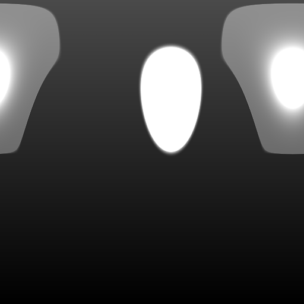

# パノラマシェイプ

<table>
<tr style="border: 0;">
<td style="border: 0;" valign="top">

{width="128px"}

## パノラマシェイプ

**イン：** *テクスチャジェネレーター**/パターン*

**複合**

</td>
<td style="border: 0;" valign="top">

## 説明

これは、手続き型「Studio」のパノラママップを生成するのに役立つノードです。 スポットライト画像の配置と変更、およびHDRプロパティの設定ができます。 複数のシェイプに対して連結できます。

## パラメーター

* **シェイプ行列**\
  結果を移動または移動します。キャンバスと直接相互作用することで変更できます。
* **図形**: *正方形、ディスク*&#x200B;図形の種類を設定します。
* **図形の色**: *（色値）*図形の色を設定します。
* **図形の強度**: *0.0 ～ 100.0*&#x200B;図形のHDR強度を設定します。
* **図形の柔らかい境界線**: *0.0 ～ 1.0*&#x200B;図形の境界線の柔らかさを変更します。
* **ホットスポットの強度**: *0.0 ～ 100.0*&#x200B;図形のホットスポットのHDR強度を設定します。
* **ホットスポットのサイズ**: *0.0 ～ 1.0*&#x200B;シェイプ内のホットスポットのサイズを変更します。
* **ホットスポットのフォールオフ**: *0.0 ～ 1.0*&#x200B;ホットスポットのフォールオフ、つまりエッジのブレンドを変更します。
* **ホットスポットの位置**: *0.0 ～ 1.0*&#x200B;ホットスポットを図形に対して相対的に移動します。
* **背景を有効にする**: *False/True*&#x200B;背景を単色で塗りつぶすことができます。 つまり、ブレンドによって連結できなくなったということです。
* **背景色**: *（カラー値）*背景色を設定します。
* **テクスチャ入力を有効にする**: *False/True*&#x200B;定義済みの図形の種類ではなく、カスタム入力を許可します。

## サンプル画像

</td>
</tr>
</table>
