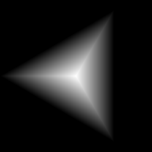
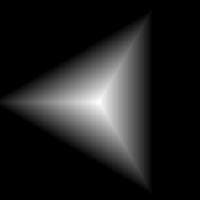

# 多角形2

<table>
<tr style="border: 0;">
<td width="33.33%" style="border: 0;" valign="top">

{width="128px"}

<b>イン：</b>テクスチャジェネレーター>パターン

</td>
<td width="100.00%" style="border: 0;" valign="top">

## 説明

調整オプションのある滑らかなグラデーションポリゴンを生成します。 より高度なバージョンについては、[ポリゴン1](../../../../../../compositing-graphs/nodes-reference-for-com/node-library/texture-generators/patterns/polygon-1/polygon-1.md)を参照してください。

</td>
</tr>
</table>

## パラメーター

|  |  |
|:---|:---|
| <b>辺</b> <i>3 - 32</i> | 辺の量。 |
| <b>スケール</b> <i>0.0 - 1.0</i> | グローバルスケールを設定します。 |
| <b>回転</b> <i>0.0 - 1.0</i> | シェイプ全体を回転します。 |
| <b>曲線</b> <i>-1.0 - 1.0</i> | グラデーションプロファイルカーブを変更します。 |
| <b>グラデーション</b> <i>0.0 - 1.0</i> | グラデーションのコントラストを調整します。 |
| <b>グラデーションを反転</b> <i>False/True</i> | グラデーション方向を反転します。 |
| <b>自動スケール</b> <i>False/True</i> | デフォルト設定でカンバスに合わせて拡大・縮小します。 |
| <b>非正方形拡張</b> <i>False/True</i> | スカッシュとストレッチを非正方形の比率で補正できます。 |

## 例

<table style="margin-top: 32px; margin-bottom: 32px">
    <tr style="border: 0">
        <td style="border: 0; background: transparent">
            
        </td>
    </tr>
</table>
