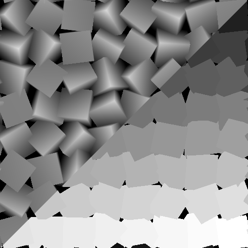

# スプラッタv2をマスクにシェイプ

<table>
<tr style="border: 0;">
<td width="33.33%" style="border: 0;" valign="top">

<b>イン：</b>ジェネレーター>パターン

</td>
<td width="100.00%" style="border: 0;" valign="top">

## 説明

[Shape splatter v2](../shape-splatter-v2/shape-splatter-v2.md)ノードによって生成された図形の選択範囲からマスクを計算します。  使用できるオプションには、ランダムな選択範囲に加え、一意の識別子やマテリアル ID/パターンID*による図形の範囲の選択があります。  図形は、<i>Heightブレンド</i>から背景Heightを使用して[Shape splatter v2](../shape-splatter-v2/shape-splatter-v2.md)ノードによって事前にマスクされます。 背景と選択されていない図形の両方が真っ黒です。 （例：0）  <b>*:</b>シェイプスプラッタのUVW入力から取得される値の1つは、マテリアル IDまたはパターンIDです。これは、シェイプスプラッタv2ノード： - <i>SDF/プリミティブ</i>: マテリアル ID - <i>パターン入力/グリッドアトラス:</i>パターンID （リスト/アトラス内のパターンのインデックス）で使用される<b>シェイプの種類</b>に応じて異なります。

</td>
</tr>
</table>

>[!INFO]
>
> このノードには、[Shape splatter v2](../shape-splatter-v2/shape-splatter-v2.md)ノードによって生成された入力データが必要です。
> 
> Shapeスプラッタv2ファミリのその他のノード：
> * [シェイプスプラッタv2マッパーグレースケール](../shape-splatter-v2-mapper-grayscale/shape-splatter-v2-mapper-grayscale.md)
> * [シェイプスプラッタv2マッパーの色](../shape-splatter-v2-mapper-color/shape-splatter-v2-mapper-color.md)

>[!TIP]
> 
> [**&#39;錆びたボルト&#39;**&#x200B;材料サンプル](../../../../../../function-graphs/nodes-reference-for-fun/function-node-library/function-nodes-sdf-functions/working-with-sdf-functions.md#material-sample)は、シェイプスプラッタv2ノードの使用を開始するために使用できます。
> 
> SDF 関数に関する概念やワークフローについて詳しくは、専用ページ（[SDF 関数の操作](../../../../../../function-graphs/nodes-reference-for-fun/function-node-library/function-nodes-sdf-functions/working-with-sdf-functions.md)）を参照してください

## 入力

|                             |                                                                                                                                                                                                                                                                                                                                                                                                                                                                                                                                                                                                           |
|:----------------------------|:----------------------------------------------------------------------------------------------------------------------------------------------------------------------------------------------------------------------------------------------------------------------------------------------------------------------------------------------------------------------------------------------------------------------------------------------------------------------------------------------------------------------------------------------------------------------------------------------------------|
| <b>Splatter UVW</b> *色* | <b>R</b> – シェイプのUVのUコンポーネント <b>G</b> – シェイプのUVのVコンポーネント <b>B</b> – シェイプのHeight。 (W) <b>A</b> – パックされたデータ：  - <i>整数部分：</i>図形の一意の識別子。 (ID)  - <i>小数部：</i> <b>図形の種類</b>に依存： SDF/プリミティブの場合はマテリアルID、パターンの入力/グリッドアトラスの場合はパターンID*。  <b>*:</b>パターンIDは、一覧/アトラス内の図形のインデックスです。 |

## 出力

|               |                                           |
|:--------------|:------------------------------------------|
| <b>出力</b> | 選択した図形の計算されたマスクです。 |

## パラメーター

|                                                         |                                                                                                                                                                                                                                                                                                                                                                                                                                                                                                                                                                                                                   |
|:--------------------------------------------------------|:------------------------------------------------------------------------------------------------------------------------------------------------------------------------------------------------------------------------------------------------------------------------------------------------------------------------------------------------------------------------------------------------------------------------------------------------------------------------------------------------------------------------------------------------------------------------------------------------------------------|
| <b>出力</b> *整数* | 出力マスクで選択した図形に使用されている値。  - <b>バイナリマスク：</b>選択した図形はすべて、1の値を使用します。 - <b>図形ID (整数):</b>選択した図形は、一意の識別子を使用します。 (ID) - <b>マテリアル ID (整数):</b>選択した図形はマテリアル IDを使用します。 - <b>図形ID （正規化）:</b>選択した図形は、最低のマテリアル IDから最高の[0, 1]範囲にマップされた一意の識別子 (ID)を使用します。 - <b>マテリアル ID （正規化）:</b>選択した図形は、最低のマテリアル IDから[範囲112}範囲0}にににマップを使用します最高。] |
| <b>図形IDの開始範囲</b> *整数* | 選択範囲の開始位置として使用する図形の固有識別子(ID)を指定します。 （含まれる） |
| <b>図形IDの終了範囲</b> *整数* | 選択範囲の末尾として使用する図形の一意の識別子(ID)です。 （含まれる） |
| <b>図形IDのオフセット</b> *整数* | 選択範囲に合わせて、図形の一意の識別子を指定した値だけオフセットします。  これにより、開始境界と終了境界を手動で調整しなくても、現在の選択範囲を指定した値だけ簡単にオフセットできます。 |
| <b>マテリアル /パターンidマスクの組み合わせ</b> *整数* | 固有識別子(ID)による選択範囲とマテリアルID/パターンIDによる選択範囲を組み合わせるために使用する論理演算子が指定されました。  - <b>なし：</b>選択範囲のマテリアルID/パターンID全体を無視します。 - <b>および：</b>選択した図形は、IDとマテリアルID/パターンIDの両方の範囲に含まれている必要があります。 （より少ない図形を含む） -<b>または：</b>選択した図形は、IDまたはマテリアル ID/パターンIDの範囲に含まれている必要があります。 （その他のシェイプを含む） |
| <b>マテリアル/パターンIDの開始範囲</b> *整数* | 選択範囲の開始位置として使用するマテリアルIDまたはパターンID*。 （含まれています）  <b>*:</b>詳細については、ノードの説明を参照してください。 |
| <b>マテリアル/パターンIDの終了範囲</b> *整数* | 選択範囲の最後に使用するマテリアルIDまたはパターンID*。 （含まれています）  <b>*:</b>詳細については、ノードの説明を参照してください。 |
| <b>図形ランダムマスク</b> *フロート* | シェイプのランダムマスクの係数です。1の場合は、すべてのシェイプがマスクされます。 |

