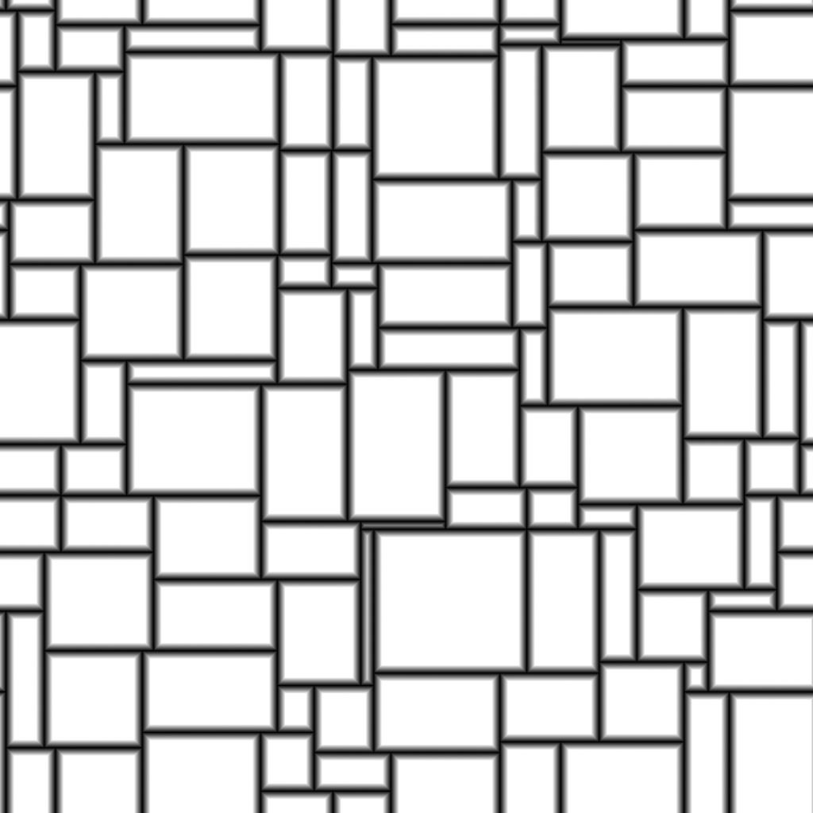

# タイル、ランダム2

<table>
<tr style="border: 0;">
<td width="33.33%" style="border: 0;" valign="top">

{width="200px"}

<b>イン：</b> テクスチャジェネレーター>パターン

</td>
<td width="100.00%" style="border: 0;" valign="top">

## 説明

**タイルランダム2**&#x200B;ノードは、ランダムサイズとHeightと幅の比率で隣接するタイルを生成します。

グリッドは、シェイプの側面をランダムに&#x200B;*斜め*&#x200B;して角度を分割することで微調整できます。

*拡大・縮小*、*面取り*、*角の丸み*&#x200B;および&#x200B;*回転の調整*&#x200B;のオプションを使用して図形を調整できます。

これらの調整は、*入力マップ*&#x200B;によって制御される場合があります。

専用の出力を使用すると、図形の&#x200B;**UV**&#x200B;を&#x200B;**Flood Fillに入力して(...)**&#x200B;できます 追加のバリエーションを適用するノードです。

</td>
</tr>
</table>

## 入力

|  |  |
|:---|:---|
| <b>ランダムサイズマップ</b> <i>グレースケール</i> | シェイプのランダムスケールを制御するグレースケール入力画像です。  その影響は、<b>ランダムサイズ入力マップ乗数</b>パラメーターによって制御されます。 |
| <b>ランダム傾斜図</b> <i>グレースケール</i> | シェイプのランダムな傾斜を制御するグレースケール入力画像。  その影響は、<b>ランダム傾斜角入力マップ乗数</b>パラメーターによって制御されます。 |
| <b>角丸の半径マップ</b> <i>グレースケール</i> | シェイプの角丸の半径を制御するグレースケール入力画像です。  その影響は、<b>角丸の半径入力マップの乗算</b>によって制御されます。 パラメータで指定します。 |
| <b>ベベル距離マップ</b> <i>グレースケール</i> | シェイプのベベルを制御するグレースケール入力画像です。  その影響は、<b>ベベル距離入力マップ係数</b>によって制御されます。 パラメータで指定します。 |
| <b>マスクマップ</b> <i>グレースケール</i> | シェイプのマスクを制御するグレースケール入力画像。  この影響は、<b>マスクマップの入力開始</b>および<b>マスクマップの入力終了</b>パラメーターによって制御されます。 |

## パラメーター

|  |  |
|:---|:---|
| <b>金額X</b> <i>整数</i> | <b>X</b> 軸のセルの数です。 |
| <b>適用量Y</b> <i>整数</i> | <b>Y</b> 軸上のセルの数です。 |
| <b>サイズ</b> |  |
| <b>ランダムサイズ乗数</b> <i>浮動小数</i> | ランダムな拡大・縮小の強さに<i>全体</i>調整を適用します。 |
| <b>ランダムサイズ入力マップ乗数</b> <i>浮動小数</i> | <b>ランダムサイズマップ</b>入力の値<i>サンプリング</i>を使用して、ランダムスケーリングの強度を調整します。 |
| <b>ランダムサイズX</b> <i>浮動小数</i> | <b>X</b>軸<i>のみ</i>でランダムスケールの適用度を調整します。 |
| <b>ランダムサイズY</b> <i>浮動小数</i> | <b>Y</b>軸<i>のみ</i>のランダムスケールの適用度を調整します。 |
| <b>ランダムサイズの分布</b> <i>整数</i> | ランダムスケールの値を配分する方法を制御します：   - <i>均一</i>:ランダムスケールは、すべてのセルに<i>同じ方法</i>で適用されます - <i>青のノイズ</i>:ランダムスケールは、青のノイズパターンを使って<i>調整されます</i> |
| <b>図形の縦横比 – 変形</b> |  |
| <b>インタースティスThickness</b> <i>浮動小数</i> | シェイプ間の間隔のThicknessを調整します。 すべての</i>図形に対して<i>等しい。 |
| <b>ランダム位置乗数</b> <i>浮動小数</i> | 図形の上の<i>セルの境界に合わせて</i>図形にランダムな位置オフセットを適用します。 |
| <b>角丸の半径</b> <i>浮動小数</i> | シェイプの角丸の<i>半径</i>を調整します。 値<b>0</b>は、丸めが適用されていないことを示します。  <i>注意</i>：この効果は、<b>軸ごとのベベルコントロールを有効にする</b>パラメーターが<i>True</i>に設定されている場合は適用できません。 |
| <b>角丸の半径の入力マップ係数</b> <i>浮動小数</i> | <b>角丸の半径マップ</b>の入力マップが角丸の半径に与える影響の強さを調整します。  マップは、<b>角丸の半径</b>パラメーターの<i>ピクセルあたりの</i>乗数として機能します。  <i>注</i>：この効果は、<b>軸ごとのベベル制御を有効にする</b>パラメーターが<i>真</i>に設定されている場合は適用できません。 |
| <b>スケール乗数</b> <i>浮動小数</i> | 各図形のサイズを、そのセルの<i>面積</i>に対する比率で調整します。 |
| <b>ランダムに拡大・縮小</b> <i>浮動小数</i> | <i>各</i>図形にランダムスケールを適用する強度を調整します。 |
| <b>回転</b> <i>フロート</i> | 各<i>角</i>をセルの境界線に沿って<i>隣</i>に移動して、セル内の図形を回転させます。  このメソッドを使用すると、ある程度の<i>ゆがみ</i>と<i>拡大/縮小</i>がisで図形に適用されます。 |
| <b>ランダムな回転</b> <i>フロート</i> | 各形状にランダムな回転量を適用する強度を調整します。  回転の方法は、<b>Rotation</b>パラメーターに記述されています。 |
| <b>コーナーの位置をランダムにする</b> <i>フロート</i> | セルの境界線に沿ってそれぞれの<i>角</i>にランダムな量の<i>オフセット</i>を適用して、図形を変形させます。 |
| <b>傾斜角</b> |  |
| <b>ランダム傾斜乗数</b> <i>フロート</i> | ランダムな傾斜の強さに<i>グローバル</i>調整を適用します。 |
| <b>ランダム傾斜角入力マップ乗数</b> <i>フロート</i> | <b>ランダム傾斜マップ</b>入力の値<i>サンプリング</i>を使用して、ランダム傾斜の強度を調整します。 |
| <b>ランダムな傾斜角X</b> <i>フロート</i> | <b>X</b>軸<i>のみ</i>のランダムな傾斜の強さを調整します。 |
| <b>ランダム傾斜角</b> <i>フロート</i> | <b>Y</b>軸<i>のみ</i>のランダムな傾斜の強さを調整します。 |
| <b>ランダム傾斜分布</b> <i>整数</i> | ランダムな傾斜値を配分する方法を制御します：   - <i>均一</i>：すべてのセルにランダムな傾斜角を<i>同じ方法</i>で適用します - <i>青のノイズ</i>：青のノイズパターンを使用して、ランダムな傾斜角を<i>調整します</i> |
| <b>ベベル</b> |  |
| <b>ベベル距離モード</b> <i>整数</i> | 図形のベベルの基準となる間隔</i>を取得する方法を設定します：   - <i>グリッドサイズに対する比率</i>：指定した<i>グリッドサイズの比率</i> - <i>図形サイズに対する比率</i>：指定した<i>サイズの比率</i> - <i>画像サイズに対する比率</i>：指定した<i>の比率で図形のベベルが適用されます&lbrace;1されます<i></i> |
| <b>ベベル距離マルチプライヤ</b> <i>浮動小数</i> | <i>グローバル</i>調整をベベルの距離に適用します。 |
| <b>ベベル距離入力マップ係数</b> <i>浮動小数</i> | <b>ベベルの距離マップ</b>を<i>ピクセル単位</i>の乗数として使用して、ベベルの入力マップを調整します。 |
| <b>ベベルの丸みを帯びた曲線</b> <i>浮動小数</i> | ベベル角度に適用される丸みの強度を調整して、より<i>凸状</i>にします。 |
| <b>軸ごとのベベルコントロールを有効にする</b> <i>ブーリアン</i> | <i>真</i>の場合、ベベルを適用して、<b>X</b>および<b>Y</b>軸で<i>個別に</i>調整できます。  <i>注意</i>：この<i>は<b>角丸</b>効果をキャンセル</i>します。 |
| <b>ベベル距離X</b> <i>浮動小数</i> | <b>X</b>軸<i>のみ</i>のベベルの間隔を調整します。 この距離は、<b>Bevel Distance Mode</b>パラメーターの値によって異なります。  <i>注意</i>：このパラメーターは、<b>軸ごとのベベルコントロールを有効にする</b>パラメーターが<i>True</i>に設定されている場合にのみ使用できます。 |
| <b>ベベル距離Y</b> <i>浮動小数</i> | <b>Y</b>軸<i>のみ</i>のベベルの間隔を調整します。 この距離は、<b>Bevel Distance Mode</b>パラメーターの値によって異なります。  <i>注意</i>：このパラメーターは、<b>軸ごとのベベルコントロールを有効にする</b>パラメーターが<i>True</i>に設定されている場合にのみ使用できます。 |
| <b>マスク</b> |  |
| <b>マスクのランダム反転</b> <i>ブーリアン</i> | シェイプのランダムマスクを反転します。 |
| <b>マスクのランダム開始</b> <i>浮動小数</i> | 指定された<b>ランダムシード</b>に対して、疑似ランダムマスクが開始シェイプから終了シェイプまでの<i>特定の順序</i>に従って適用されます。 このパラメーターを使用すると、<i>開始</i>図形のインデックス</i>を<i>オフセットできます。  <i>注意</i>：これにより、マスクの<i>値の範囲</i>の上限が1つ決定されます。 したがって、値は<b>マスクランダム終了</b>値よりも<i>大きい</i>値になる可能性があります。 |
| <b>マスクのランダムな終了</b> <i>浮動小数</i> | 指定された<b>ランダムシード</b>に対して、疑似ランダムマスクが開始シェイプから終了シェイプまでの<i>特定の順序</i>に従って適用されます。 このパラメーターを使用すると、<i>end</i>図形のインデックス</i>を<i>オフセットできます。  <i>注意</i>：これにより、マスクの<i>値の範囲</i>の上限が1つ決定されます。 したがって、値は<b>マスクランダム開始</b>値よりも<i>大きい</i>値になる可能性があります。 |
| <b>セル領域でマスクを反転</b> <i>ブーリアン</i> | セルの面積に応じてシェイプのマスクを反転します。 |
| <b>セル領域の開始位置でマスク</b> <i>浮動小数</i> | 図形をマスクするために<i>最小</i>セルの領域のしきい値を調整します。  <i>注意</i>：これにより、マスクする<i>値の範囲</i>の上限が1つ決定されます。 したがって、この値は<b>セル領域の終わりによるマスク</b>値よりも<i>大きい</i>値になる可能性があります。 |
| <b>セル範囲の終了点でマスク</b> <i>浮動小数</i> | 図形をマスクするために<i>最大</i>セルの領域のしきい値を調整します。  <i>注意</i>：これにより、マスクする<i>値の範囲</i>の上限が1つ決定されます。 したがって、この値は、<b>セル領域の開始によるマスク</b>値よりも<i>低い</i>値になる可能性があります。 |
| <b>マスクマップの入力反転</b> <i>ブーリアン</i> | <b>マスクマップ</b>入力マップでシェイプのマスクを反転します。 |
| <b>マスクマップの入力開始</b> <i>浮動小数</i> | シェイプをマスクするための<b>マスクマップ</b>入力マップの<i>最小グレースケール値</i>のしきい値を調整します。  <i>注意</i>：これにより、マスクのための<i>値範囲</i>の上限が1つ決まります。 したがって、値は<b>マスクマップ入力端</b>値よりも<i>大きい</i>値になる可能性があります。 |
| <b>マスクマップの入力終了</b> <i>浮動小数</i> | シェイプをマスクするための<b>マスクマップ</b>入力マップの<i>グレースケールの最大値</i>のしきい値を調整します。  <i>注</i>：これにより、マスクのための<i>値範囲</i>の上限が1つ決まります。 したがって、値は<b>Mask Map Input Start</b>値よりも<i>低い</i>値になる可能性があります。 |

## 例

<table style="margin-top: 32px; margin-bottom: 32px">
    <tr style="border: 0">
        <td style="border: 0; background: transparent">
            
        </td>
        <td style="border: 0; background: transparent">
            
        </td>
        <td style="border: 0; background: transparent">
            
        </td>
        <td style="border: 0; background: transparent">
            
        </td>
        <td style="border: 0; background: transparent">
            
        </td>
        <td style="border: 0; background: transparent">
            
        </td>
        <td style="border: 0; background: transparent">
            
        </td>
    </tr>
</table>
