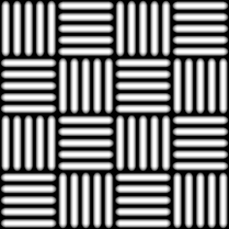

# 織り1

<table>
<tr style="border: 0;">
<td width="33.33%" style="border: 0;" valign="top">

{width="128px"}

<b>イン：</b>テクスチャジェネレーター>パターン

</td>
<td width="100.00%" style="border: 0;" valign="top">

## 説明

単純な織りパターンを生成します。

</td>
</tr>
</table>

## パラメーター

|  |  |
|:---|:---|
| <b>タイル表示</b> <i>1 - 16</i> | 結果をタイルする回数を設定します。 |
| <b>45度回転</b> <i>False/True</i> |  |
| <b>非正方形拡張</b> <i>False/True</i> | スカッシュとストレッチを非正方形の比率で補正できます。 |

## 例

<table style="margin-top: 32px; margin-bottom: 32px">
    <tr style="border: 0">
        <td style="border: 0; background: transparent">
            
        </td>
    </tr>
</table>
