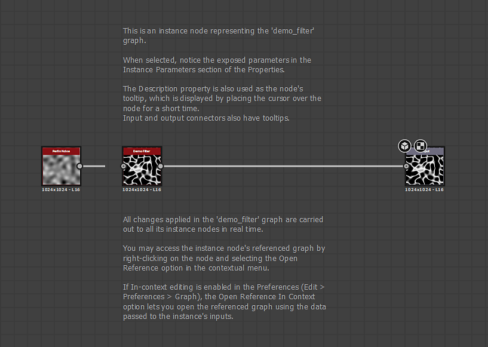

# サンプル Substance グラフ

## 概要

このページには、ダウンロード可能な[Substance 3D Designer](https://www.adobe.com/jp/products/substance3d-designer.html)ファイルのサンプルが表示されます。 これらのプロジェクトには、[Substanceグラフ](../../compositing-graphs/substance-compositing-graphs.md)の基本的なツールや概念を示す注釈つきグラフが含まれています。

<table>
<tr style="border: 0;">
<td style="border: 0;" valign="top">

## フィルター

このプロジェクトでは、他のグラフのフィルターとして使用する簡単なグラフ設定を特徴としています。 [フィルター](../../compositing-graphs/nodes-reference-for-com/node-library/filters/filters.md)は、1つ以上の入力画像を変更またはブレンドするノードです。

[{width="64px"}](https://shared-assets.adobe.com/link/f1509448-39d4-4b4a-5d3f-1e0ab0313335)

</td>
<td style="border: 0;" valign="top">

{zoomable="yes"}

</td>
</tr>
</table>

<table>
<tr style="border: 0;">
<td style="border: 0;" valign="top">

## 遺伝

このプロジェクトでは、解像度やビット深度などの重要なイメージ情報をグラフ内のSubstance間で伝達するための、ノードグラフで使用できる継承メソッドを示します。

継承については、アドビのドキュメントの[このページ](../../compositing-graphs/inheritance-compositing/inheritance-in-substance-compositing-graphs.md)をご覧ください。

[{width="64px"}](https://shared-assets.adobe.com/link/9b155f58-74a1-40b6-47ed-d360b18e0bc4)

</td>
<td style="border: 0;" valign="top">

{zoomable="yes"}

</td>
</tr>
</table>

<table>
<tr style="border: 0;">
<td style="border: 0;" valign="top">

## ピクセルプロセッサー

[ピクセルプロセッサー](../../compositing-graphs/nodes-reference-for-com/atomic-nodes/pixel-processor/pixel-processor.md)ノードは、Designerで最も複雑で強力なノードの1つです。このノードの機能を理解すると、グラフの強力で柔軟な機能の大部分が利用できるようになり、より多様なカスタムノードを作成できるようになります。

このプロジェクトでは、ピクセルプロセッサーをジェネレーターとフィルターの2つの簡単な用途で使用する方法を紹介します。 また、[関数グラフ](../../function-graphs/function-graphs.md)で多くのことを行うための足がかりにもなります。

[{width="64px"}](https://shared-assets.adobe.com/link/ad8e013e-ae48-4290-740a-9b28387cab38)

</td>
<td style="border: 0;" valign="top">

{zoomable="yes"}

</td>
</tr>
</table>
