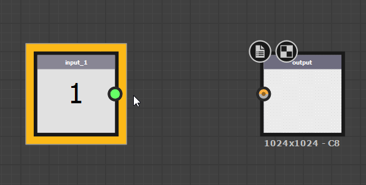

# Substance グラフの値

バージョン2019.1.0の[Substance 3D Designer](https://www.adobe.com/jp/products/substance3d-designer.html) Engine v7の導入以降、関数だけでなく、Substanceグラフでも[値を処理できるようになりました。](../../function-graphs/function-graphs.md) 値データは関数（整数、浮動小数点、ブール値など）で使用されるデータと同じであり、画像全体のピクセル値を表すカラー画像やグレースケール画像のデータとは大きく異なります。 具体的には、値データを記述する場合、*Integer 1, Integer 2, Integer 3 and Integer 4, Float 1, Float 2, Float 3 and Float 4 and Boolean*&#x200B;を意味します。 それぞれが個別のカラーコードを持ち、ほとんど互いに入れ替わりません。

これには、次のような使用例があります。

* 単一値のマテリアルプロパティや追加のメタデータなど、画像以外のデータを返して処理します。 たとえば、マテリアルのIOR値などです。
* ピクセルごとに計算する必要のないグラフ計算を最適化しています（[ピクセルプロセッサ](../../compositing-graphs/nodes-reference-for-com/atomic-nodes/pixel-processor/pixel-processor.md)の代わりに使用できます）。 例えば、ランダムなベタ塗り。
* 画像データを値に処理することによって、1つのノードのプロパティを別のノードにリンクする。 例えば、レベルを調整する画像の最小値と最大値などです。

## 新しい値ノードと入力

2つの新しいAtomicノードは値で動作します。

|  |  |
| --- | --- |
| 

  <b>[Value Processor](../../compositing-graphs/nodes-reference-for-com/atomic-nodes/value-processor/value-processor.md)</b> | [値プロセッサー](../../compositing-graphs/nodes-reference-for-com/atomic-nodes/value-processor/value-processor.md)は、任意の数のグレースケール入力またはカラー入力を受け取り、これらの入力に基づいて計算から1つの値を返すことができます。 |
| 

  **[値の入力](../../compositing-graphs/nodes-reference-for-com/atomic-nodes/input/input.md)** | [値入力](../../compositing-graphs/nodes-reference-for-com/atomic-nodes/input/input.md)を使用すると、値として明示的に定義されたサブグラフに入力スロットを作成できます。 |

さらに、他のノードでは特定の方法で処理されます。

[出力ノード](../../compositing-graphs/nodes-reference-for-com/atomic-nodes/output/output.md)は、グレースケールとカラーで行ったように、値の接続を接続すると、値の出力になるように自動的に調整されます。

{width="512px"}

各ノード（[Atomic](../../compositing-graphs/nodes-reference-for-com/atomic-nodes/atomic-nodes.md)および[Library](../../compositing-graphs/nodes-reference-for-com/node-library/node-library.md)/Instance）に新しいタブがあり、値の入力を定義できます。

## 値の操作

値の使用は、通常のSubstanceグラフの作業とは少し異なります。

値の接続は、[値プロセッサ](../../compositing-graphs/nodes-reference-for-com/atomic-nodes/value-processor/value-processor.md)、[値の入力](../../compositing-graphs/nodes-reference-for-com/atomic-nodes/input/input.md)、または[サブグラフ](../../compositing-graphs/creating-compositing-gra/graph-instances-sub-gra/graph-instances-sub-graphs.md)からのみ実行できます。 つまり、最初から値の接続を作成する唯一の方法はバリュープロセッサであり、「静的な値」ノードなどはありません。 代わりに、バリュープロセッサを作成し、静的な値を配置して出力として設定することで、同じ結果が得られます。

複数の値、または複数の値のセットやグループを返す場合は、[サブグラフ](../../compositing-graphs/creating-compositing-gra/graph-instances-sub-gra/graph-instances-sub-graphs.md)を作成する必要があります。値プロセッサは単一の値のみを返すことができます。

値が表示される場所または使用中の場所を強調表示するには、値入力（値出力）を持つノードを黄色の太い枠線で強調表示します。

