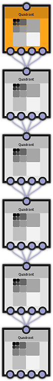
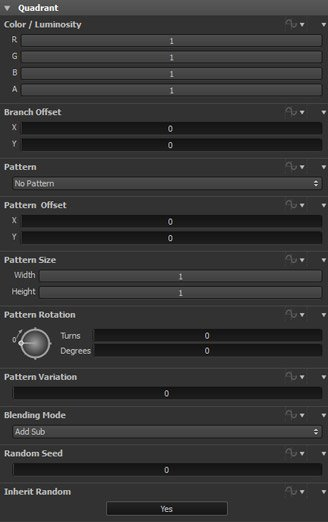

# クアドラントノード

多くのFX-Mapsは、クアドラントノードのチェーンで構成されています。 クアドラントノードはFX-Mapグループの中で最も強力で柔軟性の高いノードであるため、このノードの動作を理解することは価値があります。

Quadrantノードについて最も重要なことは、FX-Mapグラフの深度（*オクターブ*）を増加させる唯一のノードであるということです。 各クアドラントノードは、基本となるクアッドツリーグラフに追加されますが、他のノードは追加されません。

Quadrantノードには、次のようなパラメータがあります。

## カラー / 輝度

ノードがイメージをFX-Mapに追加する場合、これらの設定はチャンネルがチェーン内の他のイメージとブレンドされる方法を定義します。 *色/輝度*&#x200B;パラメーターは、この特定のノードによってレンダリングされたすべての画像に適用されます。

### 分岐オフセット

ノードのイメージをシフトします。 オフセットは、グラフの後続のノードによってレンダリングされた他のすべてのイメージに適用されます。 分岐オフセットは、グラフの同じ分岐内にある現在の四半円点ノードとその下にあるすべてのノードに移動を適用します。

このパラメータは、ダイナミック機能で制御できます。

### パターン

このノードによってFX-Mapに追加されるイメージ（存在する場合）を定義します。

クアドラントノードでは、パターンの長いリストがサポートされます。これについては、このトピックで後ほど説明します。

>[!WARNING]
>
> このパラメーターは、sbsarファイルの動的関数で制御できません。

### パターンオフセット

ノードのイメージを指定した量だけオフセットしますが、後続のノードには影響しません。 このパラメータは、ダイナミック機能で制御できます。

### パターンサイズ

FX-Mapに追加する画像のサイズ（該当する場合）を定義します。 このパラメータは、ダイナミック機能で制御できます。

### パターン回転

FX-Mapに追加する画像の回転を定義します（該当する場合）。 このパラメータは、ダイナミック機能で制御できます。

### パターンバリエーション

一部のパターンは多様体を示す。 この設定では、使用するバリエーションを選択できます。 このパラメータは、ダイナミック機能で制御できます。

### ブレンドモード

このノードのイメージ（該当する場合）をFX-Mapイメージと混合するときに使用するブレンドプロセスを指定します。 このパラメータは、ダイナミック機能で制御できます。

### ランダムシード

乱数ジェネレータのシード。

ジェネレータは、このシードを開始位置として使用し、乱数のように見えるシーケンスを作成します。 この方法の利点は、現実世界とは異なり、毎回まったく同じ乱数のシーケンスが生成され、予測でき、繰り返し可能ですがランダムな結果が得られることです。

このパラメータは、ダイナミック機能で制御できます。

### ランダム継承

[はい]に設定した場合、乱数ジェネレータのシードはグラフの前のノード（つまり、クアッドツリーのこのノードより上のノード）から継承されます。 これが最初のノードの場合は、含まれている[Substanceグラフ](../../../compositing-graphs/substance-compositing-graphs.md)からランダムシードを取得します。

## パターン

各Quadrantノードは、オプションでイメージを最終的なFX-Mapに追加できます。

デフォルトでは「パターンなし」が選択されているため、画像はレンダリングされません。 Quadrantノードは、単にFX-Mapイメージを分割し、チェーン内の次のノードに対して4つに分割します。

次のオプション&#x200B;*Input image*&#x200B;は、FX-Mapノードに提供されるイメージを使用します。 FX-Mapノードは、背景として、または組み込みパターンの1つの置き換えとして使用するカラーまたはグレースケールイメージを受け入れます。 象限ノードは、グレースケールのFx-Map内のグレースケール入力イメージのみをレンダリングでき、逆にカラーのFX-Map内のカラー入力イメージのみをレンダリングできます。 カラータイプをミックスする場合は、グラフで入力を変換する前に変換する必要があります。

最後に、組み込みのパターンの1つ：正方形、ディスク、放物面、ベル、ガウス、ソーン、ピラミッド、レンガ、グラデーション、波、ハーフベル、縁の付いたベル、三日月とカプセルから選択することができます。

補足：このパラメーターでダイナミック関数を作成することもできますが、これはSubstance 3D Designerでのみ機能します。 ダイナミック関数で入力された画像にアクセスするには、256（画像エントリ1）以上の値（画像エントリ2の場合は257など）を使用する必要があります。

### パターンの種類：

パターンはすべてグレースケール *パターンのバリエーション*&#x200B;パラメーターを使用して、一部のパターンを少し変更できます。

組み込みのパターンの多くには、何らかの形の円形グラデーションの塗りなどが含まれています。 これは、多くの種類のノイズやパターンに非常に便利です。 レンガ、ディスク、正方形などの他のパターンは、シンプルで平坦なシェイプです。

[パターンのバリエーション]パラメータは、パターンの定義されたフィーチャを調整します。

<table>
<tr style="border: 0;">
<td style="border: 0;" valign="top">

{width="80px"}

</td>
<td style="border: 0;" valign="top">

</td>
</tr>
</table>
