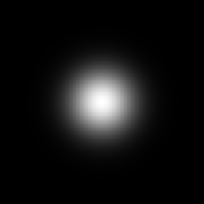

# 反復処理して`$number`変数

Iterateノードは、右側にコネクトされたノードをIterations値で指定された時間だけレンダーします。

| 

 | 1回繰り返し：ガウスパターンは1回レンダリングされます |
| --- | --- |
| 

 | 10 反復：ガウスパターンは同じ場所に10回レンダリングされます |

Iterateノードを使用する場合、`$number`変数を使用して現在の反復値を取得できます。 `$number`は浮動小数値で、0から始まります。

<table>
<tr style="border: 0;">
<td style="border: 0;" valign="top">

{width="300px"}

</td>
<td style="border: 0;" valign="top">

{width="300px"}

</td>
</tr>
</table>

Pattern Offsetパラメーターで設定されたこの関数は、パターンごとに1つずつ、10回実行されます。

最初のパターンの`$number`の値は0で、次に(0, 0)座標でレンダリングされます。 2番目のパターンの`$number`の値は1で、次のパターンでは(0.1, 0)座標(1 x 0.1 = 0.1)でレンダリングされます。
