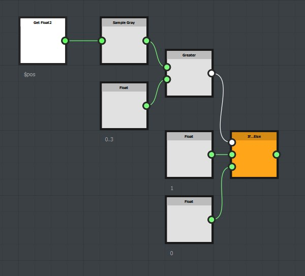

# Samplerノードの使用

サンプラーノードは、fx-mapノードに接続された画像入力のピクセル値をサンプリングするために使用できる。 サンプルされた値は、関数を使用してパラメーターを操作するために使用できます。

## 簡単な例

この例では、パターンのグリッドを生成するために、四半円点ノードのチェーンが作成されています。 最後の象限の[不透明度/輝度]パラメータに関数が作成されます。

{width="300px"}{width="300px"}

Sampleノードは、サンプル座標(x, y)としてfloat2入力を取ります。 この例では$pos変数を使用しました。各パターンについて、ピクセル値はFxMapノードに接続された最初の画像入力のパターン位置でサンプリングされます。

Sample Grayノードは、0, 1の範囲のfloat1値を返します。

Sample Colorノードは、0、1の範囲のfloat4(rgba)値を返します。

## 詳細な例

ここでは、サンプル値を定数(0.3)と比較します。 サンプル値が0.3より大きい場合は1が返され、それ以外の場合は0が返されます。

{width="300px"}{width="300px"}

## サンプルをダウンロード

[{width="64px"}](https://shared-assets.adobe.com/link/d5f9adf3-0bb5-49a1-4eb9-a0506d4f3f32)
