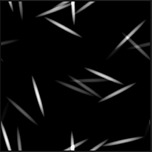

# Set/Sequenceノードの使用

このページでは、**Set**&#x200B;および&#x200B;**Sequence**&#x200B;ノードについて説明し、**FX-Maps**&#x200B;のコンテキストでの使用例を示します。

<table>
<tr style="border: 0;">
<td style="border: 0;" valign="top">

## 概要

<b>FX-Maps</b>で関数を使用しているときに、パラメーターの&#x200B;*[Substance関数グラフ](../../../../function-graphs/the-function-graph/the-function-graph.md)*&#x200B;から値を出力する必要がある場合があります。その場合、*別のグラフに使用できます。* ただし、既定では、Substance関数グラフは&#x200B;*one*&#x200B;値（関連パラメーターを制御する値）のみを出力します。

</td>
<td style="border: 0;" valign="top">

</td>
</tr>
</table>

この場合、<b>Set</b>と<b>Sequence</b>ノードの組み合わせを使用して、単一または複数の関数全体で変数を制御できます。

このプロセスには、次の2つの手順が含まれます。

1. <b>Set</b>ノードを使用すると、新しい変数を作成して、別の場所に呼び出して値を割り当てることができます。
1. <b>シーケンス</b>ノードは、グラフの別の分岐&#x200B;*を実行する前に（たとえば、現在のグラフの期待値を実際に出力するときに関与するロジック）、つまりステップ1のロジック全体を*&#x200B;実行するために使用されます

<table>
<tr style="border: 0;">
<td width="100.00%" style="border: 0;" valign="top">

## 「設定」ノード

<b>Set</b>ノードでは、新しい変数を設定し、ノードの&#x200B;*input*&#x200B;に接続された型と値を割り当てることができます。

変数の&#x200B;*名前*&#x200B;は、ユーザーによってノードのプロパティに入力されます。

既定では、このノードで設定される変数は&#x200B;*only*&#x200B;で、このSubstance関数グラフの&#x200B;*親*&#x200B;のスコープ（関数で定義されるパラメーターをホストするノードなど）内でアクセスできます。

</td>
<td width="25.00%" style="border: 0;" valign="top">

</td>
</tr>
</table>

<table>
<tr style="border: 0;">
<td style="border: 0;" valign="top">

この例では、変数名が&#x200B;**`myVariable`**&#x200B;に設定されており、その値は&#x200B;**1**&#x200B;です。

</td>
<td style="border: 0;" valign="top">

</td>
</tr>
</table>

<table>
<tr style="border: 0;">
<td width="100.00%" style="border: 0;" valign="top">

## シーケンスノード

<b>シーケンス</b>ノードでは、*最初の分岐が完全に実行されてから2番目の分岐*&#x200B;が実行されるようにすることで、Substance関数グラフの&#x200B;*実行フロー*&#x200B;を制御できます。

*2番目の分岐*&#x200B;の出力は、ノードの出力に渡されます。

</td>
<td width="25.00%" style="border: 0;" valign="top">

</td>
</tr>
</table>

<table>
<tr style="border: 0;">
<td style="border: 0;" valign="top">

この例では、<b>シーケンス</b>ノードをグラフの出力として設定します。 したがって、関数の出力は、<b>Float</b>ノードによって出力される<b>0.5</b>値になります。

ただし、その前に`<b>myVariable</b>`変数はfloat値<b>1.0</b>で設定されます。 この変数は、ノードのコンテキスト内の&#x200B;*他の場所*&#x200B;で使用できます。

</td>
<td style="border: 0;" valign="top">

</td>
</tr>
</table>

グラフの実行フローを制御するために、**シーケンス**&#x200B;のノードを&#x200B;*チェーン*&#x200B;できます。

たとえば、これらのアクションを&#x200B;*特定の順序で*&#x200B;実行しながら、最初に変数を&#x200B;*設定*&#x200B;し、後でその値を&#x200B;*更新*&#x200B;し、その後で最終値を&#x200B;*読み取り*&#x200B;することができます。

## 変数の表示

宣言された変数はどこからでも&#x200B;*アクセス可能*&#x200B;ではないことに注意してください。\
親レベルで宣言された変数は子レベルでアクセスできますが、逆は&#x200B;*trueではありません*。

したがって、ノードに設定された変数はグラフレベルでは&#x200B;*アクセスできません*。一方、グラフのレベルに設定された変数は、ノードのパラメーター関数で&#x200B;*アクセスできます*。

たとえば、このルールは&#x200B;*パラメーターの公開*&#x200B;のコアであり、公開には実際に次の手順が含まれます。

1. グラフ入力パラメーターの作成
1. パラメータのSubstance関数グラフからアクセスする
1. 関数の出力としての値の設定

小さな例を作成しましょう。<b>象限</b>のノードの<b>回転</b>の値を、<b>カラー/輝度</b>の値の影響を受けたいと考えます。輝度が明るいほど、回転が大きくなります。

<table>
<tr style="border: 0;">
<td style="border: 0;" valign="top">

<b>Color/Luminosity</b>パラメーター関数の計算をすべて実行します。 このパラメーターは&#x200B;*最初*&#x200B;に計算されるため、このパラメーターに設定されているすべての変数を他のノードパラメーターで使用できます。

</td>
<td style="border: 0;" valign="top">

</td>
</tr>
</table>

<table>
<tr style="border: 0;">
<td style="border: 0;" valign="top">

この関数は単純になります。輝度は&#x200B;**0**&#x200B;から&#x200B;**1**&#x200B;の間のランダムな値で、この値は`myRotation`変数に保存され、関数の出力として値を設定します。

つまり、**Color/Luminosity**&#x200B;パラメーターの値はランダムな&#x200B;*および*&#x200B;で、`myRotation`変数に格納されます。

**Position**&#x200B;プロパティは既にランダムな値によって定義されています。また、**Iterate**&#x200B;ノードを使用して、ランダムに配置された複数のパターンを取得します。

</td>
<td style="border: 0;" valign="top">

</td>
</tr>
</table>

<table>
<tr style="border: 0;">
<td style="border: 0;" valign="top">

`myRotation`変数が存在し、値が設定されたので、<b>Pattern Rotation</b>プロパティのSubstance関数グラフにアクセスします。

</td>
<td style="border: 0;" valign="top">

</td>
</tr>
</table>

<table>
<tr style="border: 0;">
<td width="100.00%" style="border: 0;" valign="top">

この関数では、**Get Float**&#x200B;ノードを使用して`myRotation`パラメーターの値を読み取り（変数にfloat値が含まれていることがわかっています）、関数の出力として設定します。

</td>
<td width="25.00%" style="border: 0;" valign="top">

</td>
</tr>
</table>

輝度も回転を制御するようになりました。

