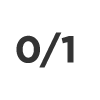

# 定数

固定ノードは、Substance関数グラフ内で使用する静的値を作成する手段です。 [変数](../../../../function-graphs/variables/variables.md)とは異なり、これらの変数は外部で変更できません。

さらに、このページでは、各データタイプと一般的なユースケースに関する追加情報も提供します。

## 整数

定数整数は整数を生成し、1段階になります。

[浮動小数](../../../../function-graphs/nodes-reference-for-fun/atomic-function-nodes/cast-nodes/cast-nodes.md)に変換できます。これは、加算、減算、単純な比較よりも複雑な処理を行う場合に推奨されます。

<table>
<tr style="border: 0;">
<td width="16.67%" style="border: 0;" valign="top">

</td>
<td width="100.00%" style="border: 0;" valign="top">

<b>整数</b>

整数は一つの要素を持つ。 次のような選択を行う際に索引として便利です。

* ユーザーにドロップダウンメニューとして表示されるオプションを選択します（[このページ](../../../../compositing-graphs/manage-parameters/exposing-a-parameter/exposing-a-parameter.md)の「ドロップダウンリスト」を参照）。
* [マルチスイッチ](../../../../compositing-graphs/nodes-reference-for-com/node-library/filters/blending/multi-switch/multi-switch.md)ノードの入力を選択しています。<b></b>

>[!IMPORTANT]
>
> <b>パラメーター関数の負の整数</b>は&#x200B;*サポートされていません*。 回避策については、[技術的な問題]の[このページ](../../../../technical-issues/parameters-not-working/parameters-not-working-as-expected.md)を参照してください。

</td>
</tr>
</table>

<table>
<tr style="border: 0;">
<td width="16.67%" style="border: 0;" valign="top">

</td>
<td width="100.00%" style="border: 0;" valign="top">

<b>整数2</b>

Integer2ノードは、(X,Y)成分を持つ静的2成分整数ベクトルを生成する。

Integer2は一般的ではありませんが、[Tile Generator](../../../../compositing-graphs/nodes-reference-for-com/node-library/texture-generators/patterns/tile-generator/tile-generator.md)のXとYの2Dタイリングを設定する場合などに使用されます。

</td>
</tr>
</table>

<table>
<tr style="border: 0;">
<td width="16.67%" style="border: 0;" valign="top">

</td>
<td width="100.00%" style="border: 0;" valign="top">

<b>Integer3</b>

Integer3ノードは、(X, Y, Z)成分を持つ静的3成分整数ベクトルを生成する。

整数3は一般的ではなく、ほとんど検出されません。<b>\
</b>

</td>
</tr>
</table>

<table>
<tr style="border: 0;">
<td width="16.67%" style="border: 0;" valign="top">

</td>
<td width="100.00%" style="border: 0;" valign="top">

<b>Integer4</b>

整数4ノードは、(X,Y,Z,W)成分を有する静的4成分整数ベクトルを生成する。

整数 4は一般的ではなく、あまり発生する可能性は低いです。<b>\
</b>

</td>
</tr>
</table>

## 浮動小数

定数浮動小数は、全数ではなく小数を生成します。つまり、常に小数点以下の記号の後に値が表示され、1より小さいステップ単位で増減できます（デフォルトは0.01）。

[浮動小数は整数](../../../../function-graphs/nodes-reference-for-fun/atomic-function-nodes/cast-nodes/cast-nodes.md)に変換できますが、最も近い整数に切り上げまたは切り捨てられるため、データと精度が失われます。

<table>
<tr style="border: 0;">
<td width="16.67%" style="border: 0;" valign="top">

</td>
<td width="100.00%" style="border: 0;" valign="top">

<b>浮動小数</b>

浮動小数は1つの構成要素を持ち、簡潔さのために名前から(1)が省略されています。 浮動小数は非常に一般的で、スライダーや角度の形式で正確に制御する必要があるあらゆる値に使用されます。 ほとんどすべてのノードのパラメータに含まれています。 また、グレースケール値のデータ型としても推奨されます。<b></b>

</td>
</tr>
</table>

<table>
<tr style="border: 0;">
<td width="16.67%" style="border: 0;" valign="top">

</td>
<td width="100.00%" style="border: 0;" valign="top">

<b>浮動小数2</b>

浮動小数2ノードは、静的2成分浮動小数ベクトルを生成する。 コンポーネントにはX、Yという名前が付けられます。浮動小数2は非常に一般的で、[サンプリング座標](../../../../function-graphs/nodes-reference-for-fun/atomic-function-nodes/sampler-nodes/sampler-nodes.md)および[変換オフセット](../../../../compositing-graphs/nodes-reference-for-com/node-library/filters/transforms/transforms.md)に使用されます

</td>
</tr>
</table>

<table>
<tr style="border: 0;">
<td width="16.67%" style="border: 0;" valign="top">

</td>
<td width="100.00%" style="border: 0;" valign="top">

<b>浮動小数3</b>

浮動小数3ノードは、静的3成分浮動小数ベクトルを生成する。 コンポーネントにはX、Y、Zという名前が付けられます。「浮動小数3」は一般的ではなく、[3Dスケール座標](../../../../compositing-graphs/nodes-reference-for-com/node-library/texture-generators/patterns/cube-3d/cube-3d.md)を表すために使用され、Alphaデータを使用せずにカラーを簡単に保存する方法としても使用されます。<b>\
</b>

</td>
</tr>
</table>

<table>
<tr style="border: 0;">
<td width="16.67%" style="border: 0;" valign="top">

</td>
<td width="100.00%" style="border: 0;" valign="top">

<b>浮動小数4</b>

浮動小数4は静的な4要素浮動小数Vector.Componentsを生成します。X,Y,Z,Wという名前が付けられています。浮動小数4は非常に一般的で、XYZWがRGBA値を表す[カラー情報を格納および設定するための望ましい方法です。](../../../../compositing-graphs/nodes-reference-for-com/atomic-nodes/uniform-color/uniform-color.md)<b>\
</b>

</td>
</tr>
</table>

## その他

Substance関数グラフの内部には、ブール型と文字列という2つのデータ型が存在します。 Designerバージョン6では、文字列は[Text](../../../../compositing-graphs/nodes-reference-for-com/atomic-nodes/text/text.md)ノードと共に導入されました。

<table>
<tr style="border: 0;">
<td width="16.67%" style="border: 0;" valign="top">

</td>
<td width="100.00%" style="border: 0;" valign="top">

<b>ブール値</b>

ブール値は、TrueまたはFalse、1または0の2つの状態のみを認識できる、最も単純なデータ型です。 これは白のカラーで表されます。 [キャスト](../../../../function-graphs/nodes-reference-for-fun/atomic-function-nodes/cast-nodes/cast-nodes.md)を使用せずに、または[論理ノード](../../../../function-graphs/nodes-reference-for-fun/atomic-function-nodes/logical-nodes/logical-nodes.md)を使用して、ブール値と整数を交換することはできません。 ブール値は非常に一般的で、関数やグラフのフローを制御する優れた方法です。通常、[スイッチノードで使用します。](../../../../compositing-graphs/nodes-reference-for-com/node-library/filters/blending/switch/switch.md)<b></b>

</td>
</tr>
</table>

<table>
<tr style="border: 0;">
<td width="16.67%" style="border: 0;" valign="top">

</td>
<td width="100.00%" style="border: 0;" valign="top">

<b>文字列</b>

文字列ノードは、静的な文字列、つまりテキストを生成します。 これは関数で使用できるデータの中で最も特殊なタイプであり、通常は他の関数ノードとあまり併用できません。 主な目標は、[テキストノード](../../../../compositing-graphs/nodes-reference-for-com/atomic-nodes/text/text.md)の最終出力として機能することです。

</td>
</tr>
</table>
