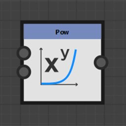
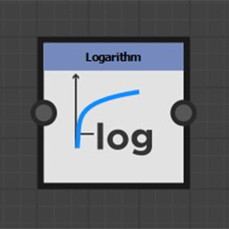
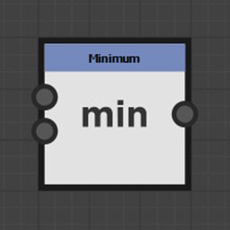

# 関数ノード

関数ノードは、入力値を表す数学関数に従って変形します。

これらの入力コネクターは通常は入力されませんが、すべての値の型をサポートしているわけではありません。

## ノードリスト

+++Pow

2番目の入力の累乗で累乗された最初の入力を返します： <b>X^Y</b>。

+++

+++2Pow

入力値<b>2^X</b>のべき乗に2を返します。

+++

+++平方根

入力値<b>√X</b>の平方根を返します。

+++

+++指数

入力値の指数値を返します： <b>e^X</b>

<b>e</b>は約2.7182818と等しくなります。

+++

+++対数

入力値<b>ln(X)</b>の自然対数を返します。

+++

+++対数の底 2

入力値<b>log2(X)</b>の底2の対数を返します。

+++

+++絶対値

入力の絶対値を返します： <b>abs(X)</b>。

+++

+++天井

入力値を切り上げます。 X以上の最小の整数値を返します： <b>ceil(X)</b>。

+++

+++下限

入力値を切り捨てます。 X以下の最大整数値を返します： <b>floor(X)</b>。

+++

+++リニア補間

浮動値の関数で2つの値の間の線形補間を返します： <b>(1 - X)\*A + X\*B</b>

+++

+++最小

次の2つの入力値のうち最小値を返します： <b>min(A, B)</b>。

+++

+++最大

次の2つの入力値のうち最も高い値を返します： <b>max(A, B)</b>。

+++

+++余弦

入力値のコサインをラジアンで返します： <b>cos(X)</b>。

+++

+++正弦

入力値のサインをラジアンで返します： <b>sin(X)</b>。

+++

+++正接

入力値のタンジェントをラジアンで返します： <b>tan(X)</b>。

+++

+++逆正接 2

入力された2Dベクトルと水平間の角度を返します。

<b>デカルト関数</b>の逆数です。

通常の<b>atan2</b>関数のように、入力ベクトルのX成分とY成分を切り替える必要はありません。

+++

+++デカルト

極座標を直交座標に変換します。

<b>Arc tangent 2 </b>関数の逆数です： <b>Length \* Float2(cos(Angle), sin(Angle).</b>

極座標は原点からの距離で、水平からの角度はラジアンです。

+++

+++ランダム

0から入力値<b>X</b>までの間のランダムな値を返します。

+++
