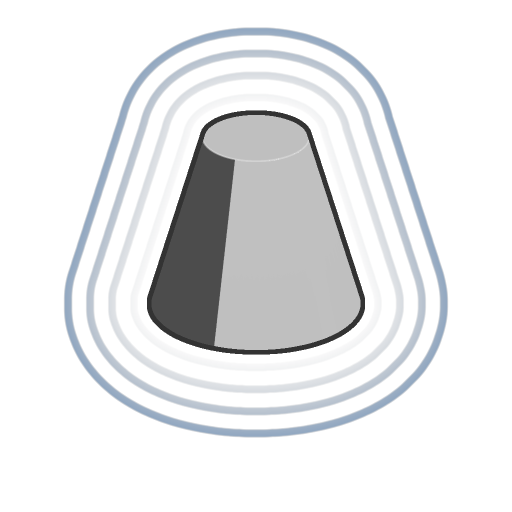

# キャップ付き円錐

<table>
<tr style="border: 0;">
<td width="33.33%" style="border: 0;" valign="top">

<b>イン：</b> SDF 関数 >プリミティブ

</td>
<td width="100.00%" style="border: 0;" valign="top">

## 説明

調節可能な底面半径と上部半径のキャップされた円錐用のSDF 関数。

</td>
</tr>
</table>

>[!INFO]
> 
> SDF 関数に関する概念やワークフローについて詳しくは、専用ページ（[SDF 関数の操作](../../working-with-sdf-functions.md)）を参照してください

## 入力

|  |  |
| :--- | :--- |
| <b>半径ベース</b> *フロート* | 円錐の底面の半径です。  <i>既定値： 0.5</i> |
| <b>半径（上）</b> *フロート* | 円錐の上面の半径。  <i>既定値： 0.2</i> |
| <b>Height</b> *フロート* | 底からキャップされた円錐のZアップHeight。  <i>既定値： 1</i> |
| <b>中央位置</b> *浮動小数点3* | キャップされた円錐の基点のワールド空間位置。  <i>既定値： (0, 0, 0)</i> |
| <b>P</b> *浮動小数点3* | ワールド空間の位置。 この入力を使用して、<b>オフセットP</b>および<b>回転P</b>ノードを使用する追加の変換を適用します。  <i>既定：変換されていないワールドスペースの位置。</i> |
