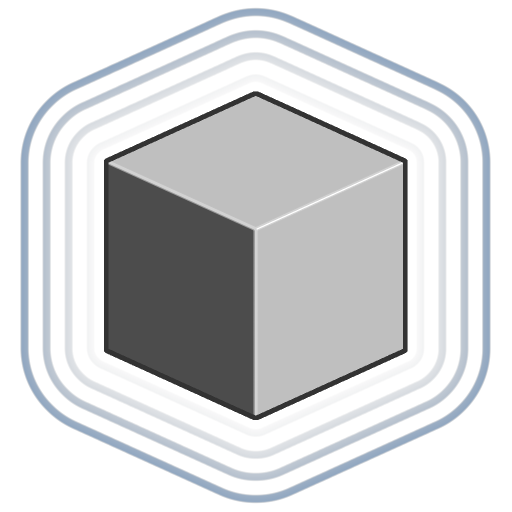

# 立方体

<table>
<tr style="border: 0;">
<td width="33.33%" style="border: 0;" valign="top">

<b>イン：</b> SDF 関数 >プリミティブ

</td>
<td width="100.00%" style="border: 0;" valign="top">

## 説明

XYZサイズを調整したり、エッジを丸めたりできる立方体のSDF 関数です。

</td>
</tr>
</table>

>[!INFO]
> 
> SDF 関数に関する概念やワークフローについて詳しくは、専用ページ（[SDF 関数の操作](../../working-with-sdf-functions.md)）を参照してください

## 入力

|  |  |
| :--- | :--- |
| <b>サイズ</b> *浮動小数点3* | X、Y、およびZ上のキューブのサイズ。  <i>既定： (1, 1, 1)</i> |
| <b>丸め</b> *フロート* | キューブのエッジに適用される丸みを帯びた円弧の半径です。  <i>注： </i>丸みの半径が交差する部分にハードエッジが表示される場合があります。  <i>既定： 0</i> |
| <b>ピボットの位置 （ローカル）</b> *浮動小数点3* | キューブのローカル基点のワールド空間の位置です。(0, 0, 0)は、基点をキューブの中心に配置します。  <i>既定値： (0, 0, -0.5)</i> |
| <b>中央位置</b> *浮動小数点3* | キューブの基点のワールドスペース位置です。  <i>既定値： (0, 0, 0)</i> |
| <b>P</b> *浮動小数点3* | 変換されたワールド空間の位置。 この入力を使用して、<b>オフセットP</b>および<b>回転P</b>ノードを使用する追加の変換を適用します。  <i>既定：変換されていないワールドスペースの位置。</i> |
