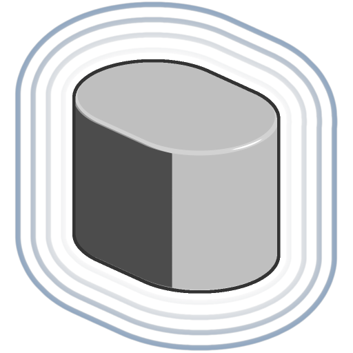

# 細長い円柱

<table>
<tr style="border: 0;">
<td width="33.33%" style="border: 0;" valign="top">

<b>イン：</b> SDF 関数 >プリミティブ

</td>
<td width="100.00%" style="border: 0;" valign="top">

## 説明

長さ、半径、エッジの丸みを調整できる細長い円柱のSDF 関数。 細長い円柱は2つの円柱をブリッジした結果です。

</td>
</tr>
</table>

>[!INFO]
> 
> SDF 関数に関する概念やワークフローについて詳しくは、専用ページ（[SDF 関数の操作](../../working-with-sdf-functions.md)）を参照してください

## 入力

|  |  |
| :--- | :--- |
| <b>Height</b> *フロート* | 開始シリンダと終了シリンダの両方のベースからのZアップHeight。  <i>既定値： 0.5</i> |
| <b>半径</b> *フロート* | 開始シリンダと終了シリンダの両方の半径です。  <i>既定値： 0.5</i> |
| <b>丸め</b> *フロート* | 細長い円柱のエッジに適用される丸みを帯びた円弧の半径です。  <i>注： </i>丸みを帯びた半径が交差する部分にハードエッジが表示される場合があります。  <i>既定： 0</i> |
| <b>中央位置</b> *浮動小数点3* | 細長い円柱の基点のワールド空間位置です。  <i>既定値： (0, 0, 0)</i> |
| <b>伸び距離</b> *フロート* | 開始円柱が伸びる距離です。 つまり、開始円柱と終了円柱の中心間の距離です。  <i>既定値： 0.5</i> |
| <b>P</b> *浮動小数点3* | ワールド空間の位置。 この入力を使用して、<b>オフセットP</b>および<b>回転P</b>ノードを使用する追加の変換を適用します。  <i>既定：変換されていないワールドスペースの位置。</i> |
