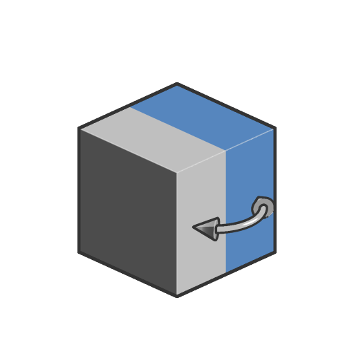

# 反転

<table>
<tr style="border: 0;">
<td width="33.33%" style="border: 0;" valign="top">

<b>イン：</b> SDF 関数 >変形

</td>
<td width="100.00%" style="border: 0;" valign="top">

## 説明

入力されたSDFシェイプにミラー変形を適用します。 選択した軸に対して負のスケールを実行します。

</td>
</tr>
</table>

>[!INFO]
> 
> SDF 関数に関する概念やワークフローについて詳しくは、専用ページ（[SDF 関数の操作](../../working-with-sdf-functions.md)）を参照してください

## 入力

|  |  |
| :--- | :--- |
| <b>SDF</b> *フロート* | 入力されたSDFシェイプ。 |
| <b>ミラー軸</b> *Integer3* | 整数3を使用して、目的のミラー軸を設定します。 例： (1, 0, 0)はX軸をミラーリングします。  <i>既定： (1, 0, 0)</i> |
| <b>P</b> *浮動小数点3* | ワールド空間の位置。 この入力を使用して、<b>オフセットP</b>および<b>回転P</b>ノードを使用する追加の変換を適用します。  <i>既定：変換されていないワールドスペースの位置。</i> |
