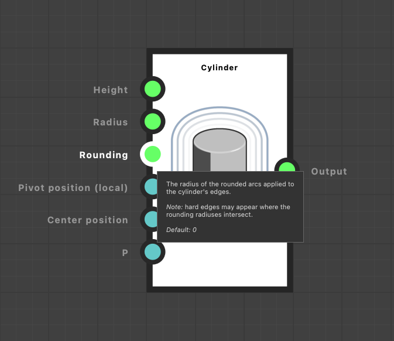
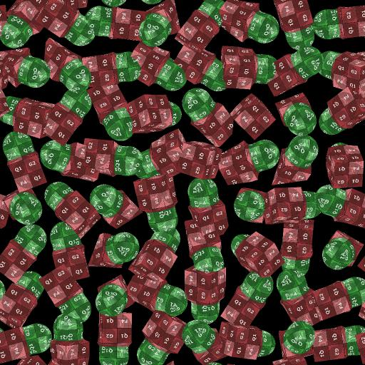

# SDF 関数の操作

バージョン16.0.0で、Substance 3D DesignerはSDF 関数を作成するための強力なノードのセットを導入しました。このノードを使用して、プロシージャルした3Dシェイプを作成および操作できます。

SDF 関数は、ツールセットで使用可能なSDFノードを組み合わせたSubstance関数グラフで、SDF 関数をサポートするノードの専用パラメータに適用されます。

作業を開始する前に、基本的なワークフローを以下に示します。

1. [3Dビューア](../../../../compositing-graphs/nodes-reference-for-com/node-library/filters/effects/3d-viewer/3d-viewer.md)ノードで、結果を視覚化するSDF 関数を作成します。
2. 最終的な関数グラフをコピー（または[インスタンス化](../../../../glossary/glossary.md#instance-node)）して、[Shape splatter v2](../../../../compositing-graphs/nodes-reference-for-com/node-library/texture-generators/patterns/shape-splatter-v2/shape-splatter-v2.md)などのSDF 関数をサポートするノードのSDF 関数パラメーターにコピーします。

## SDF 関数とは

<table style="border: none">
    <tr style="border: 0">
        <td style="border: 0; vertical-align: top">
            
2Dで曲線としてプロットできるのと同様に、3Dでもサーフェスとしてプロットできます。

符号付き距離フィールドは、空間内の任意の点からサーフェス上の最も近い点までの距離を計算することによって、3D空間でサーフェスを定義する数学関数です。

「signed distance field」という名前をさらによく理解するために詳しく説明しましょう。<ul><li><b>符号付き</b>とは、ポイントがサーフェスの外側または前面にある場合は関数が正の値を返し、ポイントがサーフェスの内側または背面にある場合は負の値を返し、ポイントが正確にサーフェス上にある場合は0を返すことを意味します。</li><li><b>距離</b>とは、関数が空間内の任意の点からサーフェス上の*最も近い*点までの距離を計算することを意味します。</li><li><b>Field</b>は、関数が値のフィールドを記述することを意味します。これは、空間内の各ポイントには、最も近いサーフェスまでの距離を表す対応する値があるためです。</li></ul>

        </td>
        <td style="border: 0; width: 33%; vertical-align: top">
            
        </td>
    </tr>
</table>

これらの機能は、画面の描画、影のキャスト、コンターマスク、衝突検出など、コンピューターグラフィックスで多くの用途に使用されています。

Substance 3D Designerでは、SDF 関数を使用してプロシージャルした方法で3Dシェイプを作成および操作します。

### SDF 関数の出力と意図された使用

SDF 関数ノードは、1つの浮動小数値、つまり最も近いサーフェスへの符号付き距離を出力します。

しかし、それらにはさらに多くのことがあります。ホストノードが定義する必要がある変数の値を内部的に取得および設定したり、結果のシェイプを操作および描画するために知っておく必要があります。

つまり、これらのノードは、*変数をサポート*&#x200B;するノードのコンテキストで使用する必要があります。これらのSDF 関数を認識し、ネイティブに統合するためです。

ノードには、[シェイプスプラッタv2](../../../../compositing-graphs/nodes-reference-for-com/node-library/texture-generators/patterns/shape-splatter-v2/shape-splatter-v2.md)と[3Dビューア](../../../../compositing-graphs/nodes-reference-for-com/node-library/filters/effects/3d-viewer/3d-viewer.md)が含まれます。

### Substance関数グラフ

SDF 関数ノードは専用のSubstance関数グラフで使用されるため、そのグラフの種類でのみ使用できます。
関数として表現するノードパラメーターでは、「関数の編集」ボタンを使用します。

Substance関数グラフについて知っておくべきこと：
* グラフと同様に、nodes コネクターは&#x200B;*specialized*&#x200B;です。つまり、型](../../function-nodes-overview/function-nodes-overview.md#color-coding)を表す&#x200B;*一致する色* [の他のコネクターにのみ接続できます。
* ノードにはパラメータはなく、入力のみを持つことができます。 （ただし、いくつかの例外があります）。
* グラフには出力ノードが1つあります。 ノードを右クリックし、`Set as output`を選択して出力ノードとして指定します。
* グラフと同様に、基本ビルディングブロックである&#x200B;*atomic*&#x200B;ノードと、他のSubstance関数グラフを表す&#x200B;*instance*&#x200B;ノードがあります。
* グラフ内の値に対して演算を実行できる個別の演算子（代数演算子、論理演算子、比較演算子）がありますが、SDFノードには[独自の演算子](#operators)があります

+++ SDF 関数を定義する関数グラフの例

+++

## はじめに

SDF 関数を作成するには、まずノードを視覚化して、調整するノードとパラメーターの効果を理解する必要があります。

[3Dビューア](../../../../compositing-graphs/nodes-reference-for-com/node-library/filters/effects/3d-viewer/3d-viewer.md)ノードには、ノードを使用して作成された図形を視覚化するための専用モードがあります。SDF 関数の<b>シーンの種類</b>パラメーターを`SDF function`に設定し、**関数の編集**&#x200B;ボタンをクリックして、SDF 関数自体をホストする関数グラフを開きます。

このノードは、バウンディングフレームやアイソラインなど、より直感的かつ効率的にSDF 関数の側面を視覚化するための専用機能を提供します。

[物理的な太陽/空](../../../../compositing-graphs/nodes-reference-for-com/node-library/3d-view-library/hdri-tools/physical-sun-sky/physical-sun-sky.md)ノードを使用すると、3Dビューアーで環境照明をすばやく設定できます。

>[!TIP]
> 
> <table style="border: none"><tr style="border: none"><td style="border: none; vertical-align: top">
すべてのSDF 関数ノードとその入力コネクターには、その目的と使用方法に関する詳細を知らせるツールチップがあります。

ぜひチェックしてみてください。
</td><td style="border: none; width: 33%; vertical-align: top"></td></tr></table>

### ノード値の設定

Substance関数グラフのすべてのノードと同様に、SDF 関数ノードにはパラメータがなく、パラメータとして使用される入力コネクターのみが含まれます。

これらの入力の値を設定するには、[定数ノード](../../atomic-function-nodes/constant-nodes/constant-nodes.md)を使用します（**浮動小数**、**浮動小数3**、**整数3**&#x200B;など）。\
ノードメニューを使用して通常の方法で作成するか、またはノードから新しいコネクションをドラッグして、一致するタイプのコネクターのフィルタリングされたリストからメリットを得ることができます。

SDF 関数ノードのほとんどの入力コネクターにはデフォルト値があります。この値はツールチップに表示されます。

>[!TIP]
> 
> <table style="border: none"><tr style="border: none"><td style="border: none; vertical-align: top">
一部の値を常に表示しておく必要がない場合は、<code>D</code>キーを使用してノードをドッキングすると、スペースを節約し、グラフを除去できます。

また、コメントを使用して値を追跡することもできます。
</td><td style="border: none; width: 67%; vertical-align: top"></td></tr></table>

### 境界フレーム

<table style="border: none">
    <tr style="border: none">
        <td style="border: none; vertical-align: top">
            
境界フレームは、3Dスペースのボックスで、<a href="../../../../compositing-graphs/nodes-reference-for-com/node-library/texture-generators/patterns/shape-splatter-v2/shape-splatter-v2.md">シェイプスプラッタv2</a>ノードでSDF 関数が評価および描画される<i>境界</i>を定義します。

境界フレームが小さすぎる場合は、シェイプの一部がトリミングされることがあります。 大きすぎると、不要な計算が発生し、処理時間が長くなる可能性があります。

<b>バウンディングフレーム</b>パラメーターを使用すると、バウンディングフレームの表示を有効にできます。 次に、<b>境界フレームのサイズ</b>パラメーターの値を変更して、境界フレームのサイズを調整できます。

<b>[フレームの色抜き]</b>パラメーターを使用すると、境界フレームの外側の領域が明るい赤で表示されるので、それに応じてフレームを調整できます。

        </td>
        <td style="border: none; width: 33%; vertical-align: top">
            
        </td>
    </tr>
</table>

### 等値線

<table style="border: none">
    <tr style="border: none">
        <td style="border: none; vertical-align: top">
            
シェイプの変形では、シェイプが描画される空間を実際に*変形する*必要があるため、トランスフォームの後にノードを使用すると、意外な結果が生じることがあります。 その場合、空間自体を視覚化すると便利です。これは、図形の<i>距離フィールドを視覚化</i>することで実現できます。

そのために、3Dビューアーノードは、図形の表面から所定の距離を表す等高線を繰り返す<i>等高線</i>を使用します。 <b>SDFアイソライン</b>パラメーターを使用すると、ビジュアル化が可能になります。 等値線は、<b>SDF等値線位置</b>パラメーターで指定されたHeightに配置された水平面に描画されます。

シェイプに適用されたトランスフォームによって等値線がどのように変形されるかを確認すると、シェイプ自体がどのように変形されるかを理解し、それに応じてノードのパラメーターを調整するのに役立ちます。

        </td>
        <td style="border: none; width: 33%; vertical-align: top">
            
        </td>
    </tr>
</table>

## SDF 関数ノードカテゴリ

SDF 関数ノードは、その機能と目的に基づいてライブラリ内で分類されます。

必要な数のライブラリビューを作成して、作業スペースを整理できます。これにより、すべての作業を管理しながら、SDF 関数ツールセットをカテゴリ別に整理できます。 **ウィンドウ/新規ライブラリ**&#x200B;の表示に移動して、ライブラリの独立したビューを個別に追加します。

+++ サンプルワークスペース

+++

### プリミティブ

SDF 関数の基本ビルディングブロック。球体、ボックス、シリンダなどの基本的なシェイプを作成できます。

+++ ノード

[円錐型](./sdf-functions-primitives/3d-sdf-capped-cone/3d-sdf-capped-cone.md)\
[円錐（2点）](././sdf-functions-primitives/3d-sdf-capped-cone-2-points/3d-sdf-capped-cone-2-points.md)\
[キャップされたトーラス](./sdf-functions-primitives/3d-sdf-capped-torus/3d-sdf-capped-torus.md)\
[カプセル](./sdf-functions-primitives/3d-sdf-capsule/3d-sdf-capsule.md)\
[円錐](./sdf-functions-primitives/3d-sdf-cone/3d-sdf-cone.md)\
[キューブ](./sdf-functions-primitives/3d-sdf-cube/3d-sdf-cube.md)\
[円柱](./sdf-functions-primitives/3d-sdf-cylinder/3d-sdf-cylinder.md)\
[円柱（2ポイント）](./sdf-functions-primitives/3d-sdf-cylinder-2-points/3d-sdf-cylinder-2-points.md)\
[準拠楕円体](./sdf-functions-primitives/3d-sdf-ellipsoid/3d-sdf-ellipsoid.md)\
[細長い円柱](./sdf-functions-primitives/3d-sdf-elongated-cylinder/3d-sdf-elongated-cylinder.md)\
[グリッド](./sdf-functions-primitives/3d-sdf-ground-plane/3d-sdf-ground-plane.md)\
[らせん](./sdf-functions-primitives/3d-sdf-helix/3d-sdf-helix.md)\
[六角柱](./sdf-functions-primitives/3d-sdf-hexagonal-prism/3d-sdf-hexagonal-prism.md)\
[無限平面](./sdf-functions-primitives/3d-sdf-infinite-plane/3d-sdf-infinite-plane.md)\
[平面](./sdf-functions-primitives/3d-sdf-plane/3d-sdf-plane.md)\
[ピラミッド](./sdf-functions-primitives/3d-sdf-pyramid/3d-sdf-pyramid.md)\
[角錐](./sdf-functions-primitives/3d-sdf-pyramid-square/3d-sdf-pyramid-square.md)\
[ロック](./sdf-functions-primitives/3d-sdf-rock/3d-sdf-rock.md)\
[球](./sdf-functions-primitives/3d-sdf-sphere/3d-sdf-sphere.md)\
[トーラス](./sdf-functions-primitives/3d-sdf-torus/3d-sdf-torus.md)

+++

### 演算子

これらのノードを使用すると、プリミティブで作成されたシェイプを結合および修正できます。 次のようなものがあります。
* **直線のブール演算式**&#x200B;の演算子（[和](sdf-functions-operators/3d-sdf-op-union/3d-sdf-op-union.md)、[交差](sdf-functions-operators/3d-sdf-op-intersection/3d-sdf-op-intersection.md)、[減算](sdf-functions-operators/3d-sdf-op-subtraction/3d-sdf-op-subtraction.md)など）を使用すると、様々な方法でシェイプを組み合わせることができます。
* **ブール演算式**&#x200B;の変形（[丸め](sdf-functions-operators/3d-sdf-op-rounding/3d-sdf-op-rounding.md)、[モーフ](sdf-functions-operators/3d-sdf-op-morph/3d-sdf-op-morph.md)など）により、シェイプをブレンド効果と組み合わせることができます。
* **図形を変更および/または複製できる[Shell](sdf-functions-operators/3d-sdf-op-shell/3d-sdf-op-shell.md)および[Symmetry](sdf-functions-operators/3d-sdf-op-symmetry/3d-sdf-op-symmetry.md)などのその他の特殊な**&#x200B;演算子。

+++ ノード

[交差点](./sdf-functions-operators/3d-sdf-op-intersection/3d-sdf-op-intersection.md)\
[交差点のスムーズ](./sdf-functions-operators/3d-sdf-op-intersection-smooth/3d-sdf-op-intersection-smooth.md)\
[交差サーフェス](./sdf-functions-operators/3d-sdf-op-intersection-surface/3d-sdf-op-intersection-surface.md)\
[モーフ](./sdf-functions-operators/3d-sdf-op-morph/3d-sdf-op-morph.md)\
[ミラーの繰り返し](./sdf-functions-operators/3d-sdf-op-repeat-mirror/3d-sdf-op-repeat-mirror.md)\
[丸め](./sdf-functions-operators/3d-sdf-op-rounding/3d-sdf-op-rounding.md)\
[シェル](./sdf-functions-operators/3d-sdf-op-shell/3d-sdf-op-shell.md)\
[減算](./sdf-functions-operators/3d-sdf-op-subtraction/3d-sdf-op-subtraction.md)\
[減算スムーズ](./sdf-functions-operators/3d-sdf-op-subtraction-smooth/3d-sdf-op-subtraction-smooth.md)\
[対称](./sdf-functions-operators/3d-sdf-op-symmetry/3d-sdf-op-symmetry.md)\
[組合](./sdf-functions-operators/3d-sdf-op-union/3d-sdf-op-union.md)\
[ユニオン面取り](./sdf-functions-operators/3d-sdf-op-union-chamfer/3d-sdf-op-union-chamfer.md)\
[和平スムーズ](./sdf-functions-operators/3d-sdf-op-union-smooth/3d-sdf-op-union-smooth.md)

+++

### 変形

図形は、[翻訳](sdf-functions-transforms/3d-sdf-transform-offset/3d-sdf-transform-offset.md)、[回転](sdf-functions-transforms/3d-sdf-transform-rotate/3d-sdf-transform-rotate.md)、[拡大/縮小](sdf-functions-transforms/3d-sdf-transform-scale/3d-sdf-transform-scale.md)、[ねじれ](sdf-functions-transforms/3d-sdf-transform-twist/3d-sdf-transform-twist.md)など、さまざまな方法で変形できます。
これらのノードを使用すると、サーフェスが定義されている空間そのものを*変換*&#x200B;することで、これらの変換を実行できます。

このスペースは`P`と呼ばれます。次のセクションに進むと、このスペースの意味とスペース変換の仕組みについて詳しく理解できます。

+++ ノード

[曲げ](./sdf-functions-transforms/3d-sdf-transform-bend/3d-sdf-transform-bend.md)\
[細長くする](./sdf-functions-transforms/3d-sdf-transform-elongate/3d-sdf-transform-elongate.md)\
[反転](./sdf-functions-transforms/3d-sdf-transform-flip/3d-sdf-transform-flip.md)\
[オフセット](./sdf-functions-transforms/3d-sdf-transform-offset/3d-sdf-transform-offset.md)\
[オフセットP](./sdf-functions-transforms/3d-sdf-transform-offset-p/3d-sdf-transform-offset-p.md)\
[回転](./sdf-functions-transforms/3d-sdf-transform-rotate/3d-sdf-transform-rotate.md)\
[Pを回転](./sdf-functions-transforms/3d-sdf-transform-rotate-p/3d-sdf-transform-rotate-p.md)\
[スケール](./sdf-functions-transforms/3d-sdf-transform-scale/3d-sdf-transform-scale.md)\
[ねじり](./sdf-functions-transforms/3d-sdf-transform-twist/3d-sdf-transform-twist.md)

+++

### マテリアル

SDF 関数を使用して作成されたシェイプに対して、基本的なマテリアルマネジメントが利用できます。

基本的なマテリアルアトリビュート（カラー、粗さ、メタネス）を定義できます。このアトリビュートは、3Dビューアノードでの直接表示に使用したり、シェイプスプラッタv2ノードでのマテリアル作業のベースとして使用できます。\
また、マテリアルIDをシェイプの異なる部分に割り当てて、それらを分離することもできます。

これらのノードのアプリケーションの詳細については、[以下](#material-id)を参照してください。

+++ ノード

* [マテリアルIDを設定](./sdf-functions-material/set-id/set-id.md)
* [マテリアルを設定](./sdf-functions-material/set-material/set-material.md)
* [カラーを設定](./sdf-functions-material/set-color/set-color.md)
* [メタネスの設定](./sdf-functions-material/set-metalness/set-metalness.md)
* [粗さを設定](./sdf-functions-material/set-roughness/set-roughness.md)

+++

## &#39;P&#39;入力

オフセットや回転などのトランスフォームをシェイプに適用すると、シェイプが定義されている空間が実際にトランスフォームされます。

トランスフォームを他のシェイプに適用する場合（例えば、複数のシェイプを同じように回転させる場合）、トランスフォームされた同じ領域を使用している必要があります。

変換されたスペースは、専用の`P`入力を使用してノード間で共有されます。この入力は、ほとんどのSDFノードで見つけることができます。\
&#39;P&#39;はワールド空間を表します&#x200B;**P** osition:ワールド空間の点の座標を表す3Dベクトルです。

[オフセットP](sdf-functions-transforms/3d-sdf-transform-offset-p/3d-sdf-transform-offset-p.md)および[回転P](sdf-functions-transforms/3d-sdf-transform-rotate-p/3d-sdf-transform-rotate-p.md)ノードは、空間を変換し、その変換を継承するすべてのノードに伝達します。\
たとえば、複数のシェイプの`P`入力を同じ回転Pノードに接続することで、複数のシェイプを一緒に回転できます。

これは単に便宜上の問題ではなく、SDFノードが空間内の同じ位置で動作することを確認するためです。

次に例を示します。

球が繰り返され、空間が3Dグリッドとして表示されます。 *スペースを繰り返す*&#x200B;ことで繰り返されます。\
共有`P`がない場合、曲がった円柱は球で使用される繰り返しスペースを使用します。\
共有`P`を使用すると、共有の回転されたスペースで図形を正しく定義できます。

## 「シェイプスプラッタv2」ノードのSDF 関数の使用

3DビューアノードのコンテキストでSDF 関数を完了したら、関数全体をコピーして[Shape splatter v2](../../../../compositing-graphs/nodes-reference-for-com/node-library/texture-generators/patterns/shape-splatter-v2/shape-splatter-v2.md)ノードに貼り付け、そのノードのシェイプジェネレータとして使用できます。

**図形の種類**&#x200B;パラメーターを`SDF function`に設定し、**パターンSDF 関数**&#x200B;パラメーターに移動して、**関数の編集**ボタンをクリックして、パラメーターの関数グラフを開きます。
その後、3Dビューアノードからコピーした関数をグラフに貼り付けることができます。 （関数グラフの出力ノードをもう一度設定することを忘れないでください。）

**SDF境界フレームサイズ**&#x200B;パラメータを調整して、3Dビューアーノードで使用していた[境界フレーム](#the-bounding-frame)と一致させ、シェイプが正しく描画されていることを確認してください。

\
**図形の種類**&#x200B;が`SDF function`に設定された&#x200B;*図形スプラッタv2。**SDF境界フレームサイズ**がシェイプに合わせて調整されています。*

>[!TIP]
> 
> SDF 関数を簡単に再利用するには、新しいSubstance関数グラフにコピーし、そのグラフを3Dビューアとシェイプスプラッタv2ノードの両方で&#x200B;**インスタンスノード**&#x200B;として使用します。
> 
> これには、次のような利点があります。
> * 関数に対して行った更新は、両方のノードに反映されます。コピー&amp;ペーストの必要はありません。 これは、複雑なシェイプのQOLを大幅に改善したものです。
> * グラフには、インスタンスノードに表示される説明的な名前を付けることができます。これにより、独自のSDFシェイプのライブラリを使用する方がはるかに管理しやすく、グラフを読みやすくすることができます。
> * [Get](../../atomic-function-nodes/get-nodes/get-nodes.md)ノードで使用できる関数グラフの入力を作成できます。 これらの入力は、インスタンスノードで入力コネクタとして公開され、シェイプのバリエーションを簡単に作成できます。

### マテリアル ID

SDF図形にはマテリアルIDを割り当てることができます。マテリアルIDは整数値で、図形の一部を区別したり、[3Dビューア](../../../../compositing-graphs/nodes-reference-for-com/node-library/filters/effects/3d-viewer/3d-viewer.md)および[シェイプスプラッタv2](../../../../compositing-graphs/nodes-reference-for-com/node-library/texture-generators/patterns/shape-splatter-v2/shape-splatter-v2.md)のノードでSDF図形に異なるマテリアルを割り当てたりするのに使用できます。

以下の例に示すように、異なるマテリアルIDを持つサーフェスは、ブレンドされたシェイプを横切るようにハードエッジで分割されます。

特定のマテリアルIDを使用してタグ付けする図形の部分の後に[マテリアルIDの設定](./sdf-functions-material/set-id/set-id.md)ノードを使用し、[Integer](../../atomic-function-nodes/constant-nodes/constant-nodes.md)定数ノードを使用して、必要なマテリアルID値を設定します。\
3Dビューアーノードで、**Output**&#x200B;パラメーターを`Material ID`に設定して、図形のマテリアルIDを表示します。

\
*右側では、2つの3Dビューアーノードの出力が合成され、シェイプ（左）とそのマテリアルID （右）が表示されます。これにより、ブレンドしたシェイプで、マテリアルIDを分割している間にマテリアルがどのように補間されるかが示されます。*

マテリアルIDは、Shape splatter v2コンパニオンノードで活用できます。
* [シェイプスプラッタv2マッパー](../../../../compositing-graphs/nodes-reference-for-com/node-library/texture-generators/patterns/shape-splatter-v2-mapper-color/shape-splatter-v2-mapper-color.md)ノードは、これらのマテリアルIDを使用して異なるパターンを割り当てることができます。
* [シェイプスプラッタv2をマスクする](../../../../compositing-graphs/nodes-reference-for-com/node-library/texture-generators/patterns/shape-splatter-v2-to-mask/shape-splatter-v2-to-mask.md)は、マテリアルIDに従ってシェイプの一部をマスクできます。

<table style="border: none; margin-top: 32px">
    <tr style="border: 0">
        <td style="border: 0; width: 33%">
            <i>カラーマッピングに使用されるマテリアル ID 図形スプラッタv2マッパーの色</i>
        </td>
        <td style="border: 0; width: 33%">
            <i>三平面マッピングに使用されたマテリアル ID 図形スプラッタv2マッパーカラー</i>
        </td>
        <td style="border: 0; width: 33%">
             <i>シェイプスプラッタv2でマスクに マスクに使用されたマテリアル ID</i>
        </td>
    </tr>
</table>

### カラー、ラフネス、メタネス

[色の設定](./sdf-functions-material/set-color/set-color.md)、[ラフネスの設定](./sdf-functions-material/set-roughness/set-roughness.md)、および[メタネスの設定](./sdf-functions-material/set-metalness/set-metalness.md)ノードを使用すると、SDF 関数内の図形に対してこれらのマテリアル属性を定義できます。

その後、そのSDF 関数を[Shape splatter v2](../../../../compositing-graphs/nodes-reference-for-com/node-library/texture-generators/patterns/shape-splatter-v2/shape-splatter-v2.md)ノードでシェイプの種類として使用する場合、これらのマテリアル属性は、ノードの&#x200B;**SDFカラー**、**SDF ラフネス**&#x200B;および&#x200B;**SDFメタネス**&#x200B;出力でマップとして使用できます。 これらのマップは、他のノードを使用する、より複雑なマテリアル作業のベースとして使用できます。

以下の例に示すように、マテリアル IDとは異なり、値はブレンドされたシェイプ間でグラデーションとして&#x200B;*補間*&#x200B;されます。

<table style="border: none; margin-top: 32px">
    <tr style="border: 0">
        <td style="border: 0; width: 33%">
            <i>SDFカラー出力</i>
        </td>
        <td style="border: 0; width: 33%">
             <i>SDFラフネス出力</i>
        </td>
        <td style="border: 0; width: 33%">
            <i>SDFメタネス出力</i>
        </td>
    </tr>
</table>

### マテリアルサンプル

<table style="border: none">
    <tr style="border: none">
        <td style="border: none; vertical-align: top">
            
<b>錆びたボルト</b> <a href="../../../../compositing-graphs/creating-compositing-gra/material-samples/material-samples.md">マテリアルサンプル</a>を使用すると、シェイプスプラッタv2ノードのコンテキストで適用されたSDF 関数にジャンプできます。

グラフの構造、ノード設定、およびSDF 関数設定をガイドするように、ノードが整理され、注釈が付けられています。

また、<i>完全に編集可能</i>であるため、サンドボックスとして使用して、シェイプスプラッタv2とSDF 関数ツールセットについて実践的に理解することができます。 サンプルグラフは好きなだけ作れるので、自由に試してみてください。

        </td>
        <td style="border: none; width: 20%; vertical-align: top; text-align: right">
            
        </td>
    </tr>
</table>
