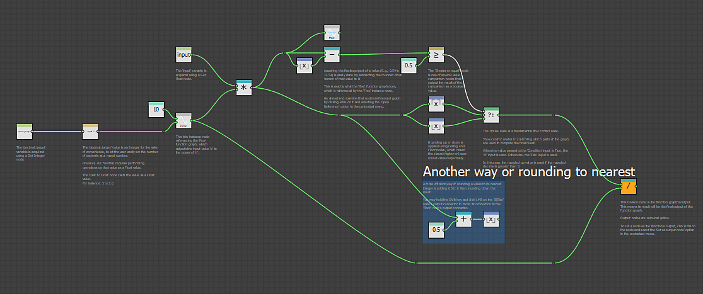

# 関数グラフのサンプル

## 概要

このページには、ダウンロード可能な[Substance 3D Designer](https://www.adobe.com/jp/products/substance3d-designer.html)ファイルのサンプルが表示されます。 これらのプロジェクトには、[関数グラフ](../../function-graphs/function-graphs.md)の基本的なツールと概念を示す注釈つきグラフが含まれています。

<table>
<tr style="border: 0;">
<td style="border: 0;" valign="top">

## Substance合成グラフの関数

このプロジェクトでは、関数グラフの概要と、[Substance合成グラフ](../../compositing-graphs/substance-compositing-graphs.md)のノードパラメーターに対する制御を拡張するための関数グラフの使用方法について説明します。

[{width="64px"}](https://shared-assets.adobe.com/link/c5aa6fa1-b72e-488b-60b2-eda2c85e5515)

</td>
<td style="border: 0;" valign="top">

{width="512px"}

</td>
</tr>
</table>
