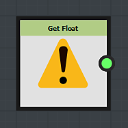

# 変数値を取得する

関数で変数を使用するには、変数を「呼び出す」、つまり変数の値を関数に読み込む必要があります。

これを行うには、*Get*&#x200B;ノードを使用する必要があります。

Getノードには様々な種類があります。読み込む値の種類に応じて適切なノードを選択します。

## 取得ノードへの変数の割り当て

デフォルトでは、getノードは警告記号を表示します。これは、まだ変数にリンクされていないことを意味します。

変数をリンクするには、パラメータに移動し、「変数/取得\*\*」リストから変数を1つ選択します（\*\*\*はGetノードが呼び出せる値の型に置き換えられます）。

変数名がノードに表示されます。

リストには、Getノードと同じ型の変数だけが表示されることに注意してください。

>[!WARNING]
>
> *Set*&#x200B;ノードで作成された変数は、*Get*&#x200B;ノードリストに表示されません。
> 
> ただし、リストに名前を手動で書き込むことによって、変数を取得することはできます。
> 
> 次の場合に、Setノードで作成された変数を呼び出すことができます。
> 
> * GetノードとSetノードは、同じノードのパラメーターを制御する関数グラフ内にあります
> * *Get*&#x200B;ノードグラフによって制御されるパラメーターが同じであるか、パラメータースタックーの&#x200B;*Set*&#x200B;ノードグラフーのパラメーターの下にあります。
