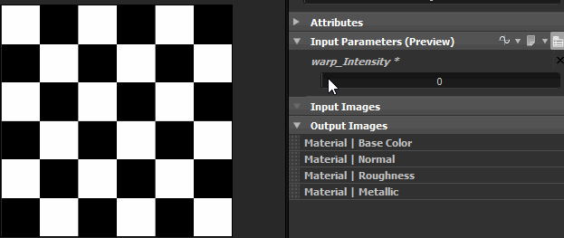

# 関数とは

Substance 3D Designerの関数を使用すると、プログラミング言語のロジックを使用して結果を生成できます。

しかし、Designerの関数は、コード行を使用するのではなく、同じノードのアプローチを維持します。 一見すると、関数グラフは通常のグラフに非常に似ています。

関数が検出される主なケースには、次の2つがあります。

* パラメータの結果を制御するには
* ピクセルプロセッサーを

## パラメーターの結果を制御する

Substance 3D Designerでは、任意のパラメーターを関数で制御できます。

したがって、グラフの各部間の規則や依存性を想像して、独自の結果を得ることができます。

例えば、ブレンドノードの不透明度をワープノードの強度の半分に設定することができます。

実際、気付かないうちに関数を作成してしまった可能性があります。

パラメーターを表示した場合は、関数と変数が自動的に作成されています。関数には、新しく作成された変数の値をキャッチするget floatノードが含まれています。

