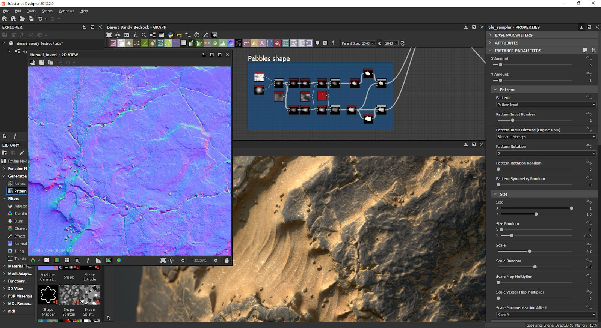

# Substance 3D Designerユーザーガイド

[Substance 3D Designer](https://www.adobe.com/jp/products/substance3d-designer.html) はマテリアルオーサリングソフトウェアです。 ノードグラフを使用して、プロシージャパターンやノイズからテクスチャを生成したり、ビットマップを操作することができます。

Designer で使用されている単語や概念になじみがありませんか？ 「[用語集](../glossary/glossary.md)」に移動して学んでください。

このマニュアルで回答されていない質問がある場合は、[コミュニティサポートフォーラム](https://community.adobe.com/t5/substance-3d-designer/ct-p/ct-substance-3d-designer)で自由に質問してください。 PBR の詳細については、[物理ベースレンダリングガイド](https://substance3d.adobe.com/tutorials/courses/the-pbr-guide-part-1)をダウンロードすることもできます。

<table>
<tr style="border: 0;">
<td style="border: 0;" valign="top">

## はじめに

* [アクティベーションとライセンス](../getting-started/activation-and-licenses/activation-and-licenses.md) — このページには、Designer の使用を開始できるようにライセンスをアクティベートおよび管理する方法に関する情報があります。
* [必要システム構成](../getting-started/system-requirements/system-requirements.md) — このページには、必要システム構成およびハードウェア互換性情報がリストされています。
* [概要](../getting-started/overview/overview.md) — このページでは、Substance 3D Designer https://www.adobe.com/jp/products/substance3d-designer.html の概要、Substance エコシステム内の他のアプリケーションとの比較方法、ならびに作業するファイル形式およびリソースの種類を示します。
* [ワークフローの概要](../getting-started/workflow-overview/workflow-overview.md) — このページでは、ノードベースのワークフローの概念と、Designer で作成できる 3 つの主なタイプのグラフの概要を説明しています。
* [ショートカット](../getting-started/shortcuts/shortcuts.md) — このページでは、Substance 3D Designer のすべてのショートカットの概要を確認できます。
* [チュートリアルと学習](../getting-started/tutorials-learning/tutorials-learning.md) — ビデオや、他のより焦点を絞った、学習用のマテリアルで調べたい場合は、はじめる前にこれらのチュートリアルが適しています。

</td>
<td style="border: 0;" valign="top">

## インターフェイス

* [ホーム画面](../interface/home-screen/home-screen.md) — Substance 3D Designer を起動すると、ホーム画面が歓迎します。 ソフトウェアの使用を開始し、最も役立つリンクにアクセスするのに役立ちます。
* [ワークスペースのカスタマイズ](../interface/customizing-your-wor/customizing-your-workspace.md) — このページでは、Adobe Substance 3D Designer の https://www.adobe.com/jp/products/substance3d-designer.html ユーザーインターフェイスでパネルを並べ替える方法と、その機能を活用してワークフローを強化する方法を提示しています。
* [メインツールバー](../interface/the-main-toolbar/the-main-toolbar.md) — このページでは、Adobe Substance 3D Designer のメインツールバーおよびメニューについて説明しています。これらは、メインウィンドウの左上に表示されます。
* [環境設定](../interface/preferences-window/preferences-window.md) — このページでは、環境設定ウィンドウとそのすべての設定を提示しています。
* [エクスプローラー](../interface/the-explorer-window/the-explorer-window.md) — このページでは、Adobe Substance 3D Designer のエクスプローラードックについて説明しています。 このドックを使用すると、パッケージとそのリソースを管理できます。
* [グラフビュー](../interface/the-graph-view/the-graph-view.md) — このページでは、Substance 3D Designer のグラフビューを提示しています。
* [ライブラリ](../interface/the-library/the-library.md) — このページでは、Substance 3D Designer のライブラリパネル、そのレイアウト、コンテンツの検索およびフィルタリングに使用できるツールを提示しています。
* [プロパティ](../interface/properties/properties.md) — このページでは、Substance 3D Designer の属性パネル、そのレイアウト、様々なロールアウトとカテゴリ、およびパラメーターを提示しています。 Substance グラフのプロパティに焦点が絞られています。 Substance機能グラフとFX-Mapグラフのレイアウトがシンプルになりました。
* [2D ビュー](../interface/2d-view/2d-view.md) — このページでは、Substance 3D Designer の 2D ビューパネルのユーザーインターフェイスおよび機能について説明しています。
* [3D ビュー](../interface/3d-view/3d-view.md) — 3D ビューは、カスタムメッシュおよびレンダリングされた PBR マテリアルを含んだマテリアルを表示し、理解するのに役立ちます。
* [依存関係マネージャー](../interface/dependency-manager/dependency-manager.md)

</td>
</tr>
</table>

<table>
<tr style="border: 0;">
<td style="border: 0;" valign="top">

## Substance グラフ

* [Substance グラフの重要な概念](../compositing-graphs/compositing-graph-key-con/substance-compositing-graph-key-concepts.md)
* [Substance グラフの作成](../compositing-graphs/creating-compositing-gra/creating-a-substance-compositing-graph.md)
* [パラメーターの表示](../compositing-graphs/manage-parameters/exposing-a-parameter/exposing-a-parameter.md)
* [グラフパラメーター](../compositing-graphs/graph-parameters/graph-parameters.md)
* [Substance グラフの継承](../compositing-graphs/inheritance-compositing/inheritance-in-substance-compositing-graphs.md)
* [出力サイズ](../compositing-graphs/output-size/output-size.md)
* [Substance グラフの値](../compositing-graphs/values-compositing-graphs/values-in-substance-compositing-graphs.md)
* [Substance 3D アセットファイル（SBSAR）の公開](../compositing-graphs/publishing-asset-files/publishing-substance-3d-asset-files-sbsar.md)
* [ビットマップの書き出し](../compositing-graphs/exporting-bitmaps/exporting-bitmaps.md)
* [PSD ファイルの書き出し](../compositing-graphs/exporting-psd-files/exporting-psd-files.md)
* [サンプル Substance グラフ](../compositing-graphs/sample-compositing-graphs/sample-substance-compositing-graphs.md)
* [Substance グラフの警告](../compositing-graphs/warnings-compositing-gra/warnings-in-substance-compositing-graphs.md)
* [Substance グラフのノード参照](../compositing-graphs/nodes-reference-for-com/nodes-reference-for-substance-compositing-graphs.md)

</td>
<td style="border: 0;" valign="top">

## リソース

* [新しいリソースの読み込み、リンクおよび追加](../resources/importing-linking-and-new/importing-linking-and-new-resources.md)
* [ビットマップリソース](../resources/bitmap-resource/bitmap-resource.md)
* [ベクターグラフィック（SVG）リソース](../resources/vector-graphics-svg-res/vector-graphics-svg-resource.md)
* [3D シーンリソース](../resources/3d-scene-resource/3d-scene-resource.md)
* [AxF（Appearance eXchange Format）](../resources/axf-appearance-exchange/axf-appearance-exchange-format.md)
* [フォントリソース](../resources/font-resource/font-resource.md)
* [依存関係からの警告](../resources/warnings-from-dep/warnings-from-dependencies.md)

</td>
</tr>
</table>

<table>
<tr style="border: 0;">
<td style="border: 0;" valign="top">

## パイプラインおよびプロジェクト設定

* [プロジェクト設定ファイル - SBSPRJ](../pipeline-and-project-con/project-configuration-fil/project-configuration-files-sbsprj.md)
* [設定リスト - SBSCFG](../pipeline-and-project-con/configuration-list-sbscfg/configuration-list-sbscfg.md)
* [ユーザー環境設定 - 設定の自動化](../pipeline-and-project-con/user-preferences-aut/user-preferences-automating-setup.md)
* [インストールパスの取得](../pipeline-and-project-con/retrieving-the-ins/retrieving-the-installation-path.md)
* [環境変数](../pipeline-and-project-con/environment-variables/environment-variables.md)

</td>
<td style="border: 0;" valign="top">

## 技術的な問題

* [警告とエラー](../technical-issues/warnings-and-errors/warnings-and-errors.md)
* [プロジェクトを作成できない／読み込めない](../technical-issues/cannot-create-load-pro/cannot-create-load-a-project.md)
* [アプリケーションが起動しない](../technical-issues/application-does-not-sta/application-does-not-start.md)
* [グラフのレンダリング時にクラッシュ](../technical-issues/crash-when-rendering-gra/crash-when-rendering-graphs.md)
* [パラメーターが予期したとおりに機能しない](../technical-issues/parameters-not-working/parameters-not-working-as-expected.md)
* [画像出力が正しくない](../technical-issues/incorrect-image-output/incorrect-image-output.md)
* [3D ビューの問題](../technical-issues/3d-view-issues/3d-view-issues.md)
* [ユーザーインターフェイスの問題](../technical-issues/user-interface-issues/user-interface-issues.md)

</td>
</tr>
</table>
