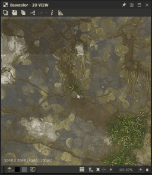
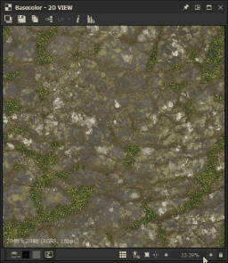
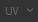
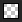
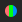
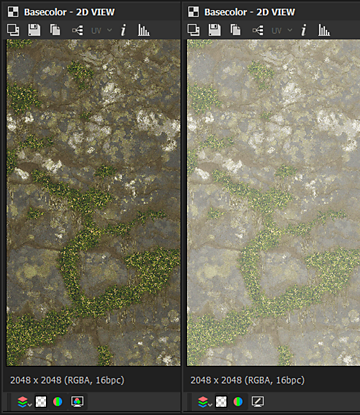
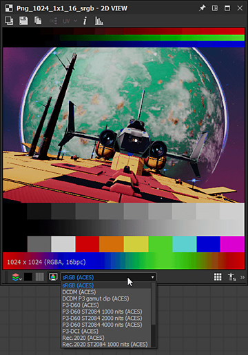

# 2D ビュー

このページでは、Substance 3D Designerの&#x200B;**2Dビュー**&#x200B;パネルのユーザーインターフェイスと機能について説明します。

## 概要

[2Dビュー](https://substance3d.adobe.com/)は、Designerのユーザーインターフェイスのメインパネルの1つです。 その主な目的は以下の通りである：

* 指定された&#x200B;*ノード*&#x200B;または指定された&#x200B;*ノードコネクタ*&#x200B;経由での&#x200B;*value*&#x200B;または&#x200B;*image*&#x200B;出力を表示しています
* [ビットマップ](../../resources/bitmap-resource/bitmap-resource.md)と[ベクターグラフィックス](../../resources/vector-graphics-svg-res/vector-graphics-svg-resource.md) [リソース](../../resources/resources.md)を表示しています
* カラーチャンネルや正確なカラー値など、現在保持しているコンテンツに関する&#x200B;*追加情報*&#x200B;を表示しています
* パラメーター&#39; *ギズモ*&#x200B;を制御しています

表示されている画像または値が変更されると、2Dビュー&#x200B;*は自動的に更新*&#x200B;され、データの現在の状態との同期が維持されます。\
*複数* 2Dビューパネルはいつでもアクティブにでき、それぞれが異なる画像または値を表示できます。 ユーザーインターフェイスパネルの <b>ピン</b>機能を使用して、新しいパネルを使用するタイミングを制御できます。

### 2Dビューでのコンテンツの表示

>[!WARNING]
>
> このセクションの&#x200B;*ノード*&#x200B;で行われた操作に関するすべての言及は、[Substanceグラフ](../../compositing-graphs/substance-compositing-graphs.md)にのみ適用されます。

2Dビューで画像を表示する最も簡単な方法は、*LMB*&#x200B;をダブルクリックすることです。

* ...[エクスプローラー](../../interface/the-explorer-window/the-explorer-window.md)の[ビットマップ](../../resources/bitmap-resource/bitmap-resource.md)または[ベクターグラフィックス](../../resources/vector-graphics-svg-res/vector-graphics-svg-resource.md)リソース上
* ... [グラフビュー](../../interface/the-graph-view/the-graph-view.md)のノードまたはノードコネクタ上に配置します

[エクスプローラー](../../interface/the-explorer-window/the-explorer-window.md)パネルの[リソース](../../resources/resources.md)の&#x200B;*LMB*、またはグラフ表示のノードの&#x200B;*RMB*&#x200B;を押して、画像をビューポートに直接&#x200B;*ドラッグアンドドロップ*&#x200B;することもできます。

グラフビューでは、<b>2Dビューで出力を表示</b>コンテキストメニューオプションを使用して、画像を2Dビューに送信できます。このオプションには、*RMB*&#x200B;をクリックしてアクセスします。

* ...を&#x200B;*ノード*&#x200B;上に置き、*そのノードの出力*&#x200B;を表示します。 ノードに複数の出力がある場合は、サブメニューから目的の出力を選択します
* ...グラフ表示の&#x200B;*空きスペース*&#x200B;に、*そのグラフの出力*&#x200B;を表示します。 グラフに複数の出力がある場合は、サブメニューから目的の出力を選択します

グラフを読み込むと、デフォルトで&#x200B;*最初の出力*&#x200B;が2Dビューに自動的に表示されます。 この動作は、[環境設定](../../interface/preferences-window/preferences-window.md)で無効にできます。 <b>編集/環境設定/グラフ/Substance合成グラフ</b>に移動し、*グラフを開くときに<b>出力を2Dビューで表示</b>する*&#x200B;をオフにします。

## ビューポート

ビューポートは<b>2Dビュー</b>の&#x200B;*表示領域*&#x200B;で、次のマウスおよびキーボードショートカットを使用して表示された画像を&#x200B;*移動*&#x200B;できます。

<table>
<tr style="border: 0;">
<td style="border: 0;" valign="top">

* <b>パン：</b> Ctrl + RMB / MMB
* <b>ズーム：</b> Alt + RMB /マウスホイール/ &#39;表示倍率&#39;ツール：\
  
* <b>ビューポートに合わせて調整：</b> F / &#39;ビューに合わせる&#39;ボタン
* <b>1:1の倍率に調整：</b> Z / &#39;倍率に合わせる&#39;ボタン

</td>
<td style="border: 0;" valign="top">

</td>
</tr>
</table>

トラックパッドの使用（macOSのみ）

* <b>パン： </b>2本指でのスワイプ
* <b>ズーム：</b> Cmdを押しながら2本指でピンチ/ 2本指でスワイプ

>[!IMPORTANT]
>
> 利用できないアクション
> 
> 画像の現在の表示サイズがビューポートのサイズより&#x200B;*小さい場合、画像のパンは*&#x200B;できません&#x200B;*。*
> 
> 表示されているコンテンツ&#x200B;*が存在しない*&#x200B;場合（画像の参照ノードまたはリソースが削除された場合など）は、画像を&#x200B;*ズームインまたはズームアウトできません*。

>[!NOTE]
>
> ズーム方向
> 
> 各ズーム方法は、他の方法と反転する：
> 
> * マウスホイールを&#x200B;*上げると画像が近づく*
> * Alt+RMBを押しながら上にドラッグすると、画像が&#x200B;*プッシュ*&#x200B;されます
> 
> ズーム方向は、[環境設定](../../interface/preferences-window/preferences-window.md)で反転できます。

画像のネイティブ&#x200B;*解像度*、*カラーフォーマット*&#x200B;および&#x200B;*ビット深度*&#x200B;は、ビューポートの左下の領域に表示されます。

ビューポートには、ナビゲーションの他に次の機能があります。

* タイル表示： *ビューポートで画像をタイル表示で繰り返します*。 これは、パターンまたはテクスチャがどのように繰り返されるかを確認する場合に便利です。 **スペースバー**&#x200B;または **タイル表示**&#x200B;ボタンを使用して有効になっています
* 物理サイズ表示：グラフの[物理サイズ](../../compositing-graphs/graph-parameters/graph-parameters.md)プロパティと一致する&#x200B;*比率*&#x200B;で画像を表示します。 **物理サイズ比率**&#x200B;ボタンを使用すると有効になります
* 表示サイズを維持：このオプション&#x200B;*は、表示スケールをロック*&#x200B;して、異なる画像全体で一貫した状態を保ちます。 *デフォルトで有効*&#x200B;であり、 **表示サイズを維持**&#x200B;ボタンを使用して無効にできます

## メインツールバー

<b>2Dビュー</b>パネルのメインツールバーでは、表示された画像をさらに活用でき、次の機能が提供されます。

+++背景画像
{width="360px"}

現在表示されている画像の上に&#x200B;*別の画像をオーバーレイ*&#x200B;できます。  <b>背景画像</b>ボタンを押すと、オーバーレイとして使用する画像ファイルを選択するように求められます。

ファイルを選択すると、新しいツールバーが表示され、画像オーバーレイについて次のコントロールが表示されます。

<b>閉じる： </b> *閉じる*&#x200B;オーバーレイコントロールツールバーおよび&#x200B;*無効*&#x200B;背景画像オーバーレイ。

<b>画像の読み込み：</b>オーバーレイとして使用する&#x200B;*別の画像ファイル*&#x200B;を選択します。

<b>ソース画像：</b>は、オーバーレイ画像を&#x200B;*0%*&#x200B;不透明度に設定します。

<b>背景画像：</b>は、オーバーレイ画像を&#x200B;*100%*&#x200B;不透明度に設定します。

<b>リセット：</b>オーバーレイ画像を&#x200B;*50%*&#x200B;不透明度に設定します。

スライダーを使用すると、オーバーレイ画像の不透明度を&#x200B;*手動で*&#x200B;制御できます。

+++

+++画像を書き出し
{width="360px"}

現在表示されている画像は、*画像ファイルにエクスポート*&#x200B;できます。  <b>画像を保存…</b>ボタンを押すと、書き出したファイルの&#x200B;*場所*、*名前*&#x200B;および&#x200B;*ファイル形式*&#x200B;を選択するように求められます。

画像はビューポートの左下に表示される&#x200B;*元の解像度*&#x200B;としてエクスポートされますが、*ビット深度*&#x200B;と&#x200B;*色の形式*&#x200B;は選択した画像の形式&#x200B;*に依存します*。 例えば、32ビット浮動小数点精度イメージは、TIFF、EXR、HDRなど、この精度をサポートするイメージフォーマットを使用して、完全なデータ範囲でのみ書き出すことができます。 画像形式がデータをサポートしていない場合は、書き出された画像でクランプやカラーバンドが発生する可能性があります。\
一般に、使用する画像形式（浮動小数点のサポート、ICCプロファイルなど）によって提供される精度や機能に注意してください。

<b>OCIO</b>または<b>AdobeACE</b>の場合 現在、[カラーマネジメントモード](../../color-management/color-management.md)が使用されており、書き出した画像の&#x200B;*カラースペース*&#x200B;を選択するための追加オプションを使用できます。

+++

+++クリップボードにコピー
{width="360px"}

現在表示されている画像を&#x200B;*クリップボードにコピー*&#x200B;できます。  <b>画像をクリップボードにコピー</b>ボタンを押すと、画像をAdobe Photoshopなどのサードパーティソフトウェアにペーストする準備が整います。

画像は、ビューポートの左下に表示される&#x200B;*ネイティブ解像度*&#x200B;の&#x200B;*8ビット*&#x200B;精度の画像としてコピーされます。

+++

+++グラフ出力の切り替え
{width="360px"}

現在表示されている画像が&#x200B;*グラフ出力*&#x200B;の場合、 <b>出力を選択</b>ボタンを使用して&#x200B;*他の任意の*&#x200B;グラフ出力にすばやく切り替えることができます。

この機能は、複数の出力を持つノードを含む他のノードで&#x200B;*使用できません*。

+++

+++UVオーバーレイ
{width="357px"}

[3Dビュー](../../interface/3d-view/3d-view.md)ドックの<b>シーン</b>メニューで「<b>UVを2Dビューで表示</b>」オプションが有効になっている場合、UVオーバーレイ機能を2Dビューで使用できます。

<b>[UV]</b>ボタンを使用して有効にすることができます。 

これにより、3Dビュー[&#128279;](../../interface/3d-view/3d-view.md)で現在選択されているメッシュのUVが色付きのワイヤーフレームとして表示されます。

メッシュファイルでマテリアルカラー情報が使用できる場合、そのマテリアルカラーがUVオーバーレイのカラーとして使用されます。

メッシュに<b>複数のUVセット</b>がある場合、ボタンの「UV」ラベルの横の矢印をクリックすると開くことができるドロップダウンチェックリストで目的のUVを選択できます。

+++

+++画像情報
{width="360px"}

 <b>画像情報</b>ボタンを使用して有効になっている<b>情報</b>パネルでは、画像の&#x200B;*正確なピクセル値* *および座標*&#x200B;を表示できます。 これは、例えば、HDR画像を検査したり、ピクセル間のステッピングが意図した進行に従っていることを確認したりする場合に非常に役立ちます。

色は<b>RGBA</b>および<b>HSV</b>の値で表され、次のように画像の&#x200B;*精度*&#x200B;に応じて表示されます。

* <b>8ビット</b>: 0 ～ 255整数/ 0.0 ～ 1.0浮動小数点

* <b>16ビット</b>: 0 ～ 65532の整数/ 0.0 ～ 1.0浮動小数点

* <b>16F</b> （16ビット浮動小数点）: raw浮動小数点値

* <b>32F</b> （32ビット浮動小数点）: raw浮動小数点値

ピクセル座標は<b>X</b>および<b>Y</b>値で表されます。

+++

+++ヒストグラム
{width="360px"}

*ヒストグラム*&#x200B;の画像を<b>ヒストグラム</b>パネルで表示できます。このパネルは、 <b>ヒストグラムの表示</b>ボタンを使用して有効になっています。

次の&#x200B;*ヒストグラムモード*&#x200B;を使用できます：

* <b>輝度</b>

* <b>赤</b>

* <b>グリーン</b>

* <b>青</b>

* <b>RGB</b>

* <b>Alpha</b>

次の情報は、モードの下に表示されます。

* <b>ピクセル</b>：画像内のピクセル数

* <b>範囲</b>：使用可能な値範囲全体

* <b>使用範囲</b>：値の範囲は、最小値ピクセルから最大値ピクセルまでです

さらに、ヒストグラムの&#x200B;**LMB**&#x200B;をクリックするか、*ホールド* **LMB**&#x200B;して&#x200B;*ドラッグ*&#x200B;し、ヒストグラム全体で&#x200B;*データの特定の部分を選択*&#x200B;できます。 この選択について、次の情報が表示されます。

* **選択したピクセル**：選択した値を持つピクセルの数

* **選択範囲**：選択した部分の値の範囲

* **選択した最大**：選択した部分に含まれる値を持つピクセルの最大数です

ヒストグラムの&#x200B;**RMB**&#x200B;をクリックすると、選択範囲を&#x200B;*クリア*&#x200B;できます。

上記の値がどのように表示されるかは、パネルの下部で選択した精度によって次のように異なります。

* **8ビット**: 0 ～ 255の整数

* **16ビット**: 0 ～ 65532の整数

* **32ビット**: raw浮動小数点値

ヒストグラムの一部には、ピクセル数の値が非常に低く、読み取りが困難な場合があります。 この場合、**Sqrt**&#x200B;ボタンを使用して&#x200B;**平方根**&#x200B;モードを有効にすることができます。このボタンは、実際の値の&#x200B;*平方根*&#x200B;を使用してヒストグラムを描画します。

+++

## ツールバーを表示

**ディスプレイ**&#x200B;ツールバーは、初期設定では&#x200B;**2Dビュー**&#x200B;パネルの&#x200B;*下部*&#x200B;にあり、ビューポートでの画像の表示方法を制御できます。

*左端*&#x200B;セクションには&#x200B;*色*&#x200B;および&#x200B;*透明度*&#x200B;のコントロールが含まれ、*右端*&#x200B;セクションには&#x200B;*ビューポート*&#x200B;コントロールが含まれており、このページのビューポートセクションで詳しく説明されています。

>[!NOTE]
>
> 3本の平行線で表される左端の&#x200B;*ハンドル*&#x200B;を使用して、**2Dビュー**&#x200B;パネルの周りにツールバーを&#x200B;*再配置*&#x200B;できます。

{width="360px"}

### カラーチャンネル

 <b>カラーチャンネル</b>ボタンを使用して、画像の単一チャンネルを表示できます。 これによりコンボボックスが開き、<b>赤</b>、<b>緑</b>、<b>青</b>および<b>Alpha</b>のチャンネルのうち表示するチャンネルを選択できます。 <b>[RGB]</b>を選択すると、すべてのチャンネルを含む画像の通常の状態が復元されます。

次の&#x200B;*キーボードショートカット*&#x200B;を使用すると、別のカラーチャンネルにすばやく切り替えることができます。

* RGB: <b>C</b>
* 赤： <b>R</b>
* 緑： <b>G</b>
* 青： <b>B</b>
* Alpha: <b>A</b>

<b>カラーチャンネル</b>ボタン&#x200B;*の*&#x200B;アイコン&#x200B;*は、現在表示されているチャンネルによって異なります*。

>[!NOTE]
>
> キーボードショートカットは、2Dビューパネルにフォーカスがある場合にのみ使用できます。 このパネルを少なくとも1回クリックして、この状態であることを確認してください。
> 
> パネルにはフォーカスが必要なので、グラフのノードを作成するために設定した&#x200B;*カスタムショートカット*&#x200B;を、これらのショートカット&#x200B;*が*&#x200B;妨げることはありません。この機能の詳細については、[こちら](../../interface/preferences-window/preferences-window.md)を参照してください。

{width="360px"}

### 透明トグル

/ <b>チェッカーボードを表示</b>ボタンを使用して、透明表示のオンとオフを切り替えることができます。 このオプションを有効にすると、チェッカーパターンを使用して透明度が表示されます。

透明度を解釈する主な方法は2つあります。透明度は、/ <b>透明度モード</b>ボタンを使用して選択できます。

<b>直線：</b>透明情報はアルファチャンネルにのみ保存され、画像の他の側面には影響しません

<b>合成：</b>透明度情報はアルファチャンネルに格納されます。また、アルファチャンネルに対して合成されるため、RGBチャンネルにも影響します

*正しい色*&#x200B;を表示するには、画像が&#x200B;*作成*&#x200B;されたときに適用された透明方法と一致するように、<b>2Dビュー</b>パネルで適切な透明モードを選択する必要があります。

{width="360px"}

### カラースペース

色を最も正確に表現するために、既定で画像は、*モニター*&#x200B;で使用されているものと一致する&#x200B;*カラースペース*&#x200B;に表示されます。

使用可能なコントロールと/ <b>カラースペース</b>ボタンの効果は、[プロジェクト設定](../../interface/preferences-window/project-settings/project-settings.md)で設定された[カラーマネジメントモード](../../color-management/color-management.md)によって異なります。 これらのコントロールの詳細については、このページの「カラーマネジメント」セクションを参照してください。

<table>
<tr style="border: 0;">
<td style="border: 0;" valign="top">

## ビットマップペイントツール

<b>ビットマップペイントツール</b>は、次の条件に一致する[ビットマップリソース](../../resources/bitmap-resource/bitmap-resource.md)で使用できます：

* ビットマップは&#x200B;*8ビット*&#x200B;の精度を使用します
* ビットマップリソースはパッケージに&#x200B;*読み込み済み*&#x200B;です。リンクされた画像は&#x200B;*サポートされていません*

>[!NOTE]
>
> Substance 3D Designer内で作成された&#x200B;*新しい*&#x200B;個のビットマップリソースは、これらの条件と&#x200B;*自動一致*&#x200B;します。

</td>
<td style="border: 0;" valign="top">

</td>
</tr>
</table>

>[!TIP]
>
> 詳しくは、ドキュメントの[ビットマップペイントエディター](https://helpx.adobe.com/substance-3d/unlisted/documentation/sddoc/bitmap-painting-editor-102400057.html)を参照してください。

<table>
<tr style="border: 0;">
<td style="border: 0;" valign="top">

## ベクターグラフィックエディター

<b>ベクターグラフィックスエディター</b>は、*インポート済み* [&#x200B; SVGリソース](../../resources/vector-graphics-svg-res/vector-graphics-svg-resource.md)で使用できます。リンクされたリソースは&#x200B;*サポートされていません*。

>[!NOTE]
>
> Substance 3D Designer内で作成された&#x200B;*新しい*&#x200B;個のSVGリソースは、この条件と&#x200B;*自動一致*&#x200B;します。

</td>
<td style="border: 0;" valign="top">

</td>
</tr>
</table>

>[!TIP]
>
> 詳しくは、ドキュメントの[ベクターグラフィックエディター（非推奨）](https://helpx.adobe.com/substance-3d/unlisted/documentation/sddoc/vector-graphic-editor-deprecated-102400059.html)ページを参照してください。

{width="360px"}

## カラーマネジメント

<b>2Dビュー</b>は、画像を表示するときに&#x200B;*表示カラースペース*&#x200B;のどちらを使用するかを選択できるシンプルな&#x200B;*カラーマネジメント*&#x200B;のコントロールを提供します。

これらのコントロールは、次のように、[プロジェクト設定](../../interface/preferences-window/project-settings/project-settings.md)で設定された現在の[カラーマネジメントモード](../../color-management/color-management.md)に適応します。

* <b>従来：</b>  sRGBまたはリニアsRGBカラースペースで画像を表示またはレイアウトできます。
* <b>Adobe ACE:</b>  *有効*&#x200B;のカラーマネジメントを有効にして、Adobe ACEエンジンによって検出された&#x200B;*現在のモニター*&#x200B;に最適なカラースペースを設定するか、 *無効*&#x200B;のカラーマネジメントを行って、Raw色値を使用して画像を表示できます。
* <b>OCIO:</b>  *有効*&#x200B;なカラーマネジメントを設定し、OCIOエンジンによって検出された&#x200B;*現在のモニター*&#x200B;に最適なカラーマネジメントを設定するには、コンボボックスを使用して、現在使用されている[OCIO構成ファイル](../../color-management/color-management.md)で使用可能な&#x200B;*表示カラースペース*&#x200B;を選択するか、 *無効*&#x200B;なカラーマネジメントを選択し、Raw色の値で画像を表示します。

>[!WARNING]
>
> これらのコントロール&#x200B;*のみ*&#x200B;は、*表示カラースペース*&#x200B;に影響することに注意してください。 *画像の元のカラースペース*&#x200B;と&#x200B;*作業用カラースペース*&#x200B;も考慮して、色が&#x200B;**2Dビュー**&#x200B;で正しく表示されるようにしてください。

>[!TIP]
>
> この機能とDesignerへの広範な実装について詳しくは、このドキュメントの[カラーマネジメント](../../color-management/color-management.md)のセクションに移動してください。
