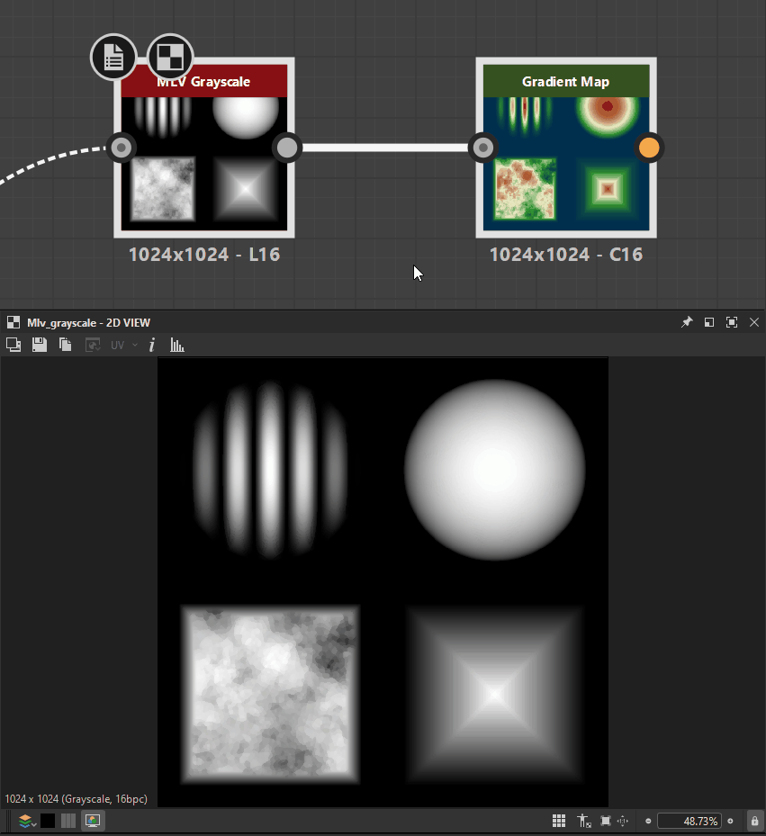

# カラーサンプラーツール

{zoomable="yes"}

カラーSamplerツールを使用すると、パラメーターを微調整したり、ノードを切り替えたりしながら、[2Dビュー](../../../interface/2d-view/2d-view.md)で<b>指定のピクセルの値をトラッキング</b>できます。

ビューポートにピンを配置し、その位置のピクセルのカラーと位置をサンプリングします。

## ツールの使用

ツールにアクセスして使用するには、次の手順に従います。

1. 2Dビューツールバーの <b>情報</b>ボタンをクリックして、情報ドックとツールバーを開きます
1. 情報ツールバーの <b>カラーSamplerツール</b>をクリックします
1. ビューポートで、サンプルする特定のピクセルをクリックして <b>ピン</b>を配置します
1. 情報ドックの専用セクションでサンプル値を確認します
1. ツールの操作が完了したら、 <b>削除</b>ボタンをクリックして、ビューポートからピンを削除します。\
   ピンを削除するには、ピンのRMBをクリックして、コンテキストメニューで「削除」アクションを選択します。

以下に、このツールの動作を示します。

{zoomable="yes"}

*クリックして拡大*

+++サンプルされたRGBA値のコピー
サンプリングした値をコピーするには、ピンのRMBをクリックし、コンテキストメニューで「RGBA値をコピー」アクションを選択します。

コピーされた値は、カラーサムネイルを使用して<b>パラメーターに貼り付けることができます</b>。

情報パネルのカラーサムネールを、これらのパラメーターのカラーサムネールに直接ドラッグ&amp;ドロップすることもできます。

{zoomable="yes"}

*クリックして拡大*

+++

## サンプル情報

<table>
<tr style="border: 0;">
<td width="100.00%" style="border: 0;" valign="top">

情報は3種類の形式と2種類の形式にグループ化されています。

* 画像の各RGBAチャンネルに保存された<b>サンプリング値</b>:\
  変化\* /浮動小数点
* HSV表現の<b>サンプリングされた色</b>:\
  8ビット整数/浮動小数点
* ピクセルの<b>位置</b> （ピクセル数および正規化されたイメージスペース）:\
  整数/浮動小数点

</td>
<td width="33.33%" style="border: 0;" valign="top">

{zoomable="yes"}

</td>
</tr>
</table>

この値は、画像で使用されるビット深度によって異なります。 Substanceグラフでは、ビット深度は<b>出力形式</b>で制御されます [基本パラメーター](../../../compositing-graphs/graph-parameters/graph-parameters.md)。

使用可能なビット深度は次のとおりです。

* <b>8ビット整数：</b> 0 ～ 255の256個の整数値です。
* <b>16ビット整数：</b> 0 ～ 65,535の65,536個の整数値。
* <b>HDR低精度（16ビット）</b>: 16ビットを使用してエンコードされた浮動小数点値です。
* <b>HDR高精度（32ビット）</b>: 32ビットを使用してエンコードされた浮動小数点値です。 これは、Designerで使用可能な最高精度です。
