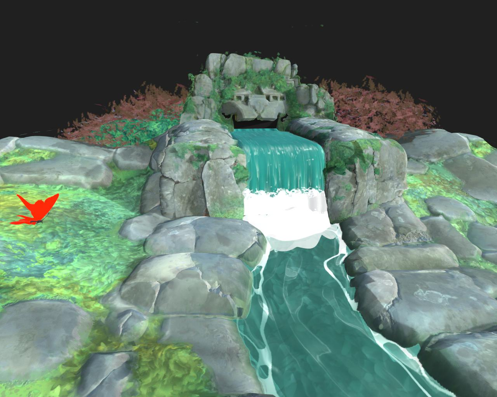

# 3Dレンダラー

3Dビューには、次の4つのレンダラーがあります。

* Adobeの社内3Dレンダラーの2つのバージョン：シャドウをサポートするリアルタイムのビジュアライゼーションのためのラスタライザーと、シャドウ、反射、複雑なマテリアルプロパティなどを正確にレンダリングするためのGPU パストレーサーです。
* 2つの非推奨のサードパーティレンダラー：OpenGLおよびNVIDIAのIray。

>[!NOTE]
>
> グラフィックドライバーを最新に保つ
> 
> 新しい3Dレンダラーは定期的にアップグレードされます。これらのアップグレードの一部では、最新のGPUドライバーが必要です。 最高の信頼性とレンダリング機能のサポートを実現するために、システムのGPUドライバーを最新バージョンに更新してください。
> 
> ドライバーは、次の場所で確認できます： [NVIDIA](https://www.nvidia.com/Download/index.aspx?lang=en-us) [AMD](https://www.amd.com/en/support) [Intel](https://downloadcenter.intel.com/product/80939/Graphics-Drivers)

+++ ラスタライザとGPUのパストレーサの比較

<table>
  <tr>
    <td>
      
       <i>ラスタライザ</i>
    </td>
    <td>
      
       <i>GPU パストレーサー</i>
    </td>
  </tr>
</table>

+++

Adobeの3Dレンダラーは、[MaterialX](https://materialx.org/)のシェーディング言語や[USD](https://openusd.org/release/index.html)のシーン記述などの最新のテクノロジーをサポートするためにゼロから構築されており、Substance 3Dエコシステム全体で完全な視覚的な一貫性を提供します。

USDを基盤としているため、Adobeの[USDFileFormatプラグイン](https://github.com/adobe/USD-Fileformat-plugins)を活用して、FBXやGLTFなどの多くの3Dシーン形式を読み込み、マテリアル、テクスチャ、カメラ、ライトなどのこれらのシーンを完全にレンダリングできます。

+++ シーンの読み込み：ラスタライザーとOpenGL

<table>
  <tr>
    <td>
      
       <i>ラスタライザ</i>
    </td>
    <td>
      
       <i>OpenGL</i>
    </td>
  </tr>
</table>

+++

>[!TIP]
>
> プロジェクト設定[&#128279;](../../../interface/preferences-window/project-settings/project-settings.md)の「3Dビュー」セクションで、新しい3D ビューを開始するときに既定で使用するレンダラーを選択できます。

## ラスタライザー

+++ パラメーター

|                                                                 |                                                                                                                                                                                                                                                                             |
|-----------------------------------------------------------------|-----------------------------------------------------------------------------------------------------------------------------------------------------------------------------------------------------------------------------------------------------------------------------|
| **サンプル**&#x200B;浮動小数点 | 画像が収束したとみなされるまでに、計算するピクセルサンプルの数を指定します。 |
| **アンビエントオクルージョンの不透明度**&#x200B;浮動小数点 | アンビエントオクルージョンの不透明度の値を指定します。 |
| **ディスプレイスメントを有効にする** ブーリアン | 変位を有効にするかどうかを指定します。 |
| **ディスプレイスメントしきい値**&#x200B;浮動小数点 | GPU テセレーションを有効 / 無効にするしきい値を設定します。 |
| **バックフェースカリングを有効にする** ブーリアン | trueの値を指定すると、法線がカメラから離れた方向を向いている三角形メッシュのカリングが有効になります。 falseの値を指定すると、背面カリングが無効になります。 |
| **診断モード**&#x200B;整数 | レンダリングする診断モードを指定します。 |
| **ラスタライザシャドウモード**&#x200B;の整数 | シャドウのレンダリングに使用するテクニックを指定します。<ul data-preserve-html="true"> <li data-preserve-html="true"><i>影なし：</i>影はレンダリングされません。</li> <li data-preserve-html="true"><i>ボクセルが行進しました：</i>シャドウレイをボクセル化されたシーンに行進します。</li> </ul> |
| **ラスタライザシャドウサンプル数**&#x200B;整数 | 1ピクセルあたりにトレースするシャドウレイの数を指定します。 |
| **ラスタライザーのシャドウの不透明度**&#x200B;浮動小数点 | シャドウの不透明度を0.0（シャドウなし）から1.0（完全なシャドウ）の間で指定します。 |
| **ラスタライザ順序に依存しない透明化が有効**&#x200B;ブール値 | 透明なサーフェスをレンダリングする際の順序は考慮されません。 これにより、透明なサーフェスのレンダリングを高速化するための精度が犠牲になります。 |
| **ラスタライザSSSを有効にする** ブーリアン | サブサーフェススキャタリング効果を切り替えます。 |
| **ラスタライザSSSサンプル数**&#x200B;整数 | サブサーフェススキャタリングをレンダリングするために1ピクセルあたりに取得するサンプル数を指定します。 |
| **ラスタライザの累積アンチエイリアスを有効にする**&#x200B;ブール値 | 重なり補正のアンチエイリアスを切り替えます。これにより、各ピクセルのローカルの平均色を重ねてレンダリングし、ジッターを適用することで、レンダリングされたイメージのSmoothnessやエッジが向上します。 つまり、値を累積して平均値を計算します。 |
| **ラスタライザのボクセルグリッド解像度**&#x200B;整数 | ラスタライザを行進するボクセルで使用するボクセルグリッドの解像度を指定します。   値が大きいほどシャドウの精度は高くなりますが、パフォーマンスが低下します。 |
| **ラスタライザIBLランタイムサンプル数**&#x200B;整数 | テクニックが`runtimeSampled`に設定されている場合に、IBLからのSpecular反射の計算に使用されるサンプル数を指定します。 |

+++

+++ グランドプレーン

|                               |                                                                                                                                                              |
|-------------------------------|--------------------------------------------------------------------------------------------------------------------------------------------------------------|
| **Enabled**&#x200B;ブール値 | レンダリングシーンのグリッドを切り替えます。 |
| **Height**&#x200B;浮動小数点 | グリッドのHeightオフセットを制御します。   この値を作成した場合は、シーンのスケールに基づいて、適切なバイアスがベイクされます。 |
| **シャドウの適用度**&#x200B;浮動小数点 | シャドウが有効な場合、0.0（シャドウなし）から1.0（完全なシャドウ）まで、地表プレーンに投影されるシャドウの不透明度を制御します。 |

+++

{zoomable="yes"}

## GPU パストレーサー

+++ パラメーター

|                                                     |                                                                                                                                                                                                                                                                                                                                                                                                                                                                                                                                                                                                                                                                                                                               |
|-----------------------------------------------------|-------------------------------------------------------------------------------------------------------------------------------------------------------------------------------------------------------------------------------------------------------------------------------------------------------------------------------------------------------------------------------------------------------------------------------------------------------------------------------------------------------------------------------------------------------------------------------------------------------------------------------------------------------------------------------------------------------------------------------|
| **サンプル**&#x200B;浮動小数点 | 画像が収束したとみなされるまでに、計算するピクセルサンプルの数を指定します。 |
| **ディスプレイスメントを有効にする**&#x200B;ブール値 | 変位を有効にするかどうかを指定します。 |
| **ディスプレイスメントしきい値**&#x200B;浮動小数点 | GPU テセレーションを有効 / 無効にするしきい値を設定します。 |
| **背面カリングを有効にする**&#x200B;ブール値 | trueの値を指定すると、法線がカメラから離れた方向を向いている三角形メッシュのカリングが有効になります。 falseの値を指定すると、背面カリングが無効になります。 |
| **ピクセル循環の種類**&#x200B;整数 | インタラクティブレンダリングの計算解像度を下げるのに使用するテクニックを指定します。<ul data-preserve-html="true"> <li data-preserve-html="true"><i>循環しない：</i>ピクセル循環を無効にし、各フルピクセルサンプルを計算します。</li> <li data-preserve-html="true"><i>最適なデバイス：</i>レンダリングに使用するデバイスに基づいて、理想的なピクセルサイクル解像度を選択します。</li> <li data-preserve-html="true"><i>4x4:</i>サイクルパスごとにピクセルの16分の1をサンプリングします。</li> <li data-preserve-html="true"><i>8x8:</i>サイクルパスあたりのピクセルの1/64をサンプリングします。</li><li data-preserve-html="true"><i>ブルーノイズ:</i>複数のピクセルを適応的にサンプリングし、目標とするフレームレートに合わせてスプラットします。</li> </ul> |
| **診断モード**&#x200B;整数 | レンダリングする診断モードを指定します。 |
| **転送による背景の表示**&#x200B;ブール値 | trueの値を指定すると、透過または屈折するオブジェクトを通して背景イメージを表示できます。   falseの場合、透過オブジェクトはシーン環境の屈折したイメージを表示します。 |

+++

+++ グランドプレーン

|                                    |                                                                                                                                                                  |
|------------------------------------|------------------------------------------------------------------------------------------------------------------------------------------------------------------|
| **Enabled**&#x200B;ブール値 | レンダリングシーンのグリッドを切り替えます。 |
| **Height**&#x200B;浮動小数点 | グリッドのHeightオフセットを制御します。   この値を作成した場合は、シーンのスケールに基づいて、適切なバイアスがベイクされます。 |
| **シャドウの適用度**&#x200B;浮動小数点 | シャドウが有効な場合、0.0（シャドウなし）から1.0（完全なシャドウ）まで、地表プレーンに投影されるシャドウの不透明度を制御します。 |
| **ローカルライトを有効にする**&#x200B;ブール値 | ローカルライトからの直接光をシャドウキャッチャーに使用するかどうかをコントロールします。 |
| **反射を有効にする**&#x200B;ブール値 | グリッド上のすべての反射の可視性を制御します。 |
| **反射の不透明度**&#x200B;浮動小数点 | 反射を有効にすると、反射の不透明度を0.0（反射なし）から1.0（全反射）の間で制御します。 |
| **反射の粗さ**&#x200B;浮動小数点 | 反射を有効にすると、反射に使用する地表プレーンのマテリアルの粗さを0.0（完全に光沢）から1.0（完全に粗い）の間で制御します。 |

+++

{zoomable="yes"}

## OpenGL

OpenGLレンダラーは、高速なリアルタイムレンダリングを提供します。使用事例に応じて、デフォルトでいくつかのシェーダが使用できます。以下のリストを参照してください。

+++ OpenPBR

Adobeを含む主要な業界関係者の支援を受け、幅広い機能を備えたマテリアルモデル。

Heightを表示するには、次の2つの方法を使用できます。

<b>パララックスオクルージョン</b> – ローカライズされたUV変形およびオクルージョンによってジオメトリを変更せずに、Heightのディスプレイスメントを偽装します。

<b>面分割+ディスプレイスメント</b> – ジオメトリを再分割し、法線に沿って頂点を移動します。

DesignerのOpenPBRについて詳しくは、[こちら](../material-properties/material-properties.md#openpbr)をご覧ください。

+++

+++ Adobe Standard Material

Adobeの標準化シェーダー。 すべてのAdobeのSubstance 3Dアプリケーションが正しく表示され、幅広い機能がサポートされます。

Heightを表示するには、次の2つの方法を使用できます。

<b>パララックスオクルージョン</b> – ローカライズされたUV変形およびオクルージョンによってジオメトリを変更せずに、Heightのディスプレイスメントを偽装します。

<b>テッセレーション+ ディスプレイスメント</b> – ジオメトリを再分割し、法線に沿って頂点を移動します。

Adobe Standard Materialについては、アドビのドキュメントの[このセクション](https://experienceleague.adobe.com/ja/docs/substance-3d/general-knowledge/asm/adobe-standard-material)で詳細に説明されています。

+++

+++ AxF SVBRDF

[AxF ファイル](../../../resources/axf-appearance-exchange/axf-appearance-exchange-format.md)から抽出されたマテリアルを<b>SVBRDF</b>表現を使用して視覚化するための専用シェーダーです。

Heightを表示するには、次の2つの方法を使用できます。

<b>パララックスオクルージョン</b> – ローカライズされたUV変形およびオクルージョンによってジオメトリを変更せずに、Heightのディスプレイスメントを偽装します。

<b>面分割+ディスプレイスメント</b> – ジオメトリを再分割し、法線に沿って頂点を移動します。

このシェーダーは現在&#x200B;*処理中*&#x200B;であり、マテリアルの特性の概要を示していますが、微調整には使用しないでください。一部の機能はまだサポートされていません。

+++

+++ ブリン

「Old - generation」、PBR以外のシェーダーが正しい。 不透明度、Height、標準などの標準チャンネルの横に、拡散、Specular、光沢の各チャンネルを使用します。

Heightを表示するには、次の2つの方法を使用できます。

<b>パララックスオクルージョン</b> – ローカライズされたUV変形およびオクルージョンによってジオメトリを変更せずに、Heightのディスプレイスメントを偽装します。

<b>面分割+ディスプレイスメント</b> – ジオメトリを再分割し、法線に沿って頂点を移動します。

+++

+++ ランバート

非常にシンプルなLambertライティングシェーダでサポートされているのは拡散反射光チャンネルのみです。 古い点光源システムを使用します。HDR画像照明はサポートされません。

+++

+++ メッシュ情報

アンライトシェーダをデバッグして、次のジオメトリデータを視覚化します。

* 法線

* 正接

* 従法線

* UV

* UV タイル

* 頂点カラー

* 位置（ワールドスペース）

表示は[0, 1]に固定されます。 したがって、画面上でその範囲外の値の直接読み取りを取得することはできません。

+++

+++ メタリックラフネス

メタリックの粗さモデルの標準PBRマテリアル。 ベースカラー、メタリック、粗さチャンネルを使用します。

Heightを表示するには、次の2つの方法を使用できます。

<b>パララックスオクルージョン</b> – ローカライズされたUV変形およびオクルージョンによってジオメトリを変更せずに、Heightのディスプレイスメントを偽装します。

<b>テッセレーション+ ディスプレイスメント</b> – ジオメトリを再分割し、法線に沿って頂点を移動します。

+++

+++ メタリックの粗さ – コーティング

メタリックの粗さモデル用のコーティングされたPBR材料。 ベースカラー、メタリック、ラフネスのチャンネルに加えて、追加の「コート」チャンネルを使用します。

Heightを表示するには、次の2つの方法を使用できます。

<b>パララックスオクルージョン</b> – ローカライズされたUV変形およびオクルージョンによってジオメトリを変更せずに、Heightのディスプレイスメントを偽装します。

<b>テッセレーション+ ディスプレイスメント</b> – ジオメトリを再分割し、法線に沿って頂点を移動します。

+++

+++ メタリックの粗さ – SSS

メタリック粗さモデルのサブサーフェス散乱PBRマテリアル。 ベースカラー、メタリック、ラフネスの各チャンネルと追加の散布チャンネルを使用します。

Heightを表示するには、次の2つの方法を使用できます。

<b>パララックスオクルージョン</b> – ローカライズされたUV変形およびオクルージョンによってジオメトリを変更せずに、Heightのディスプレイスメントを偽装します。

<b>テッセレーション+ ディスプレイスメント</b> – ジオメトリを再分割し、法線に沿って頂点を移動します。

+++

+++ スペキュラ光沢

Specular光沢モデルの標準PBRマテリアル。 Diffuse、Specular、光沢度チャンネルを使用します。

Heightを表示するには、次の2つの方法を使用できます。

<b>パララックスオクルージョン</b> – ローカライズされたUV変形およびオクルージョンによってジオメトリを変更せずに、Heightのディスプレイスメントを偽装します。

<b>面分割+ディスプレイスメント</b> – ジオメトリを再分割し、法線に沿って頂点を移動します。

+++

+++ 消灯

アンライトデバッグシェーダーを使用して、照明なしでテクスチャマップを視覚化します。 &#39;color&#39;チャンネルのみを使用します。

+++

Designerでは、GLSLFXファイル[&#128279;](../../../interface/3d-view/glslfx-shaders/glslfx-shaders.md)を使用して、OpenGLレンダラー用に独自のシェーダーを設定することもできます。

>[!IMPORTANT]
> 
> このレンダラーは&#x200B;**非推奨**&#x200B;です。新機能は提供されず、今後のバージョンのDesignerでは廃止されます。

{zoomable="yes"}
