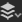

# 3D ビュー

3Dビューは、カスタムメッシュとレンダリングされたPBRマテリアルを使用してマテリアルを表示し、理解するのに役立ちます。 すべてのSubstance 3D Designerウィンドウと同様に、右クリックメニューオプションおよびドラッグアンドドロップ操作を使用して他のウィンドウと連携します。

3Dビューには、3Dシーンでマテリアルをレンダリングする方法として、主に次の2つがあります。
* **ラスタライザー**&#x200B;と&#x200B;**OpenGL**&#x200B;のレンダラーを使用した、高速なリアルタイムの視覚化
* **GPU パストレーサー**&#x200B;レンダラーを使用した高品質のレイトレースレンダリング

詳細については、こちらを参照してください： [3Dレンダラー](3d-renderers/3d-renderers.md)

+++ 3Dビューのドック

+++

## ビューポートの操作

以下のセクションでは、一般的なアクションを簡単に実行する方法と、そのプロセスを説明するアニメーションGIFについて説明します。

### ナビゲーション

3Dビューカメラおよび環境は、次の3つの方法で操作できます。

* <b>軌道：</b> LMB +ドラッグ
* <b>パン</b>: MMB+ドラッグ/ Ctrl+RMB+ドラッグ
* <b>ズーム</b>:マウスホイールを使用してスクロールする/RMB+ドラッグ
* <b>環境の回転：</b> ⇧+右マウスボタンを押しながらドラッグ
* <b>選択したメッシュに焦点を合わせる： </b> F （選択がない場合はシーン全体に焦点を合わせる）
* <b>オービットポイントライト1:</b> Ctrl + ⇧ + LMB +ドラッグ
* <b>ポイントライト1を原点に近づける、または原点から遠ざける：</b> Ctrl+⇧+RMB+ドラッグ
* <b>カメラのオービット位置をリセット：</b> R
* <b>カメラのオービットの位置とプロパティをリセット：</b> ⇧+R

トラックパッドの使用（macOSのみ）

* <b>オービット：</b> 2本指でのスワイプ
* <b>パン:</b> ⇧+2本指でスワイプ
* <b>ズーム： </b>2本指ピンチ/ ⌘+2本指スワイプ
* <b>環境の回転：</b> ⇧+2本指でスワイプ

>[!NOTE]
>
> ズーム方向
> 
> 各ズーム方法は、他の方法と反転する：
> 
> * マウスホイールを&#x200B;*上げるとシーンが近くなります*
> * 元のサイズで上にドラッグすると、シーンが&#x200B;*プッシュ*&#x200B;されます
> 
> ズーム方向は、[環境設定](../../interface/preferences-window/preferences-window.md)で反転できます。

### 選択してフォーカス

ビューポートで直接メッシュを操作できます。

<b>メッシュを選択するには、⇧を押しながらメッシュ上のLMBをクリックします。</b> 選択したメッシュのアウトラインは青です。

<b>選択したメッシュにフォーカスするには、Fキーを押します</b>。 メッシュをフォーカスすると、カメラが移動してフレームに収まり、カメラの周りを回転します。

<b>メッシュが選択されている間にRMBをクリックすると</b>、コンテキストメニューで[マテリアルアクション](#material-actions)にアクセスできます。

<b>Escキーを押して選択を解除します。</b> カーソルはメッシュ上にある必要はありません。

{zoomable="yes"}

*選択、フォーカス、選択解除*

{zoomable="yes"}

*選択、コンテキストメニュー*

>[!NOTE]
>
> これらのアクションは、非推奨の[OpenGL](../../interface/3d-view/3d-renderers/3d-renderers.md)レンダラーでは使用できません。

### 環境照明(IBL)を変更する

Designerは、デフォルトで画像ベースの照明(IBL)で動作します。 ハイダイナミックレンジビットマップは、環境照明のレンダリングに使用されます。

この環境は、3Dオブジェクトを中心に回転できます。また、プリセットまたはカスタムHDRライト環境を読み込むこともできます。 HDR画像は正距円筒図法を使用し、32 bit浮動小数点の精度にする必要があることに注意してください。

3Dビューで、⇧ + RMBキーを押しながら<b>ドラッグすると、環境が回転します</b>。

正確な回転を設定するには、上部の3Dビューツールバーの<b>環境/編集</b>を使用し、プロパティウィンドウの<b>回転角度</b>スライダーを変更します。

プリセットのHDRライト環境を使用するには、[ライブラリ](../../interface/the-library/the-library.md)の<b>3Dビューカテゴリ</b>の<b> HDRI環境</b>セクションをクリックし、いずれかのアイコンを3Dビューにドラッグ&amp;ドロップします。

独自のカスタムHDRライト環境を使用するには、エクスプローラーウィンドウのパッケージにファイルをドラッグ&amp;ドロップして、HDR画像を読み込みます（プロンプトが表示されたらファイルを<b>リンク</b>します）。 次に、リソースをドラッグ&amp;ドロップし、ターゲットとして<b>緯度/緯度パノラマ</b>を選択します。

### 点光源

<b>ライト/プロパティの編集</b>に移動して、シーンのポイントライトを切り替えます。

ポイントライト1は、ライトモードでビューポート内をLMBまたはRMBを押しながらドラッグすることで、シーンの原点を中心に移動できます。 

カメラモードの場合 、Ctrl + ⇧キーをマウスボタンと組み合わせて押すことにより、一時的に照明モードに切り替えることもできます。

## 3Dビューでデータを表示

### Substance グラフ

3Dビューでは、マテリアル全体を完全なマテリアルとして表示できます。 これは最も一般的な操作方法であり、出力ノードの[使用属性](../../compositing-graphs/nodes-reference-for-com/atomic-nodes/output/output.md)を3Dビューマテリアルの関連するテクスチャスロットに一致させます。 つまり、出力を正しく設定する必要があり（テンプレートを使用すれば正しく設定できます）、選択したマテリアル/ビューポートシェーダがサポートしていることが必要です

グラフのすべての出力を表示するには、[グラフビュー](../../interface/the-graph-view/the-graph-view.md)で空の領域&#x200B;*RMB*&#x200B;をクリックし、コンテキストメニューの&#x200B;**「3Dビューで出力を表示」**&#x200B;オプションを選択します。

[エクスプローラー](../the-explorer-window/the-explorer-window.md)ドックのグラフリソースでRMBをクリックし、コンテキストメニューの&#x200B;**「3Dビューで出力を表示」**&#x200B;オプションを選択すると、グラフを開かずに出力を表示することもできます。

グラフのコンテキストメニューを使用する代わりに、[エクスプローラー](../the-explorer-window/the-explorer-window.md)ドックから3Dビューにグラフをドラッグして、同じ結果を得ることができます。

*グラフを読み込み中*&#x200B;の出力は、既定では3Dビューに自動的に適用されます。 この動作は、[環境設定](../../interface/preferences-window/preferences-window.md)で無効にできます。 **編集/環境設定/グラフ/共通**&#x200B;に移動し、「**グラフを開くときに3Dビューで出力を表示**」オプションをオフにします。

>[!NOTE]
>
> **複数のマテリアルスロット**
> 
> 複数の単一のマテリアルでカスタムメッシュを使用する場合は、マテリアルを割り当てるマテリアルスロットを選択するよう求められます。 上記のいずれかの方法で、スロットをクリックして選択を確定します。 マテリアルとその割り当てについて詳しくは、以下の詳細セクションを参照してください。

### 個々のノード/グラフ出力

[3Dビュー](https://substance3d.adobe.com/)で使用可能な任意のマテリアルチャンネルで、単一の出力のみを表示できます。 この方法はあまり一般的には使用されませんが、出力のない簡単なテストや個々のノードをプレビューするのに適しています。

[グラフビュー](../../interface/the-graph-view/the-graph-view.md)でノードを右クリックし、<b>3Dビューで表示</b>を選択すると、出力ノードだけでなく、任意のノードを表示できます。 ノードを割り当てる使用可能なチャンネルのリストが表示されます。 「任意」をクリックして確定します。

また、*RMB*&#x200B;を使用して、任意のノードをグラフビューから3Dビューにドラッグアンドドロップすることもできます。 ノードを割り当てる使用可能なチャンネルのリストが表示されます。 「任意」をクリックして確定します。

個々のグラフ出力を表示するには、[エクスプローラー](../the-explorer-window/the-explorer-window.md)ドックでグラフリソースを展開し、*LMB*&#x200B;を使用して出力を3Dビューにドラッグします。 ノードを割り当てる使用可能なチャンネルのリストが表示されます。 「任意」をクリックして確定します。

## （カスタム）3Dシーンの表示

Designerには、12種類のプリセットメッシュが用意されています。 これらのメッシュは均一で使用可能なUV座標を持ち、テクスチャのタイリングに関するほとんどのシナリオを提供します。 独自の3Dメッシュの読み込みと表示も可能です。\
トップバーの<b>シーン</b>ドロップダウンメニューからデフォルトのメッシュのいずれかを選択します。

カスタム3Dシーンの場合は、[3Dシーンの操作](../../working-with-3d-scenes/working-with-3d-scenes.md)セクションに移動します。

## シェーダプロパティの変更

Designerでは、デフォルトでいくつかの異なる[シェーダ](../../glossary/glossary.md)を使用できます。各シェーダには、テクスチャチャンネル以外にもオプションがあります。 これらは個別に設定できます。

Designerの[3Dレンダラー](../../interface/3d-view/3d-renderers/3d-renderers.md)間でシェーダーが異なり、「共通」ラベルが付いた設定のみがレンダラーの切り替え時に引き継がれます。

現在のシェーダーを変更するには、<b>に移動します &#39;</b>マテリアル&#39;メニュー次に、編集するマテリアルのサブメニューを開きます。

例えば、「プレーン（高解像度）」シーンの「デフォルト」マテリアルの「Heightスケール」プロパティを調整するには、「マテリアル/デフォルト/プロパティの編集」に移動します。 プロパティドックで「Heightスケール」プロパティを見つけます。

シェーダは、サブメニューの「マテリアルをリセット」または「シーンの状態にリセット」アクションを使用してリセットできます。 3DビューでSubstanceグラフ出力を表示していた場合は、再度適用する必要があります。

>[!NOTE]
>
> テッセレーションについて
> 
> 「テッセレーション係数」プロパティは、選択した3Dレンダラーによって異なります。
> 
> * <b>ラスタライザ/GPU パストレーサー:</b>レンダラー設定（レンダラー/編集設定）にある&#x200B;*シーン全体*&#x200B;に影響します。
> * <b>OpenGL:</b>マテリアルプロパティにあるマテリアルに影響を与えます。

## シーンを書き出し

[このページ](../../working-with-3d-scenes/exporting-scenes/exporting-scenes.md)の3Dシーンの書き出しについて説明します。

### テッセレーションされたメッシュの書き出し（OpenGLレンダラーのみ）

<b>3Dビュー</b>から<b>OBJ</b>、<b>FBX</b>、または<b>PLY</b>形式のファイルにメッシュを書き出すことができます。 *テッセレーション*&#x200B;ディスプレイスメントが有効な場合、ジオメトリのサブディビジョンはエクスポートされたメッシュにベイクされます。

ただし、元のメッシュの頂点法線が新しいディスプレイスされたシェイプと一致しない場合があります。これは、ディスプレイスされたメッシュが正しくレンダリングされないことを意味します。 次の2つの方法で管理できます。

* 正しい法線を提供するメッシュ&#x200B;*法線マップ*&#x200B;を使用してください
* *メッシュ法線マップを使用して書き出し時にメッシュ法線を再計算*&#x200B;します。つまり、これらの法線は書き出されたメッシュにベイク処理されるため、法線マップは不要になります

3Dビューメッシュを書き出すには、<b>シーン/テッセレーションされたメッシュを書き出し…</b>に移動し、法線の再計算に関する選択を行い、書き出すメッシュの場所、名前、ファイル形式を選択します。

>[!NOTE]
>
> この機能は、**macOS**&#x200B;では&#x200B;*利用できません*&#x200B;です。

>[!IMPORTANT]
>
> いくつか注意事項
> 
> 元のメッシュに複数のマテリアルやUVセットがある場合、これらは&#x200B;*1つにマージ*&#x200B;されます。
> 
> 書き出し処理の期間と結果のファイルサイズは、メッシュ三角形の数と&#x200B;*分割係数*&#x200B;によって異なります。 テッセレーション係数の値が高いと、GPUのオンボードメモリプールによっては不安定になることがあります。
> 
> つまり、テッセレーションされたメッシュの頂点数は、*Height*&#x200B;マップのピクセル数と&#x200B;*同じ範囲*&#x200B;にある必要があります。
> 
> <b>Phong</b>面分割を使用する場合、Heightマップよりも高密度のメッシュを使用するとメッシュが少し滑らかになりますが、最初に必要なHeightマップの詳細を含んだメッシュを確実にエクスポートし、必要に応じて他のソフトウェアでエクスポートされたメッシュをリファインすることを目指す必要があります。

>[!WARNING]
>
> **TDR （Windowsのみ）**
> 
> この機能を使用するには、Designerの[技術要件](../../getting-started/system-requirements/system-requirements.md)で説明されているように、<b>タイムアウトの検出と回復(TDR)</b>がドキュメントの[このページ](https://experienceleague.adobe.com/en/docs/substance-3d-painter/using/technical-support/technical-issues/gpu-issues/gpu-drivers-crash-with-long-computations-tdr-crash)の推奨値と一致している必要があります。

## メニューバー

メニューバーには、3Dビューに関連する7つのメニューとオプションが表示されます。 以下に、使用可能なすべてのオプションの概要を示します。

+++シーン
<b>シーン</b>メニューは、表示されるジオメトリ（3Dリソース）と3Dビューの状態を扱います。 3Dリソースはメッシュのみです。シーンの状態はライト、カメラ、関連設定で、メッシュを横に並べて含めることもできます。

<b>編集： </b>[プロパティ](../../interface/properties/properties.md)パネルのシーンオプションを読み込みます。 3Dメッシュの表示/非表示を切り替えることができます。

<b>標準プリミティブ：</b> 3Dビューで以下の単純な3Dメッシュのいずれかを表示します。

* 立方体

* 円柱

* 白抜きボックス

* インナーボックス

* 平面

* 平面 (高解像度)

* 球面

<b>拡張プリミティブ：</b> 3Dビューで以下の3Dメッシュを表示します。

* 布

* マットボール

* 角丸立方体

* 角丸円柱

* 球面 2 タイル

* トーラス

<b>UVを2Dビューで表示：</b>現在選択されているメッシュのUVを[2Dビュー](../2d-view/2d-view.md)にオーバーレイとして表示します。

<b>現在のシーンから3Dリソースを作成…:</b>現在のシーンからパッケージ内に新しい[3Dシーンリソース](../../resources/3d-scene-resource/3d-scene-resource.md)を作成します。

<b>状態ファイルを読み込む…: </b>外部に保存された[シーン状態ファイル](../../working-with-3d-scenes/working-with-3d-scenes.md) (\*.sbsscn)を読み込みます。 3Dメッシュを置き換えず、3Dレンダラー、カメラ、ライトの設定のみをロードします。

<b>メッシュで状態ファイルを読み込む…:</b>外部に保存された[シーン状態ファイル](../../working-with-3d-scenes/working-with-3d-scenes.md) (\*.sbscn)を読み込みます。 3Dレンダラ、カメラ、ライトの設定を、その参照3Dシーンと共にロードします。 .

<b>状態ファイルを保存します…: </b>3Dビューの現在の状態を[シーン状態ファイル](../../working-with-3d-scenes/working-with-3d-scenes.md) (\*.sbscn)に保存します。

<b>現在の状態を既定として保存： </b>3Dビューの現在の状態を[シーン状態ファイル](../../working-with-3d-scenes/working-with-3d-scenes.md)として設定し、新しい3Dビューを作成するときに既定で使用します。 このファイルは、3Dビューがリセットまたは初期化されるたびに読み込まれ、[プロジェクト設定](../../interface/preferences-window/project-settings/project-settings.md)で設定できます。

<b>シーンの書き出し：</b> *（ラスタライザー/GPU パストレーサーレンダラーのみ）*&#x200B;現在のシーンを[統合されたシーン](../../working-with-3d-scenes/exporting-scenes/exporting-scenes.md)として書き出します。書き出されたシーンには、結果のシーンのみが書き込まれ、元のシーンへの参照はすべて失われます。 書き出されるシーンの内容は、選択した書き出し形式でサポートされる機能によって異なります。\
利用可能な形式：STL、FBX、GLB、GLTF、PLY、USDC、USD、USDA、USDZ、OBJ。

<b>レイヤーのあるシーンの書き出し：</b> *（ラスタライザーおよびGPU パストレーサーレンダラーのみ）*現在のシーンを[レイヤー化されたシーン](../../working-with-3d-scenes/exporting-scenes/exporting-scenes.md)として書き出します。元のシーンへのすべての編集は、非破壊的なワークフローで個別のファイルに保存されます。 これは、USDファイル形式でのみ使用できます。\
利用可能な形式は、USDC、USD、USDAです。

<b>テッセレーションされたジオメトリのエクスポート：</b> *（OpenGLレンダラーのみ）*&#x200B;現在のシーンをテッセレーションを使用してRAWジオメトリとしてエクスポートします。「シーンのエクスポート」セクションを参照してください。

<b>シーンのリセット： </b>3Dビューを既定値にリセットします。

一部のソフトウェアの更新により、シーン状態ファイルの保存/ロード方法が変更される場合があります。

シーンがファイルから&#x200B;*正しく復元*&#x200B;されない場合は、シーンの目的の状態を手動で設定し、シーン状態ファイルを&#x200B;*再度書き出し*&#x200B;することをお勧めします。

+++

+++マテリアル
<b>マテリアル</b>メニューは、読み込まれた3Dメッシュと使用されているレンダラーに基づいて変化します。

「マテリアル」メニューには、シーン内のメッシュに割り当てられたすべてのマテリアルのリストが表示されます。 「マテリアル」メニューに表示される各マテリアルには、マテリアルアクションのサブメニューがあります。

<b>編集</b> – プロパティウィンドウで現在のマテリアルの設定を編集します。

<b>シェーダーリスト</b> – 現在の[3Dレンダラー](../../interface/3d-view/3d-renderers/3d-renderers.md)で使用できるすべての[シェーダー](../../glossary/glossary.md)。

<b>定義の読み込み…: </b>（OpenGLレンダラーのみ）独自のカスタム[GLSLFXシェーダーを読み込むことができます。](../../interface/3d-view/glslfx-shaders/glslfx-shaders.md) 上のリストにシェーダが追加されます。

<b>共通パラメータのリセット：</b>シェーダ間で共通するすべてのパラメータをリセットします。 例えば、ラスタライザー/GPU パストレーサーレンダラーとOpenGLレンダラーを切り替える場合、[Adobe Standard Material](https://experienceleague.adobe.com/en/docs/substance-3d/general-knowledge/asm/adobe-standard-material)のいくつかのパラメーター値が引き継がれます。

<b>名前の変更：</b>このマテリアルのラベルを変更します。

<b>マテリアルのリセット：</b>すべてのシェーダーパラメーターを既定値にリセットします。 テクスチャがシェーダの任意のサンプラにコネクトされている場合、テクスチャはコネクトされません。

<b>マテリアルをシーンの状態にリセット： </b>*（ラスタライザまたはGPU パストレーサーレンダラーのみ）* [オーバーライドされたマテリアル](../../working-with-3d-scenes/overriding-scene-mat/overriding-scene-materials.md)のすべてのプロパティを、元のテクスチャ（存在する場合）を含めてシーンの元の値にリセットします。

<b>追加： </b>新しいマテリアルをリストに追加します。 既定では使用されず、[Scene Browser](../../interface/3d-view/scene-browser/scene-browser.md)を使用して[シーンマテリアルに接続](../../working-with-3d-scenes/overriding-scene-mat/overriding-scene-materials.md)されている可能性があります。

+++

+++ライト
<b>ライト</b>メニューは、従来の環境光と点光源のみを扱います。 これらのライトはPBRに準拠しておらず、HDRイメージベースのレンダリングと同じ高品質の結果が得られません。

<b>編集：</b>環境光と2つの点光源の個別の設定を編集します。

<b>光源のリセット：</b>ライトのプロパティを既定の状態にリセットします。

+++

+++カメラ
<b>カメラ</b>メニューを使用すると、カメラの設定の変更、定義済みのアングルへの移動、カスタム3Dメッシュファイル内に保存されているカメラアングルの読み込みを行うことができます。

<b>プロパティの編集：</b>プロパティドックで既定のカメラの設定を開きます。

<b>フォーカス： </b>(F)現在選択されているメッシュに既定のカメラをフォーカスします。 つまり、メッシュをフレーム化し、カメラの基点をそのメッシュに位置合わせします。 アクティブな選択がない場合は、シーンのグローバルバウンディングボックスが使用されます。

<b>シーンカメラ：</b>シーンに1つ以上のカメラが含まれている場合、それらのカメラがここに一覧表示され、その設定がシーンの既定のカメラに適用されるプリセットとして使用されます。

<b>ビューポイント：</b>既定のカメラの事前設定されたPOV。 これは、カメラのトランスフォーム（位置と回転）にのみ影響します。

* デフォルト：オブジェクトの前方左から撮影した高角度のショット。

* 戻る

* 下

* フロント

* 左

* 右

* 上

<b>レンダリングを保存…:</b> (Alt + S)現在レンダリングされているイメージをディスクに保存します。ディスクの解像度は、レンダラープロパティで指定されている解像度か、上書き解像度が設定されている場合は既定のカメラのプロパティで指定されています。

<b>クリップボードにレンダリングをコピー：</b> (Alt+C)現在レンダリングされているイメージをクリップボードにコピーし、外部イメージエディターで貼り付けます。

<b>位置のリセット：</b> (R)カメラの位置をリセットします。

<b>選択した項目のリセット：</b> (Shift + R)カメラの位置とプロパティをリセットします。

+++

+++環境
<b>環境</b>メニューでは、PBR正しいマテリアルに照明を当てるために使用されるHDRI環境に関連する設定を変更できます。

<b>プロパティの編集：</b> PBRの照明に使用されるHDR環境設定にアクセスできます。 具体的には、表示の切り替え、プレビューを使用した露出の変更、正確なスライダーを使用した回転の設定ができます。

<b>環境のリセット：</b>すべての環境プロパティを既定にリセットします。

+++

+++表示
表示メニューでは、レンダリングされたシーンの表示モード、ヘルパー、情報を切り替えることができます。

<b>軸：</b>ビューポートでの3D軸の表示を切り替えます。

<b>グリッド：</b>ワールドフライドの表示を切り替えます。

<b>解像度：</b>小さい解像度のカウンターの表示を切り替えます。

<b>シーン統計：</b>ポリカウント、マテリアルカウント、静的メッシュ数などのシーン統計の表示を切り替えます。

<b>レンダリング時間：</b>画像全体に対して1つのサンプルを計算する時間。

<b>サンプル：</b>累積アンチエイリアス（ラスタライザ）またはパストレース（GPUパストレーサ）用に計算されたピクセルサンプルの量。

<b>背面カリング:</b>このオプションを無効にすると、*両側*&#x200B;からメッシュ面を表示できます。 このオプションはワイヤーフレームと組み合わせて使用できます

<b>バウンディングボックス：</b>メッシュのバウンディングボックスの表示を切り替えます。

<b>ワイヤーフレーム:</b>メッシュワイヤーフレームの表示を切り替えます。

<b>光源：</b>点光源のヘルパーラインの表示を切り替えます。

<b>頂点接線空間：</b>すべての頂点の接線、従法線、法線ベクトルを色付きギズモとして表示します

これらのオプションの一部は、シーンツールバーでボタンを切り替えると使用できるようになります。

+++

+++レンダラー
<b>レンダラー</b>メニューでは、3Dレンダラーを切り替えたり、<b>プロパティの編集</b>アクションを使用して現在の3Dレンダラーのプロパティにアクセスしたりできます。

使用可能なレンダラーとその設定については、[この専用ページ](../../interface/3d-view/3d-renderers/3d-renderers.md)で説明しています。

+++

## シーンツールバー

**シーン**&#x200B;ツールバーは、3Dビューの左側の境界にデフォルトで配置されており、シーンを表示して操作するためのコントロールを提供します。

また、[ディスプレイスメントポップアップ](displacement/displacement.md)と[Scene Browser](scene-browser/scene-browser.md)ドックにアクセスすることもできます。

>[!NOTE]
>
> 3本の平行な線で表された左端の&#x200B;*ハンドル*&#x200B;を使用して、ツールバーを&#x200B;**3Dビュー**&#x200B;ドックの周りに&#x200B;*再配置*&#x200B;できます。

### 表示オプション

#### 上

 

 <b>Scene Browser</b>

3Dシーン内のすべての要素の階層を表示します。

>[!INFO]
>
>Scene Browserとその機能については、[専用ページ](../../interface/3d-view/scene-browser/scene-browser.md)で詳しく説明しています。

 <b>選択</b>

シーン内のメッシュの直接選択を有効にします。

<code>LMB</code> シーンでメッシュを選択します。

シーン内の個々のメッシュを選択します。 選択したメッシュはビューポートで青いアウトラインを持ち、[Scene browser](../../interface/3d-view/scene-browser/scene-browser.md)でハイライトされます。

選択したメッシュに対してコンテキストメニューが使用できます。<code>RMBをクリックすると表示される場合があります</code>.

メッシュは、<code>Shift + LMBキーを押して、カメラモードまたはライトモードでも選択できます</code>.

 

 <b>カメラ</b>

シーン内のカメラを直接コントロールできます。

<code>LMB</code> カメラをターゲットの周りに回します。 <code>元</code> カメラをターゲットに近づけたり、ターゲットから遠ざけたりします。

 

 <b>環境の表示</b>

このボタンをクリックすると、シーンの環境の表示が切り替わります。 同じ設定は、3Dビューのメニューバーで<b>環境/編集</b>に移動した後、プロパティドックで見つけることができます。

 

 <b>明</b>

シーン内のポイントライト1の直接制御を有効にします。

<code>LMB</code> シーンの原点を中心にカメラを回します。 <code>RMB</code> ライトをシーンの原点に近づけたり、シーンの原点から遠ざけたりします。

 

 <b>レンダラー設定</b>

現在のレンダラーの設定を[プロパティ](../properties/properties.md)ドックに表示します。

 

 <b>パストレーサを有効にする</b>

[GPU パストレーサー](3d-renderers/3d-renderers.md#gpu-pathtracer)レンダラーの選択を切り替えます。

 

 <b>シャドウを有効にする</b>

[ラスタライザ](3d-renderers/3d-renderers.md#rasterizer)レンダラーのリアルタイムシャドウのレンダリングを切り替えます。

 

 <b>グリッドを有効にする</b>

[ラスタライザ](3d-renderers/3d-renderers.md#rasterizer)および[GPU パストレーサー](3d-renderers/3d-renderers.md#gpu-pathtracer)のレンダラーでグリッドのレンダリングを切り替えます。

 

 <b>ディスプレイスメント</b>

[ディスプレイスメントポップアップ](displacement/displacement.md)を表示します。

 

#### 下

 

 <b>グリッド</b>

ワールドグリッドの表示を切り替えます。

 

 <b>シーンの統計</b>

ポリカウント、マテリアル数、スタティックメッシュ数などのシーン統計の表示を切り替えます。

 

 <b>軸</b>

ビューポートでの3D軸の表示を切り替えます。

 

#### OpenGLレンダラーのみ

 

 <b>バックフェースカリング</b>

このオプションを無効にすると、*両側*&#x200B;からメッシュ面が表示されます。 このオプションは、ワイヤーフレームと組み合わせて使用できます。

 

 <b>バウンディングボックス</b>

メッシュのバウンディングボックスの表示を切り替えます。

 

 <b>頂点接線空間</b>

すべての頂点の接線、従法線、法線ベクトルを色付きギズモとして表示します。

 

 <b>ワイヤーフレーム</b>

メッシュをワイヤーフレームとして表示するかどうかを切り替えます。

## ツールバーを表示

<b>ディスプレイ</b>ツールバーは、初期設定では<b>3Dビュー</b>パネルの&#x200B;*下部*&#x200B;にあり、ビューポートでのレンダリングイメージの表示方法を制御できます。

>[!NOTE]
>
> 3本の平行な線で表された左端の&#x200B;*ハンドル*&#x200B;を使用して、ツールバーを&#x200B;**3Dビュー**&#x200B;ドックの周りに&#x200B;*再配置*&#x200B;できます。

### 3D レンダリング AOV

<table style="margin-top: 32px; margin-bottom: 32px">
    <tr style="border: 0; vertical-align: top">
        <td style="border: 0">
            
 <b>3DレンダリングAOV</b>ボタンを使用して、異なる<a href="../../glossary/glossary.md#aov">AOV</a>を表示できます。

            
AOVを使用すると、メッシュとマテリアルの情報を個別に検査して、集中的な作業やデバッグを行うことができます。

            
一部のAOVには、ビューポートで1 （純粋な白）または0 （純粋な黒）にクランプされる<i>HDR値</i>が含まれています。 すべての値を検査するには、AOVの3DレンダリングをHDR値をサポートする画像ファイル形式（<code>.exr</code>など）に書き出します。 現在のAOVを書き出すには、[<code>Camera > Save render...</code>]メニューオプションを使用します。

            
<i>注意：</i> AOVは、ラスタライザーとGPU パストレーサー <a href="./3d-renderers/3d-renderers.md">3Dレンダラー</a>を使用している場合にのみ使用できます。

        </td>
        <td style="width: 33%; border: 0">
            
        </td>
    </tr>
</table>

### カラーチャンネル

 <b>カラーチャンネル</b>ボタンを使用して、画像の単一チャンネルを表示できます。 これによりコンボボックスが開き、<b>赤</b>、<b>緑</b>および<b>青</b>のチャンネルのうち、表示するチャンネルを選択できます。 <b>[RGB]</b>を選択すると、すべてのチャンネルを含む画像の通常の状態が復元されます。

<b>カラーチャンネル</b>ボタン&#x200B;*の*&#x200B;アイコン&#x200B;*は、現在表示されているチャンネルによって異なります*。

### カラースペース

色を最も正確に表現するために、既定で画像は、*モニター*&#x200B;で使用されているものと一致する&#x200B;*カラースペース*&#x200B;に表示されます。

使用できるコントロールは、[プロジェクト設定](../../interface/preferences-window/project-settings/project-settings.md)で設定されたカラーマネジメントモードによって異なります。 これらのコントロールについて詳しくは、このページの「[カラーマネジメント](../../color-management/color-management.md)」セクションを参照してください。
