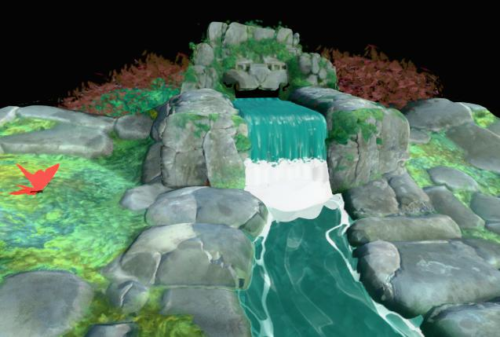
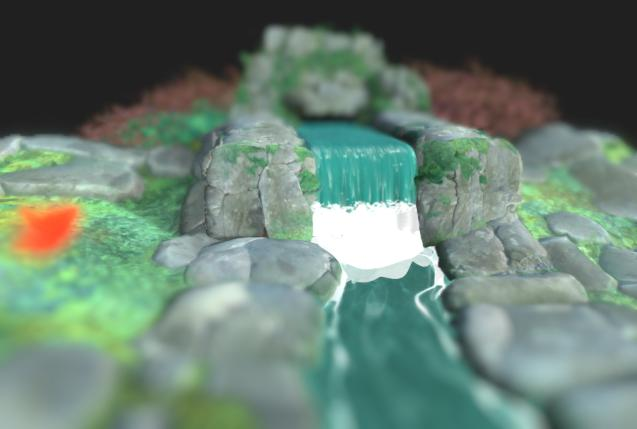

# ポストエフェクト

{zoomable="yes"}

カメラのプロパティで、ポストエフェクトを有効にしてレンダリングを強化したり、特定のマテリアルプロパティを確認したりできます。

これらの効果は社内で開発されており、ラスタライザーおよびGPU パストレーサー [レンダラー](../../../../interface/3d-view/3d-renderers/3d-renderers.md)でのみ使用できます。

[3Dシーンリソース](../../../../resources/3d-scene-resource/3d-scene-resource.md)または[シーン状態ファイル](../../../../working-with-3d-scenes/working-with-3d-scenes.md)の保存時に有効にされたポストエフェクトは、シーン状態の一部として保存されます。

<table>
<tr style="border: 0;">
<td style="border: 0;" valign="top">

## トーンマッピング

</td>
<td style="border: 0;" valign="top">

### ブルーム

</td>
<td style="border: 0;" valign="top">

### 被写界深度

</td>
<td style="border: 0;" valign="top">

</td>
</tr>
</table>

## トーンマッピング

特定のアルゴリズムやルックアップテーブル(LUT)に従って、レンダリングの色を再マップします。

これにより、アプリケーション間のカラーの一貫性を高めることができます。 例えば、AgXトーンマッパーはBlenderでも使用できます。

+++Reinhard

<table>
  <tr>
    <td>
      
       <i>前</i>
    </td>
    <td>
      
       <i>後</i>
    </td>
  </tr>
</table>

+++

+++Atan

<table>
  <tr>
    <td>
      
       <i>前</i>
    </td>
    <td>
      
       <i>後</i>
    </td>
  </tr>
</table>

+++

+++Exp

<table>
  <tr>
    <td>
      
       <i>前</i>
    </td>
    <td>
      
       <i>後</i>
    </td>
  </tr>
</table>

+++

+++ログ

<table>
  <tr>
    <td>
      
       <i>前</i>
    </td>
    <td>
      
       <i>後</i>
    </td>
  </tr>
</table>

+++

+++Aces

<table>
  <tr>
    <td>
      
       <i>前</i>
    </td>
    <td>
      
       <i>後</i>
    </td>
  </tr>
</table>

+++

+++ヘイル

<table>
  <tr>
    <td>
      
       <i>前</i>
    </td>
    <td>
      
       <i>後</i>
    </td>
  </tr>
</table>

+++

+++ニュートラル

<table>
  <tr>
    <td>
      
       <i>前</i>
    </td>
    <td>
      
       <i>後</i>
    </td>
  </tr>
</table>

+++

+++Agx

<table>
  <tr>
    <td>
      
       <i>前</i>
    </td>
    <td>
      
       <i>後</i>
    </td>
  </tr>
</table>

+++

+++Pbrニュートラル

<table>
  <tr>
    <td>
      
       <i>前</i>
    </td>
    <td>
      
       <i>後</i>
    </td>
  </tr>
</table>

+++

## ブルーム

非常に明るい領域から光量の少ない領域に向かって光が外に漏れ出すフリンジのカメラ内効果をシミュレートします。

この効果は、シーンの照明、カメラ露光量、emissiveマテリアルの影響を受けます。

+++しきい値
この値を超えるとブルームが表示される輝度。

*左： 1.0 /右： 4.0*

<table>
  <tr>
    <td>
      
       <i>前</i>
    </td>
    <td>
      
       <i>後</i>
    </td>
  </tr>
</table>

+++

+++減衰
ブルーム減衰ランプ。値が小さいほど、ブルームの半径が短くなります。

*左： 1.0 /右： 0.6*

<table>
  <tr>
    <td>
      
       <i>前</i>
    </td>
    <td>
      
       <i>後</i>
    </td>
  </tr>
</table>

+++

+++レベル
花の咲き具合。 値を大きくすると、明るく鮮明な明るいフリンジになります。

*左： 8.0 /右： 2.0*

<table>
  <tr>
    <td>
      
       <i>前</i>
    </td>
    <td>
      
       <i>後</i>
    </td>
  </tr>
</table>

+++

+++カラーシフト
花の影響を受ける領域の色相を暖色寄りにオフセットします。

*左： 0.0 /右： 0.8*

<table>
  <tr>
    <td>
      
       <i>前</i>
    </td>
    <td>
      
       <i>後</i>
    </td>
  </tr>
</table>

+++

## 被写界深度

焦点距離より近い物や遠い物がぼやける場合に、カメラレンズによって引き起こされる光学現象をシミュレートします。

このエフェクトは、カメラの「F-Stop」パラメーターと「Focus distance」パラメーターの両方の影響を受けます。

>[!TIP]
>
> カメラのピントをすばやく合わせるには、ピントを合わせるシーンの場所にカーソルを置き、Ctrl+LMB(Windows)またはCmd+LMB(macOS)を押して、その場所にピントを合わせます。

+++最大半径
ぼかし効果の最大半径です。

*左： 32.0 /右： 4.0*

<table>
  <tr>
    <td>
      
       <i>前</i>
    </td>
    <td>
      
       <i>後</i>
    </td>
  </tr>
</table>

+++

+++コンポジットの適用量
フォーカスから外側へのブラー効果の大きさを指定します。

*左： 0.2 /右： 0.05*

<table>
  <tr>
    <td>
      
       <i>前</i>
    </td>
    <td>
      
       <i>後</i>
    </td>
  </tr>
</table>

+++

+++縦方向の収差
焦点距離から離れて発生する収差の強度。

「収差」は、異なる波長の光がわずかに異なる焦点距離を持つことをシミュレートします。その結果、色が相殺したように見え、焦点が微妙に異なります。

*左： 0.0 /ライト： 1.0*

<table>
  <tr>
    <td>
      
       <i>前</i>
    </td>
    <td>
      
       <i>後</i>
    </td>
  </tr>
</table>

+++

+++無色収差
色収差を無彩色（一部またはすべての色が同じ焦点距離を持つことを意味）にするかどうかを指定します。

これにより、ぼかし効果がより均等に分布するように見えます。

*左： True /右： False*

<table>
  <tr>
    <td>
      
       <i>前</i>
    </td>
    <td>
      
       <i>後</i>
    </td>
  </tr>
</table>

+++

+++口径食
シーン内で猫の目の効果を有効にします。斜めに入る光が円盤ではなく不規則な楕円に入り、ゆがみを引き起こす様子をシミュレートします。

この効果は絞り値が大きいほど、つまりF-Stop値が小さいほど顕著になります。

*左： True /右： False*

<table>
  <tr>
    <td>
      
       <i>前</i>
    </td>
    <td>
      
       <i>後</i>
    </td>
  </tr>
</table>

+++
