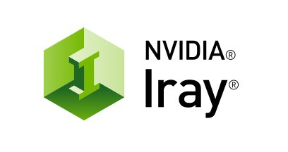
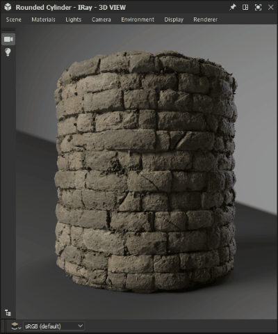
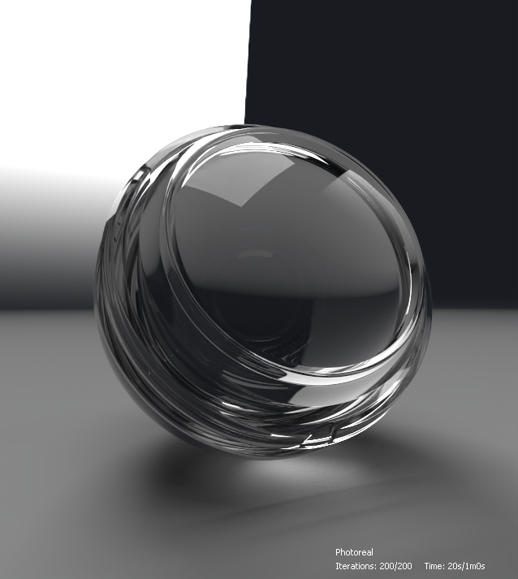

# Iray

このページでは、[Substance 3D Designer](https://www.adobe.com/jp/products/substance3d-designer.html)の3Dビューパネルで使用できるIrayレンダラーについて説明します。このパネルでは、CPUまたはGPUアクセラレーション（Nvidia GPUのみ）を使用してフォトリアリスティックなレンダリングのためのインタラクティブなパストレーシングを提供します。

>[!WARNING]
> 
> Irayレンダラーおよびすべての関連機能は、バージョン16.0.0でDesignerから削除されました。
> 
> 詳細については、こちらを参照してください： [MDLグラフとIrayの提供終了](../../../technical-issues/mdl-graph-iray-eol/mdl-graph-iray-eol.md)

<table>
<tr style="border: 0;">
<td style="border: 0;" valign="top">

## 概要

<b>Iray</b>は、光とマテリアルの物理的な動作をシミュレートすることで&#x200B;*フォトリアルな画像*&#x200B;を生成する、高度に&#x200B;*インタラクティブ*&#x200B;で、直感的な物理ベースのレンダリング技術です。 詳しくは、[Nvidia Iray](https://www.nvidia.com/en-us/design-visualization/iray/)のwebページを参照してください。

</td>
<td style="border: 0;" valign="top">

</td>
</tr>

<tr style="border: 0;">
<td style="border: 0;" valign="top">

3DビューはIrayの&#x200B;*プログレッシブレンダラー*&#x200B;を使用しているため、各ピクセルに少なくとも1つのサンプルが実行されると、すぐにイメージが生成されます。 サンプリングの繰り返しが実行されると、画像は&#x200B;*自動的に更新*&#x200B;されます。その結果、最初の大まかな画像は&#x200B;*繰り返しごとに鮮明*&#x200B;になります。

レンダラーは[3Dビュー](../../../interface/3d-view/3d-view.md)パネルで使用できます。<b>レンダラー</b>メニューを開き、<b>Iray</b>オプションを選択して、その3Dビューパネルで使用されているレンダラーをIrayに切り替えます。\
Irayレンダラー&#x200B;*に切り替えると、一部の3Dビューメニューで使用できるオプションが変更されます*。 これらの変更については、以下の「<b>3Dビュー</b>」セクションで説明しています。

デフォルトでは、イメージレンダラーを選択するとすぐにプログレッシブレンダリングが開始されます。 レンダリングプロセスは、次の条件のうち&#x200B;*one*&#x200B;が満たされるまで実行されます：

* *最大サンプル数*&#x200B;が実行されます
* *レンダリング時間制限*&#x200B;を満たしています

これらの条件の調整の詳細については、このページの<b>レンダラー</b>のセクションを参照してください。

</td>
<td style="border: 0;" valign="top">

*素材： [中世の城壁](https://helpx.adobe.com/jp/substance-3d/unlisted/assets/allassets/2b3f6eca9a6b6ab19d263d8b77819df431c3c973.html)* *著者： [Mark Foreman](https://www.artstation.com/oggyart)* *[Substance 3Dアセット](https://helpx.adobe.com/jp/substance-3d/unlisted/assets.html)* *ライブラリ*

</td>
</tr>
</table>

>[!WARNING]
>
> いつでも実行できるIrayレンダリングインスタンスは&#x200B;*1*&#x200B;個のみです。\
> つまり、3Dビューパネルでこのレンダラーが使用されている場合、他の3Dビューパネルでは&#x200B;**レンダラー**&#x200B;メニューが&#x200B;*無効*&#x200B;になり、これらのデフォルトは&#x200B;**OpenGL**&#x200B;レンダラーになります。

## 3D表示オプション

### シーン

<b>シーン</b>メニューの<b>編集</b>オプションを選択し、<b>プロパティ</b>パネルでIrayに固有のシーンプロパティを検索します。

* <b>有効：</b> *偽*&#x200B;に設定すると、オブジェクトは非表示になり、*シーンに貢献*&#x200B;しなくなります

表示コンポーネント

* <b>表示</b> : *偽*&#x200B;に設定すると、オブジェクトは非表示になりますが、シーンに&#x200B;*まだ貢献*&#x200B;しています。つまり、光の反射、光の吸収、影の投影などです

メッシュ表示コンポーネント

* 分割
  * <b>メソッド</b>:メッシュをより細かいジオメトリに手続き的に細分化するために使用されるメソッドです
    * *なし*:サブディビジョンは適用されません
    * *パラメトリック*:メッシュを`4^x`個の三角形に細分割します。`x`はこのパラメーターで指定された値です
    * *長さ*：すべてのエッジの長さが最小長さパラメーターで指定された値以下になるまで、メッシュを再分割します
  * <b>最小の長さ</b>:オブジェクト空間ですべてのエッジがこの指定された値より小さい長さになるまでメッシュを再分割します（*Length*&#x200B;メソッドにのみ適用）
  * <b>数値</b>:メッシュに適用するサブディビジョン反復回数（*パラメトリック*&#x200B;メソッドにのみ適用）

>[!WARNING]
>
> メッシュ&#x200B;*を再分割すると、レンダリング前とレンダリング中の処理時間が指数的に*&#x200B;増加します。 入力された値を&#x200B;*控えめな*&#x200B;設定することをお勧めします。\
> パラメトリックメソッドには&#x200B;*高* **数値**&#x200B;の値を使用し、長さメソッドには&#x200B;*低* **最小の長さ**&#x200B;の値を使用することに注意してください。

### マテリアル

IrayはNVIDIAが開発した[MDL シェーディングモデル](https://www.nvidia.com/en-us/design-visualization/technologies/material-definition-language/)を使用しているため、シーンマテリアルに使用可能なマテリアルは、Designerが読み込むMDLライブラリに置き換えられます。 このライブラリは、次のソースを使用して構築されます。

* Designerのインストールに含まれるMDLファイル
* 読み込まれた[プロジェクトファイル](../../../pipeline-and-project-con/project-configuration-fil/project-configuration-files-sbsprj.md)内の[ユーザーがリストしたディレクトリ](../../../interface/preferences-window/project-settings/project-settings.md)でMDLファイルが見つかりました
* [NVIDIA vMaterials](https://developer.nvidia.com/vmaterials)ライブラリ（インストールされている場合）

>[!NOTE]
>
> MDL シェーディングモデルの詳細については、NVIDIAが作成および管理している[MDLハンドブック](http://mdlhandbook.com/)を参照してください。

<table>
<tr style="border: 0;">
<td style="border: 0;" valign="top">

読み込まれたMDLマテリアルの累積リストは、<b>マテリアル</b>メニューで利用できます。リストされたマテリアルのサブメニューの下に、右の画像に示すように表示されます。

さらに、[MDLグラフ](../../../mdl-graphs/creating-an-mdl-graph/creating-an-mdl-graph.md)をDesignerに読み込むと、シーン内の任意のマテリアルに適用できます。 この時点で、使用可能なMDL資料のリストに追加されます。

このメニューのその他の注目すべきオプションは次のとおりです。

* <b>編集</b>オプションを選択して、<b>プロパティ</b>パネルにあるMDLの&#x200B;*公開入力*&#x200B;にアクセスし、必要に応じて素材を調整します
* <b>読み込み…</b>オプションを使用すると、累積リストに追加してシーンに適用するMDLファイルを&#x200B;*手動で読み込み*&#x200B;できます
* <b>プリセットを書き出し…</b>オプションを選択すると、<b>MDLマテリアルプリセットを書き出し</b>ダイアログが開きます。このダイアログでは、3Dビューで適用されている現在の設定を使用して、プリセットMDLファイルを書き出すことができます

</td>
<td style="border: 0;" valign="top">

</td>
</tr>
</table>

>[!NOTE]
>
> **MDLグラフ**&#x200B;を読み込むと、3Dビューレンダラーは&#x200B;*自動的に&#x200B;**Iray***に切り替えられ、読み込んで適用されます。

### カメラ

カメラ設定に関するOpenGLとIrayの主な違いは、*フィールドの深度*&#x200B;の管理方法です。 実際に、Irayは物理的に正確なレンダラーなので、カメラの&#x200B;*絞り*&#x200B;に応じて「自然に」フィールドの深度が発生します。

Rayレンダラーを選択すると、カメラのプロパティで次の2つのパラメーターを使用できます。

* <b>焦点距離</b>：焦点のカメラからの距離 – つまり、画像が最もシャープな場所です
* <b>絞りの直径</b>:カメラの絞りを駆動する値です。 値が小さいほど、焦点の前と後の画像がシャープになります。つまり、この値は電界効果の深度の強さを制御します

### 環境

<b>環境</b>メニューを開き、<b>編集</b>オプションを選択して、<b>プロパティ</b>パネルに環境プロパティを表示します。

次のプロパティを使用できます。

ドーム

* <b>ドーム型</b>：環境テクスチャが投影されるシーンを囲むオブジェクトを設定します
  * *無限球* ：無限球環境
  * *地面*：無限の球面環境ですが、テクスチャの付いた地面です
  * *球*:カスタム半径の有限サイズの球形ドーム
  * *地面のある球*：環境の下部が球の上部と下部を分割する平面に投影される、カスタム半径の有限サイズの球形のドームです
  * *地面のある箱*：幅、Height、長さをカスタムに設定した、有限のサイズの箱の形をしたドームです。環境の下部が、箱の上部と下部を分割する平面に投影されます。
* <b>回転角度</b>: *Y軸*&#x200B;のドームの回転角度を制御します
* <b>半径</b>：球の半径(*球*&#x200B;および&#x200B;*球（地面*&#x200B;ドーム型）にのみ適用されます)
* <b>幅</b>:ボックスの幅（*地面*&#x200B;ドーム型のボックスにのみ適用）
* <b>Height</b>:ボックスのHeightです（地面&#x200B;*ドーム型の*&#x200B;ボックスにのみ適用）
* <b>長さ</b>:ボックスの長さ（地面&#x200B;*ドーム型の*&#x200B;ボックスにのみ適用）
* <b>視覚化</b>：有限サイズの環境ジオメトリの偽色オーバーレイを有効にします。 これは、ジオメトリを、キャプチャした環境マップの投影に合わせるために使用できます（地面のある&#x200B;*球*、*球*&#x200B;および地面のある&#x200B;*箱*&#x200B;のドーム型にのみ適用されます）

>[!NOTE]
>
> 有限サイズのドームの場合、すべてのシーンジオメトリはドーム内で&#x200B;*囲む*&#x200B;必要があります。

ドーム地盤\
次のパラメーターは、ドーム型が&#x200B;*地面*、*地面のある球*&#x200B;および&#x200B;*地面のある箱*&#x200B;に適用されます。

* **地面**:グリッドを有効にします
* **位置**：有限ドームの原点の位置（*球*&#x200B;ドーム型にも適用）
* **反射率**：地面の映り込みの不透明度と色合い。黒は、映り込みが見えていないことを示します
* **光沢**：地面の反射の光沢
* **影の強度**：地面に落ちる影の不透明度
* **テクスチャスケール**：地面の環境テクスチャ投影のサイズを制御します（*球*&#x200B;ドーム型にも適用されます）

これらの設定の一部の影響を次に示します。

+++表示環境

<table>
  <tr>
    <td>
      
       <i>前</i>
    </td>
    <td>
      
       <i>後</i>
    </td>
  </tr>
</table>

+++

+++グランドプレーンを有効にする

<table>
  <tr>
    <td>
      
       <i>前</i>
    </td>
    <td>
      
       <i>後</i>
    </td>
  </tr>
</table>

+++

+++環境を回転

+++

+++グリッドを調整

+++

+++無限球を調整

+++

+++囲むボックスを調整

+++

### 表示

これらのオプションでは、レンダリングされたイメージの上に&#x200B;*テキストオーバーレイ*&#x200B;が表示され、レンダリングに関する有用な情報が表示されます。

* <b>経過時間</b>:レンダリングの継続時間（秒）。 このタイマーとレンダリングプロセスは、どちらかの終了条件が満たされると停止します
* <b>反復回数</b>：実行されたサンプリング反復回数です。 このカウンターとレンダリング処理は、どちらかの終了条件が満たされたときに停止します
* <b>レンダリングメソッド</b>：使用されるレンダリング経路です。 ローカルマシンでのほとんどの目的には、Photorealが使用されます
* <b>解像度</b>：効果的なレンダリング解像度です。 カメラのプロパティにあるUse window resolutionオプションがFalseに設定されている場合、画像の縦横比は解像度に合わせて自動的に調整されます
* <b>シーンの統計</b>:レンダリングされたシーンに関連する統計のリストです。三角形の数、マテリアルの数などが含まれます

{width="512px"}

### レンダラー

<b>レンダラー</b>メニューを開き、<b>編集</b>オプションを選択して、<b>プロパティ</b>パネルでレンダラーのプロパティを表示します。

プログレッシブレンダリング

* <b>最小サンプル</b>:プログレッシブレンダリングを停止する条件を検討する前に計算する、ピクセルあたりの最小サンプル数
* <b>最大サンプル数</b>：このピクセルあたりのサンプル数がレンダリングされている場合は、プログレッシブレンダリングを自動的に停止します
* <b>最大時間（秒）</b>:プログレッシブレンダリングが自動的に終了するまでの時間（秒単位）
* <b>コースティックサンプラーを有効</b> ：専用のコースティックサンプラーでデフォルトのサンプラーを増強します。 コースティクスは、不透明でないオブジェクトを光が通過した結果であるため、透光性をサポートする[MDL](../../../mdl-graphs/creating-an-mdl-graph/creating-an-mdl-graph.md)マテリアルがシーン内の任意のオブジェクトに適用される場合にのみ必要です
* <b>Fireflyフィルターを有効にしました</b>:ホタルフィルターを有効にします。このフィルターは、レンダリングの進行に伴い、定義済みのアルゴリズムを使用して、計算済み画像からホタルを取り除きます。 Fireflyとは、画像内の&#x200B;*単一のピクセル*&#x200B;が近隣のピクセルよりも&#x200B;*明るく*&#x200B;見えている視覚的なアーティファクトで、光の分散を正確に判断するのに十分な光線サンプルがない結果です
* 投稿拒否\
  Irayレンダラーは、[NVIDIA Optix AI-Accelerated denoiser](https://developer.nvidia.com/optix-denoiser)アルゴリズムを使用して、レンダリング中の画像の高品質なノイズを繰り返し除去します。

  * <b>有効</b>：定義済みの&#x200B;*ノイズ除去アルゴリズム*&#x200B;を、設定されたレンダリング繰り返しでトリガーし、レンダリングの&#x200B;*終了*&#x200B;までアクティブにします
  * <b>反復処理の開始</b>:ノイズ除去が有効になっている場合、このオプションはノイズ除去プロセスを開始する反復処理を設定します。 これにより、例えばカメラを動かす際に、ノイズ除去を行う人のパフォーマンスのオーバーヘッドがインタラクティブ性に影響を与えることを防ぐことができます。 さらに、収束性が不十分なため、最初の数回の反復はノイズ除去の入力として適切でないことが多く、満足のいく結果が得られません。

これらの設定の一部の影響については、次の図の比較で示しています。

+++コースティックサンプラー

<table>
  <tr>
    <td>
      
       <i>前</i>
    </td>
    <td>
      
       <i>後</i>
    </td>
  </tr>
</table>

+++

+++Fireflyフィルター

<table>
  <tr>
    <td>
      
       <i>前</i>
    </td>
    <td>
      
       <i>後</i>
    </td>
  </tr>
</table>

+++

+++脱臭後の

<table>
  <tr>
    <td>
      
       <i>前</i>
    </td>
    <td>
      
       <i>後</i>
    </td>
  </tr>
</table>

+++

*材料：厚いガラスMDL* *MDLコア定義で使用可能* *NVIDIAによる*

## ハードウェアアクセラレーション

Rayレンダラーは、NVIDIA GPUでのみハードウェアアクセラレーションを提供します。その利点は次のとおりです。

* レンダリング速度が大幅に向上
* [Optix AIアクセラレーションによるノイズ除去](https://developer.nvidia.com/optix-denoiser) （このページの<b>レンダラー</b>セクションの「ノイズ除去の後」を参照）

右側の画像に示されているように、[環境設定](../../../interface/preferences-window/preferences-window.md)ウィンドウの<b>3Dビュー</b>セクションで、Irayがレンダリングに使用するハードウェアを選択できます。

サポートされているGPUが検出されると、このセクションに一覧表示されます。デフォルトでは&#x200B;*自動的に選択*&#x200B;され、CPUは選択されていません。 この自動動作は手動で変更した場合に上書きされるので、以降のセッションで使用するカスタム変更は保存されます。

>[!NOTE]
>
> サポートされているGPUが検出され、一覧に表示された場合、IrayレンダリングにCPUを使用するとアプリケーションの全体的なパフォーマンスと応答性に&#x200B;*大きな影響を与えるため、* CPUを選択しないままにする&#x200B;*ことを強くお勧めします。*

>[!WARNING]
>
> GPUハードウェアアクセラレーションは、[NVIDIA CUDA](https://developer.nvidia.com/cuda-zone)テクノロジーを使用します。 最適な互換性と信頼性を得るには、*グラフィックスドライバーが最新*&#x200B;であることを確認してください。 お使いのNVIDIA GPUの最新ドライバーは、[こちら](https://www.nvidia.com/Download/index.aspx?lang=en-us)から確認できます。\
> 複数のGPUを構成する場合、最高の信頼性を得るには、*SLIを無効にする*&#x200B;ことと、1つのGPUのみを選択することをお勧めします。

