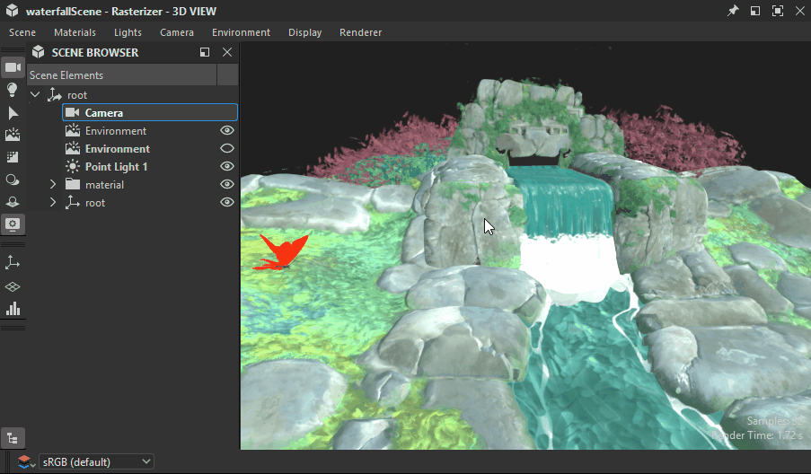
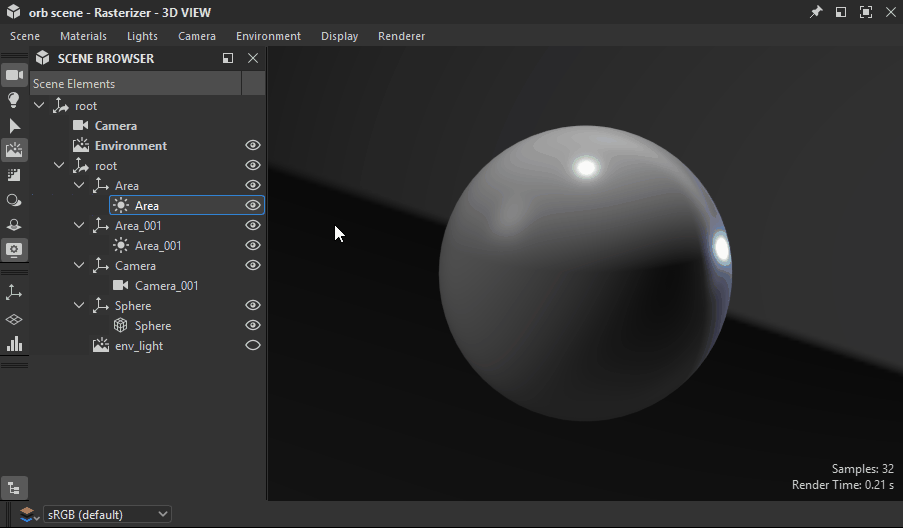

# シーンブラウザー

3Dビューのシーンブラウザには、シーン内のすべての要素とその階層が一覧表示されます。

オブジェクトの選択、表示/非表示の切り替え、[シーンマテリアルをオーバーライド](../../../working-with-3d-scenes/overriding-scene-mat/overriding-scene-materials.md)する必要があるマテリアルの選択を行うためのコントロールが用意されています。

Designerでは、シーンの記述と管理に[USD](https://openusd.org/release/index.html)を使用しているため、用語とコンセプトはそのシーンツリーに含まれています。

これは、[3Dビューのシーンツールバー](../../../interface/3d-view/3d-view.md)で専用のトグルボタンをクリックして表示します。

{zoomable="yes"}

<table>
<tr style="border: 0;">
<td style="border: 0;" valign="top">

## シーンツリー

</td>
<td style="border: 0;" valign="top">

### シーン内のオブジェクトの切り替え

</td>
<td style="border: 0;" valign="top">

### 接続されたマテリアル

</td>
</tr>
</table>

## シーンツリー

<table>
<tr style="border: 0;">
<td width="100.00%" style="border: 0;" valign="top">

Scene Browserには、階層ツリーに配置されたオブジェクトのリストが表示されます。

オブジェクトは、シーンのルートまで、他のオブジェクトの親になります。 親オブジェクトには、子のリストを展開または折りたたむために使用する矢印ボタンがあります。

</td>
<td width="33.33%" style="border: 0;" valign="top">

{zoomable="yes"}

</td>
</tr>
</table>

ツリー内の任意の項目にカーソルを置いたまま数秒間待つと、ツールチップに次の情報が表示されます。

* <b>パス：</b>シーン内のオブジェクトの完全なパスです。
* <b>TypeName:</b>オブジェクトのUSD型です。
* <b>ドキュメント：</b> USDシーン要素としてのオブジェクトに関する詳細情報です。

メッシュには、頂点の数、フェースの数、UVの数などの追加情報があります。

### Designerで追加されたオブジェクト

<table>
<tr style="border: 0;">
<td width="100.00%" style="border: 0;" valign="top">

Designerは、読み込まれたシーンにオブジェクトを追加します。 Designerによって追加されたオブジェクトには、<b>太字</b>でラベルが付けられます。

ライト、カメラ、環境メニューで「編集…」アクションを使用すると、シーン内に他のライト、カメラ、環境があるかどうかに関係なく、これらのオブジェクトが編集されます。

これらのオブジェクトは、[書き出し](../../../working-with-3d-scenes/exporting-scenes/exporting-scenes.md)時にシーンに含まれます。

</td>
<td width="33.33%" style="border: 0;" valign="top">

{zoomable="yes"}

</td>
</tr>
</table>

* <b>カメラ：</b>シーンの既定のカメラです。 Designerでやり取りできるカメラはこれだけです。 読み込まれたシーンに含まれているカメラはすべて、初期設定のカメラのプリセットとして追加されます。
* <b>環境：</b>シーンの既定の環境です。 シーンの環境に適用されたテクスチャは、その環境にのみ適用されます。 同様に、環境の回転はその環境にのみ影響します。\
  読み込まれたシーンに1つ以上の環境光（米ドルで[DomeLight](https://openusd.org/release/user_guides/schemas/usdLux/DomeLight.html)）が含まれている場合、デフォルトの環境は自動的に無効になり、シーンの環境光を妨げることはありません。
* <b>ポイントライト#:</b>ライト/プロパティの編集でDesignerのポイントライトのいずれかが有効になっている場合、各ポイントライトがシーンに追加されます。

## シーン内のオブジェクトの切り替え

### すべてのタイプ

シーン内の任意のオブジェクトを有効または無効にできます。 無効にすると、オブジェクトはシーンに寄与しなくなります。シャドウを投影したり、光を放出したり、反射したりすることはありません。

親オブジェクトの状態はその子に継承されるので、親オブジェクトを無効にすると、その子も無効になります。

オブジェクトの表示/非表示は、目のボタンをクリックするか、コンテキストメニューから切り替えることができます。 このメニューには、シーンオブジェクトの表示を管理するためのアクションがいくつか用意されています。

* <b>非表示：</b>選択したオブジェクトを無効にします。
* <b>表示：</b>選択したオブジェクトを有効にします。

特定のアクションは、メッシュの表示に影響します。

* <b>表示のみ：</b>選択したメッシュとその子を除くすべてのメッシュを無効にします。
* <b>すべて表示：</b>すべてのメッシュを有効にします。

親オブジェクトには、次のような追加のアクションがあります。

* <b>子を非表示：</b>選択したオブジェクトのすべての子を再帰的に無効にします。
* <b>子の表示：</b>選択したオブジェクトのすべての子を再帰的に有効にします。
* <b>すべての子を展開：</b>選択したオブジェクトの下にあるすべての子のリストを再帰的に展開します。
* <b>すべての子を折りたたむ：</b>選択したオブジェクトの下にあるすべての子のリストを再帰的に折りたたみます。

{zoomable="yes"}

### 環境

環境光(DomeLight)の表示/非表示は、他のオブジェクトと同様に有効/無効にできます。

環境光を無効にすると、シーンに対する環境光の効果も無効になります。

複数の環境光が有効になっている場合、その光の効果は&#x200B;*累積的に追加*&#x200B;されます。

{zoomable="yes"}

### ライト

シーン内の任意のライトについても同じことが言えます。各ライトは個別に切り替えることができます。

{zoomable="yes"}

## 接続されたマテリアル

Scene Browserでは、オーバーライドされたマテリアルを、Designerの3Dビューの[マテリアルメニュー](../../../interface/3d-view/3d-view.md)にリストされている別のマテリアルにコネクトすることもできます。

<table>
<tr style="border: 0;">
<td style="border: 0;" valign="top">

Designerで一覧表示されるマテリアルは、少なくとも1つのメッシュで使用されるシーンツリー内のマテリアルオブジェクトです。

これらのマテリアルのいずれかを[上書き](../../../working-with-3d-scenes/overriding-scene-mat/overriding-scene-materials.md)すると、Designerにより、数字のサフィックスを持つコピーが作成されます。

オーバーライドされたマテリアルは、コンテキストメニューに追加の項目を提供します。&#39;[接続されたマテリアル](../../../working-with-3d-scenes/overriding-scene-mat/overriding-scene-materials.md)&#39;サブメニューには、このマテリアルをオーバーライドするために使用できるその他すべての利用可能なマテリアルが一覧表示されます。

</td>
<td style="border: 0;" valign="top">

{zoomable="yes"}

</td>
</tr>
</table>
