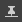

# ワークスペースのカスタマイズ

このページでは、[Adobe Substance 3D Designer](https://www.adobe.com/jp/products/substance3d-designer.html)のユーザーインターフェイスでパネルを並べ替える方法と、その機能を使用してワークフローを強化する方法について説明します。

<table>
<tr style="border: 0;">
<td width="100.00%" style="border: 0;" valign="top">

## ウィンドウメニュー

このメニューを使用すると、Designerのメインユーザーインターフェイスを管理できます。 各オプションは、[このページ](../the-main-toolbar/the-main-toolbar.md)の<b>Windows</b>セクションで、メインツールバーについて説明されています。 ここでは、このメニューに関連する追加の概念について説明します。

### ビューを表示/非表示にする

特定のインターフェイス項目の表示と非表示を切り替えるには、*Windows*&#x200B;メニューでインターフェイス項目の名前をクリックします。 表示されている項目にはチェックマークが付いています。

### ドックへのビューの移入

Designerでは、ドックは内容とは別の&#x200B;*コンテナです*。 これは、<b>ライブラリ</b>ドックが存在し、空でもできることを意味します。このドックにはライブラリ&#x200B;*ビュー*&#x200B;が保持されていません。

<b>新しいエクスプローラー</b>、<b>新しい3Dビュー</b>および<b>新しいライブラリビュー</b>オプションでは、ビューが作成され、ユーザーインターフェイスの現在の状態に従って配置されます：

* 空のドックが使用可能な場合、新しいビューは&#x200B;*その中に*&#x200B;作成されます
* 空のドックが&#x200B;*使用できない*&#x200B;場合、新しいビューを保持するために&#x200B;*新しいドック*&#x200B;が作成されます

</td>
<td width="33.33%" style="border: 0;" valign="top">

</td>
</tr>
</table>

## ドックのサイズ変更

ドックのサイズは、ドックの端を移動して変更できます。 他のドックは、サイズに合わせて動的に変更されます。

## ドックの移動

任意のドックを、*タイトルバー*&#x200B;を使用してメインウィンドウの周りに移動できます。 ドックの移動先の場所に応じて、ドックのサイズが変更されます。

## ドックのタブ移動

ドックは複数のタブに分けて積み重ねてもよい。 これは、何らかの形で互いに関連する画面のスペースや集約ビューを保存するのに便利です。

ドックのタブ設定を行うには、ドックのタイトルバー&#x200B;*を既存のドックの上*&#x200B;に移動します。たとえば、ドックはサイズ変更も移動もされませんが、移動先のドックの周りには&#x200B;*フレーム*&#x200B;が表示されます。

## ドッキング解除

ドックは、*フローティングウィンドウ*&#x200B;にドッキング解除できます。フローティングウィンドウは、サイズを変更したり、別のディスプレイに移動するなど、メインウィンドウの外に移動したりできます。

これは、次の2つの方法で実行できます。

* *タイトルバー*&#x200B;を使用してドックを移動し、*メインウィンドウの外*&#x200B;に配置するか、または&#x200B;*ドックではない*&#x200B;メインウィンドウの領域に配置します。 このドックを再ドッキングするには、メインウィンドウ&#x200B;*の別のドック*&#x200B;に移動するか、<b> [再ドッキング]</b>ボタンをクリックします。
* <b> [ドッキング解除]</b>ボタンをクリックします。 このメソッドでドッキングを解除したドックは、<b> [再ドッキング]</b>ボタンをクリックして&#x200B;*のみ*&#x200B;再ドッキングできます。

## ドックの最大化

どのドックも、領域またはその&#x200B;*親ウィンドウ*&#x200B;に合わせて最大化できます。

* ドッキングドックは、タイトルバー、メインツールバー、およびステータスバーを除く&#x200B;*メインウィンドウ*&#x200B;の領域全体に広がります
* ドッキングされていないドックは、*ディスプレイ全体*&#x200B;に表示されます

ドックは、次の2つの方法で最大化できます。

* *カーソルをドック*&#x200B;の上に置いて、<b>Shift +スペース</b>のキーストロークを押します
* <b> [最大化]</b>ボタンをクリックしています

最大化されたドックは、*最大化される前*&#x200B;に保持されていたサイズと場所に最小化できます。 これは、次の3つの方法で実行できます。

* *カーソルをドック*&#x200B;の上に置いて、<b>Shift +スペース</b>のキーストロークを押します
* <b> [最小化]</b>ボタンをクリックしています
* <b>ウィンドウ</b>メニューを開き、<b>ウィンドウの最大化を解除</b>オプションを選択しています

>[!NOTE]
>
> 一度に最大にできるのは&#x200B;*1*&#x200B;ドックのみです。

>[!IMPORTANT]
>
> ドックが最大化されている場合、インターフェイスの動作が一部異なる場合があります。
> 
> * 自動的に表示/更新されるドックは、バックグラウンドで実行されます（例：プロパティ、2Dビュー）
> * **Windows**&#x200B;メニューのメニュー項目は&#x200B;*無効*&#x200B;です
> * Dockタイトルバーのボタンは&#x200B;*無効*&#x200B;です
> * メインウィンドウ&#x200B;*で最大化されているドックは、タイトルバーを使用して移動できません*

## ドックの固定

ドック&#x200B;*を固定すると、他のコンテンツや別のビューがドックに追加されるのを防ぐことができます*。

ドックが固定されると、そのドックに表示されるコンテンツは代わりに&#x200B;*新しいドックを作成*&#x200B;してホストします。 この新しいドックは固定されないため、新しいコンテンツを更新してホストできます。

ドックを固定するには、 <b>固定</b>ボタンをクリックします。 その後、 <b>ピン留めを解除</b>ボタンを使用して&#x200B;*ピン留めを解除*&#x200B;し、新しいコンテンツをホストするために&#x200B;*使用可能*&#x200B;に戻すことができます。

**&#x200B;同じ種類&#x200B;*の複数のドックを含め、一度に複数の*&#x200B;ドックを固定できます。

ドックをピン留めすると、次の機能を使用できます。

* 複数のノードのプロパティを同時に表示および微調整する
* 2つ以上のビットマップを同時に表示
* 複数のグラフの同時操作

## ドックのクローズ

どのドックも、 <b>閉じる</b>ボタンをクリックして閉じることができます。

## インターフェイスレイアウトのリセット

<b>Windows</b>メニューを開き、<b>レイアウトのリセット</b>オプションを選択すると、ユーザーインターフェイス全体を既定のレイアウトにリセットできます。

これらの表示状態もリセットされます。つまり、閉じたドックは&#x200B;*再度開く* （例： 3Dビュー）ことができ、表示したドックは&#x200B;*閉じる* （例：コンソール、依存関係マネージャー、プラグインで作成したドック）ことができます。

