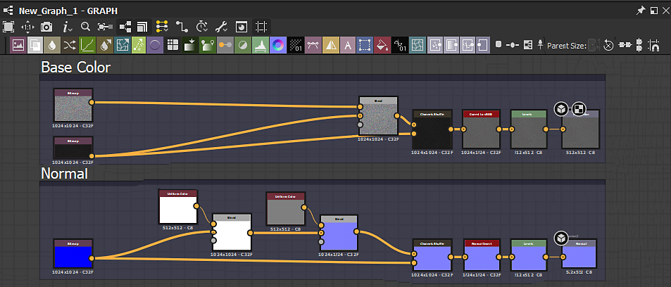

# Workspace

ワークスペースは、<b>ドック</b>と呼ばれる個別の領域に分割されています。この領域は、Designerのメインウィンドウの[サイズを変更、移動、ドッキング解除](../interface/customizing-your-wor/customizing-your-workspace.md)して、フローティングドックにすることができます。

Designerの初期設定のドックのレイアウトは次のとおりです。

<table>
<tr style="border: 0;">
<td style="border: 0;" valign="top">

<b>1</b>メインメニューとツールバー

<b>2</b>エクスプローラー

<b>3</b>グラフビュー

</td>
<td style="border: 0;" valign="top">

<b>4</b>のプロパティ

<b>5</b> 2Dビュー

</td>
<td style="border: 0;" valign="top">

<b>6</b> 3Dビュー

<b>7</b>ライブラリ

</td>
</tr>
</table>

>[!NOTE]
>
> Interface scaling
> 
> Designerは、特定の規模のユーザーインターフェイス要素&#x200B;*をOSから取得します*。 したがって、ユーザーインターフェイスの拡大・縮小に対する調整は、OSの表示設定で行う必要があります。
> 
> Designerでディスプレイの設定が正しく適用されるように、OSユーザーセッションの&#x200B;*ログアウト*&#x200B;し、これらの設定を変更した後で、再度ログインしてください。

<table>
<tr style="border: 0;">
<td style="border: 0;" valign="top">

## メインメニューとツールバー

メインツールバーからは、[環境設定ウィンドウ](../interface/preferences-window/preferences-window.md)などの追加メニューにアクセスできます。また、新しいSubstanceグラフやパッケージをすばやく作成するためのいくつかのボタンも使用できます。

</td>
<td style="border: 0;" valign="top">

</td>
</tr>
</table>

* <b>ファイル： </b>新しいパッケージおよびリソースを作成したり、現在作業中のパッケージを保存して閉じたりすることができます。 このメニューの機能は、このツールバーのクイックボタンとしても使用できます。
* <b>編集： </b>取り消しとやり直しの機能（以下のクイックボタンとして使用できます）と、[環境設定](../interface/preferences-window/preferences-window.md)にアクセスして、深度内でカスタマイズすることができます。
* <b>ツール：</b> Substance engineを制御し、プラグインマネージャーにアクセスできるようにします。
* <b>ウィンドウ：</b>任意のウィンドウの表示と非表示を切り替えたり（一部のウィンドウは既定で非表示になります）、ウィンドウレイアウトを既定に戻すことができます。
* <b>ヘルプ： </b>SubstanceアカデミーやこのドキュメントWebサイトなど、その他の情報やオンラインリソースにアクセスできます。

## エクスプローラー

[エクスプローラーウィンドウ](the-explorer-window/the-explorer-window.md)は、あらゆる種類のファイルやリソースを操作するための主要な手段です。 メインツールバーのファイルメニューよりも多くのオプションを提供します。ここで、すべての作業セッションの開始と終了が行われます。

## グラフビュー

[グラフビュードック](../interface/the-graph-view/the-graph-view.md)は、Substance 3D Designerで最も重要なウィンドウです。 Designerで利用できるあらゆる種類のグラフ（[Substanceグラフ](../compositing-graphs/substance-compositing-graphs.md)、[Substance関数グラフ](../function-graphs/function-graphs.md)、[FX-Mapグラフ](../function-graphs/fxmaps/fxmaps.md)）のノードネットワークが表示され、作成および編集できます。

## プロパティ

[プロパティドック](properties/properties.md)は、最も技術的なウィンドウです。 これは常に状況依存であり、選択したリソースまたはノードの動作を変更するスライダー、ドロップダウン、およびその他の要素を表示します。

## 2D ビュー

[2D ビュー](../interface/2d-view/2d-view.md)は最も簡単なプレビューツールです。 この機能は、グラフと密接に連携しています。グラフビューの任意のノードをダブルクリックすると、視覚的な結果が2D ビューに表示されます。

## 3D ビュー

[3D ビュー](../interface/3d-view/3d-view.md)は、最もインタラクティブで高度なプレビューウィンドウです。 2D ビューとは異なり、フルマテリアルをレンダリングするには、さまざまな出力マップを使用します。 つまり、ベースカラー、標準、ラフネスなどのすべてのチャンネルが表示されます。

## ライブラリ

[ライブラリドック](../interface/the-library/the-library.md)では、Designerのライブラリに含まれているすべてのコンテンツと[カスタムコンテンツ](../interface/the-library/managing-custom-content/managing-custom-content-and-filters.md)に既定でアクセスできます。

