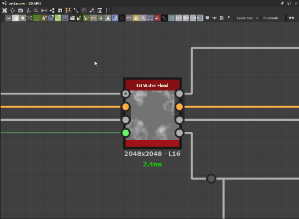
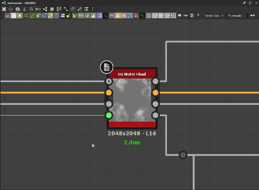

# Preferencesウィンドウ

このページには、<b>環境設定</b>ウィンドウとそのすべての設定が表示されます。

環境設定ウィンドウは、アプリケーションのメイントップバーの<b>編集</b>メニューから見つけることができます。 このダイアログボックスでは、さまざまな設定を調整できます。 このパネルは、様々なビヘイビアーおよび機能をカバーするタブにまとめられています。\
アプリケーションがどのように動作し、ワークフローに合わせてどのようにカスタマイズできるかをより詳しく理解するために、これらの設定をすべて確認することをお勧めします。

>[!NOTE]
>
> これらの設定の保存方法および運用環境での統合方法の詳細については、ドキュメントの[ユーザー設定 – 自動設定](../../pipeline-and-project-con/user-preferences-aut/user-preferences-automating-setup.md)のページを参照してください。

## 一般

### 最近使用したドキュメント

|  |                                                                                                                                         |
| --- |-----------------------------------------------------------------------------------------------------------------------------------------|
| <b>最近使用した文書のリストには</b>件あります  *既定： 10* | これにより、[メインメニュー](../the-main-toolbar/the-main-toolbar.md)の<b>ファイル</b>項目の<b>最近使用したパッケージ</b>エントリに一覧表示するドキュメントの数を選択できます。 |

### 履歴

|  |  |
| --- | --- |
| **履歴のスタックサイズ** *既定： 200* | これは、[メインメニュー](../the-main-toolbar/the-main-toolbar.md)の<b>編集/取り消し</b>項目で、任意の時点で使用可能な取り消し操作の数を示します。  **注意：**&#x200B;必要な取り消し操作が多いほど、アプリケーションに必要なメモリが多くなります。 |

### 言語

|  |  |
| --- | --- |
| **アプリケーションの言語を選択してください** *既定：システム* | この設定は、アプリケーションインターフェイスで使用される言語を定義します。 &#39;*System*&#39;オプションは、システム言語設定から言語を自動検出します。 利用可能な言語は、[必要システム構成](../../getting-started/system-requirements/system-requirements.md)に記載されています。  **注意：**&#x200B;この設定の変更は、アプリケーションの再起動後にのみ有効になります。 |

### ビュー

|  |  |
| --- | --- |
| <b>ビューのズームを反転する</b>  *既定：未確認* | オンにすると、[2Dビュー](../../interface/2d-view/2d-view.md)、[3Dビュー](../../interface/3d-view/3d-view.md)および[グラフ](../../interface/the-graph-view/the-graph-view.md)でズームコントロールが反転されます。 |

### パス

|  |  |
| --- | --- |
| <b>パスの保存/書き出し</b>  *既定：最後のパス* | 提案された保存/書き出しパスが最後に選択されたパスであるか、[SBSパッケージ](../../getting-started/overview/overview.md)のパスであるかを特定します。 最後に選択したパスは、セッション間で保存されます。 |
| <b>一時フォルダー</b>  *既定：システムOSによって異なるパス* | グラフの画像データが割り当てられたメモリプールを超えると（<b>メモリ/画像キャッシュ</b>を参照）、オーバーフローしたデータがディスクに書き込まれます。 この設定では、オーバーフローしたイメージキャッシュデータが書き込まれる場所を定義できます。   この場所は、現在開いているSBSパッケージのコピーを、最後に手動で保存した後に行われた最新の変更とともに保存するためにも使用されます。 |

### メモリ

#### 画像キャッシュ

アプリケーションは、現在のグラフのレンダリングノードごとに&#x200B;*フル解像度の非圧縮イメージ*&#x200B;をキャッシュに保持します。\
インスタンスノードは、参照するグラフのすべてのノードに対してこれらの画像を生成し、[出力](../../compositing-graphs/nodes-reference-for-com/atomic-nodes/output/output.md)が計算された後にこれらの画像を削除します。 その時点では、出力のみがメモリに保持されます。

サムネールとイメージに割り当てられる最大キャッシュサイズをシステムメモリに設定し、現在の使用状況を確認できます。 キャッシュデータが割り当てられたプールを超えた場合、超過したデータは<b>一時フォルダー</b>に書き込まれます（上記<b>パス>一時フォルダー</b>を参照）。

|  |  |
| --- | --- |
| <b>メモリ予算</b>  *既定：自動* | この割り当ては、システムメモリプール全体の約75 %に対して自動的に計算されます。 この値を手動で設定するには、&#39;*カスタム*&#39;オプションを選択し、隣接する入力フィールドに値を設定します。 |

ディスクへの書き込みは、システムメモリへの書き込みよりも&#x200B;*桁遅く*&#x200B;なります。 そのため、オーバーフローしたデータを一時フォルダーに書き込む必要があるため、グラフのレンダリング時間は&#x200B;*指数関数的に増加*&#x200B;します。\
これを防ぐには、グラフのメモリフットプリントを減らすための推奨事項をドキュメントの「[パフォーマンス最適化ガイドライン](../../best-practices/performance-optimization/performance-optimization-guidelines.md)」セクションで確認することをお勧めします。

#### ジョブスケジューラー

サムネールまたは[2Dビュー](../../interface/2d-view/2d-view.md)の画像変換などの特定のタスク中に、個別のジョブが作成され、効率的にシステム処理コアに分散されます。 各ジョブは、その操作を実行するためにデータをシステムメモリに書き込みます。\
この設定では、*すべての同時ジョブ*&#x200B;に割り当てられたメモリプールを定義できます。 このプールが完全に使用されると、新しいジョブは現在のジョブが完了するまでキューに入れられます。

|  |  |
| --- | --- |
| <b>メモリ予算</b>  *既定：自動* | この割り当ては、システムメモリプール全体の約10%に対して自動的に計算されます。 この値を手動で設定するには、&#39;*カスタム*&#39;オプションを選択し、隣接する入力フィールドに値を設定します。 |

### ユーザーインターフェイス

|  |  |
| --- | --- |
| **高DPIを無効にする** *既定：未確認* | <b>高DPI</b>モードでは、テキストおよびユーザーインターフェイス要素の一貫した拡大/縮小が、システムのディスプレイと拡大/縮小の設定から&#x200B;*個別*&#x200B;に維持されます。   この設定を無効（例：チェックボックス&#x200B;*入力済み*）にすると、インターフェイスが拡大され、一部のディスプレイではテキストが大きく読みやすくなりますが、レイアウトの問題によってテキストサイズの不一致が発生する場合があります。  **注意：** Designerは、OSから&#x200B;*ユーザーインターフェイス要素の特定のスケールを取得します*。 したがって、ユーザーインターフェイスの拡大・縮小に対する調整は、OSの表示設定で行う必要があります。 Designerでディスプレイの設定が正しく適用されるように、OSユーザーセッションの&#x200B;*ログアウト*&#x200B;し、これらの設定を変更した後で、再度ログインしてください。  **注意：**&#x200B;この設定の変更は、アプリケーションの再起動後にのみ有効になります。 |

### 自動バックアップ

自動保存機能がデフォルトで含まれています。この機能では、開いている[SBSパッケージ](https://docs.substance3d.com/display/DRAFTDESIGNER/.Overview+vDraftVersion)の現在の状態のコピーを設定された期間で作成します。 自動保存は、SBSパッケージの場所にある<b>.autosave</b>フォルダーに配置されます。

|  |  |
| --- | --- |
| <b>自動バックアップ（分ごと）</b>  *既定： 5* | 各自動保存の間の期間。 |
| <b>最大#個のバージョンを保持</b>  *既定： 6* | 任意の時点で保持する自動保存の最大数。 |

バージョンの最大数に達すると、新しいバックアップによって最も古いバックアップが削除されます。\
また、自動保存は、元のSBSパッケージの場所に移動&#x200B;*した後、*&#x200B;開く必要があります。 現在の場所で&#x200B;*開かないでください*。

### SBSARファイルの公開と送信

|  |  |
| --- | --- |
| <b>.sbsarに公開したり、別のアプリケーションに送信したりするときに、常に.sbsファイルを保存する</b>  *既定： True* | [公開時](../../compositing-graphs/publishing-asset-files/publishing-substance-3d-asset-files-sbsar.md)または別のアプリケーションへの送信時に、SBSパッケージの自動保存を制御します。 |

### クッカー

|  |                                                                                                                                                                                                                                                                                                 |
| --- |-------------------------------------------------------------------------------------------------------------------------------------------------------------------------------------------------------------------------------------------------------------------------------------------------|
| <b>調理のサイズ制限</b>  *既定： 8192ピクセル* | 任意のSubstance [グラフ](../../compositing-graphs/substance-compositing-graphs.md)内のすべてのノードに許可される最大ピクセル解像度を定義します。 グラフの出力は常に2の累乗の解像度の正方形イメージであるため、ここで設定する値は、最大幅と最大Heightの両方をピクセル単位で定義します。 |

### エンジン

|  |  |
| --- | --- |
| <b>GPUキャッシュの制限</b>  *既定： 2048 MB* | この設定を使用すると、レンダリングステージのキャッシュ用に確保するメモリの量を定義できます。 通常、Substance engineは各ノードの出力をSubstanceグラフにキャッシュします。 |

>[!NOTE]
>
> グラフのメモリ使用量を減らすための推奨事項については、ドキュメントの「[パフォーマンス最適化ガイドライン](../../best-practices/performance-optimization/performance-optimization-guidelines.md)」セクションを参照することをお勧めします。

## プロジェクト

[プロジェクト設定](../../interface/preferences-window/project-settings/project-settings.md)ページを参照してください。

## グラフ

### 共通

|  |  |
| --- | --- |
| <b>Tabキーでノードメニューを表示</b>  *既定：確認済み* | オンにすると、&#39;Tab&#39;キーは<b>ノードメニュー</b>を開き、&#39;Space&#39;キーの機能を複製します。 |
| <b>コネクタをクリックしてドラッグすることでノードの作成を有効にする</b>  *既定：確認済み* | オンにした場合、任意のコネクタをクリックしたときに、カーソルをドラッグしてグラフの空の領域で作成されたリンクを離すと、<b>ノードメニュー</b>が表示されます。   メニューは、クリックされたコネクタの種類に応じて&#x200B;*フィルター処理*&#x200B;されます。 つまり、クリックしたコネクタと互換性のあるノードのみが表示されます。 |
| <b>グラフを開くときに3Dビューで出力を表示する</b>  *既定：確認済み* | オンにすると、グラフを開いたときに、すべてのグラフ出力が[3Dビュー](../../interface/3d-view/3d-view.md)に自動的に適用されます。   また、[Output](../../compositing-graphs/nodes-reference-for-com/atomic-nodes/output/output.md)ノードに至るストリームの一部であるすべてのノードをレンダリングする効果もあります。 |

### Substance 合成グラフ

|  |  |
| --- | --- |
| <b>グラフを開くときに、すべてのノードのサムネイルを自動的に計算する</b>  *既定：確認済み* | オンにすると、グラフを読み込むときに、すべてのノードサムネールを自動的にレンダリングします。 |
| <b>グラフを開くときに2Dビューで出力を表示する</b>  *既定：確認済み* | オンにすると、グラフを開いたときに、最初のグラフ出力が[2Dビュー](../../interface/2d-view/2d-view.md)に自動的に表示されます。 これには、[Output](../../compositing-graphs/nodes-reference-for-com/atomic-nodes/output/output.md)ノードに至るストリームの一部であるすべてのノードをレンダリングする効果もあります。 |
| <b>新しく作成された合成ノードを自動的に表示します</b>  *既定：確認済み* | オンにすると、[2Dビュー](../../interface/2d-view/2d-view.md)が自動的に更新され、新しく作成されたノードの出力が表示されます。 |
| <b>カラー/グレースケール変換ノードを自動的に挿入する</b>  *既定：未確認* | オンにすると、*特定のノードを配置*&#x200B;して適切な変換を実行することで、カラー/グレースケール接続の種類の不一致を自動的に解決します。   *グレースケール*&#x200B;出力（灰色のコネクタ）が&#x200B;*Color*&#x200B;入力（黄色のコネクタ）に接続されている場合、[Gradient Map](../../compositing-graphs/nodes-reference-for-com/atomic-nodes/gradient-map/gradient-map.md)ノードが2つのコネクタの間に自動的に配置されます。   *Color*&#x200B;出力（黄色のコネクタ）が&#x200B;*グレースケール*&#x200B;入力（灰色のコネクタ）に接続されている場合、[グレースケール変換](../../compositing-graphs/nodes-reference-for-com/atomic-nodes/grayscale-conversion/grayscale-conversion.md)ノードが2つのコネクタの間に自動的に配置されます。 |
| <b>コンテキストでグラフの編集を有効にする</b>  *既定：未確認* | 既定では、[インスタンスノード](../../compositing-graphs/creating-compositing-gra/graph-instances-sub-gra/graph-instances-sub-graphs.md)が参照するグラフをノード上で右クリックして[<b>参照を開く</b>]を選択すると、そのグラフが読み込まれ、*編集されます*。   オンにすると、インスタンス&#x200B;*によって参照されているグラフを、現在のグラフによってインスタンス*&#x200B;に渡された情報を使用して編集できます。 これを行うには、インスタンスノードを右クリックして<b>「コンテキスト内の参照を開く」</b>を選択するか、Ctrl+Eキーストロークを使用します。   つまり、インスタンス化されたグラフは、そのインスタンス化されたグラフのコンテキストで編集できます。 これは、作業中のグラフで編集の効果を確認する場合に非常に便利です。 以下の例を参照してください。  **注意：**&#x200B;コンテキスト内編集を使用している場合、[グラフプロパティ](../../compositing-graphs/graph-parameters/graph-parameters.md)の<b>プレビュー</b>および<b>プリセット</b>のタブは&#x200B;*無効*&#x200B;です。 |

<table>
<tr style="border: 0;">
<td style="border: 0;" valign="top">

*参照を開く*

</td>
<td style="border: 0;" valign="top">

*コンテキスト内の参照を開く*

</td>
</tr>
</table>

## 3D ビュー

### その他

|  |  |
| --- | --- |
| <b>既定で非表示になっている環境</b>  *既定：確認済み* | [環境](../../interface/3d-view/3d-view.md)の既定の表示設定を決定します。 非表示にすると、3D ビューの背景が&#x200B;*単色*&#x200B;に置き換えられます。 |
| <b>ビューポートの拡大/縮小</b>  *既定：自動* | ディスプレイの拡大・縮小が使用される際の3D ビューのレンダリング解像度の拡大・縮小を制御します。<ul data-preserve-html="true"> <li data-preserve-html="true"><i>自動</i>:レンダリング解像度は<i>拡大縮小</i>の表示解像度に基づいています</li> <li data-preserve-html="true"><i>なし</i>:レンダリング解像度は<i>ネイティブ</i>の表示解像度に基づいています</li> </ul> |

### OpenGL

|  |  |
| --- | --- |
| <b>サンプル数</b>  *既定： 64* | 3D ビューシェーダのサンプルテーブルのサイズに影響します。 値を大きくすると、画質は向上しますが、パフォーマンスは低下します。  **注意：**&#x200B;シェーダーのサンプルテーブルも、システムのGPUおよびOSの影響を受けます。 |

## ベイカー

|  |  |
| --- | --- |
| <b>GPU レイトレーシング</b>  *既定：確認済み* | オンにすると、[互換性のあるベイカー](https://experienceleague.adobe.com/en/docs/substance-3d/bakers/features/gpu-raytracing)のレイトレーシングがGPUで実行されます。   NVIDIA GPUアーキテクチャに応じて、次のGPU レイトレーシングバックエンドがデフォルトになります。<ul data-preserve-html="true"> <li data-preserve-html="true"><i>DXR</i>:チューリング以降</li> <li data-preserve-html="true"><i>Optix</i>:パスカルとマックスウェル</li> </ul>  **注意：** GPUを利用したベイカーについて詳しくは、[Substance Bakers](https://experienceleague.adobe.com/en/docs/substance-3d/bakers/home)ドキュメントの[GPU レイトレーシング](https://experienceleague.adobe.com/en/docs/substance-3d/bakers/features/gpu-raytracing)セクションを参照してください。  **ヒント：**&#x200B;アプリケーションを開始して&#x200B;*強制的に*&#x200B;別のGPU レイトレーシングバックエンドを使用する場合は、次の&#x200B;*コマンドライン引数*&#x200B;を使用できます： <ul data-preserve-html="true"> <li data-preserve-html="true"><code>—force-optix</code> :Nvidia Turing以降のGPUでOptixを強制的に使用</li> <li data-preserve-html="true"><code>—force-dxr</code> :NVIDIA Pascal GPUでDXRを強制的に使用</li> </ul> |

## ライブラリ

|  |  |
| --- | --- |
| <b>サムネイルの再構築</b> | このオプションを選択すると、すべての[ライブラリ](../../interface/the-library/the-library.md)のサムネールの再計算がトリガーされ、以前のサムネールが自動的に置き換えられます。 |

## ショートカット

グラフのノードを作成するために、カスタムキーボードショートカットを割り当てることができます。

次のすべてのグラフの種類のノードにショートカットを割り当てることができます： [Substanceグラフ](../../compositing-graphs/substance-compositing-graphs.md)、[Substance関数グラフ](../../function-graphs/function-graphs.md)および[FXマップグラフ](../../function-graphs/fxmaps/fxmaps.md)。

任意のノードにショートカットを割り当てることができます。カスタムライブラリノードにもショートカットを割り当てることができます。 同じショートカットを異なるグラフタイプに割り当てることができます。 デフォルトではショートカットが割り当てられていないため、自由にカスタマイズできます。

別のノードショートカットまたは組み込みプログラムショートカットと競合する場合、エントリは強調表示され、警告が表示されます。 競合が解決されるまで、ショートカットは&#x200B;*効果がありません*。

>[!IMPORTANT]
>
> Pythonプラグインで上書きされるショートカット
> 
> ノードに割り当てられているキーボードショートカットをPythonプラグインが定義すると、プラグインはそのショートカットを上書きします。 つまり、ノードを作成する代わりにキーを使用するとプラグインアクションが起動します。
> 
> これは、[ノード整列ツール](../../interface/the-graph-view/node-alignment-tools/node-alignment-tools.md)で使用されるH、S、およびVキーに既に該当します。
