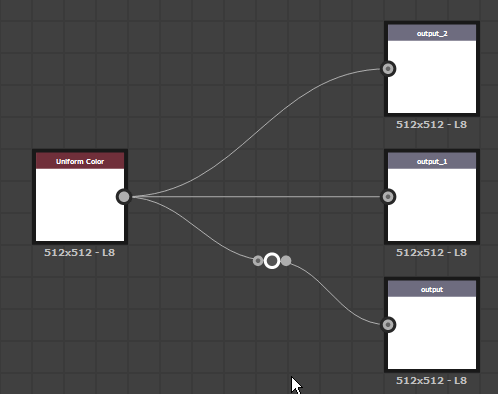

# ドットノード（ポータルも含む）

<table>
<tr style="border: 0;">
<td width="25.00%" style="border: 0;" valign="top">

</td>
<td width="100.00%" style="border: 0;" valign="top">

<b>ドット</b>ノードは、接続を再ルーティングおよびグループ化することでグラフを簡素化およびクリーンアップできるヘルパーです。 このオプションは、他のコネクションやノード上で多数の長いコネクションが実行されているグラフで特に便利です。

ドットノードのペアを<b>ポータル</b>として使用して、長距離を経由する接続を非表示にしたり、接続のルーティングが困難な場所で使用したりできます。

</td>
</tr>
</table>

## ドットノードの作成

ドットノードは、次のいずれかの方法で任意のグラフタイプに追加できます。

+++リンク上に挿入
<b>Alt</b>キーを押しながら接続をポイントすると、ドットノードのプレビューが表示されます。次に、[LMB]をクリックすると、その場所の接続にドットノードが追加されます。

{width="512px"}

+++

+++ノードコネクタ
<b>Alt</b>キーを押しながら、ノードコネクタから新しい接続をドラッグして、その場所にドットノードを挿入します。

新しい接続を引き続きドラッグし、この操作を繰り返して、その接続を任意にルーティングできます。

+++

+++ノードメニュー
<b>スペースバー</b>を押して<b>ノードメニュー</b>を表示し、「ドット」項目を選択するか、検索フィールドに「ドット」と入力して、項目を表示して素早く検索します。

+++

>[!TIP]
>
> ドットノードが作成されると、その「名前」プロパティは自動的にフォーカスを取得するので、ノードの名前をすぐに編集できます。

<table>
<tr style="border: 0;">
<td style="border: 0;" valign="top">

## リンクの結合

複数のノードのコネクションをマージするには、Altキーを押しながらリンク上にドットノードを移動します。

</td>
<td style="border: 0;" valign="top">

{width="512px"}

</td>
</tr>
</table>

## ポータル

<table>
<tr style="border: 0;">
<td width="16.67%" style="border: 0;" valign="top">

</td>
<td width="100.00%" style="border: 0;" valign="top">

ドットノードを<b>ポータル</b>として使用すると、読みやすさを損なう面倒な長いリンクを設定することなく、グラフ内の長距離にわたってデータを送信できます。 これにより、ドットノード間のリンクが効果的に非表示になります。

</td>
</tr>
</table>

### ポータルの作成

送信機と受信機の2つのドット・ノード間には、送信機のドット・ノードに名前を付けると、ポータルが自動的に作成されます。 ドットノードに名前を付けるには、<b>Name</b>プロパティに一意の識別子を設定します。

グラフ内に1つ以上の名前付きドットノードが存在する場合、任意のドットノードを受信側として接続するには、次の手順を実行します。

* 受信機の入力と送信機の出力の間にリンクを作成すること。
* 受信機の<b>Input Portal</b>プロパティで送信機の名前を選択しています。

受信機を複製またはコピーすると、送信機との接続がポータルとして保持されます。

### ポータルの識別

ポータルとして使用されるドットノードは、ポータルとして使用されるコネクタの横に無線信号アイコンが配置される。

ポータルとして使用されている任意のドットノードを選択すると、他のポータルへの非表示の接続が破線で表示されます。

### ポータルの削除

送信機の<b>Name</b>がクリアされた場合、または非表示の接続が次の方法で削除された場合、ポータルは削除されます：

* ポータルを選択し、非表示の接続を選択して削除します。
* 受信機を選択し、プロパティの<b>入力ポータル</b>の横にある<b>X</b>ボタンを押します。

>[!IMPORTANT]
>
> [FX-Mapグラフ](../../../../function-graphs/fxmaps/fxmaps.md)では、ポータルとしてドットノードを使用できません。

ポータルとしてのドットノードに関するこのチュートリアルをご覧ください。
