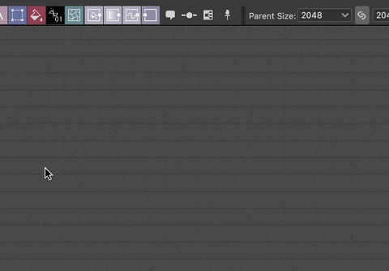
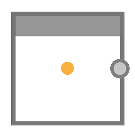

# フレーム

<table>
<tr style="border: 0;">
<td width="25.00%" style="border: 0;" valign="top">


</td>
<td width="100.00%" style="border: 0;" valign="top">

フレームでは、グラフ内のオブジェクトを視覚的にグループ化し、これらすべてのオブジェクトを簡単に一緒に動かすことで、グラフの読みやすさとレイアウトが向上します。

例えば、フレームに名前や色を付けて、概観したときにグラフの構造がはっきりと見えるようにすることができます。これは、グラフが複雑になるにつれて大きな助けとなります。

また、ノードに注釈を付けて、特定の方法でノードが設定された理由を説明するドキュメンテーションツールとして機能することもできます。

</td>
</tr>
</table>

## 外観

マウスカーソルの位置または選択範囲の一部であるかどうかに応じて、フレームが様々な表示スタイルで表示され、それとどのように相互作用できるかが示されます。

+++デフォルト
既定では、フレームは<b>フレームの色</b>プロパティで選択された色で塗りつぶされた、角が丸い四角形です。 そのカラーの暗いシェードがフレームのアウトラインに適用されます。

<b>Title</b>プロパティのタイトルセットは、フレームの左上隅にグレーで表示されます。


+++

+++ポイント時のヘッダー
フレームの上部にマウスポインターを置くと、ヘッダーバーが表示されます。

フレームは、ヘッダーバーまたはそのタイトルをドラッグして移動できます。


+++

+++選択済み
選択すると、フレームのタイトルとアウトラインが白でハイライトされます。 輪郭が太くなります。


+++

## フレームの作成

フレームは、次のいずれかの方法で、任意のグラフの種類に追加できます。

+++ノードメニュー
グラフビューの<b>スペースバー</b>を押して<b>ノードメニュー</b>を開き、一覧の[フレーム]をクリックします。

検索フィールドに「フレーム」と入力して、アイテムのサーフェスを表示し、すばやく検索することができます。

+++

+++ショートカット
[環境設定](../../../../interface/preferences-window/preferences-window.md)の「フレーム」項目にキーボードショートカットがマッピングされている場合は、グラフビューにフォーカスがあるときにそのショートカットを押します。

+++

+++コンテキストメニュー
グラフビューで、任意のオブジェクトまたは空の領域で<b>RMB</b>を押し、「<b>フレームを追加</b>」オプションを選択します。

+++

+++グラフツールバー
グラフビューツールバーで、<b>ノードパレット</b>の[フレーム]ボタンをクリックします。

+++

+++ライブラリ
ライブラリで、<b>グラフアイテム</b>カテゴリを選択し、「フレーム」アイテムをグラフビューにドラッグアンドドロップします。

+++

### フレームの選択範囲

フレームの作成時にグラフで選択範囲がアクティブになっていると、そのフレームは自動的に調整され、選択したオブジェクトが完全に含まれます。

そのため、キーボードショートカットを使用してフレームを作成すると、グラフのコンテンツのフレーム化がさらに高速になります。

{width="480px"}

>[!TIP]
>
> フレームを作成すると、その「タイトル」プロパティに自動的にフォーカスが移動するので、すぐにフレームのタイトルを編集できます。

## フレームの操作

<table>
<tr style="border: 0;">
<td style="border: 0;" valign="top">

フレームは、タイトルまたはヘッダーバーをドラッグすると<b>パン</b>され、境界線またはコーナーをドラッグすると<b>サイズ変更</b>されます。

この図では、パン（青）とサイズ変更（黄）の相互作用ゾーンが強調表示されています。

</td>
<td style="border: 0;" valign="top">


</td>
</tr>
</table>

<table>
<tr style="border: 0;">
<td style="border: 0;" valign="top">

### グリッドのスナップ

初期設定では、フレームを移動またはサイズ変更すると、中くらいのグリッドにスナップします。

<b>Ctrl</b> (Windows) / <b>Cmd</b> (macOS)キーを押したままにすると、このスナップが小さなグリッドに移動し、微調整が行われます。

</td>
<td style="border: 0;" valign="top">


</td>
</tr>
</table>

## プロパティ

フレームを選択すると、[プロパティ](../../../../interface/properties/properties.md)ドックで次のプロパティを使用できます。

+++タイトル
フレーム左上に配置されている<b>タイトル</b>。 <b>タイトルの表示</b>プロパティを使用して、タイトルの表示のオンとオフを切り替えることができます。

タイトルのサイズを最小限の画面サイズでロックして、グラフをズームアウトしてもタイトルが読みやすいようにすることができます。 これを行うには、[グラフビュー](../../../../interface/the-graph-view/the-graph-view.md)ツールバーの<b>情報</b>ドロップダウンで「フレームタイトル」オプションをオンにします。

{width="640px"}


+++

+++説明
<b>説明</b>は、フレームの内容に注釈を付けるために使用できるオプションの追加テキストです。

HTMLタグを使用してテキストをフォーマットできます。  <b>HTMLマークアップ</b>ボタンをクリックすると、この書式が切り替わります。

詳しくは、以下の説明セクションを参照してください。

{width="640px"}


+++

+++カラー
<b>フレームの色</b>は、グラフビューのフレームを塗りつぶすために使用されます。 カラーピッカーを使用して、任意のカラーを選択します。

カラーのアルファチャンネルはフレームの&#x200B;*不透明度*&#x200B;を制御します。値0は、フレームが完全に透明であることを意味します。

{width="640px"}


+++

## 説明

枠内に配置されるテキストで枠に注釈を付けることができます。 テキストは左揃えで配置され、フレームの左上隅から開始します。 フレームの[Description](#properties)プロパティを使用して、そのテキストを編集します。

<table>
<tr style="border: 0;">
<td style="border: 0;" valign="top">

### 標準

<b>タイトル</b>は、フレームの左上に太字で表示されます。 タイトルの表示/非表示を切り替えることができます。

画面サイズを最小限に抑えることで、グラフのズームアウト時に読みやすいサイズを維持できます。 これを行うには、[グラフビュー](../../../../interface/the-graph-view/the-graph-view.md)ツールバーの<b>情報</b>ドロップダウンで「フレームタイトル」オプションをオンにします。

</td>
<td style="border: 0;" valign="top">

{zoomable="yes"}

</td>
</tr>
</table>

<table>
<tr style="border: 0;">
<td style="border: 0;" valign="top">

### HTMLの書式設定

テキストは、枠の<b>Description</b>プロパティのHTMLタグを使用して書式設定できます。 同じプロパティの <b>HTMLマークアップ</b>ボタンを使用して、書式設定を有効にする必要があります。

</td>
<td style="border: 0;" valign="top">

{zoomable="yes"}

</td>
</tr>
</table>

このサンプルをフレームの「説明」プロパティにコピー&amp;ペーストして、この機能を自分でテストできます。

```
<h2>HTML formatting</h2>

<p>This is a description formatted using <b>HTML markup</b>.</p>

<p>Formattig text makes it more <i>pleasant</i>, <font color="#CC8822">impactful</font> and <code>clearly structured</code> for users.</p>

<p>  Images are also supported! <sup>How nice!</sup></p>
```


テキストの書式設定に役立つタグのリストを次に示します。

+++HTML書式タグ

|  |  |
| --- | --- |
| 太字 | &lt;b>...&lt;/b> |
| 斜体 | &lt;i>...&lt;/i> |
| カラー | &lt;font color=&quot;#4A567C&quot;>...&lt;/font> |
| 段落 | &lt;p>...&lt;/p> |
| 改行 | &lt;br> |
| 見出し | &lt;h1>...&lt;/h1>、&lt;h2>...&lt;/h2>など |
| 画像 | &lt;img src=&quot;{path\_to\_image}&quot;> |
| 上付文字 | &lt;sub>...&lt;/sub> |
| 番号なしリスト（箇条書き） | &lt;ul> &lt;li>...&lt;/li> &lt;li>...&lt;/li> &lt;/ul> |
| 番号付きリスト（番号） | &lt;ol> &lt;li>...&lt;/li> &lt;li>...&lt;/li> &lt;/ol> |
| コード | &lt;code>...&lt;/code> |


+++

## 包含ルール

オブジェクトが包含ルールを満たす場合、そのオブジェクトはフレームに含まれると見なされます。 これらの規則は、オブジェクトや特殊ケースによって異なります。 次に一覧を示します。

各イラストレーションの黄色の記号は、オブジェクトをフレームに含めるために、フレームの境界内に完全に収まる必要があるポイントまたは領域を表します。

+++ノード
<b>中心点</b>が使用されています。

ノードの下に表示されるバッジ、コネクタ、情報はすべて無視されます。

ノードのHeightは、入力コネクタまたは出力コネクタの数によって異なる場合があります。

コネクタの表示と非表示、追加、または削除を切り替えると、ノードのHeightが&#x200B;*中心*&#x200B;から調整されます。

したがって、ノードの中心点の位置は、*意図的に移動*&#x200B;するまで変更しないでください。


*host*&#x200B;ノードの<b>c</b><b>enter point</b>が使用されています。

ホストノードは、ノードがドッキングされているノードです。

複数のノードが1つのチェーンにドッキングされている場合、最後にドッキングされたノードのホストノードがチェーン全体に使用されます。

ノードの下に表示されるバッジ、コネクタ、情報はすべて無視されます。





+++

+++ドットノード
ドットの<b>中心点</b>が使用されます。

コネクタ、ポータルアイコン、および名前はすべて無視されます。


+++

+++コメント
コメントの&#x200B;*バウンディングボックス* （黄色のアウトライン）の<b>中心点</b>が使用されます。

親になったコメントは、コメントの含めるルールに従いません。

代わりに、*親*&#x200B;ノードの<b>中心点</b>が使用されます。

ノードの下に表示されるバッジ、コネクタ、情報はすべて無視されます。


+++

+++ピン
ピンアイコンの<b>ヒント</b>が使用されます。


+++

+++フレーム
入れ子になったフレームの<b>境界ボックス</b>が使用されています。

つまり、入れ子になったフレームを別のフレームの境界内に完全に含める必要があります。

タイトルは無視されます。


+++

## サイズをコンテンツに合わせる


グラフで調整を行っているときに、フレームの内容を適切に調整できない場合があります。 この場合、1つのミディアムグリッドセルのパディングで、フレームの位置とサイズをコンテンツのスパンに合わせて自動的に調整することができます。

これを行うには、フレームのタイトルまたはヘッダーバーの<b>人民元</b>をクリックし、「[アピアランス](#appearance)」を参照して、コンテキストメニューの「<b>コンテンツにサイズを合わせる</b>」オプションを選択します。

>[!NOTE]
>
> このオプションは、*1つ*&#x200B;以上のグラフオブジェクトがフレームの[包含ルール](../../../../interface/the-graph-view/graph-items/frame/frame.md)を満たしている場合に使用できます。

<table>
<tr style="border: 0;">
<td style="border: 0;" valign="top">

### 説明テキストを調整する

枠に説明が付いている場合は、可能であれば、説明の横の空白を使用するように調整されます。

フレームに収まるオブジェクトが含まれていない場合は、説明が収まるようにフレームのHeightが調整されます。

</td>
<td style="border: 0;" valign="top">


</td>
</tr>
</table>

+++例
"){width="640px"}


+++

## 自動拡張


グラフが大きくなると、フレームの内容の並べ替えが必要になる場合があります。 ノードを移動して追加するスペースを確保したり、コンテンツを読みやすくするためにより多くの間隔を空ける必要がある場合があります。

これらの調整を容易にするために、[インクルードされたオブジェクト](#inclusion-rules)を移動する際に、フレームを自動的に拡張することができます。<b>Shift</b>を押しながらオブジェクトを移動すると、オブジェクトが境界内に収まるように、フレームの境界線が自動的に調整されます。

これは、複数のオブジェクトを含む選択範囲にも適用されます。 その場合、各オブジェクトのホストフレームが同時に調整されます。

オブジェクトが枠の境界で完全に囲まれておらず、[包含の規則](#inclusion-rules)を満たしている場合は、<b>Shift</b>キーを押すと同時に、枠が完全に囲まれるように調整されて、中のグリッドセルの追加のパディングが行われます。

>[!NOTE]
>
> フレームの自動調整をトリガーまたはキャンセルするには、移動中の任意の時点で<b>Shift</b>キーを押すか離す必要がありますが、調整を効果的に適用するには、移動の完了時に&#x200B;*Shift*&#x200B;を押す必要があります。

+++例
"){width="640px"}


+++
