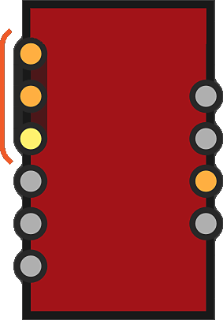
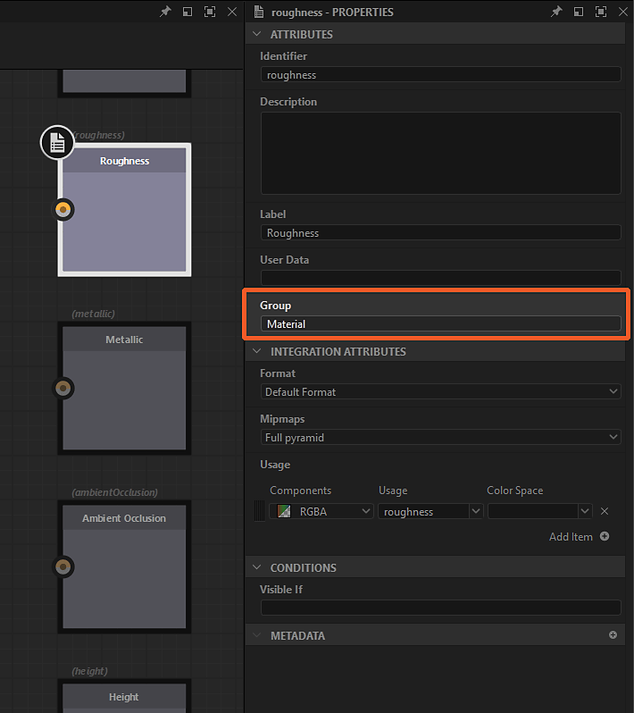

# リンク作成モード

[Substanceグラフ](../../../compositing-graphs/substance-compositing-graphs.md)では、3つの<b>リンク作成モード</b>のいずれかを使用してノードを接続できます。

<table>
<tr style="border: 0;">
<td style="border: 0;" valign="top">

{zoomable="yes"}

*クリックして拡大*

<b>標準</b> (1)

条件は適用されません。

</td>
<td style="border: 0;" valign="top">

{zoomable="yes"}

*クリックして拡大*

 <b>マテリアル</b> (2)

入力と出力は、それらの使用状況に基づいて照合されます。

2つのうちどちらか一方のみが使用されている場合、接続は標準モードと同様に実行されます。

</td>
<td style="border: 0;" valign="top">

{zoomable="yes"}

*クリックして拡大*

 <b>コンパクトマテリアル</b> (3)

マテリアルと同じです。

同じ&#x200B;*グループ*&#x200B;に属する入力と出力が折りたたまれています。

</td>
</tr>
</table>

 <b>リンク作成モード</b>ボタンをクリックするか、上記のキーボードショートカットを使用して、グラフツールバーでいつでもモードを切り替えることができます。

<b>マテリアル</b>および<b>マテリアルの最適化</b>モードでは、*用途が一致しない*&#x200B;入出力間の接続は禁止されています。

## モード

|  | 

 標準 | 

 コンパクト | 

 コンパクトマテリアル |
| --- | --- | --- | --- |
| <b>入力</b> | すべての入力が表示されます | すべての入力が表示されます | 1つのグループにつき1入力のみ |
| <b>出力</b> | すべての出力が表示されます | すべての出力が表示されます | グループあたり1つの出力のみ |
| <b>リンク</b> | すべてのリンクが表示されます | すべてのリンクが表示されます | 1つのグループにつき1つのリンクのみ（緑） |
| <b>接続</b> | リンクは1つずつ接続します | リンクは、一致する使用法に基づいてマルチリンクマテリアルグループとして接続します。   一方の端に使用法が存在する場合、接続は標準になります。 | リンクは、単一リンクのマテリアルグループとして接続します。 |

## グループの割り当て

<table>
<tr style="border: 0;">
<td width="100.00%" style="border: 0;" valign="top">

<b>マテリアル</b>および<b>コンパクトマテリアル</b>モードを使用するには、グラフの<b>入力</b>および<b>出力</b>ノードにグループを割り当てる必要があります。

ノードの<b>Attributes</b>パラメーターでグループを割り当てるには、<b>Group</b>プロパティにグループ名を入力します。 グループには任意の文字列値を指定できます。また、大文字と小文字を区別して&#x200B;*まったく同じ*&#x200B;のグループ名を共有する場合、リンクはグループ化されます。

グラフのグループ化された入力および出力は、そのグラフを参照するノードインスタンス上で&#x200B;*暗いカプセルに囲まれた*&#x200B;ことにより、視覚的に示されます。

</td>
<td width="25.00%" style="border: 0;" valign="top">

{zoomable="yes"}

</td>
</tr>
</table>

<table>
<tr style="border: 0;">
<td width="25.00%" style="border: 0;" valign="top">

</td>
<td width="100.00%" style="border: 0;" valign="top">

{zoomable="yes"}

*クリックして拡大*

</td>
<td width="25.00%" style="border: 0;" valign="top">

</td>
</tr>
</table>

## 使用状況と一致するリンク

リンクをグループ化したら、個々の入力を出力と一致させる必要があります。 これは、<b>Input</b>および<b>Output</b>ノードの<b>Usage</b>属性によって実行されます。 入力と出力の両方の&#x200B;*使用法が*&#x200B;に一致すると、リンクが作成されます。 一致する使用法が見つからない場合、リンクは作成されません。

<table>
<tr style="border: 0;">
<td width="25.00%" style="border: 0;" valign="top">

</td>
<td width="100.00%" style="border: 0;" valign="top">

{zoomable="yes"}

*クリックして拡大*

</td>
<td width="25.00%" style="border: 0;" valign="top">

</td>
</tr>
</table>
