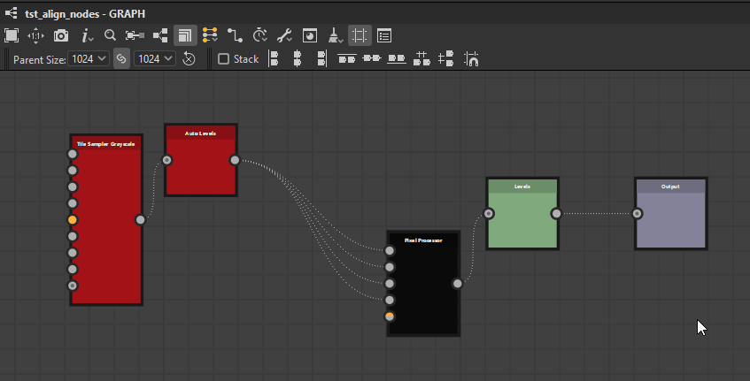
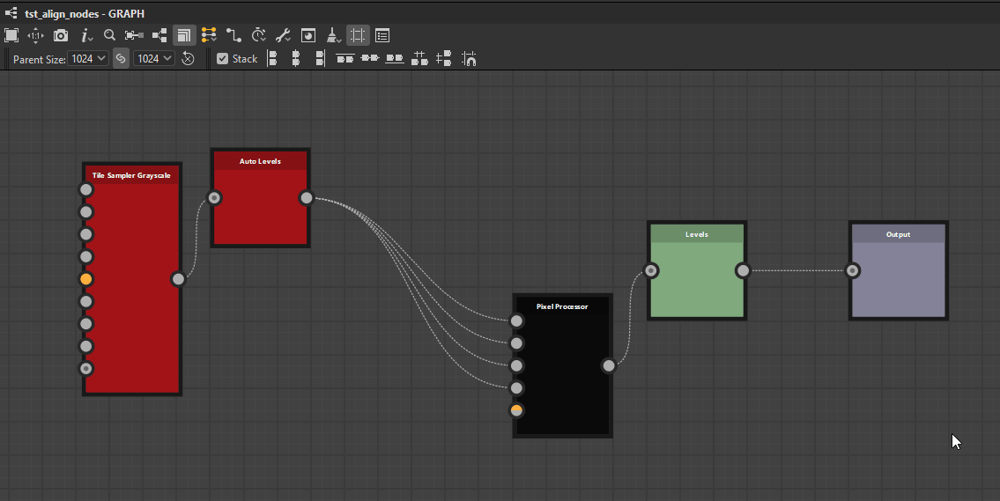
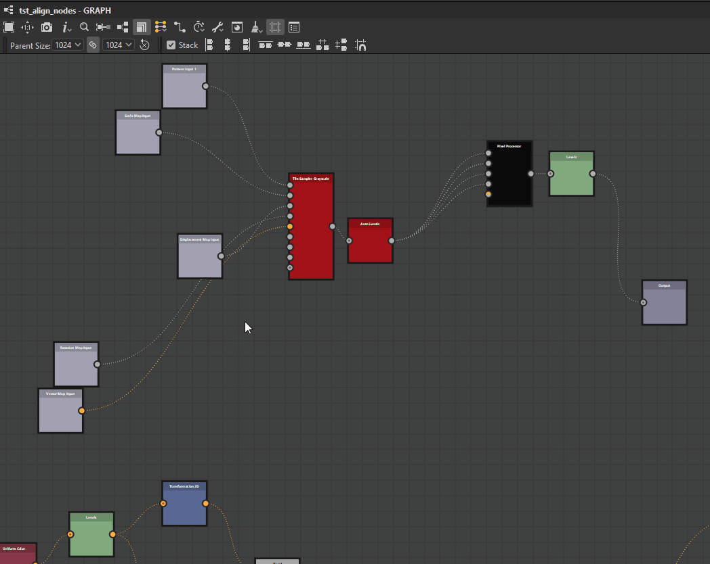
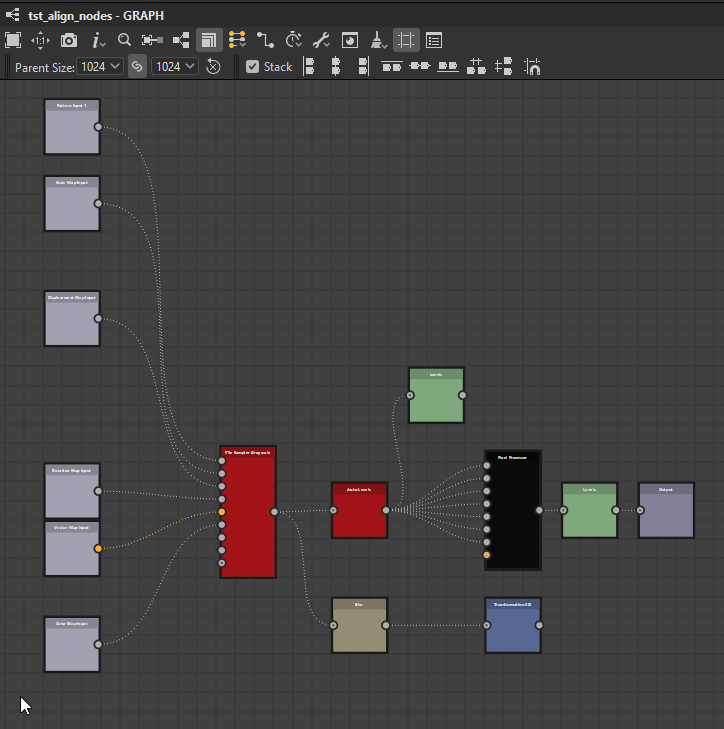

# ノード整列ツール

{zoomable="yes"}

ノード整列ツールを使用すると、ノードをグラフに配置して、読みやすさとオーサリングの操作性を向上させることができます。 ノードを整列したり、均等に配置したり、グリッドにスナップするアクションを提供します。

これらは、現在選択されている<b>ノードにのみ</b>作用します。

>[!NOTE]
>
> キーボードショートカット
> 
> 一部のアクションには、クイックアクセス用のキーボードショートカット(H、V、S)があります。以下のアクションのリストでは、括弧の間に表示されています。
> 
> これらは、ノードに割り当てられた[キーボードショートカット](../../../interface/preferences-window/preferences-window.md)を上書きすることに注意してください。

## 線形

節点は、各軸に次の3つのモードを使用して、水平および垂直に位置合わせできます。

### 平面線形

<b>左：</b>選択したノードの左側を左端のノードの左側に揃えます。

<b>中心(H):</b>選択したノードの水平方向の中心を、ノードを囲むバウンディングボックスの水平方向の中心に合わせます。

<b>右：</b>選択したノードの右側を右端のノードの右側に揃えます。

<table>
<tr style="border: 0;">
<td style="border: 0;" valign="top">

{zoomable="yes"}

*残り*

</td>
<td style="border: 0;" valign="top">

{zoomable="yes"}

*中心*

</td>
<td style="border: 0;" valign="top">

{zoomable="yes"}

*右*

</td>
</tr>
</table>

### 垂直線形

<b>上：</b>選択したノードの上の面を一番上のノードの上の面に合わせます。

<b>中央(V):</b>選択したノードの垂直方向の中心を、ノードを囲むバウンディングボックスの垂直方向の中心に合わせます。

<b>下：</b>選択したノードの下の辺を一番下のノードの下の辺に揃えます。

<table>
<tr style="border: 0;">
<td style="border: 0;" valign="top">

{zoomable="yes"}

*上位*

</td>
<td style="border: 0;" valign="top">

{zoomable="yes"}

*中央*

</td>
<td style="border: 0;" valign="top">

{zoomable="yes"}

*下*

</td>
</tr>
</table>

### スタック

<b>スタック </b>オプションを使用すると、アラインメントを使用する際に<b>重なりを避ける</b>ことができます。 デフォルトでは有効になっています。

有効にすると、ノードは選択範囲内の別のノードと衝突するまで、参照位置に可能な限り移動します。 これにより、各ノード間で1つの中間グリッドセルのマージンで、選択した軸に効果的にそれらを積み重ねることができます。

{zoomable="yes"}

## 配布

目的の軸上の現在の選択範囲の各端にあるノード間で、ノードを均等に分散できます。

<b>水平方向：</b>選択範囲の左端のノードと右端のノードの間に均等に配置されます。

<b>縦方向：</b>選択したノードの最上位ノードと最下位ノードの間にノードが均等に配置されます。

ディストリビューションの目的は、ノードのサイズに関係なく、ノード間の<b>均等間隔</b>です。

複数のノードの中心が選択した軸に完全に揃っている場合、それらのノードは残り、分布内で<b>1として扱われます</b>。 調整されたノードの&#x200B;*最大*&#x200B;は、等間隔の計算に使用されます。

選択したノードの合計サイズが選択した軸で使用可能なスペースより大きい場合、オーバーラップが発生する可能性があることに注意してください。

<table>
<tr style="border: 0;">
<td width="58.33%" style="border: 0;" valign="top">

{zoomable="yes"}

*水平方向*

</td>
<td width="100.00%" style="border: 0;" valign="top">

{zoomable="yes"}

*垂直方向*

</td>
</tr>
</table>

<table>
<tr style="border: 0;">
<td width="58.33%" style="border: 0;" valign="top">

## グリッドのスナップ

<b>スナップ(S) </b>操作は、選択した各ノードを移動させて、左上隅が中間グリッド上の最も近い点に配置されるようにします。

</td>
<td width="100.00%" style="border: 0;" valign="top">

{zoomable="yes"}

</td>
</tr>
</table>
