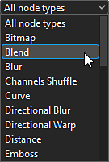
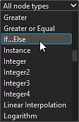
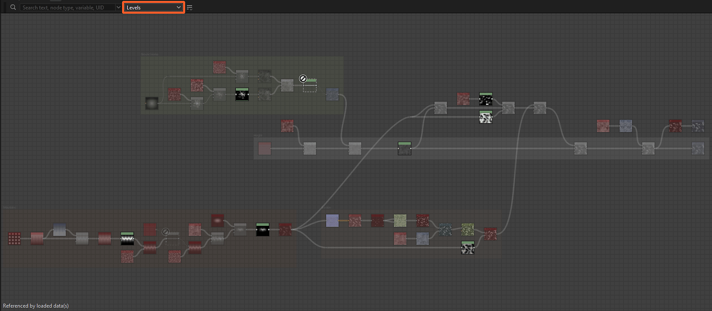
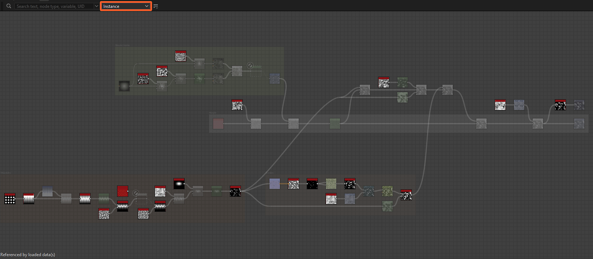
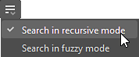
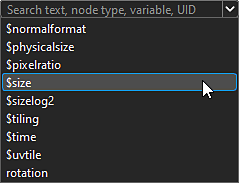
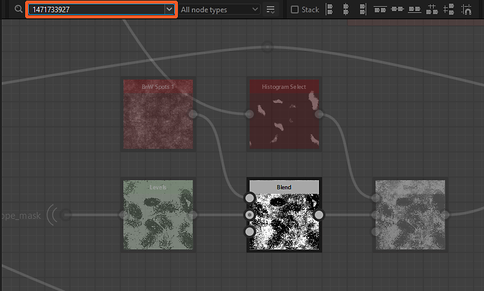

# ノードファインダー

{zoomable="yes"}

ノードファインダーツールを使用すると、テキストクエリを使用して<b>ノードおよび変数の検索</b>を実行できます。 クエリに一致しないすべてのノードがグレー表示され、結果が表示されなくなります。

クエリは次のいずれかの条件に一致します。

* インスタンス化によって参照されているグラフの<b>識別子</b>
* ノードパラメーター関数で使用される表示されるパラメーターまたは変数の<b>識別子</b>
* ノードの<b>UID</b> （一意の識別子）
* ノードの<b>ラベル</b>

検索は[グラフインスタンス](../../../compositing-graphs/creating-compositing-gra/graph-instances-sub-gra/graph-instances-sub-graphs.md)を繰り返しトラバースできるため、ノードおよび変数を[サブグラフ](../../../compositing-graphs/creating-compositing-gra/graph-instances-sub-gra/graph-instances-sub-graphs.md)全体で検索できます。 検索する用語が正確にわからない場合は、あいまいな検索オプションを使用してクエリに許容値を適用できます。

## インターフェイス

ノード・ファインダには、次の2つの方法でアクセスできます。

グラフビューで、<b>Ctrl+F</b> (Windows) / <b>Cmd+F</b> (macOS)を押してNode Finderツールバーを表示し、クエリフィールドに自動フォーカスを設定します。 これにより、すばやく検索を実行できます。

グラフビューツールバーで、<b>[ノードファインダー]ボタン</b>をクリックして[ノードファインダー]ツールバーを表示します。 表示されたツールバーは、このボタンをクリックすることによってのみ閉じられます。

<b>トラバースグラフを検索します</b>。 つまり、次の操作でグラフを開くと、検索がアクティブなままになります。

* インスタンス化:コンテキスト内の参照を開く(Ctrl+E / Cmd+E) （*注：*&#x200B;コンテキスト内のグラフ編集は、編集/環境設定/グラフで有効にする必要があります）
* ピクセルプロセッサー：機能を編集(Ctrl+E/Cmd+E)
* バリュープロセッサー：機能を編集(Ctrl+E/Cmd+E)
* FX-Map:FX-Mapグラフを編集(Ctrl+E/Cmd+E)
* ノードパラメータ：関数の編集

{zoomable="yes"}

### 検索クエリ

{zoomable="yes"}

このフィールドに検索語を入力すると、矢印ボタンにより、現在のコンテキストで使用可能な変数の一部を含むクエリ候補のリストが開きます。

実行できるクエリの詳細については、以下の[クエリの検索](#search-query)セクションを参照してください。

### ノードタイプ

{zoomable="yes"}

このコンボボックスを使用すると、検索結果をフィルター処理して、特定の種類のノードのみを保持できます。

すべてのインスタンスノードはノードの&#x200B;*同じ型*&#x200B;で、実際には&#39;instance&#39;型ですが、アトミックノードはそれぞれ独自の型です。

+++ノード型リスト
このリストは、現在のグラフタイプのコンテキストに応じて変化します。

{zoomable="yes"}

*グラフを合成するためのノードの種類*

{zoomable="yes"}

*関数グラフのノードの種類*

+++

+++アトミックノードの検索
{zoomable="yes"}

*Substanceグラフで&#39;レベル&#39;ノードの種類を検索しています*

+++

+++インスタンスノードの検索
{zoomable="yes"}

*Substanceグラフで&#39;Instance&#39;ノード型を検索しています*

{zoomable="yes"}

*Substance関数グラフで&#39;Instance&#39;ノード型を検索しています*

+++

### 検索オプション

<table>
<tr style="border: 0;">
<td width="100.00%" style="border: 0;" valign="top">

<b>検索オプションボタン</b>をクリックすると、検索に使用する設定の一覧が開きます。この一覧の表示と非表示を切り替えることができます。

これらのオプションについて詳しくは、以下の「検索オプション」セクションを参照してください。

</td>
<td width="33.33%" style="border: 0;" valign="top">

{zoomable="yes"}

</td>
</tr>
</table>

## 検索クエリ

ノードを検索するには、次に示すノードプロパティに対してテキストクエリが照合されます。

>[!NOTE]
>
> クエリは、次の点に注意して入力する必要があります。
> 
> * 検索では、大文字と小文字は区別されません。 例：「マイノードラベル」と「マイノードラベル」は同じ結果を返します。
> * クエリの前後の空白は無視されます。
> * 同じグラフで複数のクエリを同時に実行することはできません。 例：「レベルぼかし」は「レベル」と「ぼかし」の両方のノードと一致しません。 同様に、論理演算子もサポートされていません。

<table>
<tr style="border: 0;">
<td width="100.00%" style="border: 0;" valign="top">

### インスタンスグラフ識別子

[インスタンスノード](../../../compositing-graphs/creating-compositing-gra/graph-instances-sub-gra/graph-instances-sub-graphs.md)は、参照するグラフの<b>識別子</b>を使用して見つけることができます。

</td>
<td width="33.33%" style="border: 0;" valign="top">

{zoomable="yes"}

*画像をクリックして拡大*

</td>
</tr>
</table>

+++エクスプローラーのID
グラフは、ExplorerのID別に一覧表示されます。

{zoomable="yes"}

+++

+++インスタンスノードのツールチップの識別子
インスタンスノードのツールチップには、参照されるグラフの識別子が含まれます。

{zoomable="yes"}

+++

<table>
<tr style="border: 0;">
<td width="100.00%" style="border: 0;" valign="top">

### 公開されたパラメーターと変数

[公開されたパラメーター](../../../compositing-graphs/manage-parameters/exposing-a-parameter/exposing-a-parameter.md)のIDまたはその他の変数は、直接検索できます。

</td>
<td width="33.33%" style="border: 0;" valign="top">

{zoomable="yes"}

*画像をクリックして拡大*

</td>
</tr>
</table>

+++クエリの候補
クエリフィールドを展開すると、候補のリストが表示されます。

これには、現在のグラフの種類で使用できる[組み込み変数](../../../function-graphs/variables/system-variables/system-variables.md)と、グラフの公開パラメーターの識別子が含まれます。

{zoomable="yes"}

公開されたパラメーターのIDは、[Substanceグラフプロパティ](../../../compositing-graphs/graph-parameters/graph-parameters.md)で直接コピーまたは編集することもできます。

{zoomable="yes"}

*画像をクリックして拡大*

+++

+++コンソールの警告/エラーからの変数の検索
ノードによって使用される<b>変数</b>によってグラフにエラーまたは警告が発生した場合、<b>ウィンドウ/コンソール</b>に移動して、変数を含む完全なエラー/警告メッセージを表示します。 次に、この変数をコピーしてNode Finderのクエリフィールドに貼り付けると、問題の原因となっているノードをすばやく見つけることができます。

任意のテキストエディターを使用して、SBSファイルのXMLデータから変数を直接コピーすることもできます。

{zoomable="yes"}

+++

+++ノードの取得/設定
グラフ内の変数（公開されたパラメーターを含む）を検索すると、[Get](../../../function-graphs/nodes-reference-for-fun/atomic-function-nodes/get-nodes/get-nodes.md)または[Set](../../../function-graphs/fxmaps/using-functions-in-fxmaps/using-the-set-sequence/using-the-set-sequence-nodes.md)ノードが、ノードのパラメーター関数のいずれかでその変数を使用しているすべてのノードが強調表示されます。

{zoomable="yes"}

+++

<table>
<tr style="border: 0;">
<td width="100.00%" style="border: 0;" valign="top">

### ノードUID

グラフ内の各ノードには、そのノードの検索に使用できる一意のUID（識別番号）があります。

</td>
<td width="33.33%" style="border: 0;" valign="top">

{zoomable="yes"}

*画像をクリックして拡大*

</td>
</tr>
</table>

+++ノードのUIDのコピー
ノードのUIDは、コンテキストメニューからクリップボードにコピーできます。

このアクションにより、UIDが次の形式でコピーされます。

uid=1234567890

{zoomable="yes"}

+++

+++コンソールからのノードUIDの検索に関する警告/エラー
グラフにノードによって発生したエラーまたは警告がある場合は、ウィンドウ/コンソールに移動して、ノードの<b>UID</b>を含む完全なエラー/警告メッセージを表示します。 次に、このUIDをコピーしてNode Finderのクエリフィールドに貼り付けると、問題の原因となっているノードをすばやく見つけることができます。

また、任意のテキストエディターを使用して、SBSファイルのXMLデータからノードUIDを直接コピーすることもできます。

{zoomable="yes"}

+++

### ノードラベル

ノードは、ラベルを使用して検索することもできます。

ファジー検索をオフにして正確なラベルを使用すると、特定のノードの検索が特に効果的です。

## 検索オプション

<table>
<tr style="border: 0;">
<td width="100.00%" style="border: 0;" valign="top">

<b>検索オプションボタン</b>をクリックすると、ノードを検索するための<b>再帰的</b>および<b>ファジー</b>モードを切り替えることができます。

両方を同時に有効にすることができます。

</td>
<td width="33.33%" style="border: 0;" valign="top">

{zoomable="yes"}

</td>
</tr>
</table>

### 再帰モード

[グラフインスタンス](../../../compositing-graphs/creating-compositing-gra/graph-instances-sub-gra/graph-instances-sub-graphs.md)を検索し、[サブグラフ](../../../compositing-graphs/creating-compositing-gra/graph-instances-sub-gra/graph-instances-sub-graphs.md)の結果を含めるようにするには、このオプションを有効にします。

このオプションは、コンソールの警告またはエラーメッセージから取得したUIDでノードを検索する必要がある場合に、グラフのトラブルシューティングを行う際に重要になります。

{zoomable="yes"}

*右側のクエリは、以下のインスタンスノードを強調表示しています。これは、左側の参照グラフがそのクエリと一致するためです*

+++例1
{zoomable="yes"}

インスタンスノードは、複数のノードがクエリに一致するグラフを参照します。

+++

+++例2
{zoomable="yes"}

「再帰検索」オプションを有効にすると、ピクセルプロセッサノードがクエリに一致する変数を使用しているグラフを参照するインスタンスノードがハイライトされます。

+++

### ファジーモード

クエリの正確なスペルがわからない場合、このオプションを使用すると結果で<b>許容範囲</b>が有効になります。

このオプションを使用すると、結果として望ましくない結果が生じる可能性があることに注意してください。

{zoomable="yes"}
