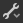

# グラフビュー

このページでは、Substance 3D Designerのグラフビューのドックを表示します。

グラフビューは、[Substance 3D Designer](https://www.adobe.com/jp/products/substance3d-designer.html)のメインウィンドウで、グラフを作成および編集します。 グラフビューには、主に2つの領域があります。上部にあるツールバーでは、特定の機能にすばやくアクセスできます。また、実際にノードが配置されているグラフ領域もあります。

グラフビューはすべての種類のグラフで使用されますが、主にツールバー領域で、[Substanceグラフ](../../compositing-graphs/substance-compositing-graphs.md)、[関数グラフ](../../function-graphs/function-graphs.md)および[FX-Mapグラフ](../../function-graphs/fxmaps/fxmaps.md)の間で少し異なります。

## ビューポートナビゲーション

グラフは、次のアクションを使用してナビゲートできます。

* <b>パン：</b> MMB / Ctrl + RMB
* <b>ズーム：</b>マウスホイール/ Alt + RMB

トラックパッドの使用（macOSのみ）

* <b>パン： </b>2本指でのスワイプ
* <b>ズーム：</b> Cmdを押しながら2本指でピンチ/ 2本指でスワイプ

>[!NOTE]
>
> ズーム方向
> 
> 各ズーム方法は、他の方法と反転する：
> 
> * マウスホイールを上げてグラフビューを&#x200B;*引っ張る*
> * Alt + RMBを押しながら上にドラッグすると、グラフビューが&#x200B;*プッシュ*&#x200B;されます
> 
> ズーム方向は、[環境設定](../../interface/preferences-window/preferences-window.md)で反転できます。

Fキーを使用して、選択したノードまたは何も選択されていない場合はグラフ全体に<b>フォーカス</b>します。

<b>ナビゲーションピン</b>とF2キーを使用して、ナビゲーションを行うこともできます。以下の[グラフアイテム](#graph-items)を参照してください。[。](../../interface/the-graph-view/graph-items/graph-items.md)

## オブジェクトの移動

オブジェクト（ノードまたはグラフ項目）のLMBをクリックし、カーソルを押したままドラッグしてグラフの周囲で<b>ノードを移動</b>します。 複数のオブジェクトが選択されている場合は、選択されているすべてのオブジェクトがカーソルの下のオブジェクトと一緒に移動します。

オブジェクトの移動中にカーソル<b>がグラフビューの境界線</b>に達すると、カーソルの方向にビューがパンされます。 カーソルが境界からさらに離れるほど、パンが速くなることに注意してください。\
これは、グラフビューの境界を越えて選択ボックスを描画する場合にも適用されます。

既定では、オブジェクトを移動すると、<b>グリッドにスナップ</b>されます。 Ctrlキー(Windows)または⌘キー(macOS)を押しながらオブジェクトを移動すると、スナップが無効になります。

## グラフ項目

グラフの整理やナビゲーションに役立つヘルパーオブジェクトがいくつか用意されています。特に、ノードの複雑なネットワークに変化して読みにくくなる場合に便利です。

<b>ドットノード</b>では、接続のルート変更と結合が可能で、<b>ポータル</b>として使用して、長い接続または扱いにくい接続を非表示にすることができます。

<b>フレーム</b>は、目に見えるタイトルと色分けのあるノードをグループ化するのに役立ちます。

<b>コメント</b>を使用すると、ノードまたはノードのグループの目的を追跡し、その他の役立つ注釈を追加できます。

<b>ナビゲーションピン</b>を使用すると、グラフ内の目的のポイントにすばやくジャンプできます。

>[!NOTE]
>
> 詳しくは、このドキュメントの[グラフ項目](../../interface/the-graph-view/graph-items/graph-items.md)セクションを参照してください。

## グラフのコンテキストメニュー

グラフの空き領域でRMBをクリックすると、コンテキストメニューが表示され、次のオプションを選択できます。

<b>ノードの追加：</b>グラフにノードを追加するには、ノードメニューを開きます。

<b>コメントを追加：</b>親のない[コメント](../../interface/the-graph-view/graph-items/graph-items.md)グラフオブジェクトを追加します。

<b>フレームの追加：</b> [フレーム](../../interface/the-graph-view/graph-items/graph-items.md)グラフオブジェクトを追加します；

<b>ピンの追加：</b> [ピン](../../interface/the-graph-view/graph-items/graph-items.md)グラフオブジェクトを追加します；

<b>ドットノードの追加：</b> [ドット](../../interface/the-graph-view/graph-items/graph-items.md)ノードの追加；

<b>3Dビューで出力を表示：</b>用途を一致させることで、グラフのすべての出力を[3Dビュー](../../interface/3d-view/3d-view.md)のマテリアルに割り当てます。以下の[3Dビューとの対話](#interacting-with-the-3d-view)を参照してください。

<b>3Dビューで出力をリセットして表示する：</b> [3Dビュー](../../interface/3d-view/3d-view.md)のマテリアルをリセットし、用途に合わせてグラフのすべての出力をそのマテリアルに割り当てます。以下の[3Dビューとの対話](#interacting-with-the-3d-view)を参照してください。

<b>出力を2Dビューで表示：</b>グラフの出力の1つを[2Dビュー](../../interface/2d-view/2d-view.md)で表示します。以下の[2Dビューとの対話](#interacting-with-the-2d-view)を参照してください。

<b>ノードサムネイルの計算：</b>グラフ内のすべてのノードの結果の計算をトリガーし（これは[画像キャッシュ](../../interface/preferences-window/preferences-window.md)に保存されます）、最初の出力をサムネイルとして使用します。

<b>ノードのサムネイルをクリア：</b>グラフ内のすべてのノードの結果を含む[画像キャッシュ](../../interface/preferences-window/preferences-window.md)をクリアします。これにより、ノードのサムネイルがクリアされます。

<b>パッケージの保存：</b>このグラフを含むパッケージを保存します。

<b>貼り付け：</b>クリップボードに現在コピーされているノード（上流接続を含む）をカーソルの位置に貼り付けます。 カーソルがグラフビューのビューポートにない場合、ノードはビューポートの中心に配置されます。

<b>リンクなしで貼り付け：</b>クリップボードに現在コピーされているノード（アップストリーム接続を除く）をカーソルの位置に貼り付けます。 カーソルがグラフビューのビューポートにない場合、ノードはビューポートの中心に配置されます。

<b>すべて選択：</b>グラフ内のすべてのノードを選択します。

<b>前のピン：</b>グラフ内の前の[ピン](../../interface/the-graph-view/graph-items/graph-items.md)オブジェクトに移動します。

<b>次のピン：</b>グラフ内の次の[ピン](../../interface/the-graph-view/graph-items/graph-items.md)オブジェクトに移動します。

<b>選択範囲のコピー：</b>選択したノード、接続、およびパラメーター値をクリップボードにコピーします。

<b>選択範囲の削除：</b>選択したノードを削除します；

<b>削除して再リンク：</b>選択したノードを削除し、可能であればアップストリームノードからダウンストリームノードに直接接続して置き換えます。

<b>選択範囲の複製：</b>選択したノードを、上流の接続を含めて同じグラフのカーソルの位置に複製します。 カーソルがグラフビューのビューポートにない場合、ノードはビューポートの中心に配置されます。

<b>リンクなしで選択を複製：</b>カーソルの位置で、選択したノードを同じグラフに複製します（上りの接続を除く）。 カーソルがグラフビューのビューポートにない場合、ノードはビューポートの中心に配置されます。

<b>上位ノードの選択：</b>選択したノードの上位にあるすべてのノードを選択します。

<b>ダウンストリームノードの選択：</b>選択したノードのダウンストリームのすべてのノードを選択します。

<b>リンクの入れ替え\*:</b>選択した入力コネクタと出力コネクタのペアの接続を入れ替えます。

<b>ノード/選択を無効にする：</b>選択したノードを無効にして、ストリームの結果に影響を与えないようにします。以下の<b>ノードを無効にする</b>を参照してください。

<b>\*:</b>選択に2つのリンク、または2つのノードが同じ3番目のノードの入力に接続されている3つのノードが含まれている場合にのみ使用できます。

## ノードの操作

グラフは主に、データを取り込んで生成し、変更してグラフの結果として出力できるノードのコンテナです。 ノードを使用するには、次の概念とアクションが必要です。

### ノードの作成と管理

ノードは、グラフの種類に関係なく、次の5つの方法でグラフに配置できます。

* ノードツールバーのアイコンをクリックまたはドラッグします（以下を参照）。 [アトミックノード](../../compositing-graphs/nodes-reference-for-com/atomic-nodes/atomic-nodes.md)のみをこのように配置できます。
* ノードの空の領域を右クリックし、<b>[グラフの追加]</b>を選択します。 [アトミックノード](../../compositing-graphs/nodes-reference-for-com/atomic-nodes/atomic-nodes.md)のみをこのように配置できます。
* サムネールをライブラリビューからグラフビューにドラッグします。 このメソッドは、ノードインスタンス[&#128279;](../../compositing-graphs/nodes-reference-for-com/node-library/node-library.md)を含むすべての種類のノードに対して機能します。
* <b>スペースバー</b>を押して、<b>ノードメニュー</b>にアクセスします。 以下を参照してください。
* ノードにマップされたキーボードショートカットを使用します。 マッピングは[環境設定ウィンドウ](../../interface/preferences-window/preferences-window.md)で実行されます。

別のノードを選択したときにノードが配置された場合、Designerは新しいノードを古いノードに自動的に接続しようとします。\
この自動接続により、古いノードの&#x200B;*後*&#x200B;の新しいノードが常にフローに配置されます。

ノードの削除は、失われたリンクの処理方法に応じて、次の2つの方法で行うことができます。

* ノードを選択してDeleteキーを押すか、右クリックして<b>選択範囲を削除</b>を選択します。 これにより、既存のすべての接続が切断され、機能が失われる可能性があります。
* ノードを選択してBackspaceキーを押すか、右クリックして<b>削除して再リンク</b>を選択します。 これにより、可能な場合はリンクを維持し、機能が損なわれないようにします。

<table>
<tr style="border: 0;">
<td width="100.00%" style="border: 0;" valign="top">

### ノードメニュー

ノードの<b>スペースバー</b>を押すと、グラフビューメニューが表示されます。

このメニューを使用すると、検索インターフェイスを介して[ライブラリ](../../interface/the-library/the-library.md)内のすべてのノードにアクセスでき、お気に入りのノードを使用して一覧の一番上に表示できます。

矢印キーを使用して検索結果を確認できます。 リスト&#x200B;*ループ*&#x200B;で、最初のアイテムで上向き矢印キーを使用すると最後のアイテムに移動します。

検索は&#x200B;*ファジー*&#x200B;です。つまり、検索語に小さな違いがあることは認められます。 例：「カラー」と「カラー」、「ノーマライズ」と「ノーマライズ」など

グラフで&#x200B;*single*&#x200B;ノードが選択されている場合、またはノードメニューをドラッグしてノードコネクターを生成した場合、検索結果は出力の種類に基づいて自動的に&#x200B;*フィルター*&#x200B;されます。\
たとえば、種類がグレースケールの[プライマリ入力](../../compositing-graphs/inheritance-compositing/inheritance-in-substance-compositing-graphs.md)を持つノードのみが、種類がグレースケールの出力に対して一覧表示されます。

</td>
<td width="33.33%" style="border: 0;" valign="top">

</td>
</tr>
</table>

### ノードの選択

1つまたは複数のノードを選択して、コピー、削除、グラフ上での移動などを行うことができます。

*単一*&#x200B;ノードを選択するには、ノード上にカーソルを置き、[LMB]をクリックします。

*複数*&#x200B;ノードを選択するには、次の方法を使用できます：

* <b>1つずつ：</b> Ctrlキーを押しながらノードのLMBをクリックします。 選択されていないノードは選択範囲に&#x200B;*追加*&#x200B;されますが、選択されたノードは選択範囲から&#x200B;*削除*&#x200B;されます。
* <b>選択ボックス：</b>グラフの空き領域でLMBをクリックし、*マウスボタンを押したまま*&#x200B;カーソルをドラッグして選択ボックスを描画します。 LMBを解放するときに、ボックス内のノード&#x200B;*少なくとも部分的に含まれている*&#x200B;が選択されています。
* <b>アップストリーム：</b>ノードのRMBをクリックして、<b>アップストリームノードの選択</b>オプションを選択します。ノードと、ノードの&#x200B;*入力*&#x200B;に接続されているストリームの一部であるすべてのノードが選択されます。
* <b>ダウンストリーム：</b>ノード上のRMBをクリックして、<b>ダウンストリームノードの選択</b>オプションを選択します。ノードおよびノードの&#x200B;*出力*&#x200B;に接続されているストリームの一部であるすべてのノードが選択されます。

### ノードコンテキストメニュー

ノード上のRMBをクリックすると、コンテキストメニューが表示され、次のオプションを含めることができます。

<b>出力を2Dビューで表示：</b>ノードの出力の1つを[2Dビュー](../../interface/2d-view/2d-view.md)で表示します。以下の[2Dビューとの対話](#interacting-with-the-2d-view)を参照してください。

<b>3Dビューで表示</b>：一致する使用法を使用して、ノードのすべての出力を[3Dビュー](../../interface/3d-view/3d-view.md)のマテリアルに割り当てます。以下の[3Dビューとの対話](#interacting-with-the-3d-view)を参照してください。

<b>3Dビューでリセットして表示：</b> [3Dビュー](../../interface/3d-view/3d-view.md)のマテリアルをリセットし、用途に合わせてノードのすべての出力をそのマテリアルに割り当てます。以下の[3Dビューとの対話](#interacting-with-the-3d-view)を参照してください。

<b>3Dビューで出力を表示\*:</b>用途に合わせて、[3Dビュー](../../interface/3d-view/3d-view.md)のマテリアルに特定のノード出力を割り当てます。

<b>コメントを追加：</b> [コメント](../../interface/the-graph-view/graph-items/graph-items.md)グラフオブジェクトを作成し、このノードの親にします。

<b>フレームの追加：</b> [フレーム](../../interface/the-graph-view/graph-items/graph-items.md)グラフオブジェクトを作成し、選択したノードに合わせます。

<b>情報をクリップボードにコピーします：</b>ノードの一意の識別子(UID)をクリップボードにコピーします。

<b>パラメーターの公開：</b>このノードの[ノードパラメーターの公開](../../compositing-graphs/manage-parameters/exposing-a-parameter/exposing-a-parameter.md)ダイアログを表示します；

<b>作成\*:</b>このノードの入力および/または出力ごとに入力および/または出力ノードを作成します。

<b>参照を開く\*:</b>このノードによって参照されているグラフ[を別のグラフビューのタブとして読み込みます。](../../compositing-graphs/creating-compositing-gra/graph-instances-sub-gra/graph-instances-sub-graphs.md)

<b>コンテキストで参照を開く\*\*:</b>現在のグラフのコンテキストで、このノードによって参照されているグラフ[を既存の[グラフビュー]タブのブレッドクラムとして読み込みます。](../../compositing-graphs/creating-compositing-gra/graph-instances-sub-gra/graph-instances-sub-graphs.md)

<b>選択範囲からグラフを作成：</b>選択したノードを新しいグラフにコピーします。

<b>選択範囲のコピー：</b>選択したノード、接続、およびパラメーター値をクリップボードにコピーします。

<b>選択範囲の削除：</b>選択したノードを削除します；

<b>削除して再リンク：</b>選択したノードを削除し、可能であればアップストリームノードからダウンストリームノードに直接接続して置き換えます。

<b>選択範囲の複製：</b>選択したノードを、上流の接続を含めて同じグラフに複製します。

<b>リンクなしで選択を複製：</b>選択したノードを、アップストリーム接続を除いて同じグラフに複製します。

<b>上位ノードの選択：</b>選択したノードの上位にあるすべてのノードを選択します。

<b>ダウンストリームノードの選択：</b>選択したノードのダウンストリームのすべてのノードを選択します。

<b>リンクの入れ替え\*\*\*:</b>選択した入力コネクタと出力コネクタのペアの接続を入れ替えます。

<b>ノード/選択を無効にする：</b>ストリームの結果に影響を与えないように、ノードまたは選択したノードを無効にします。以下の<b>ノードを無効にする</b>を参照してください。

<b>\*</b>: [グラフインスタンス](../../compositing-graphs/creating-compositing-gra/graph-instances-sub-gra/graph-instances-sub-graphs.md)ノードでのみ使用できます。\
<b>\*\*:</b> [環境設定](../../interface/preferences-window/preferences-window.md)で「<b>コンテキスト内の編集を有効にする</b>」オプションがオンになっている場合は、[グラフインスタンス](../../compositing-graphs/creating-compositing-gra/graph-instances-sub-gra/graph-instances-sub-graphs.md)のノードでのみ使用できます。\
<b>\*\*\*:</b>選択に2つのリンク、または2つのノードが同じ3番目のノードの入力に接続されている3つのノードが含まれている場合にのみ使用できます。

>[!IMPORTANT]
>
> カーソルを&#x200B;*ノード上*&#x200B;に置いたときに&#x200B;*RMB*&#x200B;がクリックされた場合、グラフで他のノードが現在&#x200B;*選択*&#x200B;されているかどうかに関係なく、これらのコンテキストメニューオプションのいくつかが&#x200B;*その*&#x200B;ノードをターゲットにします。
> 
> したがって、予測可能な結果を得るには、コンテキストメニューのアクションを使用して、実際にターゲットにする選択の一部であるノードにカーソルを常に配置することをお勧めします。

### ノードの接続

ノードAの&#x200B;*出力コネクタ*&#x200B;は、別のノードBの&#x200B;*入力コネクタ*&#x200B;に接続できます。これにより、ノードBは、計算を実行するためにAによって出力されたデータを使用することになります。

>[!NOTE]
>
> ノードのすべてのコネクタは、必ずしも接続されている必要はありません&#x200B;**。 コネクタを非表示のままにすると、次のようになります。
> 
> * *input*&#x200B;コネクタの場合：ノードは、その入力に設定された既定値に戻ります。
> * *output*&#x200B;コネクタの場合：グラフの計算時にデータは無視され、破棄されます。

*任意の順序*&#x200B;で、各コネクタの[LMB]をクリックして、新しいリンクを<b>作成</b>できます。\
また、ノードAが選択されている状態でノードBが作成された場合、ノードAの&#x200B;*最初の出力*&#x200B;はノードBの&#x200B;*プライマリ入力*&#x200B;に自動的に接続されます。

次の操作は、*既存*&#x200B;リンクで実行できます：

<b>削除：</b>リンク上のLMBをクリックして&#x200B;*削除*<b>&#x200B;または</b>を押すか、リンクがある接続をAltキーを押しながらクリックして、リンクを削除します。 Altキーを押しながらクリックすると、その接続上のすべてのリンクが削除されます。

<b>複製：</b> Ctrlキーを押しながらカーソルのLMBをクリックしてコネクターをドラッグし、リンクを複製します。 別のコネクターでLMBをクリックしてリンクを接続します。

<b>移動：</b> Shiftキーを押しながらカーソルのLMBをクリックしてコネクターをドラッグすると、リンクを選択してコネクター間を移動できます。 別のコネクターで「LMB」をクリックしてリンクを接続します。

### ノードの無効化

>[!NOTE]
>
> これは、[Substanceグラフ](../../compositing-graphs/substance-compositing-graphs.md)にのみ適用されます。

ノードを無効にして、グラフに&#x200B;*効果なし*&#x200B;にすることができますが、切断したり削除したりする必要はありません。

無効になっているノードの動作は次のとおりです。

*  <b>無効</b>バッジ&#x200B;*、* a *破線のアウトライン*、サムネイルの代わりに内部の*再ルーティング*リンクが表示されます。
* ノードは、*メイン入力*&#x200B;で受信したデータを出力します。
* 無効なノードは&#x200B;*チェーン*&#x200B;できます。
* プロパティと接続は&#x200B;*変更されていません*;
* 無効な状態は&#x200B;*保存*&#x200B;されており、セッション間で維持されます。
* SBSARに公開する場合、結果のファイルはノードの無効な状態を&#x200B;*考慮*&#x200B;します。つまり、表示されたものが取得されます。

<b>Shift + D</b>のキーストロークを使用するか、ノードを右クリックしてコンテキストメニューの<b>Disable node/Disable selection</b>をクリックすると、選択したグラフのノードまたはグループを無効にできます。

>[!IMPORTANT]
>
> 次の条件に一致するノードのみを無効にできます：
> 
> * ノードには少なくとも&#x200B;*1つの入力*&#x200B;があります
> * ノードには&#x200B;*1つの出力*&#x200B;しかありません
> * メイン入力と出力の&#x200B;*型*&#x200B;は&#x200B;*一致*&#x200B;する必要があります（グレースケールからグレースケール、色から色など）
> * 選択したすべてのノードの状態が&#x200B;*同じである*&#x200B;必要があります。つまり、すべてのノードを有効にする必要があり、有効にする場合も同じルールが適用されます

{width="512px"}

## 2Dビューを操作する

>[!NOTE]
>
> これは、[Substanceグラフ](../../compositing-graphs/substance-compositing-graphs.md)にのみ適用されます。

[2Dビュー](../../interface/2d-view/2d-view.md)でノードの出力を表示するには、ノードでLMBをダブルクリックするか、ノードでRMBをクリックし、コンテキストメニューの[2Dビューで出力を表示](#interacting-with-the-2d-view)オプションを選択します。 ノードに複数の出力がある場合は、サブメニューから目的の出力を選択します。

[グラフビュー](https://substance3d.adobe.com/)の空の領域で右マウスボタンをクリックし、コンテキストメニューの[2Dビューで出力を表示](#interacting-with-the-2d-view)オプションを選択すると、2Dビューで任意のグラフ出力を表示できます。 グラフに複数の出力がある場合は、サブメニューから目的の出力を選択します。

## 3Dビューの操作

>[!NOTE]
>
> これは、[Substanceグラフ](../../compositing-graphs/substance-compositing-graphs.md)にのみ適用されます。

[3Dビュー](../../interface/3d-view/3d-view.md)でノード出力を適用するには、ノードのRMBをクリックし、コンテキストメニューの<b>3Dビューで表示</b>オプションを選択します。 ノードに複数の出力がある場合は、サブメニューから目的の出力を選択します。 次に、3Dビューで現在使用されているシェーダのターゲットチャンネルを選択します。

（*[Substanceグラフ](../../compositing-graphs/substance-compositing-graphs.md)のみ*） 3Dビューのすべてのグラフ出力を適用するには、グラフビューの空の領域で右マウスボタンをクリックし、コンテキストメニューの<b>3Dビューで出力を表示</b>オプションを選択します。 グラフに1つ以上の[Output](../../compositing-graphs/nodes-reference-for-com/atomic-nodes/output/output.md)ノードが存在し、[正しく設定](../../compositing-graphs/nodes-reference-for-com/atomic-nodes/output/output.md)されていることを確認してください。

## ツールバー

>[!NOTE]
>
> 完全な一覧は、[Substanceグラフ](../../compositing-graphs/substance-compositing-graphs.md)にのみ適用されます。 他の種類のグラフには、これらのオプションの&#x200B;*制限付きセット*&#x200B;があります。

### グラフツール

メインツールバーは、すべてのグラフタイプに含まれており、一般的な機能を提供するとともに、他のツールバーを表示するかどうかを切り替えることができます。 次の関数が用意されています。

 <b>フォーカスの選択</b> (F)\
選択範囲にフォーカスを合わせるか、選択範囲が空の場合はシーン全体をフォーカスします。

 <b>ズームのリセット</b> (Z)\
現在のズームレベルをデフォルトの状態に戻し、ビューをグラフの中央に配置します。 ズームインまたはズームアウトです。

 <b>グラフビューのエクスポート\
</b>グラフ全体を1:1の解像度で画像としてエクスポートします。 グラフ全体のスクリーンショットを共有する場合に便利です。

 <b>ノード情報\
</b>*– コネクタ名の表示：*&#x200B;ノード上の各コネクタの名前の表示を切り替えます。\
*– ノードバッジの表示：*&#x200B;すべてのノードのノードバッジを切り替えます。\
*– ノードサイズの表示：*&#x200B;ノード解像度の表示を切り替えます（[Substanceグラフ](../../compositing-graphs/substance-compositing-graphs.md)のみ）。\
*– 表示タイミング：*&#x200B;各ノードのミリ秒のタイミングの表示を切り替えます（[Substanceグラフ](../../compositing-graphs/substance-compositing-graphs.md)のみ）。\
*– ズームアウト時に文字の拡大を制限する：* [グラフ項目](../../interface/the-graph-view/graph-items/graph-items.md)の文字は、ズームのしきい値を超えて一定の画面サイズに維持され、ズームアウト時に文字が明確に表示されます。

<b>ノードファインダー</b> (Ctrl+F)\
ツールがグラフ内のノード、公開されたパラメーター、その他の変数を検索できるようにします。 詳細については、[専用ページ](../../interface/the-graph-view/node-finder/node-finder.md)を参照してください。

 <b>フローの強調表示\
</b>現在選択されているノードの前または後に接続されているノードをハイライト表示します。 ノードの複雑なパスをトレースするのに適しています。

 <b>ノードパレット\
</b>ノードツールバーの表示と非表示を切り替えます。以下を参照してください。

 <b>長方形のリンク\
</b>ノード間の丸みを帯びたリンクまたは四角形のリンクを切り替えます。 [FX-Maps.](../../compositing-graphs/nodes-reference-for-com/atomic-nodes/fx-map/fx-map.md)では使用できません

 <b>ノードの配置ツール\
</b>選択したノードをグラフに配置します。 詳細については、[専用ページ](../../interface/the-graph-view/node-alignment-tools/node-alignment-tools.md)を参照してください。

[Substanceグラフ](../../compositing-graphs/substance-compositing-graphs.md)のみ：

 <b>親ページサイズ\
</b>親解像度コントロール設定の表示を切り替えます。以下を参照してください。

 <b>リンク作成モード</b> (1、2、3)\
標準(1)、マテリアル(2)、コンパクトノード(3)のいずれかのリンク作成モードを選択して、マテリアル コネクターを個別にまたはバッチでリンクします。 詳細については、[専用ページ](../../interface/the-graph-view/link-creation-modes/link-creation-modes.md)を参照してください。

 <b>タイミング制御\
</b>すべてのノードをリセットし、すべてのタイミングをリセットできます。

 <b>ツール\
</b>*– クリーン：* [Output](../../compositing-graphs/nodes-reference-for-com/atomic-nodes/output/output.md)ノードに接続されていないストリームの一部であるすべてのノードを削除します。\
*– エクスポート出力：* [ビットマップエクスポートインターフェイス](../../compositing-graphs/exporting-bitmaps/exporting-bitmaps.md)を開きます。\
*– 出力の再エクスポート：*&#x200B;前のエクスポート操作を再実行します。\
*- PSDエクスポータ：* [PSDエクスポータ](../../compositing-graphs/exporting-psd-files/exporting-psd-files.md)インターフェイスを開きます。

 <b>ノードイメージキャッシュ\
</b>ノードイメージキャッシュの表示を切り替えます。以下を参照してください。

未使用ノードの削除\
</b>使用されていないノードを削除するためのオプションをグラフに表示します。以下を参照してください。

### ノードパレット

ノードツールバーは、グラフの種類によって異なります。

 
<b>[Substanceグラフ](../../compositing-graphs/substance-compositing-graphs.md):</b> [原子ノード](../../compositing-graphs/nodes-reference-for-com/atomic-nodes/atomic-nodes.md)および[グラフ項目](../../interface/the-graph-view/graph-items/graph-items.md)を参照してください。

 
<b>[Substance関数のグラフ](../../function-graphs/function-graphs.md):</b> [グラフ項目](../../interface/the-graph-view/graph-items/graph-items.md)を参照してください。

 
<b>[FX-Mapグラフ](../../compositing-graphs/nodes-reference-for-com/atomic-nodes/fx-map/fx-map.md):</b> [グラフアイテムを参照してください。](../../interface/the-graph-view/graph-items/graph-items.md)

### 親ページサイズ

このツールバーは[Substanceグラフ](../../compositing-graphs/substance-compositing-graphs.md)でのみ使用でき、グラフの&#x200B;*親*&#x200B;の[出力サイズ](../../compositing-graphs/output-size/output-size.md)を設定します。グラフで&#x200B;*親に対する相対パス* [継承メソッド](../../compositing-graphs/inheritance-compositing/inheritance-in-substance-compositing-graphs.md)を使用する場合は、グラフの出力サイズに影響します。

水平方向および垂直方向のサイズはデフォルトでリンクされていますが、正方形ではないテクスチャの場合は&#x200B;*リンク解除*&#x200B;できます。 また、デフォルト値の256 x 256にリセットすることもできます。

### ノードイメージキャッシュ

[Substanceグラフ](../../compositing-graphs/substance-compositing-graphs.md)のノードを計算するときにキャッシュの使用を切り替えます。

ノードが計算されると、出力イメージはメモリ（キャッシュ）に保存されます。そのため、このノードが変更の影響を受けない場合は、グラフの再計算時に&#x200B;*再利用*&#x200B;できます。 つまり、実際に変更された部分だけが再計算されます。

このキャッシュのメモリ記憶域の制限は、<b>メモリ</b>セクションの[環境設定](../../interface/preferences-window/preferences-window.md)の<b>一般</b>セクションで変更できます。

このオプションを有効にすると、グラフ計算の全体的な応答性が大幅に向上しますが、Designerのメモリ使用量が大幅に増加します。

### 未使用ノードを削除

グラフを繰り返して試してみると、最終的な結果に影響を与えない一部のノードが取り残される可能性があります。 グラフレンダリングの最初の段階ですべてのノードが評価されるため、乱雑さと無駄な計算が増えます。

未使用のノードを削除</b>ツールは、*出力*&#x200B;ノードで終了するストリームの&#x200B;*部分ではなく*&#x200B;部分のすべてのノードを削除します。 唯一の例外は&#x200B;*input*&#x200B;ノードです。これを削除すると、このグラフを参照する[インスタンスノード](../../compositing-graphs/creating-compositing-gra/graph-instances-sub-gra/graph-instances-sub-graphs.md)のインターフェイスが変更されるためです。

最初のオプションでは、*現在*&#x200B;グラフに対してクリーニングが排他的に適用されます。

現在のグラフが[Substanceグラフ](../../compositing-graphs/substance-compositing-graphs.md)の場合、2番目のオプションが有効になり、*すべてのノードパラメーター関数*&#x200B;をクリーンアッププロセスに含めることができます。 これは、ノードパラメーター値を制御する[関数グラフ](../../function-graphs/function-graphs.md)に未使用のノードがある場合、そのグラフも同じルールに従ってクリーンアップされることを意味します。

クリーニングが完了すると、レポートダイアログが表示されます。 `GraphCleaner`にタグ付けされたログの詳細については、<b>コンソール</b>で確認できます。 これらのログには、グラフおよびパラメータ関数ごとに削除されたノードの数が含まれます。

影響を受けたすべてのグラフのクリーンアップは、*単一*&#x200B;の操作で元に戻すことができます。
