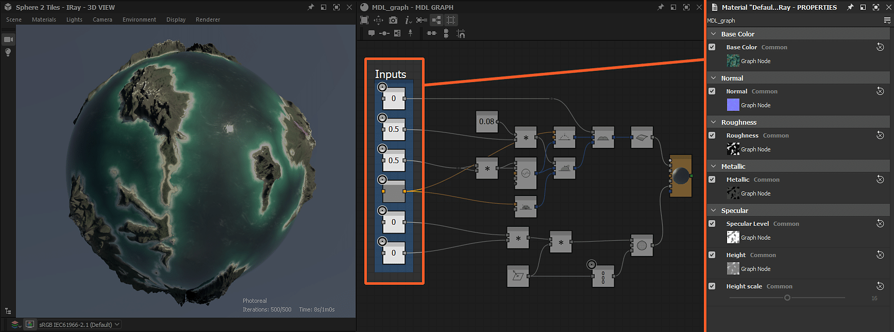
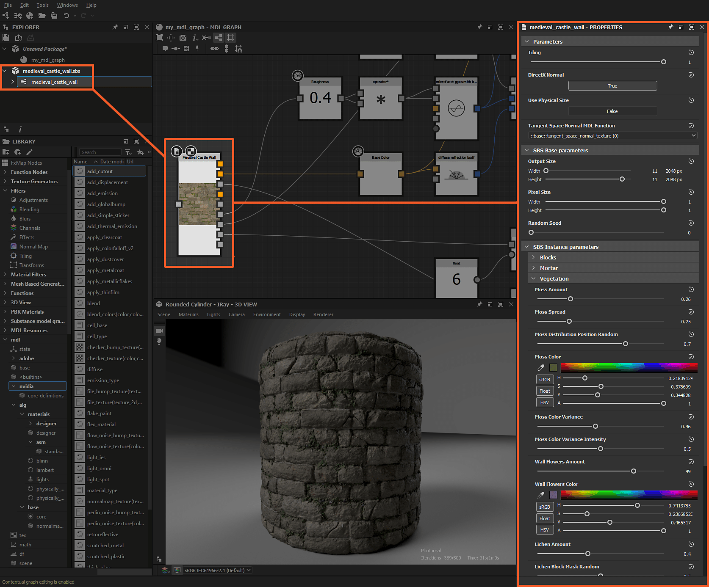

# SubstanceグラフとMDL資料

このページでは、[Substanceグラフ](../../compositing-graphs/substance-compositing-graphs.md)とMDLグラフの相乗効果、およびSubstanceグラフ[出力](../../compositing-graphs/nodes-reference-for-com/atomic-nodes/output/output.md)からMDLグラフ入力へのテクスチャの接続方法について説明します。

## 概要

Substanceグラフの出力は、2つの方法でMDL素材の公開パラメーターに&#x200B;*渡すことができます*。

現在3Dビューで適用されているMDLマテリアルに&#x200B;*[varying](../../mdl-graphs/main-mdl-graph-concepts/main-mdl-graph-concepts.md)*&#x200B;の公開パラメーターがある場合 – この型は[公開パラメーター](../../compositing-graphs/manage-parameters/exposing-a-parameter/exposing-a-parameter.md)のプロパティの<b>型修飾子</b>オプションを使用して設定される可能性があり、これらは&#x200B;*テクスチャ*&#x200B;に接続できます：

* <b>Color</b>パラメーターをRGBAテクスチャに接続できます
* グレースケールテクスチャの<b>フロート</b>パラメーター

その場合、生の均一値は、変化する値を提供するテクスチャサンプラーに置き換えられます。 これらのサンプラーには、公開されたパラメーターで<b>usage</b>属性が定義されています。この使用状況により、DesignerはSubstanceグラフによって出力されたテクスチャを&#x200B;*用途の一致*&#x200B;によりMDLマテリアル内の適切なパラメーターに接続できます。

## 3DビューでのSubstanceグラフ

Substanceグラフで<b>[3Dビューで出力を表示]</b>オプションを使用するか、Substanceグラフを<b>エクスプローラー</b>パネルから<b>3Dビュー</b>にドラッグすると、出力は、現在3Dビューで表示されているMDLマテリアル内の&#x200B;*対応する使用法*&#x200B;の公開パラメーターに接続されます。

Substanceグラフの個々のテクスチャは、IDにかかわらず、SubstanceグラフノードでRMBを押して3Dビューにドラッグすることで、テクスチャサンプリングをサポートする任意のMDLマテリアルパラメータにコネクトすることができます。 使用可能なサンプラーの使用法のリストが表示され、選択したテクスチャのターゲット使用法を選択できます。

*Substanceグラフによって出力されたテクスチャは、3DビューでMDLグラフの公開パラメーターに接続されています*

## MDLグラフのSubstanceグラフ

Substanceグラフのインスタンスを<b>エクスプローラー</b>パネルからMDLグラフにドラッグすると、MDLグラフに直接配置できます。 <b>Substance 3Dファイル</b> (SBS)と<b>Substance 3Dアセットファイル</b> (SBSAR)の両方のSubstanceグラフをMDLグラフで使用できます。

+++Substance 3Dファイル(SBS)からのSubstanceグラフ

MDL graph *の[Substance 3Dファイル](../../getting-started/overview/overview.md) (SBS)の*[ Substanceグラフ](../../compositing-graphs/substance-compositing-graphs.md)インスタンス

+++

+++Substance 3Dアセット(SBSAR)のSubstanceグラフ

*[MDLグラフの[Substance 3Dアセット](../../getting-started/overview/overview.md) (SBSAR)の](../../compositing-graphs/substance-compositing-graphs.md)インスタンス*

+++

Substanceグラフインスタンスが作成されると、次の機能を持つ&#x200B;*ノード*&#x200B;として表示されます：

* グラフの出力ごとに&#x200B;*型指定された出力*&#x200B;コネクタ。 出力データは次のように入力されます。
  * RGBAビットマップ：カラー（可変）
  * グレースケールビットマップ：浮動小数点（可変）
  * 値：値のタイプと一致させます（可変）
* Substanceグラフで出力されるテクスチャのマップに使用するUV座標を指定するためのUV座標型の&#x200B;*入力*。 接続しないままにしておくと、デフォルト値はUV空間のXとYのクラシック0-1線形グラデーションになります
* ノードはSubstanceグラフラベルの後に&#x200B;*ラベル付け*&#x200B;されます（ラベルが定義されていない場合はID）。最初のビットマップ出力はサムネールになります

ノードプロパティを使用すると、Substanceグラフの&#x200B;*すべての動的プロパティ*&#x200B;を変更できます。

* 出力サイズ
* ランダムシード
* 入力パラメーター
* …

ノードのプロパティでは、MDLマテリアルでのテクスチャの&#x200B;*マッピング*&#x200B;方法に固有のパラメーターも設定できます。

* タイリング
* 物理サイズを使用
* 法線形式
* タンジェントスペース

Substanceグラフインスタンスノードの出力は、MDLグラフ内の一致するタイプの任意のノード入力に接続することができる。

<b>SBSベースパラメーター</b>セクションのパラメーターを変更する場合、<b>Substanceエンジン</b>を使用し、MDLグラフの計算上に&#x200B;*Substanceオーバーヘッド*&#x200B;を必要とする1つ以上のパフォーマンスグラフ出力を再計算する必要があります。 3Dビューで適用されたMDLグラフでインスタンス化された&#x200B;*Substanceグラフを変更*&#x200B;すると、パフォーマンスに影響が出ると予想されます。

>[!WARNING]
>
> MDLグラフでSubstanceグラフを使用する場合、MDLグラフのエクスポートには、Substanceグラフ出力をビットマップにベイクする処理が含まれます。このビットマップは、エクスポートされたMDLファイルにバンドルされたテクスチャとしてエクスポートされます。 つまり、書き出されたMDLファイルでSubstanceグラフのパラメトリックな特性が&#x200B;*失われた*&#x200B;ということです。
