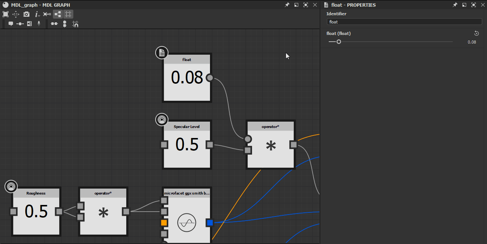

# MDLグラフでのパラメータの表示

このページでは、グラフの&#x200B;*その他のノード*&#x200B;または&#x200B;*外部ソース*&#x200B;によって提供される値およびテクスチャに接続できるように、MDLグラフにパラメーターを公開するプロセスについて説明します。

*ノード入力の公開された状態*

## ノード入力の公開

ほとんどの場合、ノードのプロパティの&#x200B;*入力コネクタ*&#x200B;を公開して、グラフ内の他のノードによって&#x200B;*値が設定されるようにすることができます*。 これはMDLグラフのワークフローの&#x200B;*重要*&#x200B;な部分であり、よく理解されている必要があります。

<b>グラフビュー</b>でノードを選択すると、そのプロパティが<b>プロパティ</b>パネルに表示されます。 ほとんどのプロパティは、ラベルの右側にボタンのセットと共に表示されます。

* **値を新しいノードにコピーし、このパラメーターにリンクします**：このプロパティの&#x200B;*入力コネクタ*&#x200B;を作成し、このプロパティの現在の値を出力する&#x200B;*新しいノード*&#x200B;に接続します
* **このパラメーターの入力ピンを作成**：このプロパティの&#x200B;*入力コネクタ*&#x200B;を作成します
* **このパラメーターを既定値にリセットします**：このプロパティの入力コネクタに値が接続されていない場合、値は既定値にリセットされます

*ノード入力の操作*

最初の2つのボタンのいずれかをクリックすると、*入力コネクタ*&#x200B;がノードに追加されます。 ノードのプロパティは、このコネクタの&#x200B;*接続状態*&#x200B;に対応しています：

* **接続されていません**:パラメーターは&#x200B;**プロパティ**&#x200B;パネルでまだ調整可能で、このパネルでの値の入力は&#x200B;*適用*&#x200B;されています
* **接続済み**:パラメーターは&#x200B;**プロパティ**&#x200B;パネルで調整できなくなりました。このパネルで入力された値は、*入力コネクタ*&#x200B;で受け取った値に&#x200B;*置き換えられ*&#x200B;ます。プロパティを既定値にリセットすることはできません

**このパラメーターの入力ピンを作成**&#x200B;ボタンをもう一度クリックして、入力コネクタを&#x200B;*削除*&#x200B;できます。 その時点で、プロパティ値は&#x200B;**プロパティ**&#x200B;パネルで設定された値に戻ります。

*公開されたノードパラメーター*

## グラフ入力の表示

MDLグラフでは、値を出力するノードを公開することで、グラフレベル（つまりMDLマテリアル入力パラメータとして表示）にパラメータを公開します。

表示できるノードのコンテキストメニューに<b>表示</b>オプションがあります。 ほとんどの場合、これらは値または浮動小数、カラー、テクスチャ座標などのデータを生成するノードです。

ノードのコンテキストメニューの

ノードのコンテキストメニューの&#x200B;*「表示」オプション*

表示されるパラメーターは、グラフのプロパティではなく、*表示されたノード*&#x200B;で直接構成されています。 表示されるパラメーターのプロパティは次のとおりです。

* <b>識別子</b>：現在のグラフ内のこの入力パラメーターの一意の名前
* <b>既定値</b>：このパラメーターの既定値です。 Designerでの入力パラメーターの表示の&#x200B;*プレビュー*&#x200B;として使用することもできます。 <b>表示名</b>、<b>グループ内</b>および<b>範囲</b>プロパティは、可能な限り正確なプレビューを行うために使用されます
* <b>範囲</b>:
  * *ソフト範囲*：このパラメーターの表示に使用するウィジェットの既定の範囲（スライダーなど）を設定します。 このプロパティはインターフェイス専用で、ソフト範囲を超える値は手動で入力できます
  * *ハード範囲*：このパラメーターで許容される値の範囲を設定します。 範囲に収まらない値は最小値に固定され、範囲に収まらない値は最大値に固定されます。 パラメーターのデフォルト値とソフト範囲の値は、この範囲内に収まるように&#x200B;*自動的に調整*&#x200B;されます。
* <b>説明</b>:パラメーターの説明
* <b>グループ</b>：この入力パラメーターが属するパラメーターグループ。 空白でない場合、パラメーターは、グループの名前を持つ折りたたみ可能セクションの一部としてDesignerに表示されます
* <b>表示名</b>:インターフェイスに表示されるパラメーター名
* <b>隠しファイル</b>: Trueに設定すると、パラメーター入力およびグラフープロパティでMDL マテリアルーが表示されません
* <b>ガンマの種類</b>：このパラメーターに接続されたテクスチャーから値をサンプリングするときに使用する必要があるガンマです
* <b>既定で表示</b>：一部のパラメーターが非表示になっている可能性がある場合に、MDL統合でこのパラメーターを表示するかどうかを設定します
* <b>型修飾子</b>：値が均一であるか可変であるかを設定します。 autoに設定した場合、パラメーターは入力からこのプロパティを継承します（例えば、浮動小数値の場合：テクスチャに接続されている場合は均一、浮動小数に接続されている場合は変化します）
* <b>Samplerの使用状況</b>:パラメーターの使用状況の識別子。複数の出力がMDL マテリアルに一度に接続される場合に、*適切なテクスチャーを接続*&#x200B;するために使用されます。 たとえば、[グラフ](../../compositing-graphs/substance-compositing-graphs.md)を3DビューのMDL マテリアルに接続する場合、テクスチャは使用識別子に合わせて正しい入力に接続されます。

>[!WARNING]
>
> グラフ入力は&#x200B;*node*&#x200B;レベルで構成されるように設定されていますが、[グラフプロパティ](../../mdl-graphs/creating-an-mdl-graph/creating-an-mdl-graph.md)の&#x200B;**グラフ入力**&#x200B;セクションで&#x200B;*グラフ*&#x200B;レベルで順序が管理されます。

*ノードをグラフ入力に表示しています*
