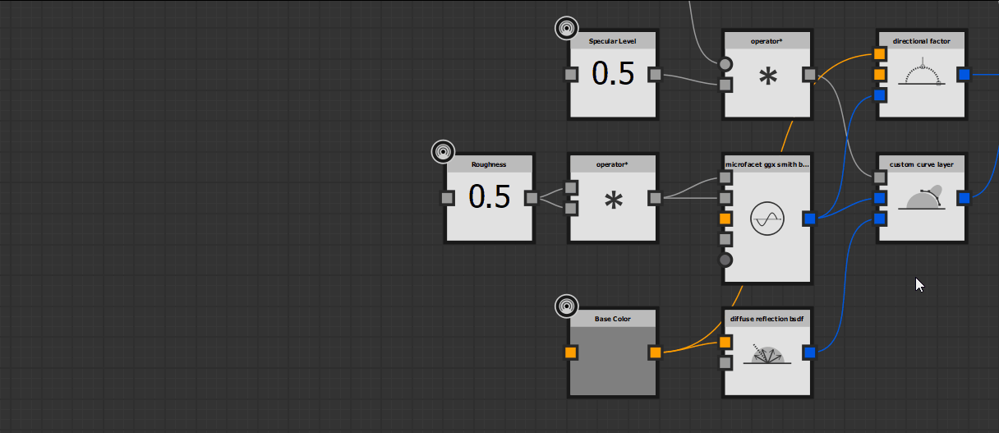

# MDLグラフの主な概念

このページでは、*具体的*&#x200B;から[MDLのグラフ](../../mdl-graphs/mdl-graphs.md)までの主要な概念を説明します。このグラフの種類をSubstance 3D Designerで最大限に活用するために理解しておく必要があります。

<table>
<tr style="border: 0;">
<td style="border: 0;" valign="top">

## Iray

MDLマテリアルでは、物理ベースのレンダリングソリューション用の記述が使用されます。これは、Designerに埋め込まれた[Iray](../../interface/3d-view/iray/iray.md)レンダラーでサポートされています。 したがって、MDLグラフ&#x200B;*の結果を表示するには、アクティブな[3Dビュー](../../interface/3d-view/3d-view.md)パネルでIrayレンダラー*&#x200B;を選択する必要があります。

</td>
<td style="border: 0;" valign="top">

</td>
</tr>
</table>

MDLグラフを作成または読み込むと、Designerによって最初に検出された[ピン留めされていない](../../interface/customizing-your-wor/customizing-your-workspace.md) 3Dビューパネルが&#x200B;*自動的に* Iray[&#128279;](../../interface/3d-view/iray/iray.md)レンダラーに切り替わります。 使用できる3Dビューがない場合は、*新しい* 3Dビューパネルが作成され、Irayレンダラーに切り替えられ、編集中のMDLマテリアルのレンダリングがホストされます。

3DビューパネルでIrayレンダラーが選択されている場合、そのパネルの「マテリアル」メニューで、使用可能なMDLマテリアルを切り替えることができます。これには、エクスプローラーパネルに読み込まれるマテリアルと、DesignerのMDLライブラリ内のマテリアルが含まれます。 IrayでのMDLマテリアルの操作について詳しくは、このドキュメントの[Iray](../../interface/3d-view/iray/iray.md)セクションを参照してください。

## ルートノード

MDLグラフの結果は、<b>Root</b>ノードによって定義されます。 グラフの任意のノードは、種類<b>マテリアル</b> （つまり、*マテリアル定義*）の出力データに限り、ルートとして設定できます。 MDLグラフには&#x200B;*1つの*&#x200B;ルートノードしか含めることができません。

一般に、ルートとして設定できるノードには、*入力*&#x200B;にデータを渡してカスタマイズできるマテリアル定義が既に含まれているため、*自己充足*&#x200B;できます。\
たとえば、ガラスのようなマテリアルで作業する場合は、RootノードとしてGlassマテリアル定義を出発点として使用する必要がありますが、これは&#x200B;*必須ではありません*。 多くのマテリアルノードは、MDLノードの広範なリストを使用して複雑なマテリアルに変換できます。

ルートノードには、現在の出力のプレビューを表示するサムネールが含まれています。

*MDLグラフのルートノードとそのプロパティが[プロパティ](../../interface/properties/properties.md)* *パネル*&#x200B;に表示されました

## コネクタとタイプ

MDLグラフにはDesignerの他のグラフよりもはるかに多くのデータ型があるため、ノードコネクタの独特な外観が見られる場合があります。 理解すべき重要な概念を以下に示します。

コネクターシェイプ

コネクターの&#x200B;*形状*&#x200B;は、データ型が&#x200B;*均一* （円）か&#x200B;*変化* （正方形）かを示します。

「均一タイプの変数は、均一な値にのみ設定できます。 可変型の変数は、均一な値だけでなく、可変値にも設定できます。 その結果として得られる変数の値は、常に変化するものと見なされます。」 （出典： [MDL仕様](https://raytracing-docs.nvidia.com/mdl/specification/MDL_spec_1.7.2_17Jan2022.pdf)のセクション6.3）

以下にその例を示します。

* <b>テクスチャ</b>のサンプルは、サンプルされたピクセルの影響を受ける値として&#x200B;*変化*&#x200B;しています
* <b>Color</b>値は、コンテキストに関係なく等しく渡されるため、*均一*&#x200B;です
* <b>BRDF</b>は、入射角の影響を受ける値として&#x200B;*可変*&#x200B;です
* <b>浮動小数</b>または<b>ブーリアン</b>の値は、コンテキストに関係なく等しく渡されるため、*均一*&#x200B;です

コネクターカラー

出力コネクターーから送信される、または入力コネクターーで予期される&#x200B;*データの種類*&#x200B;は色分けされ、コネクターをマウスでポイントしたときに識別子/ラベルの後のかっこに表示されます。

>[!WARNING]
>
> *一致するデータ型*&#x200B;のコネクターのみをリンクできます。 色分けの唯一の目的は、グラフに渡されるデータの種類や、どのコネクターをリンクさせるかについて、読みやすさを向上させることです。

{width="512px"}

*コネクターのアスペクトは、I/O値の種類によって異なります。I/O 識別子の後に括弧内に表示されます*

## フィルタリングされたノードの作成

グラフー内の<b>Library</b>の<b>mdl</b>カテゴリで利用可能な任意のノードを追加するには、*ノード*&#x200B;を<b>Libraryビュー</b>から<b>グラフビュー</b>にドラッグするか、*何も選択されていない*&#x200B;状態で<b>スペースバー</b>を押してグラフビュー内の<b>Node menu</b>を開きます。 この場合、*フィルター処理されていない*&#x200B;ノードのリストが表示されます。

ただし、ノードメニューのノードのリストがフィルタ処理され、ターゲットの入力または出力に一致するデータ型のノードのみが表示される場合があります。

* グラフビューで&#x200B;*ノードが選択されている*&#x200B;場合は、<b>スペースバー</b>が押されます
* <b>LMB</b>をクリックし、リンクを&#x200B;*ノードコネクター*&#x200B;から&#x200B;*ドラッグ*&#x200B;すると、

フィルタリングに適用される&#x200B;*規則*&#x200B;に注意してください：

* *単一*&#x200B;ノードを選択しているときに<b>スペースバー</b>を押してノードメニューを表示すると、一覧には、*最初の入力*&#x200B;のデータ型が選択したノードの&#x200B;*出力*&#x200B;データ型と一致するノードが含まれます
* *複数の*&#x200B;ノードを選択しているときに<b>スペースバー</b>を押してノードメニューを表示すると、一覧には、*最初の入力*&#x200B;のデータ型が最後に選択した&#x200B;*ノードの*&#x200B;出力&#x200B;*データ型と一致するノードが含まれます*
* *リンクを*&#x200B;出力&#x200B;*コネクタからドラッグ*&#x200B;してノードメニューを表示すると、一覧には、*最初の入力*&#x200B;のデータ型が選択した&#x200B;*出力*&#x200B;のデータ型と一致するノードが含まれます
* *リンクを*&#x200B;入力&#x200B;*コネクタからドラッグ*&#x200B;してノードメニューを表示すると、リストには、*出力*&#x200B;のデータ型が&#x200B;*選択された入力*&#x200B;のデータ型と一致するノードが含まれます

*MDLグラフでフィルター処理されたノードの作成です。一覧は、コネクタの値の種類に応じて変わります*

## グラフの入力とテクスチャ

MDLマテリアルは、外部ソースから、値やテクスチャなどの形でデータを受け取ることができます。 これは、専用の入力ノードが存在する[ノードグラフ](../../compositing-graphs/substance-compositing-graphs.md)に対して、<b>Substanceを公開</b>することで実現されます。

データは、*型*&#x200B;に応じて公開されたノードに渡すことができます。 たとえば、浮動小数点の値を、公開された<b>float</b>ノードに渡し、テクスチャを、公開された<b>color</b>ノードに渡すことができます（この場合、サンプリングされたピクセルのRGBA値はカラー値として渡されます）。

*公開されたノードは、テクスチャの未加工値入力およびサンプラーの両方であるグラフ入力を作成します*
