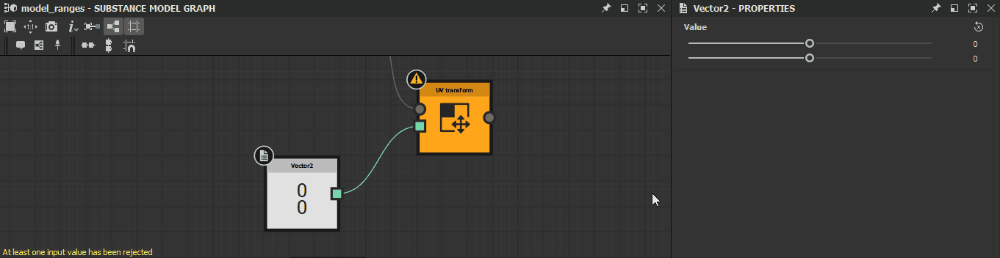

# MDLグラフの警告

[Substance 3D Designer](https://www.adobe.com/jp/products/substance3d-designer.html)のMDLグラフによってトリガーされる可能性のある警告メッセージとエラーメッセージを一覧表示し、それぞれの一般的なトラブルシューティング手順を示します。

警告は、[エクスプローラー](https://helpx.adobe.com/substance-3d/unlisted/documentation/sddoc/the-explorer-129368147.html)パネルのグラフリソースに対する警告アイコンのツールヒントと、グラフが読み込まれている場合は、[グラフビュー](../../interface/the-graph-view/the-graph-view.md)の左下隅に表示されます。

>[!NOTE]
>
> このセクションの図は、Substance 3D Designerのバージョン<b>13.0.0</b>で&#x200B;*廃止*&#x200B;された<b>Substanceモデルグラフ</b>に記録されています。 ただし、MDLグラフにも当てはまります。

## 出力ノードが定義されていません

グラフに出力ノードが定義されていません。

<b>ソリューション</b>

この関数に予期される型に一致する値を出力するグラフのノードがある場合は、それを選択し、RMBをクリックしてコンテキストメニューの<b>ルートとして設定</b>オプションを選択するか、ノードでLMBをダブルクリックします。\
Substanceモデルグラフの出力ノードは&#x200B;*オレンジ*&#x200B;色で表示されます。

### 少なくとも1つの入力値が拒否されました

パラメーターに指定された値は、ノードの有効な計算の結果にはなりません。

<b>ソリューション</b>

ターゲットパラメーターに適するように値を調整します。

### 入力値がありません

ノードが計算を行うために期待する入力値が提供されない。

<b>ソリューション</b>

入力コネクタにデータが提供されていない場合、一部のノードパラメータは既定値にフォールバックできません。 これは、シーン入力によく使用されます。

ノード入力を、タイプが一致する別のノードの出力コネクタに接続します。

### ノードは計算されませんでした

ノードに提供された情報が不完全か無効であるため、ノードは計算を実行できませんでした。

<b>ソリューション</b>

グラフのアップストリームに移動し、ノードが有効な出力を提供できない問題によってトリガーされる警告を確認します。

### 参照されたデータに警告があります

ノードが参照するリソースに1つ以上の警告があります。 リソースを参照するノードを次に示します。

* グラフインスタンスノードはグラフを参照する
* シーンリソースノードは、ビットマップ3Dシーンリソースを参照します

<b>ソリューション</b>

エクスプローラパネルで、参照されているリソースを見つけ、リソースによって発生したすべての警告のトラブルシューティングを行います。

* グラフについては、このページの他の項目を参照してください
* その他のタイプのリソースについては、「依存関係からの警告」ページを参照してください

### 参照リソースが見つかりません

ノードが参照するリソースが、Substance 3Dファイル(SBS)に保存されたパスに見つかりませんでした。 リソースを参照するノードを次に示します。

* グラフインスタンスノードはグラフを参照する
* シーンリソースノードは、ビットマップ3Dシーンリソースを参照します

<b>ソリューション</b>

グラフインスタンスノードの場合

ソースグラフが、<b>Package</b>属性に保存されたパスにあるパッケージに存在することを確認してください。\
存在しない場合は、インスタンスノードを削除し、有効なパッケージを参照しているインスタンスノードに置き換えます。 または、インスタンスノードが参照するパッケージとグラフを再作成し、[エクスプローラー](https://substance3d.adobe.com/documentation/display/DRAFTDESIGNER/.The+Explorer+window+vDraftVersion)パネルで&#x200B;*RMB*&#x200B;をクリックしてホストパッケージを再読み込みし、コンテキストメニューで<b>再読み込み</b>オプションを選択することもできます。

シーンリソースノードの場合

[エクスプローラー](https://substance3d.adobe.com/documentation/display/DRAFTDESIGNER/.The+Explorer+window+vDraftVersion)パネルで参照されているリソースを検索し、<b>ファイルパス</b>属性に保存されている場所にリソースが存在することを確認してください。\
表示されない場合は、エクスプローラーのリソース項目の&#x200B;*元*&#x200B;をクリックし、<b>再配置…を選択します。コンテキストメニューの</b>オプションを使用して、そのリソースの新しい有効なターゲットファイルを設定します。

### ソフト範囲に値が含まれていません

公開されているパラメータのデフォルト値は、そのパラメータに対して定義されているソフト範囲には含まれません。

<b>ソリューション</b>

前者が後者に含まれるように、デフォルト値またはソフト範囲を調整します。

>[!NOTE]
>
> この警告は、既定値を含むようにソフト範囲を&#x200B;*自動的に調整*&#x200B;するため、ユーザーインターフェイスを通じてトリガーすることはできません。 Substance 3Dファイル(SBS) *直接*&#x200B;のデータを変更した場合にのみ、この警告がトリガーされます。

### ソフト範囲がハード範囲を超えています

パラメータのソフト範囲と露出は、そのパラメータに定義されているハード範囲に完全には含まれません。

<b>ソリューション</b>

ソフトリレンジまたはハードレンジを調整して、前者を後者に完全に含めます。

>[!NOTE]
>
> この警告は、ハード範囲に完全に含まれるようにソフト範囲を&#x200B;*自動的に調整*&#x200B;するため、ユーザーインターフェイスからトリガーできません。 Substance 3Dファイル(SBS) *直接*&#x200B;のデータを変更した場合にのみ、この警告がトリガーされます。

を超えています

### 値はハード範囲外です

公開されたパラメータのデフォルト値は、そのパラメータに対して定義されたハード範囲には含まれません。

<b>ソリューション</b>

前者が後者に含まれるように、デフォルト値またはハード範囲を調整します。

>[!NOTE]
>
> この警告は、ハード範囲に含まれる既定値を&#x200B;*自動的に調整*&#x200B;するため、ユーザーインターフェイスを通じてトリガーすることはできません。 Substance 3Dファイル(SBS) *直接*&#x200B;のデータを変更した場合にのみ、この警告がトリガーされます。

