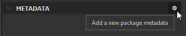
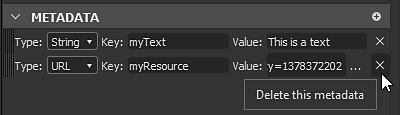

# パッケージメタデータ

パッケージメタデータは、パッケージレベルで定義されたテキスト（文字列）値の辞書です。 これは公開時にSBSARに含まれており、Pythonスクリプトで使用することを目的とした汎用ストレージです。

## Designerインターフェイスを使用したメタデータの表示と編集

Pythonプラグインを開発している場合、テストやデバッグの目的でメタデータを手動で編集することがあります。 次の方法で実現できます。

1. エクスプローラーでパッケージをダブルクリックすると、このパッケージのプロパティパネルが開きます。

   
1. ここには専用セクション「メタデータ」があります。 上記のキャプチャと同様に、このケースでは空の状態になっている可能性があります。

   「プラス」ボタンを使用すると、新しいメタデータを追加できます。

   
1. セクションに新しいアイテムが表示されます。

   
1. 「キー」フィールドと「値」フィールドがあります。 両方とも、ニーズに合わせて設定できます。 「キー」フィールドには、リスト全体で一意の値を指定する必要があります。

   
1. アイテムの「タイプ」を選択することもできます。 現時点では、「文字列」または「URL」にできます。

   
1. ここで「URL」とは、パッケージに含まれるリソースへの参照を意味します。 これを行うには、ハードドライブ上のファイルを選択し、エクスプローラーでパッケージにドラッグ&amp;ドロップします。 イメージなどの通常のリソースか、テキストファイルなどのその他のファイルを指定できます。

   
1. ファイルが新しいリソースとしてパッケージに表示されます。

   次に、パッケージのプロパティパネルに戻り、新しいメタデータを作成して、適切なキーを指定し、タイプとして「URL」を選択します。 次に「。..」を選択します。 ボタンをクリックして、「リソースから」を選択します。 最後に、直前に含めたファイルを選択し、以下を検証します。

   
1. これで、リソースの「URL」が「値」フィールドに保存されていることがわかります。

   項目の右側にある「X」ボタンを使用して、メタデータを削除することもできます。

   

>[!NOTE]
>
> メタデータエントリの移動または並べ替えは無効です。順序は重要ではなく、パッケージの公開時にも維持されません。

## 公開されたSBSARファイルのメタデータ

状況によっては、一致するパブリッシュされたSBSARのパッケージで定義したメタデータを取得する必要がある場合があります。 以下では、メタデータがどのように変換され、アーカイブに保存されているか、およびそこからメタデータを活用する適切な方法について説明します。

メタデータは、JSON形式に従って/assemblies/content/0000/metadata.jsonという名前のファイルに保存されます（パスは.sbsarアーカイブのルートからの相対パスです）。

通常の（文字列）メタデータはそのまま保存されます。例：「key」:「stringValue」、1行につき1つ。 繰り返しますが、さまざまなキーの元の順序は保持されず、実装が定義されます。 通常のPythonのディクットのように、プロセスの中の順序に決して頼らないでください！

URLメタデータの目的は、ユーザーとプラグインが.sbsarアーカイブに外部ファイルを含めることができるようにすることであるため、これらは特定の変換の対象となります。最初に、保存されたURLに一致するリソースのファイルが、実装で定義された場所（通常は、このファイルのみを含む番号付きのサブフォルダー）のアーカイブにコピーされます。 ポイントは、名前の競合を避けることです)。 ファイルは元の名前を保持します（リソースの名前はこの時点で破棄されます）。 次に、 metadata.jsonの元のURLの代わりに、 metadata.jsonに関連するアーカイブ内のコピーされたファイルへのパスが書き込まれます。

前のセクションで作成したサンプルパッケージを（いくつかの出力を含むグラフを少なくとも1つ作成した後で）書き出すと、次のアーカイブコンテンツが表示されます。

```
myPackage.sbsar

|-- assemblies

        |-- content

            |-- 0000

                |-- New_Graph.sbsasm

                |-- New_Graph.xml

                |-- metadata.json

                |-- resources

                    |-- 0

                        |-- TEXT.txt
```


metadata.jsonの内容は次のとおりです。

```
{

    "myResource": "resources/0/TEXT.txt",

    "myText": "This is a text"

}
```


現時点では、アーカイブに保存されているメタデータとリソースにアクセスするための特定のツールは提供されていません。 推奨される方法は、選択したLZMAデコーダーでアーカイブを開き、通常のJSONパーサーでmetadata.jsonを解析することです（キーや値の文字列に装飾的な文字が含まれている場合は、JSON形式にエスケープされます）。

>[!NOTE]
>
> 各メタデータが単純な文字列かURLかについての情報は残っていないので、読みたいキーが何を意味しているのかを知る必要があります。
