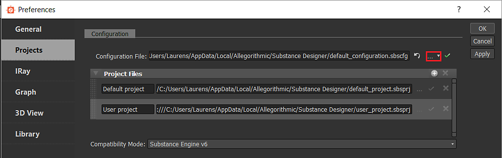

# ユーザーの環境設定 – 自動設定

<table>
<tr style="border: 0;">
<td width="100.00%" style="border: 0;" valign="top">

user\_preferences.xmlファイルには、[プロジェクト構成](../../pipeline-and-project-con/project-configuration-fil/project-configuration-files-sbsprj.md)で定義されている設定の外のユーザー固有の設定がすべて含まれています。 これらは主に特定のUIおよびパフォーマンス設定に関連しています。

変更する必要がある唯一の関連する設定は、プロジェクトの一覧を含む[構成ファイル](../../pipeline-and-project-con/configuration-list-sbscfg/configuration-list-sbscfg.md)です。 これは、以下に示すように、いくつかの方法で実行できます。

または、ユーザープリファレンスの変更を完全に省略し、Designerショートカットのコマンドライン引数を使用してSBSCFGファイルのセッションベースのオーバーライドを実行することもできます。以下を参照してください。

</td>
<td width="25.00%" style="border: 0;" valign="top">


</td>
</tr>
</table>

## 永続的またはセッションベース

Designerでデフォルト以外の[設定ファイル](../../pipeline-and-project-con/configuration-list-sbscfg/configuration-list-sbscfg.md)を使用するように設定するには、2つの方法がありますが、長所と短所の両方があります。

* <b>user\_preferences.xmlを完全に変更しています\
  </b>このファイルは、Windowsの&#x200B;*～User\AppData\Local\Adobe\Adobe Substance 3D Designer*&#x200B;にあります。 テンプレートを編集すると、そのテンプレートで定義されている内容が、どのように、いつ、どこで開始したかに関係なく、Designerによって常に使用されます。 変更を加えるには、XMLを再度変更する必要があります。両方とも以下に説明されており、少し複雑になる傾向があります。
* <b>コマンドライン引数でセッションを一時的に設定しています\
  </b>Designerは、起動時にコマンドライン引数を使用して、そのセッションのSBSCFGファイルを上書きできます（方法については、以下を参照してください）。 これはシンプルで洗練されたソリューションであり、XMLを変更するよりもプロジェクトを素早く切り替えることができます。 危険性は、複数のショートカット（Windowsのスタートメニューとデスクトップなど）から開いた場合、完全に明らかでなくても異なる結果が得られることです。 また、ショートカットの削除、移動、変更はuser\_preferences.xmlよりも簡単なので、改ざん防止ではありません。

## XMLの変更

### 環境設定の手動での変更

自動設定がない場合、またはテスト目的の場合は、手動で<b>編集/環境設定…</b>に移動し、左側の「<b>プロジェクト</b>」セクションをクリックできます。



赤でマークされたボタンを使用すると、ユーザーは別の[SBSCFGファイル](../../pipeline-and-project-con/configuration-list-sbscfg/configuration-list-sbscfg.md)を選択できます。

### スクリプトによる変更

プロジェクトファイルや構成ファイルと同様に、ユーザーの環境設定は、構造化XMLであり、関連する設定は明確に識別できます。 Notepad++やSublime Textなどのテキストエディタを使用して修正するのではなく、外部のスクリプト化されたセットアップを使用して修正する場合に非常に適しています。

スクリプトの利点は、ユーザーがボタンをクリックする以外に何もする必要がないことです。また、十分に複雑なシステムが作成されると、ファイルや設定を手動で管理しなくても、プロジェクトを簡単に管理および切り替えることができます。

関連する行は次のようになります。

```
  <configuration> 

   <configurationfile>file:///C:/Users/John/AppData/Local/Adobe/Adobe Substance 3D Designer/default_configuration.sbscfg</configurationfile> 

  </configuration>
```


#### Pythonの例

以下はWindows用の単純なPython 2.7のサンプル関数で、別の設定ファイルのuser\_preferences.xmlを変更します。 これにより、元に戻すまで値が永続的に変更されます。 関数SetConfigurationFileは、カスタムsbscfgファイルのパスをパラメータとして呼び出すことができます。

Pythonスクリプトは強力でクリーンなコードを可能にし、他の場所にも簡単に統合できますが、欠点は、ユーザーがそれを実行するには、実行可能ファイルにコンパイルする必要があり、Pythonをデプロイする必要があることです。

```
import xml.etree.ElementTree as ElementTree 

import os 

 

##Example Python script for changing Substance 3D Designer user preference file## 

 

def SetConfigurationFile(p_ConfigPath): 

## Check is the path passed as parameter exists.

    if(os.path.isfile(p_ConfigPath)): 

## replace backslashes by forwardslahes to ensure consistency

        p_ConfigPath = p_ConfigPath.replace("\", "/") 

## get Local Appadata path from Environment variables, construct full path to user_preferences.xml and check if it exists.

        m_AppDataPath = os.environ.get('LOCALAPPDATA') 

        if m_AppDataPath != None: 

            m_UserPrefsPath = os.path.join(m_AppDataPath, str("Adobe/Adobe Substance 3D Designer/user_preferences.xml")) 

            if(os.path.isfile(m_UserPrefsPath)): 

## read XML elementtree from file, find correct element until we get to the actual line that defines the configurationfile path

                m_PrefsTree = ElementTree.parse(m_UserPrefsPath) 

                m_PrefsRoot = m_PrefsTree.getroot() 

                m_PrefsElement = m_PrefsRoot.find("preferences") 

                m_XMLError = True 

                if(m_PrefsElement != None): 

                    m_ConfigElement = m_PrefsElement.find("configuration") 

                    if(m_ConfigElement != None): 

                        m_ConfigFileElement = m_ConfigElement.find("configurationfile") 

                        if(m_ConfigFileElement != None): 

                            m_XMLError = False 

## Check if path is already set, to avoid double work

                            if m_ConfigFileElement.text.replace("file:///","") == p_ConfigPath: 

                                print "configurationfile is already set to desired path. Aborting." 

                                return True 

                            else: 

## construct correctly formatted path, insert into elementtree

                                m_ConfigPath = str("file:///" + p_ConfigPath) 

                                m_ConfigFileElement.text = m_ConfigPath 

 

## Write to file

                                m_XMLString = str("<?xml version="1.0" encoding="UTF-8"?>n") + ElementTree.tostring(m_PrefsRoot, 'utf-8') 

                                m_File = open(m_UserPrefsPath,'w') 

                                m_File.write(m_XMLString) 

                                m_File.close() 

                                print "configuration file path succesfully changed!" 

                                return True 

                if m_XMLError: 

## if this flag was not set to false, we can assume something was missing or went wrong when walking through the XML

                    print("Error: malformed content in user_preferences.xml!") 

                    return False 

            else: 

                print "Error: user_preferences.xml does not exist, try starting Substance 3D Designer first!" 

                return False 

        else: 

            print "Error: LocalAppData path returned None" 

            return False 

    else: 

        print "Error: Invalid Configuration File path!" 

        return False
```


## コマンドライン引数のショートカット

より簡単な方法で、Designerは「 – config-file」（オプション）引数を使用して、起動時に特定のSBSCFGを使用するように指定できます。

### 手動設定

実稼働環境で手動の方法を使用することは推奨されませんが、テスト目的では、SBSCFGファイルを既に設定してある場合は、この操作をきわめて迅速に実行できます。

1. スペースを追加
1. 「ターゲット」セクションで、designerへのパスの後に – config-fileを追加します。
1. 別のスペースを追加
1. パスを追加します。パス内のスペースの問題を避けるために、*引用符で囲みます*。
1. 結果は次のようになります。

   *&quot;C:\Program Files\Adobe\Adobe Substance 3D Designer\Adobe Substance 3D Designer.exe&quot; —config-file &quot;C:\Dev\Substance\custom\_configuration.sbscfg&quot;*


