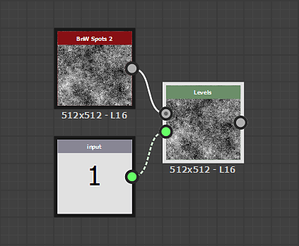
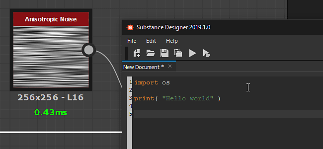
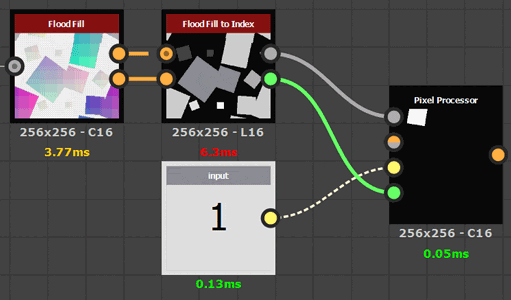

# バージョン2019.1(9.1)

**Substance Designer 2019.1**&#x200B;では、Substance engineに新しいアップデートが導入され、機能がさらに拡張され、新しいフィルターも追加されました。

## 主な機能

### 新規バリュープロセッサーーノード

このSubstance engineはバージョン7に入り、合成グラフ内に新しいコンセプトの「値」を追加しました。 値はテクスチャではなく数値であるため、関数グラフや合成グラフを介して複数のノード間で共有できる様々な計算を行うために使用できます。 バリュープロセッサーノードは、入力画像を読み取り、1つの出力値を計算できます。

バリュープロセッサーノードは単独ではありません。グラフを越えて情報を転送できるようにするために、いくつかの変更と追加が行われました。

* 出力ノードは値を直接供給することができ、もはや必ずしも画像とは限りません。

  
* グラフが値を照会できるように、「入力値」という名前の新しい&#x200B;**入力ノード**&#x200B;が追加されました。

  
* ノードには、「入力値」という名前のパラメータの下に新しいカテゴリが追加されました。このカテゴリを使用して、ノード自体の入力値を作成できます。\
  入力値は、「Get」ノードを介して関数グラフ内で参照できます。

  

>[!NOTE]
>
> 主要なSubstance engineが変更されるたびに、互換モードは以前のバージョン（デフォルトでは新しいバージョン6）に設定されます。 つまり、互換性のないノードの場合、グラフ内に黄色い枠線が表示されます。 黄色の枠線の表示/非表示を切り替えるには、メイン設定のエンジンのバージョンを、（プロジェクト設定を介して）最新のバージョンに変更するだけです。
> 
> 

### ベイカーでのOptixのサポート

Substance Designerの最新のアップデートでは、互換性のあるRTX対応ハードウェア上でGPU レイトレーシングを実行できるDXRが導入されました。 [Optix](https://developer.nvidia.com/optix)のサポートが追加されました。これにより、Linuxでも他のNvidiaのGPUでレイトレースできます。 Optixを使用すると、通常のCPU レイトレーシングよりも&#x200B;**5倍速く**&#x200B;ベイクすることが期待できます。

以下に、この変更によって影響を受けるベイカーのリストを示します。

* メッシュからのAmbient occlusion
* メッシュからのBent normals
* メッシュからのThickness

2つのバックエンドのうち1つを無効にする場合は、メインの環境設定（**編集/環境設定**）およびベイカー設定に移動します。

>[!NOTE]
>
> この機能にアクセスするには、**次のドライバーに更新**&#x200B;してください：
> 
> * Nvidia 10XXおよび20XX GPU : **ドライバー430.39** （DXRおよびOptixの両方と互換性があります）
> * Nvidia 9XX以前： **d** **rivers 419.67または430.39** （ドライバー425.31にOptixの問題があります）
> 
> DXRは、[GeForce GTX 10xx GPU](https://www.nvidia.com/en-us/geforce/news/geforce-gtx-dxr-ray-tracing-available-now/)でも使用できます（最新のドライバーを使用）。 DXRを使用するには、Windowsが最新の状態である必要があります。詳細については、[このページ](../../../best-practices/performance-optimization/performance-optimization-guidelines.md)を参照してください。

### OBJ メッシュの読み込み時間の改善

このリリースでは、**obj**&#x200B;ファイルリーダーが改善され、3D メッシュの読み込み時間が短縮されました。 UVと法線が定義されていないメッシュでは特に、読み込み時間が3倍速くなりました。

このパフォーマンスの向上は、ベイカーと3D ビューの両方に影響を与えます。

### 改善されたPythonプラグインシステム

このアップデートでは、スクリプトシステムに多くの新機能が追加されました。

* **Qtのサポート** ：アプリケーションの他の部分と同じスタイルに従ったカスタムUIを構築できます。 この新しいシステムでは、カスタムUIもはるかに簡単に統合できます。 （Tkinterは現在非推奨です）。
* **コールバック関数** :コールバック関数を登録できるようになりました。 現時点では、UI要素の作成のみではなく、ファイルのオープンと保存のみが含まれています。 今後、コールバックが追加される予定です。
* **スレッド化** ：プラグインは、バックグラウンド処理を行ったり、OSイベント（ネットワーク接続など）を待機したりするためのスレッドを作成できるようになりました。

詳しくは、Substance Designer内の&#x200B;**ヘルプ/Python APIドキュメント**&#x200B;メニュー項目からアクセスできるAPIのチェンジログを参照してください。

### 新規コンテンツ

また、デフォルトのライブラリにはいくつかの新しいノードがあり、その一部は新しいバリュープロセッサーノードで強化されています。

* **インデックスへのFlood Fill**\
  Flood Fillノードの図形に固有のインデックスを割り当てます。\
  次の例では、ピクセルプロセッサーノードがシェイプに入力された値と一致し、結果としてマスクを出力します。

  
* **Non Uniform Directional Warp**\
  画像入力から強度と角度をサンプリングする指向性ワープを適用します。

  
* **マルチ指向性ワープ**\
  入力画像をさまざまな方向に何度もワープします。

  
* **高さ押し出し**\
  指定されたHeightの正投影の3Dレンダリングを生成します。 カメラビューは、位置ギズモでコントロールできます。

  
* **最小値/最大値**\
  入力画像の最小および最大ピクセル値を返します。

  

>[!WARNING]
>
> このリリースではCentOS 6.xがサポートされなくなりました。 最新バージョンのSubstance Designerを使用するには、CentOS 7.xにアップグレードしてください。

## リリースノート

### 2019.1.3

*（2019年8月19日公開）*

**修正済み：**

* [ベイカー] 烘焙出力の縦横比とスキューマップが一致しない場合のDXRのクラッシュ
* [ベイカー] 「メッシュからのAmbient occlusion」ベイカーで法線マップを使用すると、OptixまたはDXRで間違った結果が出力される
* [ベイカー] 「曲率」ベイカーで「頂点ごと」設定を使用すると間違った結果が出力される
* [ベイカー]エラーメッセージには、エラーの原因ではなく、失敗したバックエンドの情報が表示される
* [ベイカー] ハイポリメッシュのない詳細マップベイカーを処理するとクラッシュが発生する
* [ベイカー] DXRを有効にしても、歪曲マップがすべての出力に影響を与えないように見える
* [コンテンツ] mg\_leaks:パラメータ名に誤りがあります
* [コンテンツ] 「シェイプ」が調理警告を返す
* [コンテンツ]ポリゴン1と2はランダム関数をサポートしていません
* [コンテンツ]多角形1および2の辺は3つ未満にすることができます
* [コンテンツ] Heightに対する法線HQが正方形でない場合に正しく動作しない
* [パラメータ]整数入力パラメータ：ドロップダウンリストに値が表示されません

### 2019.1.2

*（2019年7月2日リリース）*

**修正済み：**

* [3Dビュー]フィールドの深度を有効にした3Dビューの書き出しが正しく表示されない
* [3Dビュー] [レンダリングを保存]を使用すると、PSDイメージのAlphaチャンネルが正しくない
* [3Dビュー] Irayで「レンダリングを保存」オプションを使用すると、PNGとPSDが壊れる
* [3Dビュー]レンダリングを保存するとdds形式が機能しない
* [グラフ]特定の方法で右クリックと左クリックのドラッグを組み合わせると、ノードがオフセットされる
* [グラフ]関数インスタンスを変更しても、ノード結果が更新されなくなりました
* [グラフ]スペースバーメニューを表示するとクラッシュする
* [コンテンツ]シェイプの押し出し：シェイプに回転がない場合の品質の問題
* [コンテンツ]シェイプドロップシャドウ（およびグレースケール）で、HとVのタイリングがない場合にシャドウが生成されない
* [コンテンツ]材料の切り抜き通常の問題
* [ベイカー] JSONベイカープリセットが正しく読み込まれない
* [ベイカー] OptixまたはDXRを使用してヘビーメッシュをベイク処理するとクラッシュする（Vramが不十分なために失敗することがありますが、クラッシュしません）
* [ビットマップエディタ]ビットマップペイントツールは、ストロークの境界ボックスでストロークをオフセットして再描画します
* [ビットマップエディタ]ビットマップペイントツールがOSXで壊れる
* [UI]一部のボタンのメニューにアクセスできない
* [UI]ベイカーインスタンスのドラッグ&amp;ドロップ中にクラッシュする
* [SVG]埋め込みSVGの編集ツールが信頼性に欠ける
* [パラメーター] SBSARインスタンスでブールパラメーターを含むプリセットを適用するとクラッシュする
* [ネットワーク] SSL暗号化接続でエラーが発生するとクラッシュすることがある

### 2019.1.1

*（2019年5月28日リリース）*

**追加：**

* [PythonIntegration]プラグインマネージャーの状態を保存および復元する
* [Preferencies][Dependencies]依存関係のファイルパスの保存方法を指定するオプションを追加します
* [コンテンツ] Flood Fillマッパー：[フィットシェイプボックス]オプションを追加します。

**修正済み：**

* [コンテンツ] Flood Fillマッパー：「回転の自動スケール」を実行すると逆の結果になる
* [コンテンツ] 「輝度\_offset\_map」入力が「Flood Fillマッパーカラー」で使用されない
* [コンテンツ] &#39;Flood Fillマッパーのグレースケール&#39;ノードでステッピングアーティファクトが発生する
* [コンテンツ] 高さ押し出しを公開できません
* [パラメーター] sbsarに埋め込まれたプリセットがDesignerに読み込まれない
* [ベイカー]ベイカーリストにベイカー名が正しく表示されない
* [3Dビュー] 「3Dビューで出力を表示」が値に対して機能しない
* [Cooker]間違ったパラメータタイプを修正するとクラッシュする
* [API] SDResource.setInputPropertyFromId関数がSDSDBSCompGraph入力パラメーターで機能しない
* [アップデーター]一部のsbsは2019で更新できません
* [エクスプローラー]特定の.objファイルを読み込むとクラッシュする
* [PythonIntegration] PYTHONPATHの初期化時にバックスラッシュがWindowsで正しくエスケープされない
* [UI]ベーカーの一部のスライダーに関する値の問題
* [Linux] CentOS &lt; 7.6でDesignerを実行できない

### 2019.1

*（2019年5月9日リリース）*

**追加：**

* [API] SDPackageMGR.loadUserPackage()メソッドに「updatePackages」パラメーターを追加して、アップデーターを読み込み時に適用するかどうかを制御します
* [API] SDConnectionを切断する機能の追加
* [API] SDPackageを公開するためのSDSBSARExporterクラスの追加
* [API]取り消し可能なコマンドを管理するためのSDHistoryUtilsクラスの追加
* [API] Substance合成グラフにグレースケール入力ノード定義を追加する(sbs::compositing::input\_grayscale)
* [API] Substance合成グラフに値の入力ノード定義を追加する(sbs::compositing::input\_value)
* [API] SDProperty.isFunctionOnly()メソッドを追加します
* [API] SDSBSCompNodeでのカスタム入力パラメーターのサポートを追加
* [API] SDPackageMGR.loadUserPackage()メソッドに「reloadIfModified」パラメーターを追加して、パッケージが変更された場合に再読み込みされるかどうかを制御します
* [API] SDPackageMgr.getPackages()メソッドを追加する
* [API] SDModuleMgrからルートパスを取得/追加/削除する機能を追加
* [API]ピクセルバッファのポインタとSDTextureのピッチを取得できるようにする
* [API] MainWindowのポインターを取得できるようにします
* [API]メインメニューにカスタムメニューを作成できるようにする
* [API]メインウィンドウでカスタムDockWidgetsを作成できるようにします
* [API]ツールバー内のメニューを検索するためにオブジェクト名を使用する
* [API] APIへのアプリケーション通知を管理するシステムを提供
* [PythonIntegration] Pythonプラグインを検索するためのデフォルトの環境変数を追加する
* [PythonIntegration]テキスト検索を追加し、Pythonエディタに置換します。
* [PythonIntegration]起動時にPythonプラグインをインスタンス化する
* [PythonIntegration] PYTHONPATH環境変数を考慮します
* [PythonIntegration]グラフウィジェットでツールバーを作成できます
* [PythonIntegration] Pythonスレッドのサポート
* [PythonIntegration]プラグインマネージャーを追加（「ツール」メニュー内）
* [コンテンツ]法線ベクトルの回転：オプションの画像入力を追加して、角度を制御します。
* [コンテンツ]新しい最小/最大フィルタ
* [コンテンツ]新しい「インデックスへのFlood Fill」フィルタ
* [コンテンツ]新しい「Flood Fillマッパー」フィルタ
* [コンテンツ]新しいAtlas Splitterフィルタ
* [コンテンツ] [3平面フィルタを修正]
* [コンテンツ]新しいNon Uniform Directional Warpフィルタ
* [コンテンツ]新しい多方向ワープ
* [コンテンツ]新しい高さ押し出しフィルタ
* [エンジン] Fxmap：新しい「オフセットのあるグラデーション」パターン
* [エンジン]均一な値処理のサポート（新しい値プロセッサノード）
* [3D View][Bakers] OBJローダーのパフォーマンスを向上
* [3Dビュー]カメラクリップ面の距離を増やす
* [環境設定]ベーカーの設定を追加する
* [グラフ]文字列比較を回避して、無効化を高速化
* [MDL] MDLアレイのサポート
* [UI]エンジン選択UIの改善
* [IRay] IRay SDK 2018.1.4へのアップグレード
* [依存関係マネージャ]リソースを再配置するときに「最後のパス」を使用する
* [Cooking] sbsarでブール値ラベルのサポートを追加する
* Qt 5.12.2を統合する

**修正済み：**

* [グラフ]入力の名前を変更すると、接続が切断される
* [グラフ]パラメーターを微調整すると、無効な値が過剰にトリガーされます
* [グラフ]バッジを右クリックすると、「クリップボードにコピー」アクションが機能しない
* [グラフ] Altキーを使用してフレームを移動しても.sbsに保存されない
* [MDL]カラープロファイルがMDLエディターで自動的に更新されない
* [MDL]特定の設定を含むモジュールを書き出すとクラッシュする
* [MDL] LightProfileまたはMBSDFリソースを含むMDLグラフをエクスポートできない
* [UI]コンテキストメニューにショートカットが表示されない
* [UI]再起動後、フローティングウィンドウがドッキング可能になる
* [スクリプティング] Python EditorでCancelオプションが機能しない
* [スクリプティング]保存メニューの「すべてに対してはい」オプションが機能しない
* [パラメータ]コピー後にドロップダウンリストが正しく表示されない
* [Explorer]リソースを再配置すると、デフォルトでは最後に再配置されたパスが開きます
* [ライブラリ]あるバージョンから別のバージョンに切り替えると、ライブラリのコンテンツが常に再構築される
* [ライブラリ]読み込まれたビットマップが保存時に無効になる
* [IRay]接線空間が正しく計算されない、または法線マッピングが正しくない
* [機能]選択範囲から新しいグラフを作成すると、クラッシュまたは失敗する
* [API]プロパティのデフォルト値が定義されていません
