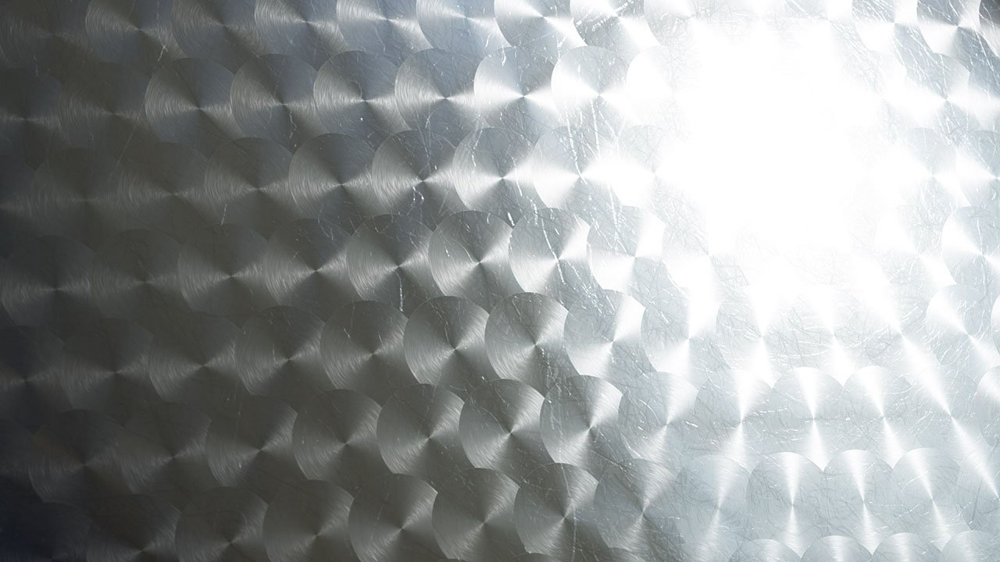

# バージョン2019.2(9.2)

**Substance Designer 2019.2**&#x200B;は、新しいドットノード、HDRフィルター、および強力な最適化を提供します。

## 主な機能

### 新規ドットノード

Dotノードは、長い間待ち望まれている要求です。 これは、ノード間のコネクションをリダイレクトしてグラフを再編成することを目的としています。 以前のリダイレクションドットとは異なり、このドットはリンクを蓄積することができ、接続が切断されても消えることはありません。

ドットノードの詳細については、[グラフ項目](../../../interface/the-graph-view/graph-items/graph-items.md)を参照してください。

### ノード作成メニューの改善

「スペースバー」を押すと表示されるノード作成メニューで、お気に入りを定義し、優先順位を付けて一覧表示できるようになりました。 メニューに新しいビヘイビアーがいくつか追加され、使いやすくなりました。

* **お気に入りを最初に表示する**\
  テキストフィールドの横のアイコンをクリックすると、お気に入りのリストを最初に有効または無効にできます。

  
* **お気に入りの追加または削除**\
  お気に入りが表示されたら、ノード名の横にあるアイコンをクリックして、リストのノードを追加または削除できます。\
  （お気に入りは、ライブラリウィンドウで直接管理することもできます）。

  
* **ノードからリンクをクリックしてドラッグするときにメニューを開く**\
  ノードのコネクションをクリックしてドラッグし、マウスを放すと、ノード作成メニューが開きます。 作成されたノードは、リンクに接続されます。 リストで使用可能なノードは、受信した接続に依存します。

### リアルタイムレンダラーの新しいテクニック

Substance Designerのリアルタイムビューポートが改善され、新しいレンダリング機能がサポートされました： **異方性**、**コーティング**&#x200B;および&#x200B;**表面化散乱**。 これらの機能によって導入されたすべての新しいチャネルおよび使用方法は、Irayとも互換性があります。

* **異方性**\
  異方性は、リフレクションが特定の方向でどのように動作するかを定義するプロパティです。 髪やブラシをかけた金属など、特定のマテリアルの種類に使用されることが多いです。\
  異方性反射マテリアルを作成するには、グラフに次の2つの出力が必要です。

  * **異方性角度**:異方性の方向を定義します。 黒から白に変化し、ループします。
  * **異方性反射レベル**:異方性の強さを定義します。 推奨値は0.9 ～ 0.98（グレースケール）です。

  注： 異方性は、すべてのデフォルトのPBRシェーダでサポートされています。

  {width="400px"}
* **コーティング**\
  コーティングによって、ベースマテリアルの上に2層目のマテリアル層を作り出すことができます。 このエフェクトは、自動車のペイントやメタリックのサーフェス上のフィルムのシミュレーションに使用できます。\
  コーティングされたマテリアルを作るには、新しいSubstanceテンプレート「PBRコーティング(メタリック/ラフネス)」を使用するか、グラフに次の出力を追加します。

  * **coatWeight**:コーティング層の不透明度。
  * **coatSpecularLevel**:コーティング層のSpecular levelです。
  * **coatColor**:コーティング層の色です。
  * **coatNormal**:コーティング層の標準。
  * **coatRoughness**:コーティング層のラフネスです。

  注意：コーティングには新しいシェーダー「physically\_metallic\_roughness\_coated」が必要です。

  {width="400px"}
* **サブサーフェススキャッタリング**\
  表面化散乱は、マテリアル内の光の吸収と拡散をシミュレートします。 肌や他の有機的な表面をシミュレートするのに非常に便利です。\
  サブサーフェスマテリアルを作成するには、新しいSubstanceテンプレート「PBRサブサーフェススキャッタリング(メタリック/ラフネス)」を使用するか、グラフに次の出力を追加します。

  * **散乱**:マテリアル内の光の拡散の強さを制御します。

  注意： Subsurfaceには新しいシェーダー「physically\_metallic\_roughness\_sss」が必要です。 スキャッタリングの色は、シェーダパラメータで制御できます。

  {width="400px"}

>[!NOTE]
>
> これらの新しいレンダリング機能はすべて、シェーダシステムのSubstance Designerを再調整することで実現できます。 **GLSLFX**&#x200B;形式は、複数パスのレンダリングを可能にする「**テクニック**」の定義をサポートするようになりました。 一部の例では、 **Substance Designer/リソース/view3d/シェーダ**&#x200B;で使用可能なデフォルトのシェーダを見てみましょう

### パフォーマンスの向上

Substanceエンジン（バージョン7.2.0にジャンプ）にいくつかの改良が加えられ、いくつかの状況で役立ちます。

* **より高速に微調整するためにグラフの計算をキャッシュしています**\
  グラフレンダリングは、新しいキャッシングシステムの追加により改善されました。 これにより、変更されていないノードをスキップするようになったため、グラフの微調整が以前よりもはるかに高速になります。
* **ライブラリの読み込み時間を改善しました**\
  新しい調理の最適化とデコード速度の向上のおかげで、ライブラリの読み込みが大幅に改善されました。 ライブラリの生成が2 ～ 8倍速くなりました。

### HDRフィルターを使用した新規コンテンツ

この新しいリリースでは、HDR環境マップの操作に特化した新しいフィルターが多数導入されています。

* **HDRマージ**:Bring&#x200B;では、複数のLDR （ローダイナミックレンジ）写真を組み合わせて1つのHDR画像を作成します。
* **Nadir Patch**:This&#x200B;ノードを使用すると、球状デフォメーションを考慮しながら、HDRIのグラウンド部分をクローンまたはパッチできます。
* **Nadir Extract**：このノードは、HDRIからテクスチャを抽出できます。 これを使用して、3Dシーンで地面のテクスチャをマッピングすることができます。
* **Color Temperature Adjustment**: HDR値のサポートを含め、入力画像の色温度を調整します。
* **水平線の角度補正**：環境マップの緯度/経度を回転します。 撮影条件によっては、360°パノラマが真っ直ぐにならない場合があります。
* **物理的な太陽と空**：このノードは、ホセックウィルキースカイライトモデルの実装です。 太陽の位置を指定すると、物理的に正確な空のパノラマが生成されます。
* **平面ライト**：長方形のライトを3Dのシェイプのように生成します。 2D表示で色相を変えたり、テクスチャを適用したり、色温度やRGB値を指定して色を設定したりすることができます。
* **ラインライト**:ライン型のライトを作成し、2D ビュー内での位置を変更します。 平面ライトと同様のオプションがありますが、ネオンライトのような細長いシェイプ用に設計されています。
* **球体光** ：球形の光を作り、2D ビューギズモを使って位置を変えます。 球テクスチャを使って遠くの惑星を作ることもできます。

すべての新しい[HDRI ツール](../../../compositing-graphs/nodes-reference-for-com/node-library/3d-view-library/hdri-tools/hdri-tools.md)は、[Node Libraryセクション](../../../compositing-graphs/nodes-reference-for-com/node-library/node-library.md)に記載されています。

## リリースノート

### 2019.2.3

*（2019年11月26日リリース）*

**修正済み：**

* [ベイカー]無効なリンクを含むスキュー・マップ・リソースを使用してベイク処理を行うとクラッシュする
* [ベーカー] Embreeでは0以外のUVセットは考慮されません
* [ベイカー] DXRで0以外のUVセットを使用すると、「メッシュから曲げ法線」が正しくない結果を出力する
* [ベイカー]ベーキングウィンドウを再度開くと、「UVセット」パラメータが「0」値にリセットされる
* [ベイカー]「位置」を選択すると、0以外のUVセットを持つ黒いイメージが出力される
* [コンテンツ]スマート自動タイル：8Kでのサンプリングの問題
* [コンテンツ]Atlas Splitter：シェイプの検出に失敗する場合があります。precisionパラメーターが表示される必要があります。
* [コンテンツ]捕虜が正しい値を返さない場合がある
* [コンテンツ]インデックスへのFlood Fill:sbsarに公開すると、正しくない結果が生成されます
* [ライブラリ]セッションの最初のSBSパッケージを読み込むときにクラッシュする
* [ライブラリ]エクスプローラーパネルに直接読み込まれたリソースでは、「デフォルトでライブラリにリソースを表示」の設定が無視される
* [コンソール]ノードメニューを使用すると、コンソールに予期しないメッセージが表示される
* [パラメーター]出力使用法リストで単一のエントリを削除できません
* [3DView]ディスクでシーンファイルを変更するとシーンが正しくリロードされない[グラフ] Value出力を使用するとノードメニューフィルタリングが正しく実行されない

**追加：**

* [MacOS]新しいMacOS Catalinaの配布要件に従ってソフトウェアを公証します

### 2019.2.2

*（2019年10月23日リリース）*

**修正済み：**

* [グラフ]値の出力を使用すると、ノードメニューのフィルタリングが正しく実行されない
* [グラフ]ノードメニューを表示するとクラッシュする
* [グラフ] Shiftショートカットを使用すると検索ツールが表示される
* [グラフ]値入力コネクタからノードメニューを連続して生成するとクラッシュする
* [グラフ]長い文字列を含むコメントはトリミングされます
* [グラフ]コネクタメニューからドラッグしてノードを作成すると、フローハイライトが正しく表示されない
* [グラフ]別のグラフのロード中にシーンからすべてのグラフアイテムを削除すると、クラッシュする
* [グラフ]クリックしてコネクタからドラッグしているときに、を使用してノードを作成するとクラッシュする
* [グラフ] 「ノードファインダー」ツールの使用中にクラッシュする
* [グラフ]「材料コンパクト」モードで出力ピンの色が正しくない
* [Cooker]マルチ出力ノードのダウンストリームノードが正しく更新されない
* [Cooker]値出力とパススルーノードの問題
* [Cooker] 「Get」ノードのみを使用すると、バリュープロセッサが間違った結果を出力する
* [コンテンツ] &#39;コントラスト/輝度&#39;ノードは、Alpha値1.0を出力します
* [コンテンツ] &#39;Studio Panorama&#39;テンプレートに説明がありません
* [コンテンツ]インデックスへのFlood Fill：入力に折り返しシェイプが含まれている場合は正しい結果が得られません
* [コンテンツ] &#39;HDRマージ&#39;：内部露出計算が正しくありません
* [ドットノード]レベルとドットノードを使用するとクラッシュする
* [Dependency Manager] 「移動」アクションが機能しなくなりました
* [PSD] PSDエクスポーターに含まれている複数のノードの削除を取り消すとクラッシュする
* [UI]ウィンドウメニューを使用してグラフを閉じ、グラフをピン留めしている間にもう一度開くと、クラッシュする
* [グラデーションエディター] 「キーを削除」ボタンが大きすぎます
* [エンジン] sqrt() acos()およびasin()の精度の問題
* [ベイカー]メッシュからAO: &#39;スプレッド角度&#39;スライダーを微調整すると、値の範囲が正しく設定されない

### 2019.2.1

*（2019年9月20日リリース）*

**追加：**

* [テンプレート]デフォルトの入力ノードをSpecular/光沢およびその他のテンプレートに追加する
* [Templates] PBR異方性テンプレートを追加する
* [3Dビュー]自動クリップ面の遠距離を増やす
* [3Dビュー] PBRコーティング：コート法線の継承の既定値を変更
* [コンテンツ] Atlas Splitter:「自動切り抜き」機能のオプションを追加
* [ノードメニュー]入力のないノードをフィルタ処理しません

**修正済み：**

* [コンテンツ]Atlas Splitter:「自動切り抜き」オプションを使用すると、一部の出力が正しく切り抜かれません
* [コンテンツ]マテリアルHeightブレンド：存在しないパラメータに関連する調理上のエラー
* [コンテンツ] 「平面ライト」:パターンUVモードが正しく動作しません
* [コンテンツ] 「通常のワールド単位へのHeight」：入力は16ビットに強制されます
* [コンテンツ]小さなシェイプにタイリングを適用せずにangularの「ベベル」ノードを使用すると、予期しないシェイプが発生する
* [ライブラリ] sbsarのアイコンがライブラリで表示されない
* [ライブラリ] URLのフィルタリングに「\」を使用しても機能しない
* [ライブラリ]フィルター値は大文字と小文字が区別されます
* [ライブラリ]「合成」がオンになっていると、検索フィルターが機能しない
* [ベイカー]特定のセルをダブルクリックし、変更を取り消すと、誤った値に戻る
* [ベイカー]ベイカーウィンドウのバックエンドのステートテキストに常に「GPUアクセラレーション：有効」と表示される
* [Cooker]グラフ内の「インポスター」依存関係を処理するとクラッシュする
* [Cooker]値を使用すると、グレースケール変換の出力サイズが間違っています
* [Explorer] 「共有時にPublish」を処理するとクラッシュする
* [グラフ]特定のパッケージを開くとクラッシュする
* [MDL]キャスト演算子を使用するとクラッシュする
* [テンプレート] PBRコーティングされたテンプレートで出力識別子が正しくありません

### 2019.2

*（2019年8月29日公開）*

**追加：**

* [コンテンツ]新しい「パノラマライト」シェイプ
* [コンテンツ]新しい「パノラマNadir Patch」フィルター
* [コンテンツ]新しい「パノラマNadir Extract」フィルター
* [コンテンツ]新しい「パノラマで水平線をまっすぐにする」フィルター
* [コンテンツ]新しい「パノラマ回転」フィルター
* [コンテンツ]新しい[パノラマポジション]ノード
* [コンテンツ]新しい[パノラマ物理の太陽と空]ノード
* [コンテンツ]新しい「パノラマグラデーション」ノード
* [コンテンツ]新しい「HDR Merge」フィルター
* [コンテンツ]新しい「HDRプレビュー」フィルター
* [コンテンツ]新しい「Color Temperature Adjustment」フィルタ
* [コンテンツ]新しい「Blackbody」ノード
* [コンテンツ]新しい「露光量」フィルター
* [UI]ノード作成メニュー：お気に入りをメニューに表示して管理する
* [UI]ノード作成メニューのお気に入りへのノードの追加/削除
* [UI]ノード作成メニュー：出力からリンクをクリック/ドラッグするとメニューが表示される
* [UI]ノード作成メニュー：現在の選択タイプに従ってコンテンツをフィルタリングします。
* [3D ビュー]サポート異方性
* [3D ビュー]支持コーティング効果
* [3D ビュー]サポート表面化散乱
* [グラフ]ドットノード
* [グラフ]調理結果をキャッシュしてグラフレンダリングを最適化します
* [環境設定] 「調理のサイズ制限」のデフォルト値を8192に変更します
* [環境設定]新しい「Tab」キーのオン/オフを切り替えるトグルを追加
* [API] SDResource.getPackage()メソッドを追加する
* [Iray] NVIDIA Iray RTX 2019.1.3 SDK (317500.3714)のアップデート
* [エクスプローラー]パッケージ内のリソースとして、任意の種類のファイルをリンクできます
* [GradientNode]グラデーションの選択をキャンセルするには、[Esc]を押します
* [パラメータ]識別子の自動大文字を削除する
* [Project]グラフやリソースを既定で「ライブラリに表示」するかどうかを指定するオプションを追加する
* [プリセット]変更されたパラメータを自動的にピン留めする

**修正済み：**

* [MDL]パラメータタイプの問題のため、モジュールをエクスポートできません
* [MDL]読み込み時に露光量が表示されない
* [MDL] MDLの書き出し中にクラッシュする
* [MDL]マテリアルサーフェスノードのカラーを変更するとクラッシュする
* [MDL] void MDLGraphNodeControllerSelector::updateSelectorCurrentMember(const DataMessage&amp; msg)が壊れています
* [グラフ]グラフ表示でリンクのThicknessが正しくない
* [グラフ]パラメーターを微調整すると、無効な値が過剰にトリガーされます
* [グラフ]パッケージの2つのウィンドウが開いているときにパッケージを閉じ、コンテキスト内編集を使用するとクラッシュする
* [ファンクショングラフ]ファンクションビューを閉じる際に警告が表示されない
* [3Dビュー]カメラ投影がデフォルトのシーン状態として「正射投影」に設定されている場合、3Dビューの初期化時にクラッシュする
* [3Dビュー] IrayではポストFX DOFは有効のままです
* [2D表示]ブラシサイズを変更すると、ブラシ選択ウィンドウが消える
* [2Dビュー]情報パネル：特定のレイアウトで値がトリミングされる
* [2Dビュー]メインウィンドウを最小化して復元するときに、イメージがオフセットされます
* [Bakers] &#39;From Resource&#39;選択リストが正しくフィルタされません
* [ベイカー]「メッシュからカラーマップ」と「メッシュから法線マップ」をEmbreeでチェーンするとクラッシュする
* [ベイカー] 頂点ごとの曲率ベイクで重大なアーティファクトが発生する
* [エクスプローラー] UDIMリソースを読み込んで、エクスプローラーにドラッグ&amp;ドロップできない
* [エクスプローラー]特殊なファイル形式をリンクした後にメッシュとフォントをリンクすると、エクスプローラーウィンドウが正しくフィルタリングされない
* [エクスプローラー] グラフで「ライブラリで表示」が「no」に設定されている場合、リソースが表示される
* [コンテンツ] &#39;Pow&#39;入力と&#39;clamp&#39;入力が正しい順序ではありません
* [コンテンツ] &#39;RGBA Merge&#39;ノード入力がラベル付けされていません
* [Cooker]数値の接続が無効なため、評価されます
* [Cooker]画像入力を入力値に接続するときにアサートする
* [UI]マウスカーソルが「サイズ変更」状態でスタックすることがある
* [UI] Linuxで、パッケージビューを右クリックしても正しいメニューが表示されない
* [依存関係]一時リソースのファイルパスが正しくありません
* [依存関係]再配置の後もビットマップリソースが見つからないことを示す警告がアクティブのままになる
* [ライブラリ]一部のサムネールが生成されない
* [ライブラリ]ライブラリにMDLファイルが表示されます
* [Parameters]パラメータの表示時のクラッシュ
* [パラメーター]ドロップダウンリストに新しいクラッシュを再作成すると、要素が発生する
* [書き出し] 8Kバッチ書き出しに失敗する
* SBSインスタンスのブール演算に関連するプリセットを適用すると、[プリセット]クラッシュが発生する
* [スクリプト]コマンドライン引数&#39;—quit&#39;を使用しても「ようこそ」画面が表示される
