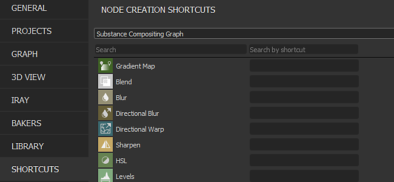
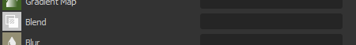
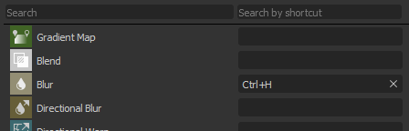
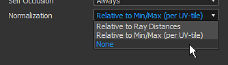
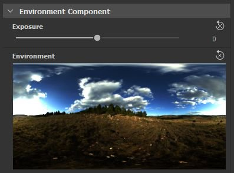
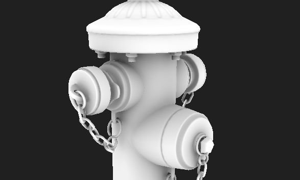
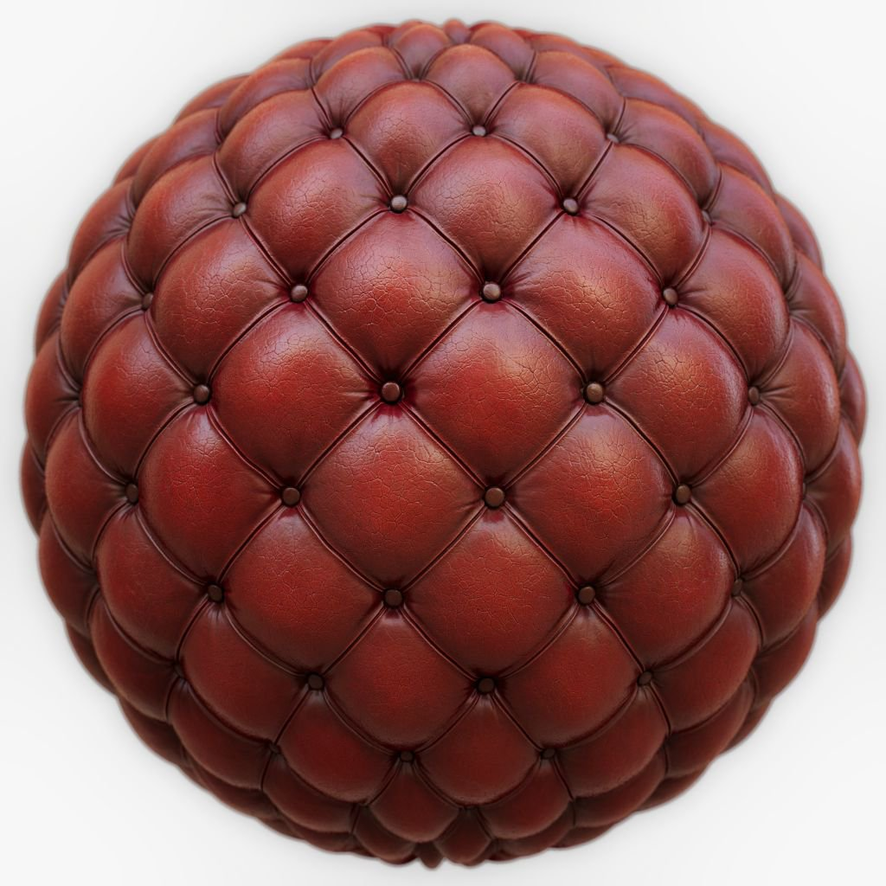

# バージョン2020.1(10.1)

**Substance Designer 2020.1**&#x200B;には、新しいショートカットエディターとMaterialXプラグインが含まれています。また、Adobe Color Engine機能や新しいベイカー機能を使用したカラーマネジメントに関する多くの新しい機能強化が行われています。

リリース日： *2020年4月10日*

>[!NOTE]
>
> このリリース以降、アプリケーションのバージョン番号によって形式が変わります。 **2020.1**&#x200B;のはずだった項目が&#x200B;**10.1.0**&#x200B;になります。

## 主な機能

### ノード作成用の新しいショートカットエディタ

このバージョンでは、キーボードショートカットを定義して、様々なグラフモードでのノードの作成を高速化できる新しいショートカットエディターを導入しました。

新しいショートカットエディターには、メインの環境設定で&#x200B;**編集/環境設定/ショートカット**&#x200B;を使用してアクセスできます。 デフォルトでは、すべてのショートカットフィールドは空です。

* **グラフの種類ごとのショートカット**\
  通常の合成グラフから、関数やMDLなどのより高度なグラフまで、Substance Designerで利用可能なグラフの種類ごとにショートカットを定義することができます。

  
* **アトミックノードとカスタムフィルターの両方にショートカットを割り当てる**\
  デフォルトでは、インタフェースはグラフのタイプごとにアトミックノードを表示します。 検索フィールドを使用すると、リストを絞り込むことはできますが、カスタムライブラリフィルターとノードにアクセスすることもできます。

  
* **新しいショートカットを作成しています**\
  特定のノードに対して新しいショートカットを作成するには、ノード名の横にあるテキストフィールドをクリックし、キーボードで要求されたキーを入力します。 ショートカットを消去するには、十字ボタンを使用します。

  
* **ショートカットの競合の管理**\
  競合の詳細を確認するには、警告アイコンのツールヒントを使用します。 これは、キーが既存のキーと競合する場合、またはアプリケーションが別の目的で既に使用している場合に言及します。

  

  
* **ショートカットの検索**\
  トラッキングするショートカットが多すぎる場合や、デフォルトでノードが表示されない場合は、検索システムを使用して次の項目を分離します。

  

### 新しいMaterialXプラグイン(Beta)

SIGGRAPH 2019では、Substance Designer用のMaterialXプラグインのデモンストレーションを行いました。 [MaterialX](http://www.materialx.org/)は、[Industrial Light &amp; Magic (ILM)](https://www.ilm.com/)によって開発された形式です。アーティストはこの形式を使用してマテリアルを作成し、様々なプラットフォームや多くの用途（映画、テレビ番組、ゲーム、VR体験、製造など）で使用できます。 ベータ版で利用可能になったこの新しいプラグインを使用すると、他の互換性のあるDCCアプリケーションで使用するMaterialXマテリアルを作成できます。 この新しいプラグインの背景にあるプロセスと目標について詳しくは、MaterialX[&#128279;](https://magazine.substance3d.com/research-a-portable-shader-graph/)に関する最近の記事をご覧ください。

この新しいプラグインにより、次のことが可能になります。

* プロシージャシェーダとテクスチャを並行して作成します。
* 詳細マップや手続き型マスクなどの機能を実行時に変更できるように、高度なシェーダを作成してSubstance Painterします。
* ゲームエンジンまたはVFXパイプラインのシェーダ機能をSubstance DesignerビューポートとSubstance Painterビューポートで一致させます。

プラグインを入手するには、[Substance share](https://share.substance3d.com/libraries/6111)に移動してダウンロードしてください。

### Adobe Color Engineの新しい統合(ACE)

OpenColorIOに加えて、Adobe Color Engine(ACE)を使用して、カラーマネジメント用のICCプロファイルをサポートできるようになりました。 これにより、PhotoshopやIllustratorなどの他のソフトウェアに合わせて、キャリブレーションされた画像を読み込んだり書き出したりできるようになりました。

* **Adobe Color Engineを有効にしています**\
  プロジェクト設定を使用して、使用するカラーマネジメントシステムを定義します。

  
* **画面プロファイルを変更しています**\
  2Dビューまたは3Dビューで画像をプレビューする場合は、ドロップダウンを使用して、使用するプロファイルを指定します。

  
* **従来のカラーマネジメントのACES**\
  ACESトーンマッピングされた出力変換が、従来のカラーマネジメントモードで使用できるようになりました。

### 改良されたパン屋

ここでは、主に次の2つの変更を加えて、ベーカーをいくつか改良しました。

* **改善されたサンプリング**\
  アンビエントオクルージョン、Thickness、および曲率ベイカーでは、ベイク処理の質を大幅に向上させる新しいサンプリング方法を使用するようになりました。 サンプル数を増やすことなく、魅力的なノイズが得られ、より安定した結果が得られます。 下の画像は、上部に以前のサンプリング方法、下部に新しいサンプリング方法を示しています。左から右に向かって4、8、16のサンプルがあります（すべてのレンダリングは、4 x 4のサブサンプリングに設定されたアンチエイリアスを使用して行われました）。

  {width="600px"}
* **新しい正規化設定**\
  Thicknessベイカーとハイトマップベイカーには、0 ～ 1の範囲に固定された値ではなく、生の値をテクスチャにベイクする新しい正規化パラメーターが追加されています。 これは、Heightマップを使用して、低ポリゴンメッシュと高ポリゴンメッシュの間の未処理距離を知る場合などに便利です。 除数の値は、ローポリゴンメッシュで設定したディスプレイスメントの強さに正確に対応し、ハイポリゴンメッシュのシルエットに一致します。 Heightマップを正しく解釈するために、0に対応するピクセル値を定義するための新しい「スカラーのゼロ値」パラメータも公開しました。 さらに、手動係数を使用すると、UVタイルごとの正規化によって生じるUDIMメッシュの潜在的なシームの問題を修正できます。

  

### 改善された3Dビュー

3Dビューでは、日々の作業をより快適なものにするため、生活の質が様々に改善されました。

* **レンダラー間のパラメーターの同期**\
  OpenGlとRayの間でシェーダパラメータが同期されるようになり、シェーダパラメータ間のジャンプが非常に簡単になりました。
* **テクスチャ入力のプレビューを表示し、無効化パラメーターを追加します**\
  シェーダ入力パラメータに、入力のプレビューが表示されるようになりました。均一カラーパラメータ、グラフノード、またはビットマップです。 また、パラメーターのチェックを解除して、一時的に無効にすることもできます。

  

  
* **設定での環境マップのプレビュー**\
  **3Dビュー/環境/編集**&#x200B;に移動すると、シーンに光を当てるために使用した環境マップのプレビューが表示されるようになりました。

  
* **新しいアンライトシェーダー**\
  「unlit」という名前の新しいシェーダがデフォルトで含まれています。 これは照明には反応せず、代わりにメッシュ上のビューポートに単一のテクスチャを表示するために使用できます。 これは、ベイク処理されたテクスチャなどを確認する場合に便利です。

  {width="500px"}
* **ビューポートのダウンスケールにより、高DPI画面のパフォーマンスが向上しました**\
  Substance Painterと同様に、画面がHDPIスケーリング（MacOSのRetinaスクリーンなど）を使用し、ビューポート解像度を2で割ることを検出する&#x200B;**ビューポートスケーリング**&#x200B;という新しいパラメーターがメインの環境設定に追加されました。 この動作により、ビューポートの描画が高すぎる解像度で行われることがなくなり、一般的なパフォーマンスが向上します。\
  現在の設定値は次のとおりです。

  * **なし**:ビューポートのスケーリングは行われません。
  * **自動** （既定）:アプリケーションがHDPI画面にある場合、ビューポートの解像度は2つに分割されます。

  

### 新規コンテンツ

このリリースには、いくつかの新しいノードまたは改善されたノードも含まれています。

* **改善されたPBR レンダリングノード**\
  このノードは以前のバージョンですでに導入されており、大幅に改善されています。 現在では、カメラコントロール、新しい形状（平面や円柱など）、後効果（フィールドの深度、ブルーム/グレア、周辺光量補正など）、新しいマテリアルタイプ（クリアコートや異方性など）に加え、不透明度のあるマテリアルのサポートも提供しています。\
  詳細については、専用の[ドキュメントページ](../../../compositing-graphs/nodes-reference-for-com/node-library/material-filters/pbr-utilities/pbr-render/pbr-render.md)を参照してください。

  {width="250px"}

  {width="250px"}

  {width="250px"}
* **新しいPBR レンダリングマッピングノード**\
  PBR レンダリングの拡張機能として、この新しいノードを使用して合成マップチャンネルプレビューを作成できます。\
  詳細については、専用の[ドキュメントページ](../../../compositing-graphs/nodes-reference-for-com/node-library/material-filters/pbr-utilities/pbr-render-mapping/pbr-render-mapping.md)を参照してください。

  {width="250px"}

  {width="250px"}
* **新しいFXAAフィルター**\
  この新しいフィルタは、アンチエイリアス方式であるFast approximate-anti-aliasing(FXAA)アルゴリズムを実装しています。 通常のテクスチャ上で使用して、ギザギザの線やエッジを滑らかにすることができます。\
  詳細については、専用の[ドキュメントページ](../../../compositing-graphs/nodes-reference-for-com/node-library/filters/effects/fxaa/fxaa.md)を参照してください。

  {width="600px"}
* **新しいHald CLUTフィルター**\
  このフィルターを使用すると、入力ルックアップテーブル(LUT)で画像のトーンとカラーを調整できます。 Hald CLUT形式を使用して、ID LUT [ここ](http://www.quelsolaar.com/technology/clut.html)から開始するだけです。\
  詳細については、専用の[ドキュメントページ](../../../compositing-graphs/nodes-reference-for-com/node-library/filters/adjustments/hald-clut/hald-clut.md)を参照してください。

  {width="600px"}

## リリースノート

### 2020.1.3

*（2020年6月11日リリース）*

**追加：**

* [コンテンツ]セーフトランスフォームグレースケールノードの「マットカラー」パラメータを公開する
* [コンテンツ] PBR レンダリング: [バックグラウンド入力をカスタマイズ]オプションを追加します。
* [コンテンツ]パノラマライトノード：背景画像からカラーをサンプリングする新しいオプション
* [パラメータ] [パラメータを表示]ウィンドウのリストから[サポートされていない]フラグのパラメータを非表示にする

**修正済み：**

* [3Dビュー]特定のケースでカスタムメッシュを切り替えるとクラッシュする
* [3Dビュー]起動時に常にDirectXが表示される
* [コンテンツ] 3Dワーリーノイズ：高いグリッドサイズ値を使用している場合のレンダリング斑点
* [コンテンツ]ディゾルブノードのブレンドが正しくない
* [コンテンツ] PBR レンダリング: Cookerの削除の警告
* [コンテンツ] PBR レンダリング：結果に負の色が含まれることがあります
* [Cooker]複数出力インスタンスノードのキャッシュインジェクションの問題
* [Explorer]表示されたMDLグラフを含むパッケージを閉じるとクラッシュする
* [グラフ] 2パスクッキング：ノードの種類を変更してもrecookがトリガーされない
* [グラフ]接続の使用中に入力を削除するとクラッシュする
* [グラフ]リンクエンドポイントを空のスペースに移動できます
* [MDL] MaterialXグラフからMDL書き出しをキャンセルするとクラッシュする
* [MDL] MDLEへの書き出しをキャンセルするときにエラーが発生する
* [プリセット]プリセットに含まれているパラメーターのタイプを変更すると、「プリセット」タブでクラッシュする
* [リソース]非UDIMとしてリンクされたメッシュのグラフコンテキストメニューでマテリアルリストが空になる

### 2020.1.2

*（2020年4月27日リリース）*

**追加：**

* [コンテンツ] Alchemistフィルターテンプレートを追加
* [コンテンツ] PBR レンダリング:パラメータを追加して、拡散反射光/Specularシャドウ強度をコントロールします。
* [コンテンツ] Shape Lightノード：カメラ位置パラメータを追加
* [ニュース]グループの「矢印」スタイルが、ウィンドウが初めて表示されたときに壊れる
* [ベイカー] 2DビューにZショートカットを追加して、1:1の画像を表示します
* [プロジェクト] $(PROJECT\_DIR)エイリアスをリストから非表示にします
* [エクスプローラー]ディスク上のファイルではないリソースに対してカスタムリソースを作成しない

**修正済み：**

* [Player] SBSパッケージの読み込み時に見つからないエイリアスを報告する
* [Player]ランダムシードの値を小数点以下で表示します
* [Player] Substance Designerに含まれるすべての環境マップをバンドルします。
* [Player] macOS High Sierraで終了時にクラッシュする
* [Player] sbs://を使用するパッケージを読み込めません
* [コンテンツ] 3Dワーリーノイズ：高いグリッドサイズ値を使用している場合のレンダリング斑点
* [コンテンツ] &#39;Wave&#39;ノードの&#39;greaterThanZero&#39;入力は使用されません
* [コンテンツ]平面ライト：ワールドスペース位置モードが機能しない
* [コンテンツ]球ライト：内部ライトの位置が正しく動作しない
* [ベーカーさん] 「すべてのベイク済みマップを更新」の実行中にベーキングウィンドウでベイク処理を行うとクラッシュする
* [ベーカー]法線マップで[低]と[高]を使用すると、メッシュからAOのOptixでベイクが失敗する
* [ベイカー] UVTilesのプレビューの解像度が画面のサイズと一致しない
* [3Dビュー]既定値がtexture2dでない場合、MDLのロード時に割り当てられたビットマップが上書きされます
* [3Dビュー]プロパティをリセットすると、マテリアルプロパティウィジェットが変更される
* [3Dビュー]通常形式のグローバル環境設定が機能しない
* [MatX]ライブラリ： [MaterialXグラフ]カテゴリに使用可能なノードの一部が表示されません
* [MatX]カスタムグラフのコンテキストメニューで、「Add Node」フォルダーに空のサブフォルダーを含めることができる
* [SBSAR]プライマリ入力がリストの最初の入力に戻ります。
* [ライブラリ]複数のグラフを持つSBSARから最初のグラフのみが含まれます
* [CustomGraph]現在のグラフの種類に含まれないノードは、場合によっては自動的に作成されます
* [Iray]ボックスプロジェクションの&#39;深度&#39;パラメータが正しく動作しません
* [環境設定]プロジェクト設定のレイアウトを改善する
* [パラメーター]パラメーターを削除した後に位置ウィジェットを移動するとクラッシュする
* [UI]出力ノードで使用階層を変更するとクラッシュする
* [グラフ]コメントに選択ボックスを使用し、バッジ付きノードを使用するとクラッシュする

### 2020.1.1

*（2020年4月10日リリース）*

**修正済み：**

* [3Dビュー]グラフの合成を行うと、メモリ使用量が大きすぎる
* [コンテンツ] 「ポリゴン」ノードの非正方形の出力で予期しない形状が発生する
* [コンテンツ] PBR レンダリング：非正方形の解像度を使用すると、正射投影カメラが正しく動作しない
* [コンテンツ] PBR レンダリング：渦巻き型ボケにより、画像の境界線が明るくなる
* [カラーマネジメント]新規ビットマップダイアログのカラーピッカーがカラーマネジメントされない。
* [カラーマネジメント]ペイントツールおよび2Dビューのベクターツールのカラーピッカーはカラーマネジメントされません。

### 2020.1.0

*（2020年4月9日リリース）*

**追加：**

* [ショートカット]ノード作成用のショートカットマネージャ
* [コンテンツ]新規PBR レンダリングノード
* [コンテンツ]新しいFXAフィルタ
* [コンテンツ]新しいHald CLUTフィルタ
* [コンテンツ] 「切り抜き」ノードのフィルタリングを公開する
* [3Dビュー]シェーダパラメータの改善/テクスチャ割り当てワークフロー
* [3Dビュー]新しいアンライトシェーダ
* [3Dビュー] ディスプレイスメントシェーダに「スカラゼロ値」を追加します
* [3Dビュー]高DPIが有効な場合にビューポート解像度をダウンスケールするオプションを追加
* [3Dビュー] GLSLFX: samplerでgui情報を設定できます（デフォルト、min、max、guiMin、guiMax、guiStep、guiWidget、guiName、guiGroup）
* [3Dビュー] [シーン]メニューで、[メッシュで状態をロード…]オプションを追加します。
* [3Dビュー]従来のカラーマネジメントモードでACESトンマップされた出力変換を追加します
* [ベーカー] AOの新しいサンプリング法、曲率、曲がった法線、Thicknessベーカー
* [ベーカー] HeightパンとThicknessパンの新しい正規化オプション
* [カラーマネジメント] Adobe ACEを統合(Adobe Color Engine)
* [カラーマネジメント] ICCプロファイルが見つからない場合のデフォルトの動作を設定するオプションを追加します
* [パラメーター]Substance Painterに合わせてスライダーを増加させる
* [パッケージ] Pythonスクリプトに対してできる限り多くのQt dllをバンドルします
* [プロジェクト]読み取り専用のプロジェクトファイルの設定を無効にし、その状態を明確に伝える
* [環境設定]応答性と計算期間に関する不明確な特定の設定を非表示にする
* [UI] Pow2の名前を変更 – > 2Pow
* [プロパティ]合成グラフプロパティの表示を最適化する
* [AXF] AXF SDK 1.7.1のアップデート

**修正済み：**

* [3Dビュー]環境光パラメータが有効になっていても表示されない
* [3Dビュー] glslfx:カラーウィジェットは常にアルファなしのvec3です
* [3Dビュー]リソースの環境マップセットがシーンリソースに保存されない
* [3Dビュー] Iray：環境光はシーンの原点で点光源に変換されます
* [3Dビュー] glslfx:カラーウィジェットは常にアルファなしのvec3です
* [パラメーター]属性グループのインスタンスパッケージURLが正しくありません
* [パラメーター]パラメーターを表示するとクラッシュする
* [パラメータ]カーブノードのパラメータでアイコンが正しく位置合わせされていません
* [パラメーター] &#39;Text&#39;ノード文字列は、公開されると&#39;プレビュー&#39;モードでのみ表示されます
* [パラメーター] &#39;Visible If&#39;ステートメントで使用されている入力パラメーターの名前を変更すると、クラッシュします
* [パラメータ]いずれかのパラメータで関数が設定されているレベルノードを削除するとクラッシュする
* [UI]入力パラメーターリストの警告アイコンが既存のボタンの上に配置される
* [UI]特定のケースで、正しい入力パラメーター項目の警告がクリアされない
* [UI] 「メッシュはUDIMですか？」を禁止する メッシュのUVが厳密に[0,1]タイルにある場合に表示されるポップアップ
* [UI]プリセットのドロップダウンリストを、マウスホイールを使ってマウスをポイントするだけでスクロールできる
* [UI]グラフ属性の「Output(s) computation」オプションの名前が正しくない
* [MDL] SBSグラフリソースをMDLグラフに配置するとクラッシュする
* [MDL]イメージ入力を含むSBSノードが正しく動作しない
* [MDL]テクスチャバインディングと使用名が正しくない
* [グラフ]入力値のグループと使用法が&#39;マテリアル&#39;リンク作成モードでは無視されます
* [グラフ]入力値は、ブール値の入力データの代わりに既定値を使用します
* [ベイカー]特定の場合、接線法線マップを使用してワールド空間法線ベイカーを実行すると、法線が正しく表示されない
* [ベイカー]プレビューウィンドウを開いた状態でベイク処理を行うと、メモリが過度に使用される
* [プリセット]破損したプリセットによりレンダリングがクラッシュする
* [プリセット]古いSBSのブールパラメーターがプリセットの影響を受けない
* [ライブラリ]最初に開いたパッケージのリソースがノード作成浮動メニューに一覧表示されます
* [Publish] SBSARに公開すると、macOSのSBSCookerでエラーコード13が返される
* [Publish] SBSARに公開するときに、SBSCookerの引数に関する警告が廃止されました
* [API] .sbsarファイルから取得したパッケージからメタデータを取得できない
* [書き出し]レガシーモードで、特定の出力のカラースペースオプションがデフォルトに戻る
* [2Dビュー]クリップボードへのコピーでカラーマネジメントの状態が考慮されない
* [Unix] Designerがシステムシグナルを無視する
* [ライブラリ]翻訳されたタグが原因で、ライブラリの一部のフィルターが正しく機能しない
* [Cooker]負の数の平方根はNaNではなく0を返す必要があります
* [2Dビュー]最初のペイントストロークを元に戻した後で、赤と青のチャンネルが入れ替わる
* [コンソール]コンソールに表示される警告メッセージが多すぎます「QPixmap::scaled: Pixmapはnull pixmapです」
* [コンテンツ] 「シェイプグロー」：調理の警告
* [依存関係]別のパッケージにあるグラフをメッシュに割り当てても、依存関係は作成されません
* [IRay]ジオメトリを切り替えると、マテリアルのプロパティが非アクティブになる

**追加：**

* [ショートカット]ノード作成用のショートカットマネージャ
* [コンテンツ]新規PBR レンダリングノード
* [コンテンツ]新しいFXAフィルタ
* [コンテンツ]新しいHald CLUTフィルタ
* [コンテンツ] 「切り抜き」ノードのフィルタリングを公開する
* [3Dビュー]シェーダパラメータの改善/テクスチャ割り当てワークフロー
* [3Dビュー]新しいアンライトシェーダ
* [3Dビュー] ディスプレイスメントシェーダに「スカラゼロ値」を追加します
* [3Dビュー]高DPIが有効な場合にビューポート解像度をダウンスケールするオプションを追加
* [3Dビュー] GLSLFX: samplerでgui情報を設定できます（デフォルト、min、max、guiMin、guiMax、guiStep、guiWidget、guiName、guiGroup）
* [3Dビュー] [シーン]メニューで、[メッシュで状態をロード…]オプションを追加します。
* [3Dビュー]従来のカラーマネジメントモードでACESトンマップされた出力変換を追加します
* [ベーカー] AOの新しいサンプリング法、曲率、曲がった法線、Thicknessベーカー
* [ベーカー] HeightパンとThicknessパンの新しい正規化オプション
* [カラーマネジメント] Adobe ACEを統合(Adobe Color Engine)
* [カラーマネジメント] ICCプロファイルが見つからない場合のデフォルトの動作を設定するオプションを追加します
* [パラメーター]Substance Painterに合わせてスライダーを増加させる
* [パッケージ] Pythonスクリプトに対してできる限り多くのQt dllをバンドルします
* [プロジェクト]読み取り専用のプロジェクトファイルの設定を無効にし、その状態を明確に伝える
* [環境設定]応答性と計算期間に関する不明確な特定の設定を非表示にする
* [UI] Pow2の名前を変更 – > 2Pow
* [プロパティ]合成グラフプロパティの表示を最適化する
* [AXF] AXF SDK 1.7.1のアップデート
