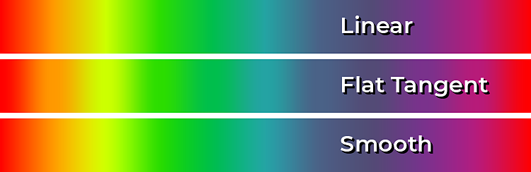
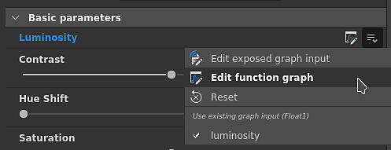
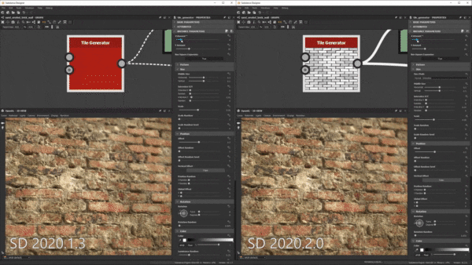

# バージョン2020.2(10.2)

**Substance Designer 2020.2**&#x200B;では、新しいSubstance engineの更新、パラメーター表示のワークフローの改善、パフォーマンスの向上および新しいコンテンツが導入されています。

リリース日： *2020年10月12日*

## 主な機能

### 新しいエンジンアップデート（バージョン8）

この新しいバージョンでは、Substance engineはバージョン8に移行し、新しい機能と複数の機能強化が行われています。

* **入力画像の既定値**\
  グラフの画像入力でデフォルトのカラーを定義できるようになりました。この機能を使用すると、何も読み込まれなかった場合や画像に接続されていない場合に、適切な値にフォールバックできます。

  {width="600px"}

* **新しい距離モード**\
  [ディスタンスノード](../../../compositing-graphs/nodes-reference-for-com/atomic-nodes/distance/distance.md)には、計算の方法を変える2つの新しいモードがあります。

  * **ユークリッド** （元のモード）:ユークリッド幾何学の点の間の直線距離。
  * **マンハッタン**:ポイント間の距離です。ただし、都市ブロックと同様にグリッド上に制限されています。
  * **チェビシェフ**：均一サイズのグリッド上の2点の差からの最大距離です。

  {width="600px"}

* **新しいグラデーション補間**&#x200B;[&#x200B;グラデーションノード](../../../compositing-graphs/nodes-reference-for-com/atomic-nodes/gradient-map/gradient-map.md)には、カラーの変化をより自然に生み出すキーを補間するための新しいモード&#x200B;**スムーズ**&#x200B;があります。 この機能は、近隣のキーを見ることによって動作します。 以前のモード&#x200B;**Interpolation**&#x200B;は、**フラット正接**&#x200B;に名前が変更されました。

  {width="600px"}

  

  **滑らか**&#x200B;モードには、色の間でブレンドする曲線を計算するために使用する正接の長さを制御するパラメーターもあります。 値0は正接の長さが0であることを示し、値1は正接が2つのキー間の長さの半分であることを示します。

  

* **改善されたカーブノード**&#x200B;[&#x200B;カーブノード](../../../compositing-graphs/nodes-reference-for-com/atomic-nodes/curve/curve.md)は、グレースケールイメージを直接出力できるようになりました。 この変更により、最初にグラデーションテクスチャを追加しなくても、カーブを定義して直接出力することができます。

  

### 表示パラメーターの改善

パラメーターの表示と編集のワークフローが改善され、より簡単になりました。

* **改善されたメニューアクション**&#x200B;表示されるパラメーターを表示および編集するアクションは、より明確になるように分割されました。 また、表示されるパラメーターをより簡単かつ迅速に編集するために、新しいショートカットが導入されています。 例えば、パラメーターの機能を編集する専用ボタンと、表示されたグラフパラメーターにジャンプする専用アクションが追加されました。

  

  

* **ダイアログから新しいパラメーターを直接構成しています**&#x200B;パラメーターを表示する場合、**パラメーターの表示**&#x200B;ダイアログから、説明や既定値などのすべての標準コントロールにアクセスできるようになりました。 これにより、新しいグラフパラメータの設定と作成が容易かつ迅速になり、パラメータを作成した直後にグラフパラメータビューに移動する必要がなくなります。

  {width="600px"}

### グラフのアイコン設定の改善

改善されたインターフェイスにより、グラフでサムネールを設定することがはるかに簡単になりました。

* **グラフのサムネイルを自動生成する**\
  グラフパラメーターのアイコンの横にある「生成」ボタンをクリックするだけで、Substanceグラフのプレビューを自動生成できるようになりました。 現在、メタリック/ラフネスPBRワークフローを出力ノードとして使用するグラフのみをサポートしています。 サムネールを生成すると、定義されている場合、ディスプレイスメントの強さは物理サイズの値から計算されます。定義されていない場合は、デフォルトの値0.1になります。

  {width="600px"}

* **新しいボタンでカスタムサムネイルを追加しています**\
  カスタムサムネールの設定を簡素化するために、いくつかの新しいボタンが追加されました。

  * **参照**:ファイルダイアログを開いて画像を読み込みます。 ボタンの横にあるフォルダーアイコンをクリックすることでも実行できます。
  * **生成**：上記のデモをご覧ください。
  * **貼り付け**:クリップボードから画像を読み込みます。
  * **削除**:アイコンに現在割り当てられている画像を削除します。

  

### パフォーマンスの向上

この新しいリリースでは、反復間の時間を短縮するために、次の2つの新しい最適化が行われました。

* **計算のパフォーマンスの向上**\
  出力ノードは、途中の中間ノード（現在は2番目のステップで行われています）を計算するのではなく、要求に応じて直接計算されるようになりました。 この変更により、ルートノードをツィークする場合でも、グラフの結果をより迅速にプレビューできます。 次の比較では、この最適化により、同じ時間内により多くのグラフの反復を確認できます（ここでは4K解像度のマテリアルを使用しています）。

  

* **拡張と拡散生成の改善**\
  ベイクしたテクスチャの拡張と拡散の生成が、以前のバージョンの最大4倍高速になりました。 これにより、パン間の待ち時間が短縮されます。

  

### 新規コンテンツ

このリリースでは、いくつかの新しいノードが追加され、既存のノードに新しいノードが追加される可能性があります。

* **[新しいしきい値フィルター](../../../compositing-graphs/nodes-reference-for-com/node-library/filters/adjustments/threshold/threshold.md)**&#x200B;このノードを使用すると、グレースケール入力に基づいて画像の一部を白黒マスクとしてすばやく分離できます。 実際には既存のヒストグラムスキャンフィルターと似ていますが、日常的に使用する方が便利です。 詳細については、[専用のドキュメントページ](../../../compositing-graphs/nodes-reference-for-com/node-library/filters/adjustments/threshold/threshold.md)を参照してください。

  {width="650px"}

* **[新しい断面フィルター](../../../compositing-graphs/nodes-reference-for-com/node-library/filters/effects/cross-section/cross-section.md)**&#x200B;このノードでは、グレースケール入力のシェイプをプロファイルとして視覚化できるため、このフィルターをデバッグツールとして使用して、ハイトマップとシェイプをより簡単に作成できます。 詳しくは、[専用のドキュメントページ](../../../compositing-graphs/nodes-reference-for-com/node-library/filters/effects/cross-section/cross-section.md)を参照してください。

  {width="600px"}

  {width="600px"}

* **改善された[Tile Generator](../../../compositing-graphs/nodes-reference-for-com/node-library/texture-generators/patterns/tile-generator/tile-generator.md)および** [**タイルSampler**](../../../compositing-graphs/nodes-reference-for-com/node-library/texture-generators/patterns/tile-sampler/tile-sampler.md)\
  この2つのノードには、さらに機能と用途を拡張するための新しいパラメータが追加されています。

  * **縦横比を維持**:タイルの比率を維持します。X軸とY軸のカウントが不均等な場合は、手動でサイズを補正する必要はありません。
  * **絶対**：最終的な画像の幅に対する既定のパーセンテージでタイルを維持します。
  * **ピクセル**:タイルのサイズをピクセル単位で定義します。

  詳細については、[専用ドキュメントページ](../../../compositing-graphs/nodes-reference-for-com/node-library/texture-generators/patterns/tile-generator/tile-generator.md)を参照してください。

  

### その他

**Iray**&#x200B;はバージョン2020.1.0に更新され、Nvidiaによる新しいAmpere GPU （RTX 3080やRTX 3090など）のサポートが追加されました。

## リリースノート

### 2020.2.0

*（2020年10月12日リリース）*

**追加：**

* [コンテンツ] [断面]ノードを追加
* [コンテンツ] functions.sbsに「Cross product vec2」関数を追加
* [コンテンツ] [取得サイズ]値ノードを追加
* [コンテンツ] functions.sbsに「直交vec2」関数を追加する
* [コンテンツ] Add Average functions to functions.sbs
* [コンテンツ] [しきい値を追加]フィルタ
* [コンテンツ]カラーマッチ：マスク入力を追加して、フィルターを適用する場所を指定します
* [コンテンツ] Tile Generator/Sampler：新しいオプションを追加して、パターンサイズを制御します
* [コンテンツ]イメージ入力の既定値でPBR レンダリングノードを更新する
* [パラメータ]インスタンスパラメータの問題をハイライト表示する警告アイコンを追加する
* [パラメーター]関数が適用されているパラメーターを含む入力/出力のVisible Ifステートメントを無視します
* [パラメーター]グループの関連付けのUXを改善します
* [パラメーター]単一のパラメーターを表示する方法の修正
* [パラメータ]公開されたパラメータをハイライト表示する
* [パラメータ]未使用パラメータのクリーンアップを改善します
* [エンジン]カーブノード：カーブテクスチャを出力する新しいオプション
* [エンジン]入力画像のデフォルト値
* [エンジン]距離ノード：新しい距離モード（マンハッタンとチェビシェフの距離）
* [エンジン]グラデーションノード：新しい補間モードで、カラー間のミックスをより自然にする
* [エンジン]他のパラメーターに応じて、一部のパラメーターがグレー表示されるようになりました
* [UX]カラーピッカーの16進フィールドで6桁のRGBカラーを使用できる
* [UX]コメントプロパティを選択時にすぐに表示しない
* [UX]グループ名の書き込みを開始するときに関連するグループを表示する
* [UX]グラフ出力を再書き出しするためのショートカット
* [UX]すべてのDropdown-textfield-comboboxが、通常のcomboboxと異なる外観になるようにする
* [GraphRender]ノードのサムネールを1つずつ表示します。すべてのノードが計算された場合に表示されるわけではありません
* [GraphRender]グラフのレンダリング中のキャンセル遅延を改善します
* [GraphRender]レンダリング進行状況バーの精度を向上させます
* [サムネイル]自動サムネイル（アイコン）計算
* [サムネール]サムネール（アイコン）をパッケージに追加するためのUXの操作
* [環境設定]新規ユーザーに対してデフォルトでGPU レイトレーシングを有効にする
* [環境設定] 3DView / OpenGL /画質：サンプル数のスライダーをより直感的な選択肢のリストに置き換えます
* [ベーカー]ポストプロセスのパフォーマンスを向上させる
* [カラーマネジメント]環境設定ダイアログで現在の作業カラースペースを表示します。
* [IRay]互換性のあるGPUがない場合、自動的にCPUモードに切り替わる
* [パフォーマンス]目的のノードの計算に要する応答時間を改善します（現在は最初に計算されています）。
* [Python API]新しいメソッドaddActionToExplorerToolbarを使用してエクスプローラツールバーにアイコンを追加
* [リソース] FBX 2020.0.1にアップグレードする
* [iRay] Iray 2020.1.0にアップデートします。
* [API]カラーマネジメントの設定とプロパティへのPythonアクセスを追加する

**修正済み：**

* [グラフ]親サイズまたはUVタイルを変更しても、現在のレンダリングはキャンセルされません
* [グラフ]出力コネクションを移動してAlt + LMBを押すとクラッシュする
* [グラフ]マテリアルモードまたはコンパクトマテリアルモードで接続を移動するとクラッシュする
* [グラフ]入力ノードがビットマップリソースをプレビューできません
* [グラフ]インスタンスでノードの互換性が壊れています
* [グラフ]グラフパラメータを変更すると、無効になるノードが多すぎます
* [コンテンツ] 「シェイプ押し出し」出力シェイプが特定のケースで反転する：新しいバージョンが必要ですが、古いバージョンは廃止されます
* [コンテンツ]カラーマッチノードでカスタムカラーバリエーションを使用すると、正しい結果が得られない
* [コンテンツ] Atlas Scatterのサイズ（X/Y量比）には逆の効果があります
* [コンテンツ]シェイプスプラッタのサイズ（X/Y量比）は逆の効果を持ちます
* [3Dビュー]パッケージからシーンリソースを読み込んだ後に取り消し操作を行うとクラッシュする
* [3Dビュー]パスに特殊文字を含むエイリアスがある場合、SBSCNにカスタム環境が保存されない
* [3Dビュー]マテリアル設定で法線の形式を切り替えると、反転される
* [UI] 「プライマリとして設定」ボタンのテキストが表示領域からあふれている
* [UI]ウィンドウ表示モードで作業中に、メインウィンドウの位置が正しく復元されない
* [UI]ウィンドウをフルスクリーンまたはスクリーンの端にドラッグすると、ステータスバーのテキストがオフセットされる
* [Iray]レンダラーを切り替えるときに「無効なタグ」というメッセージが表示されてクラッシュする
* [Image]不透明でないサーフェス上の表示されている面
* [プリセット]一部のSubstance Sourceグラフのインスタンスにプリセットを適用するとクラッシュする
* [プリセット] sbsインスタンスで取り消し後に間違った名前が表示される
* [レンダリング]プレビューモードでパラメーターを微調整すると、正しくレンダリングされない
* [ベイカー]複数のベイク済みマップを更新すると、一部のベイクがブロックされる警告が表示される
* [Cooker] SBSインスタンスでSBSARノードを微調整すると、インスタンスからの出力が0になる
* [Explorer] 「保存してSubstance Playerーで開く」を使用すると、カスタムエイリアスが渡されない
* [グラデーションエディター]絶対的なカラー選択が、選択したすべてのキーに影響しない
