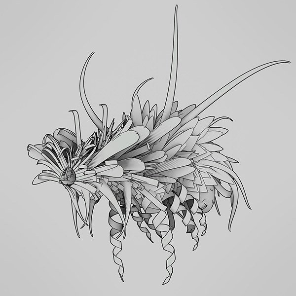

# バージョン 11.2

**Substance 3D Designer 11.2**&#x200B;は名前が少し変更され、Adobe Creative Cloudに接続されました。 Substanceモデルグラフの最初のリリース、送信先の機能、レイトレースベースのノードの数、および一部のUIの変更が加えられました。

リリース日： *23 June 2021*

## 主な機能

### 新しいSubstanceモデルグラフ

まったく新しいグラフの種類であるSubstanceモデルのグラフを使用すると、使い慣れたノードインタフェースを使用して手続き型3Dモデルを作成できます。

<table>
<tr style="border: 0;">
<td style="border: 0;" valign="top">

{width="300px"}

</td>
<td style="border: 0;" valign="top">

{width="300px"}

</td>
</tr>
</table>

詳細については、新しい専用のドキュメントセクションを参照してください。

これは最初のリリースなので、いくつかの制限があると考えられます。

### 送信機能

Substance 3D DesignerのAdobe版には新しい送信機能が追加され、他のSubstance 3Dアプリケーションにすばやくアセットを送信できるようになりました。 SBSARとして公開して個々のファイルを読み込む必要がなくなり、「送信先」を使用するとワンクリックで問題が解決します。

>[!NOTE]
>
> SteamバージョンのSubstance 3D Designerには、送信機能はありません。

### 新しいレイトレースノード

新しいノードがなければ、Designerのリリースは完了しません。 このリリースでは、PBR レンダリングの驚異的な強さをベースに、5つの新しいRTベースのノードが加わりました。

<table>
<tr style="border: 0;">
<td style="border: 0;" valign="top">

{width="300px"}

</td>
<td style="border: 0;" valign="top">

{width="300px"}

</td>
</tr>
</table>

RTAOは、前のHBAOノードよりも鮮明で正確なAOを実行します。

{width="300px"}

コースティクスは、単純なパーリンノイズなどの高いマップに基づいて、物理的に正確なレイトレースコースティクスを生成します。 リアルタイムコースティクス用のリアルなアニメートされたフリップブックテクスチャの作成に適しています。

{width="300px"}

「RTシャドウ」は、レイトレースされた正確なシャドウを簡単なコントロールで表現します。

<table>
<tr style="border: 0;">
<td style="border: 0;" valign="top">

{width="200px"}

</td>
<td style="border: 0;" valign="top">

{width="200px"}

</td>
<td style="border: 0;" valign="top">

{width="200px"}

</td>
</tr>
</table>

RT放射は、新しいノードの中で最も高度なノードです。 Heightマップと環境マップおよび/または放射マップを持つマテリアルに基づいてレイトレースされた放射を行います。

{width="600px"}

つまり、スタイライズされたプロジェクトなどにあらかじめベイク処理されたライティングを使用してテクスチャを作成したり、レイトレースグローバウンスでハイトマップからベイク処理したりできます。

{width="300px"}

最後にBent Normalノードがあります。 通常の通常の変換と比較すると、このノードはAOを使用して法線マップを変更し、そのAO情報を使用します。 効果を作成するためにメッシュベイカーが必要になる前に、このノードはテクスチャで処理します。

### Adobe Standard Material Shader

アプリケーション全体でマテリアルとレンダリングを統一する取り組みにおいて、3Dビューの新しいデフォルトシェーダはAdobe Standard Material Shaderです。 一見すると、これは古いPBR Metallic Roughnessシェーダと同じです（いずれにしてもベースになっています）が、よりエキゾチックなチャンネルをサポートしているため、外部レンダラーを使用せずにプレビューできます。

### UIの変更

UIに小さな変更を加えましたが、最も明らかなのは、改善されたファイル/新規パッケージメニューです。このメニューでは、グラフの種類を選択でき、メインツールバーのボタンが改善、更新され、新しいグラフの種類のショートカットが提供され、他のアプリケーションに送信できます。

## チュートリアル

新機能を紹介するビデオチュートリアルを以下に示します。

## リリースノート

### 11.2.0

*（2021年6月23日リリース）*

**追加：**

* [ブランディング] Substance DesignerがAdobe Substance 3D Designerに
* [Substanceモデル]手続き型3Dモデルを作成するための新しいSubstanceモデルグラフ
* [コンテンツ]新しいHDR環境マップの追加
* [コンテンツ]新しい曲げ法線ノード
* [コンテンツ]新規RT環境オクルージョンノード
* [コンテンツ]新規RTコースティクスノード
* [コンテンツ]新規RTコースティクスノード
* [コンテンツ]新規RT放射ノード
* [コンテンツ]新規RTシャドウノード
* [相互運用性]アセットをPainterに送信し、Painterを起動して、ライブラリにアセットを追加または更新します（AdobeのSubstance 3Dプランが必要）
* [相互運用性]アセットをSamplerに送信し、Samplerを起動して、ライブラリにアセットを追加または更新します（AdobeのSubstance 3Dプランが必要）
* [相互運用性] Adobe Bridgeでアセットを参照すると、アセットの場所でBridgeが起動されます（AdobeのSubstance 3Dプランが必要）
* [ASM] Substance グラフおよびMDL Graphでの新しいアドビ標準素材(ASM)のサポート
* [ASM] ASMテンプレートの追加
* [ASM] ASMにOpenGLシェーダを追加する
* [ASM] ASMシェーダをデフォルトシェーダとして設定する
* [全般]すべての一時ファイルをユーザー設定の一時ディレクトリに集約する
* [全般]新しい「コピーを別名で保存」コマンド
* [一般] [ファイルを更新]メニュー
* [全般]ヘルプメニューの更新
* [Publish]新しい公開ウィンドウ
* [Publish] SBSARファイルの公開中にSBSファイルを保存しないように、環境設定の「オプション」を追加します
* [プロパティ]グラフプロパティにグラフタイプフィールドを追加する
* [プロパティ]グラフのプロパティをより適切に並べ替えます
* [ブランド]新しいバージョン情報ウィンドウ
* [ブランディング]アプリケーションスタイルを更新
* [GLSLFX]テクニックにラベルを追加する
* [GLSLFX] GLSLFXシェーダのラベルを設定する機能を追加します
* [メタデータ]パッケージリソースへのメタデータの追加
* [メタデータ]グラフ、入力、出力、リソースのメタデータ編集を許可します
* [ローカリゼーション]ドイツ語、フランス語、簡体字中国語の新規翻訳
* [UX]マウスドラッグの場合、3Dビューで逆ズームする
* [AXF]バージョン1.8.0にアップデートします。
* [ログ]インストールされているプラグインをログに追加します
* [VFX] ACES 1.2 OpenColorIO構成を追加する
* [Python API]設定で指定したtmpディレクトリを照会するメソッドを追加します
* [Python API]パッケージが保存されているかどうかを確認するためにisModifiedメソッドをSDPackageに追加する
* [Python API] SDColorManagementEngineにいくつかの色変換メソッドを追加します。
* [Python API]グラフオブジェクト（コメント、ピン、フレームなど）を削除する
* [Python API] graphインスタンスノードの物理サイズプロパティを公開する
* [Python API]コピーを別名で保存を公開する
* [Python API] SDPackageMgr.savePackageメソッドの修正
* [Python API]選択したグラフオブジェクトのリストを取得します
* [Python API] グラフの選択を操作する新しいメソッド名を導入する
* [Python API]最初に作成したエクスプローラーパネルにプラグインがアクションを追加できない

**修正済み：**

* [パラメーター]ドロップダウン整数 1のパラメーターに負の値を指定すると、インスタンスで不適切な動作が発生する
* [パラメーター]アングルウィジェットで値を増加させると問題が発生する
* [グラフ]出力が2Dまたは3Dビューで表示される際のタイミングの問題。
* [国際化]ファイル識別子で一部の特殊文字がスペースに変更される
* [環境設定] 「ユーザープロジェクト」のファイルラベルが日本語から移動し直されない
* [Python API] SDUIMgr.getCurrentGraphSelectedNodes()メソッドの実行時にRecursionErrorが発生する
* [Python API] SDApplication.getPath(SDApplicationPath.InstallationDir)は何も返しません
* [Python API] SDSBSARExporterがファイル保存通知を送信しない
