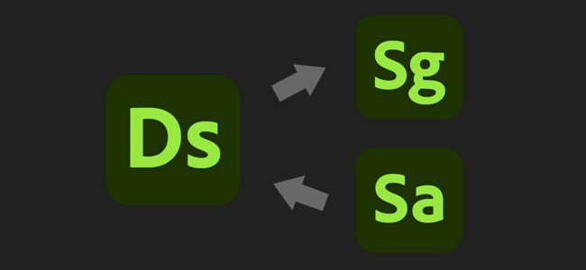
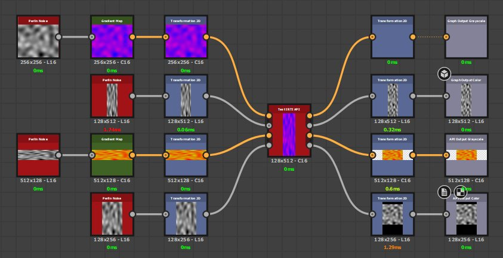
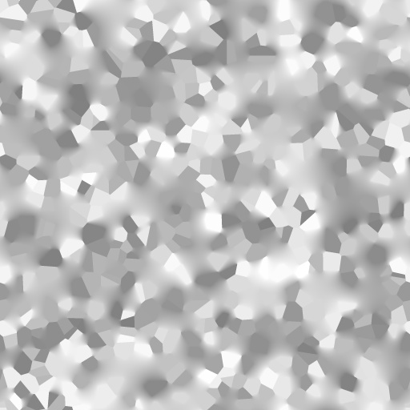

# バージョン 11.3

**Substance 3D Designer**

リリース日： *24 November 2021*

## 主な特徴

### 新しいモデルグラフ機能

モデリング機能を拡張するために、モデルグラフに多くの改善が追加されました。

* <b>新しいパーティクルワークフロー</b>\
  新しいパーティクルモデリングワークフローでは、ジオメトリを操作する点群を作成できます。 これらのツールを使用すると、上の画像の屋根タイルなど、複雑な形状や繰り返し使用する形状を多数作成できます。\
  新しいパーティクルワークフローについて詳しくは、次のドキュメントページを参照してください。

  * シーン内のアイテムの種類
  * パーティクル
  * パーティクル排除
  * インスタンスからのパーティクル

  

* <b>新しいモデリングノードと変形ノード</b>\
  さらに新しいノードが追加され、より複雑なシェイプを作成できるようになりました。各ノードをクリックして、詳細を確認してください。
  * ジェネレーティブ変換
  * オーガニックパターン
  * 旋盤
  * カーブトリム

* <b>全般的な改善\
  </b>モデリンググラフに関するワークフローが次のように改善されました：
  * ノードパラメータに関する新しいツールチップが追加され、学習しやすくなりました。
  * FBXでの書き出し時に3Dモデルの階層構造が保持されるようになりました
  * マテリアルの割り当ては、OBJおよびFBXファイル形式で書き出すことができます。
  * ビューポートの中間ノードをオーバーレイモードでプレビューします。

### 相互運用性の向上

送信操作が拡張され、次の2つの新しい方法が追加されました。

* **SBSM （Substanceモデルファイル）をStagerに送信**\
  プロシージャル3DモデルをStagerに送信し、そこから表示されるパラメーターを使用して変更できるようになりました。

* **SamplerからSBS/SBSARを受け取る**\
  Samplerで生成されたSubstanceファイルを直接Designerで受け取ることができるようになりました。

### その他

生活の質は様々に改善されています。

* **入力に対する相対入力**\
  「入力を基準」で設定したグラフ入力は、デフォルトでは親グラフのサイズではなく、コネクトされたノードのサイズを継承するようになりました。 これにより、サイズの異なる入力を使用して異なる解像度を管理することが非常に簡単になります。

  {width="400px"}

* **新しいグラフウィンドウ**\
  新しいグラフウィンドウが修正され、特定のテンプレートの詳細を確認しやすくなり、既存のパッケージに新しいグラフを直接作成できるようになりました。

  {width="400px"}

* **すべてのパッケージを閉じる**\
  エクスプローラで多くのパッケージを管理する手間を軽減する小さなアクション。 **ファイル** > **すべて閉じる**&#x200B;を使用して、現在開いているすべてのパッケージを閉じます。

  

* **現在のビューを最大化**\
  新しいタイトルバー&#x200B;**アイコン**&#x200B;またはショートカット&#x200B;**SHIFT +スペース**&#x200B;を使用して、ウィンドウを全画面に展開します。 これはフローティングウィンドウでも使用できます。

* **3Dビューの改善**\
  3Dビューには、3Dモデルの背面の表示と、頂点、接線、およびビットマップの表示を切り替える新しい表示設定が追加されています。

### コンテンツ

このリリースでは、新しいディフュージョンノードが追加され、PBR レンダリングノードが改善されました。

* <b>拡散ノード</b>\
  新しいDiffusion Color、Diffusion Grayscale、Diffusion UVノードを使用すると、入力マスクに基づいてソフトにじみブラーを生成できます。

  {width="230px"}

   

* **改善されたPBR レンダリングノード**\
  このノードには次の変更があります。
  * 球体シェイプの新規キュービックUVモード
  * サブサーフェススキャタリングの新しいサポート。
  * 異方性はAdobeストランドマテリアル5ASM)モデルに従います。
  * 画像ベースの照明は、重要なサンプリングのサポートにより改善されました。
  * 重要サンプリングのサポートにより、放射照明が改善されました。

## リリースノート

### 11.3.0

*（2021年11月24日リリース）*

**追加：**

* [Substanceモデル]ノードパラメータのツールチップを追加する
* [Substanceモデル]中間節点の結果を3Dビューポートにオーバーレイ表示します
* [Substanceモデル]基準の表示方法を改善する
* [Substanceモデル] Substanceモデルグラフを.fbxに書き出すときにオブジェクトの階層を保持する
* [Substanceモデル] SubstanceモデルグラフからFBX/OBJ書き出しで複数のマテリアルをサポート
* [Substanceモデル]&#x200B;[コンテンツ]パーティクルノード
* [Substanceモデル]&#x200B;[コンテンツ] Generative Transformノード
* [Substanceモデル]&#x200B;[コンテンツ]有機パターンノード
* [Substanceモデル]&#x200B;[コンテンツ] [インスタンスノードからのパーティクル]
* [Substanceモデル]&#x200B;[コンテンツ]パーティクルプルーニングノード
* [Substanceモデル]&#x200B;[コンテンツ]旋盤ノード
* [Substanceモデル]&#x200B;[コンテンツ]シェルノード
* [Substanceモデル]&#x200B;[コンテンツ] [プロジェクション]ノード
* [Substanceモデル]&#x200B;[コンテンツ] Curve Trim node
* [Substanceモデル]&#x200B;[コンテンツ]カーブのSamplerノードを更新
* [Substanceモデル]&#x200B;[コンテンツ]メッシュSamplerノードを更新
* [Substanceモデル]&#x200B;[コンテンツ]ジッタノードを更新
* [UX]現在のビューを最大化するボタン
* [UX]新規グラフウィンドウを更新する
* [UX]ツールメニューに「プレーヤーのダウンロード」オプションを追加し、「プレーヤーの検索」で集計する
* [UX]ファイルメニューに「すべて閉じる」エントリを追加
* [UX]メインメニュー全体で一貫した大文字と小文字の区別を適用する
* [UX]複製されたグラフアイテムのプロパティを自動的に表示する
* [UX]グラフツールバーにボタンを追加して、フレームタイトル、コメント、ピンの画面サイズが一定でないようにする
* [UX]バージョン情報を[バージョン情報]ダイアログのクリップボードにコピーするボタン
* [マテリアル]入力に対する入力
* [コンテンツ] 3Dパーリンノイズに「タイリング」オプションを追加
* [内容]新規拡散プロセスノード
* [コンテンツ]新しいPBR レンダリングノードバージョン
* [相互運用性] SamplerからSBSおよびSBSARを受信します
* [相互運用性] SBSMをStagerに送信
* [3Dビュー]背面カリングを無効にするオプションを追加
* [3Dビュー]頂点接線空間を表示するオプションを追加します
* [エクスプローラ]グラフビューの背景をダブルクリックすると、エクスプローラでグラフがハイライト表示される
* [エクスプローラー]コンテキストメニューの「検索」オプションを削除
* [ベイカー]非推奨のベイカーを非表示にする
* [カラーマネジメント] OCIO v2設定ファイルルールのサポートを追加
* [ライブラリ]グラフの種類に応じてカテゴリ名を変更する
* [環境設定]サポートされているCUDA GPUが検出された場合に、Rayハードウェア環境設定でCPUを自動無効にする

**修正済み：**

* [Substanceモデル] .fbxで「as sudb」オプションを使用すると、Macでクラッシュする
* [Substanceモデル]特定のケースでSBSMに書き出すとクラッシュする
* [Substanceモデル]ウィジェットが作成されていない公開パラメーターを書き出すと、書き出しに失敗する
* [Substanceモデル]複数の.fbxファイルを参照するグラフを開くと、ランダムにクラッシュする
* [Substanceモデル]公開されたパラメーターウィジェットで範囲が動的に適用されません
* [Substanceモデル] [メッシュを再ロード]オプションが、Substanceモデルグラフで使用されているリソースで機能しない
* [Substanceモデル]特定のケースで、使用可能な3Dビューにシーンが表示されない
* [UI]マテリアルオプションで無効領域が大きすぎる
* [UI] 「パッケージファイルが保存されません」ダイアログのスタイルの問題
* [UI]値を移動するにはTabキーを2回押す必要がある
* [UI]マウスのドラッグによるズームが3Dビューと他のビューポートの間で反転する
* [UI] 「最近使用したファイル」リストを使用して既に開いているSBSを読み込むと、「パッケージが見つかりません」というプロンプトが誤って表示される
* [UI]&#x200B;[macOS]アプリケーション起動後のデフォルトのインターフェイスレイアウトが正しくない
* [UI]パッケージをドライブのルートに保存できない（Windowsのみ）
* [グラフ] 「2Dビューで自動的に表示」オプションが、特定のケースで一貫しない
* [グラフ] 「参照を開く」オプションは、SBSARインスタンスノードで使用できます
* [グラフ]ピンのプロパティは、項目の作成時にのみ表示されます
* [グラフ]ピン文字列のルールが一貫して適用されない
* [グラフ]空のグラフを保存するとクラッシュする
* [3Dビュー] ASMシェーダで異方性角度が反転される
* [3Dビュー] ASMシェーダ： SSS関連マップの線形化の問題
* [3Dビュー]特定のケースで追加の3Dビューを閉じると、OpenGLレンダリングが壊れる
* [3Dビュー]一部の.fbxファイルの3Dビューで、事前定義されたカメラの位置が正しくない
* [MDL] MDLグラフで、コンテキストメニューの「ノードの追加」が機能しない
* [MDL]バグ：float2.xコンポーネントなどを使用すると、ノードの接続に失敗する(SD 11.1.2)
* [MDL]特定の.sbsファイルを開くとクラッシュする
* [MDL]レンダーセッションの開始時にImageのシーン単位/メートルが設定されない
* [MDL] MDLグラフでLERPノードを微調整するとフリーズする
* [MDL]エクスポートされたMDLコードのパラメーターの順序
* [エクスプローラー]リソースの作成を取り消すと、空のリソースフォルダーが作成される
* [Explorer]パッケージの最初の要素のみをリストの一番下に移動できます
* [コンテンツ] RT Bent NormalとRT AOは、ネストされたグラフでノード計算をトリガーします
* [入力ノード] UDIMを変更しても、入力ノードのビットマップが更新されない
* [Iray]インスタンスの多いシーンでSubstanceモデルを表示しようとすると時間がかかる
* [環境設定]プロジェクトファイルの追加をキャンセルすると、空の行が表示される
* [Python editor]最後のスクリプトを閉じた後も、「閉じる」オプションは有効のままであり、その名前は引き続き含まれます
